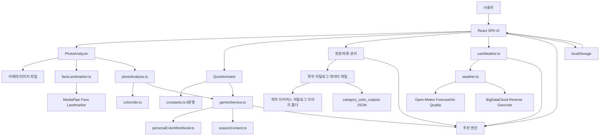
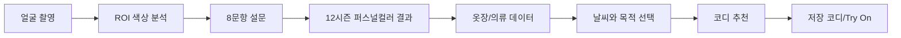
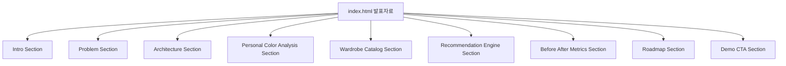

# 2026-05-03까지 프로젝트 현황 상세 분석서

> 대상 프로젝트: `C:\Users\dheod\Downloads\lastbose\통합_퍼컬_옷장`
>
> 이 문서는 기존 `PROJECT_FULL_ANALYSIS_AND_PLAN.md`를 2026-05-03 기준 실제 코드와 폴더 상태에 맞춰 최신화하고, 새로운 개발자가 이 문서만 보고 같은 프로젝트를 재구성하거나 이어서 개발할 수 있도록 구조, 데이터, 알고리즘, 화면 흐름, 구현 상태, 검증 결과, 남은 작업을 상세히 정리한 문서이다.

---

## 0. 목차

이 문서는 단순 코드 설명서가 아니라, 프로젝트의 문제의식에서 출발해 실제 구현, 개선 과정, 현재 한계, 발표자료 전환 가능성까지 이어지는 종합 문서다.

| 구간 | 제목 | 목적 |
|---|---|---|
| 0 | 목차 | 문서 전체 탐색 |
| 1 | 프로젝트 상세 정의와 정체성 | 프로젝트의 본질, 문제, 대상 사용자, 목표를 상세히 정의 |
| 2 | 2026-05-03 기준 핵심 변경점 | 기존 문서 대비 최신화된 내용 |
| 3 | 현재 파일/자산 규모 | 코드와 이미지/JSON 자산의 정량적 규모 |
| 4 | 기술 스택 | 사용 기술과 역할 |
| 5 | 실행 및 검증 상태 | 빌드/타입 검사 현황 |
| 6 | 최상위 파일 구조 | 루트 폴더와 주요 파일의 역할 |
| 7 | 소스 코드 모듈 구조 | 코드 레이어별 책임 |
| 8 | 전체 아키텍처 | 입력, 분석, 저장, 추천 흐름 |
| 9 | 사용자 화면 흐름 | 사용자가 앱을 쓰는 순서 |
| 10 | 퍼스널컬러 진단 구조 | 사진 분석, 설문, 결과 단계 |
| 11 | 얼굴 색상 분석 상세 | ROI, 조명 보정, 품질 점수 |
| 12 | 설문 구조 | 8문항과 4축 점수화 |
| 13 | 사진+설문 융합 알고리즘 | 최종 시즌 판정 방식 |
| 14 | 12시즌 데이터 | 시즌 ID, traits, 팔레트 |
| 15 | 옷장/의류 데이터 모델 | Wardrobe, ClothingItem 구조 |
| 16 | 외부 이커머스 카탈로그 구조 | 이미지/JSON을 앱 데이터로 변환하는 방식 |
| 17 | 색상 메타데이터 | 색상명, HEX, neutral/denim 처리 |
| 18 | 코디 추천 엔진 | 후보 생성, 점수화, 정렬 |
| 19 | 날씨 연동 | Open-Meteo 기반 날씨/대기질 흐름 |
| 20 | localStorage 저장 구조 | 현재 임시 DB 구조 |
| 21 | UI별 구현 상태 | 홈, 진단, 옷장, 추천, 저장, Try On |
| 22 | 구현된 기능과 미구현 기능 | 완료/부분 구현/미구현 분리 |
| 23 | 새 개발자가 재구성할 때 필요한 구현 순서 | 문서 기반 재개발 가이드 |
| 24 | 현재 알려진 문제와 해결 방향 | 타입 오류, 데이터 불일치, 고도화 과제 |
| 25 | 향후 개발 우선순위 | 즉시/중기/장기 작업 |
| 26 | 최종 현황 요약 | 현재 프로젝트 상태의 결론 |
| 27 | 기승전결형 프로젝트 서사 | 발표나 보고서에서 사용할 수 있는 이야기 구조 |
| 28 | 선택 이유와 개선 결과 | 왜 이 구조를 선택했고 무엇이 수치적으로 개선됐는지 |
| 29 | 발표자료 제작 가이드 | PPT/슬라이드로 변환할 때의 구성안 |
| 30 | HTML 발표자료 제작 가이드 | 웹 발표자료로 만들 때의 화면 구성안 |
| 31 | 발표 핵심 메시지 | 발표자가 강조해야 할 결론 |
| 32 | 워드 최종본 분석 기반 추가 보강 | `퍼스널컬러_AI옷장_최종.docx`에서 추출한 명분과 개선점 |
| 33 | 프로젝트 필요성 심화 | 왜 이 앱이 필요한지 사용자/시장/과제 관점에서 정리 |
| 34 | 다른 앱과의 비교 | 퍼스널컬러 앱, 디지털 옷장 앱, 대형 패션 이커머스 앱 대비 차별성 |
| 35 | 스토리텔링형 발표 논리 | 발표에서 설득력을 높이는 스토리 구조 |
| 36 | 워드 파일 분석 후 추가 개선 제안 | 현재 MD와 프로젝트에서 더 보완하면 좋은 지점 |

### 0.1 기승전결로 읽는 방법

이 프로젝트는 다음 순서로 이해하면 가장 자연스럽다.

| 단계 | 내용 | 문서 위치 |
|---|---|---|
| 기 | 퍼스널컬러 진단만으로는 실제 옷 선택까지 이어지지 않는 문제를 정의한다. | 1, 2, 27 |
| 승 | 얼굴 색상 분석, 설문 보정, 12시즌 팔레트, 옷장 데이터를 하나의 앱 구조로 연결한다. | 8~17 |
| 전 | 단순 진단 앱에서 끝내지 않고 날씨, 목적, 보유 의류 상태를 반영한 추천 엔진으로 확장한다. | 18~21 |
| 결 | 현재는 시연 가능한 통합 프론트엔드이며, 서버 DB/자동 의류 분석/개인화 추천으로 확장 가능하다. | 22~31 |

---

## 1. 프로젝트 상세 정의와 정체성

이 프로젝트는 단순히 “퍼스널컬러를 진단하는 웹앱”이 아니다. 또한 단순히 “옷을 등록하는 디지털 옷장”도 아니다. 이 프로젝트의 핵심 정체성은 **퍼스널컬러 진단 결과, 사용자의 보유 의류 데이터, 현재 날씨와 목적 정보를 하나로 연결해 오늘 실제로 입을 수 있는 코디를 설명 가능하게 추천하는 통합형 AI 옷장 시스템**이다.

이 앱이 해결하려는 문제는 사용자가 정보가 부족해서 옷을 못 고르는 상황이 아니다. 오히려 사용자는 이미 많은 정보를 갖고 있다. 퍼스널컬러 결과를 알고 있을 수 있고, 옷장에는 옷이 많고, 날씨 앱으로 기온도 확인할 수 있으며, 온라인에서는 수많은 코디 예시를 볼 수 있다. 그러나 이 정보들이 서로 연결되어 있지 않기 때문에, 사용자는 여전히 매일 옷장 앞에서 다시 고민한다.

이 프로젝트는 그 흩어진 정보를 하나의 의사결정 흐름으로 묶는다.

```text
내 얼굴톤과 퍼스널컬러 결과
        +
내가 실제로 가진 옷
        +
오늘의 날씨와 외출 목적
        =
오늘 입을 수 있고, 나에게 어울리며, 이유를 설명할 수 있는 코디 추천
```

### 1.1 프로젝트가 바라보는 핵심 문제

많은 퍼스널컬러 서비스는 사용자의 계절 타입을 알려주는 데서 끝난다. 사용자는 “라이트 스프링”, “소프트 서머”, “다크 윈터” 같은 결과를 받지만, 그 결과가 자신의 옷장 안에 있는 티셔츠, 니트, 바지, 아우터 중 무엇과 연결되는지는 직접 판단해야 한다. 반대로 디지털 옷장 서비스는 옷을 정리하고 기록하게 해 주지만, 사용자의 얼굴톤이나 퍼스널컬러와 깊게 연결되지는 않는다. 대형 패션 이커머스 서비스는 상품 탐색과 구매에는 강하지만, 사용자가 이미 가지고 있는 옷을 더 잘 활용하도록 돕는 데 초점이 있지는 않다.

따라서 이 프로젝트의 문제의식은 다음과 같다.

| 문제의식 | 구체적 의미 |
|---|---|
| 진단 결과의 실사용 단절 | 퍼스널컬러 결과를 알아도 실제 보유 의류 선택에 바로 적용하기 어렵다. |
| 옷장 데이터의 비가시성 | 옷은 많지만 어떤 색, 어떤 카테고리, 어떤 계절성의 옷을 갖고 있는지 구조화되어 있지 않다. |
| 상황 정보의 분리 | 날씨, 일정, 목적, 장소 분위기를 옷장 데이터와 함께 판단해야 하지만 대부분 사용자가 직접 머릿속에서 계산한다. |
| 추천 신뢰도 부족 | “이게 어울린다”는 결과만 보여주면 사용자는 왜 그런지 납득하기 어렵다. |
| 새 상품 중심 추천의 한계 | 사용자가 이미 가진 옷을 더 잘 활용하기 전에 새 옷 구매로 흐르기 쉽다. |

### 1.2 프로젝트가 답하려는 질문

이 프로젝트는 다음 질문에 답하기 위해 설계되었다.

> 사용자가 이미 가지고 있는 옷 중에서, 오늘의 날씨와 목적에 맞고, 본인의 퍼스널컬러에도 잘 맞는 조합은 무엇인가?

이 질문은 일반적인 쇼핑 추천 질문과 다르다.

| 일반 쇼핑 추천의 질문 | 이 프로젝트의 질문 |
|---|---|
| 어떤 새 상품을 사면 좋을까? | 이미 가진 옷 중 무엇을 입으면 좋을까? |
| 요즘 인기 있는 상품은 무엇인가? | 내 얼굴톤과 내 옷장에 맞는 조합은 무엇인가? |
| 비슷한 사용자가 구매한 상품은 무엇인가? | 오늘 날씨와 목적에 맞는 보유 의류 조합은 무엇인가? |

이 차이 때문에 이 프로젝트는 이커머스 앱보다 **보유 의류 활용도 향상 서비스**에 가깝다.

### 1.3 프로젝트의 핵심 목적

목적은 네 가지로 정리된다.

1. 퍼스널컬러 진단 결과를 실제 의류 선택과 연결한다.
2. 사용자가 가진 옷을 색상, 카테고리, 계절성, 보유 상태 기준으로 구조화한다.
3. 날씨와 목적을 반영해 실제 착용 가능한 코디 후보를 만든다.
4. 추천 결과를 점수와 근거로 설명해 사용자가 납득하고 학습할 수 있게 한다.

### 1.4 프로젝트의 핵심 가치는 무엇인가

이 프로젝트의 핵심 가치는 “자동화” 하나가 아니다. 더 중요한 가치는 **연결**과 **설명 가능성**이다.

| 가치 | 설명 | 구현 방식 |
|---|---|---|
| 연결성 | 얼굴 진단, 설문, 옷장, 날씨, 추천을 하나의 흐름으로 연결 | 7개 페이지 SPA, localStorage 상태, 추천 엔진 |
| 설명 가능성 | 추천과 진단의 근거를 사용자가 확인할 수 있음 | 개발자 모드, ROI 측정값, 점수 분해 |
| 현실성 | 이론적으로 어울리는 색뿐 아니라 실제 입을 수 있는 옷을 추천 | 보유 상태, 날씨 구간, 계절 태그 반영 |
| 확장성 | 서버 DB, 자동 의류 분석, 개인화 추천으로 발전 가능 | 타입화된 데이터 모델, 카탈로그 JSON 구조 |
| 시연성 | 서버 없이도 핵심 흐름을 브라우저에서 보여줄 수 있음 | React/Vite, localStorage, 외부 API fallback |

### 1.5 이 프로젝트가 아닌 것

프로젝트의 방향을 명확히 하기 위해, 이 시스템이 의도하지 않는 것도 정리할 필요가 있다.

| 오해할 수 있는 방향 | 실제 방향 |
|---|---|
| 새 옷 구매를 유도하는 쇼핑몰 | 이미 가진 옷을 더 잘 활용하도록 돕는 옷장 기반 추천 시스템 |
| 사진 한 장으로 완벽히 퍼스널컬러를 확정하는 진단기 | 사진과 설문을 융합해 12시즌 후보를 보수적으로 추정하는 시스템 |
| 전문 스타일리스트를 대체하는 서비스 | 사용자의 색상/날씨/옷장 판단을 보조하는 설명 가능한 도구 |
| 완성된 상용 서비스 | 핵심 흐름이 구현된 프론트엔드 중심 통합 프로토타입 |

### 1.6 최종적으로 만들고자 하는 사용자 경험

사용자는 앱을 열고 다음 흐름을 경험한다.

1. 얼굴 사진을 촬영하거나 사진을 선택한다.
2. 8문항 설문에 답한다.
3. 12시즌 퍼스널컬러 결과와 추천 색상, 피해야 할 색, 근거를 확인한다.
4. 옷장을 만들고, 외부 이커머스 스타일의 카테고리별 샘플 카탈로그 또는 수동 입력으로 의류를 등록한다.
5. 현재 날씨와 목적을 선택한다.
6. 앱이 상의, 하의, 아우터, 신발 조합을 만들고 점수를 계산한다.
7. 사용자는 왜 이 조합이 추천되었는지 확인하고 마음에 들면 저장한다.

결국 이 프로젝트가 제공하려는 최종 경험은 다음 문장으로 요약할 수 있다.

> 사용자가 퍼스널컬러 결과를 보고 끝나는 것이 아니라, 그 결과를 바탕으로 자신의 옷장에서 오늘 입을 옷을 고를 수 있게 만드는 것.

### 1.7 워드 최종본에서 도출한 문제의식 보강

워드 최종본에서 가장 중요한 문제의식은 “사용자는 이미 여러 도구를 따로 쓰고 있지만, 그 도구들이 한 번의 의복 선택으로 연결되지 않는다”는 점이다. 이 문제는 단순 불편함이 아니라 매일 반복되는 의사결정 피로에 가깝다.

사용자는 보통 다음 네 가지 정보를 따로 확인한다.

| 정보 | 사용자가 확인하는 방식 | 연결되지 않을 때 생기는 문제 |
|---|---|---|
| 내 퍼스널컬러 | 진단 앱, 오프라인 진단, 설문 결과 | 결과는 알지만 실제 옷장 속 옷과 연결되지 않음 |
| 내 옷장 | 기억, 사진첩, 실제 옷장 확인 | 어떤 색/카테고리/계절 옷이 있는지 정리되지 않음 |
| 오늘 날씨 | 날씨 앱, 포털, 위젯 | 기온을 알아도 어떤 의류 조합이 맞는지는 다시 판단해야 함 |
| 오늘 목적 | 출근, 데이트, 발표, 일상 | 목적에 따른 포멀함, 색감, 안정감을 직접 판단해야 함 |

이 프로젝트는 네 정보를 따로 보여주는 앱이 아니라, 네 정보를 하나의 추천 판단으로 합치는 앱이다.

```text
퍼스널컬러 결과는 색상 적합도를 결정한다.
옷장 데이터는 실제 입을 수 있는 후보를 결정한다.
날씨 데이터는 계절성과 착용 가능성을 결정한다.
목적 모드는 추천 맥락과 향후 가중치 조정 기준이 된다.
```

### 1.8 “옷이 많은데 입을 옷이 없다”는 문제

이 프로젝트의 사용자 문제는 “옷이 없다”가 아니라 “옷이 있지만 선택 기준이 정리되어 있지 않다”에 가깝다. 옷장이 커질수록 선택지는 늘어나지만, 실제로 매일 입는 조합은 반복되는 경우가 많다. 이유는 다음과 같다.

| 원인 | 결과 |
|---|---|
| 옷의 색상과 카테고리가 데이터화되어 있지 않음 | 어떤 옷이 내 퍼스널컬러와 가까운지 모름 |
| 계절성이나 보유 상태가 정리되어 있지 않음 | 세탁중인 옷, 보관중인 옷, 계절에 맞지 않는 옷까지 머릿속에서 걸러야 함 |
| 상의/하의/아우터 조합 기준이 없음 | 익숙한 조합만 반복 착용 |
| 날씨와 목적을 따로 고려해야 함 | 옷 선택 시간이 길어지고 피로도가 증가 |

따라서 이 앱은 옷장을 단순한 이미지 목록이 아니라 추천 가능한 데이터베이스로 바꾸는 것을 목표로 한다.

### 1.9 왜 퍼스널컬러만으로는 부족한가

퍼스널컬러는 중요한 기준이지만, 옷 선택의 전부는 아니다. 예를 들어 어떤 색이 사용자에게 잘 맞더라도 다음 조건을 만족하지 못하면 실제 추천으로는 부적합하다.

| 상황 | 왜 퍼스널컬러만으로 부족한가 |
|---|---|
| 한여름 30도 | 사용자의 베스트 컬러 니트라도 날씨상 추천하기 어렵다. |
| 중요한 발표 | 색은 어울려도 너무 캐주얼하거나 그래픽이 강하면 목적에 맞지 않을 수 있다. |
| 세탁중인 옷 | 색상 점수가 높아도 실제로 입을 수 없다. |
| 하의와 색상 조화가 낮음 | 개별 아이템은 좋아도 코디 전체 완성도가 낮을 수 있다. |

그래서 추천 엔진은 퍼스널컬러 점수만 보지 않고, 날씨 적합도, 조화도, 안정성을 함께 계산한다.

### 1.10 왜 완전 자동화보다 설명 가능한 구조가 우선인가

초기에는 사용자가 옷 사진을 올리면 자동으로 상의/하의/아우터를 분리하고 대표색을 추출하는 구조가 이상적이었다. 그러나 실제 사용자 사진은 변수의 폭이 크다.

| 사용자 사진 변수 | 문제 |
|---|---|
| 옷걸이/침대/바닥 배경 | 배경과 의류 색이 섞일 수 있음 |
| 착용샷 | 사람 피부, 머리카락, 그림자가 의류 영역과 겹침 |
| 손에 든 사진 | 손가락과 옷 마스크가 섞임 |
| 조명 차이 | 같은 옷도 전혀 다른 색으로 인식될 수 있음 |
| 패턴/프린팅 | 대표색이 실제 인상과 다르게 추출될 수 있음 |

그래서 현재 프로젝트는 완전 자동화보다 **시연 안정성**, **사용자 확인 가능성**, **추천 흐름 완성**을 우선했다. 외부 이커머스 스타일의 정리된 카탈로그와 수동 등록을 먼저 제공한 이유도 여기에 있다. 사용자가 일일이 모든 옷을 찍어 올리는 부담을 줄이고, 추천 엔진이 작동할 수 있는 안정적인 입력 데이터를 먼저 확보하기 위한 선택이다.

### 1.11 이 프로젝트의 명분

이 프로젝트의 명분은 다음과 같이 정리할 수 있다.

1. 퍼스널컬러 진단 결과를 실제 생활에서 쓰이게 한다.
2. 사용자가 이미 가진 옷의 활용도를 높인다.
3. 매일 반복되는 옷 선택 시간을 줄인다.
4. 새 상품 구매보다 보유 의류 재활용과 합리적 소비를 돕는다.
5. 추천 결과를 설명 가능하게 만들어 사용자가 색상 감각을 학습하도록 돕는다.
6. 컴퓨터 비전, 색상공간, 추천 알고리즘, 외부 API를 하나의 실사용 시나리오로 통합한다.

즉 이 프로젝트는 “옷 추천 앱”이라는 표현보다 **퍼스널컬러 결과를 보유 의류 활용으로 전환하는 의사결정 보조 시스템**이라는 표현이 더 정확하다.

---

## 2. 2026-05-03 기준 핵심 변경점

기존 문서 대비 현재 프로젝트에서 특히 보강된 부분은 다음과 같다.

| 영역 | 현재 상태 |
|---|---|
| 카탈로그 데이터 | 기존 더미 카탈로그 16개가 남아 있지만, 실제 UI에서는 외부 이커머스 상품 이미지 기반 카탈로그만 활성 사용한다. |
| 외부 카탈로그 이미지 자산 | 맨투맨, 데님 팬츠, 니트/스웨터, 아우터, 반소매 티셔츠 이미지 폴더가 추가되어 빌드 자산으로 포함된다. |
| 의류 분석 JSON | `category_color_outputs` 계열 JSON을 `import.meta.glob`으로 읽어 대표색 후보를 카탈로그 메타데이터에 반영한다. |
| 옷장 UI | 옷장 목록, 상세, 카탈로그 선택, 저장 미리보기, 수동 등록, 검색/필터, 그리드/리스트 보기 등이 구현되어 있다. |
| 추천 UI | 추천 전 조건 점검, 날씨 카드 펼침/접힘, 옷장 선택 패널, 목적 모드, 추천 결과 저장이 구현되어 있다. |
| 브라우저 히스토리 | 내부 상태 기반 SPA지만 `history.pushState`, `popstate`를 직접 사용해 뒤로가기가 동작하도록 구성되어 있다. |
| 검증 상태 | `npm run build`는 성공한다. `npm run lint`는 현재 타입 오류가 남아 있다. |

---

## 3. 현재 파일/자산 규모

### 3.1 주요 소스 파일 규모

`src`, `components`, `lib`, `scripts`, `tools` 기준으로 확인한 코드/도구 파일 수는 총 31개다.

| 확장자 | 개수 |
|---|---:|
| `.tsx` | 14 |
| `.ts` | 12 |
| `.py` | 3 |
| `.css` | 1 |
| `.exe` | 1 |

주요 파일 라인 수는 다음과 같다.

| 파일 | 라인 수 | 역할 |
|---|---:|---|
| `src/index.css` | 2276 | 전체 앱 스타일, 반응형, 홈/옷장/추천/결과 화면 스타일 |
| `src/App.tsx` | 1891 | 전체 SPA 상태, 화면 라우팅, 옷장/추천/저장/설정 로직 |
| `src/components/PhotoAnalyzer.tsx` | 706 | 카메라, 자동 촬영, 파일 분석, 얼굴 추적 UI |
| `src/components/ResultDisplay.tsx` | 667 | 퍼스널컬러 결과, 근거, 개발자 모드, 측정 데이터 표시 |
| `src/services/photoAnalysis.ts` | 594 | 얼굴 ROI 생성, 샘플링, 조명 보정, 품질 점수 계산 |
| `src/services/geminiService.ts` | 364 | 사진 점수, 설문 점수, 최종 융합 알고리즘 |
| `src/constants.ts` | 260 | 8문항 설문 데이터 |
| `src/seasonContent.ts` | 245 | 시즌별 설명, 추천 색/피해야 할 색, 인접 시즌 콘텐츠 |
| `src/lib/weather.ts` | 208 | Open-Meteo 날씨/대기질 API 연동 |
| `src/types.ts` | 194 | 퍼스널컬러 관련 공용 타입 |

### 3.2 외부 이커머스 카탈로그 이미지/분석 JSON 규모

현재 프로젝트에는 대형 패션 이커머스 스타일의 추천 상품 이미지와 분석 JSON이 별도 폴더로 들어 있다. 문서에서는 특정 쇼핑몰명을 드러내지 않고, “외부 이커머스 카탈로그” 또는 “카테고리별 추천 상품 이미지”로 표현한다.

| 폴더 | 이미지 수 | 분석 JSON 수 | 앱에서의 용도 |
|---|---:|---:|---|
| 니트/스웨터 추천 상품 이미지 폴더 | 32 | 32 | 니트/스웨터 상의 카탈로그 |
| 데님 팬츠 추천 상품 이미지 폴더 | 67 | 115 | 하의/청바지 카탈로그 |
| 맨투맨/스웨트 추천 상품 이미지 폴더 | 95 | 93 | 맨투맨 상의 카탈로그 |
| 반소매 티셔츠 추천 상품 이미지 폴더 | 80 | 80 | 반팔티 상의 카탈로그 |
| 아우터 추천 상품 이미지 폴더 | 48 | 48 | 아우터 카탈로그 |

앱 코드상 `ACTIVE_CATALOG_ITEMS`는 `INITIAL_CATALOG_ITEMS` 중 외부 카탈로그 prefix를 가진 항목만 필터링한다. 따라서 예전 Unsplash 더미 16개는 코드에 남아 있지만 현재 카탈로그 UI의 실제 데이터 소스는 카테고리별 추천 상품 이미지 기반 항목이다.

---

## 4. 기술 스택

### 4.1 프론트엔드

| 기술 | 버전/사용 방식 | 역할 |
|---|---|---|
| React | 19.0.0 | 전체 UI 컴포넌트 |
| TypeScript | 5.8.x | 타입 기반 개발 |
| Vite | 6.x | 개발 서버, 빌드 |
| Tailwind CSS | 4.x, `@tailwindcss/vite` | 스타일 빌드 |
| lucide-react | 0.546.x | 아이콘 |
| motion | 12.x | 결과 화면 애니메이션 |
| shadcn/base-ui 계열 | 버튼, 카드, 탭, 다이얼로그 등 | UI 컴포넌트 |
| canvas-confetti | 1.9.x | 결과 화면 축하 효과 |

### 4.2 컴퓨터 비전/색상 처리

| 기술 | 역할 |
|---|---|
| `@mediapipe/tasks-vision` | Face Landmarker 모델 로딩과 얼굴 랜드마크 검출 |
| Canvas API | 카메라 프레임 캡처, 파일 이미지 로딩, 픽셀 샘플링 |
| RGB/HSL/Lab 변환 | 색상 특징과 팔레트 거리 계산 |
| Delta E | 시즌 팔레트와 얼굴/의류 색상 간 거리 계산 |

### 4.3 외부 API

| API | 사용 위치 | 역할 |
|---|---|---|
| MediaPipe 모델 CDN | `src/services/faceLandmarker.ts` | Face Landmarker WASM/모델 로딩 |
| Open-Meteo Forecast API | `src/lib/weather.ts` | 현재 기온, 체감온도, 날씨 코드, 강수량, 풍속 |
| Open-Meteo Air Quality API | `src/lib/weather.ts` | PM10, PM2.5, European AQI |
| BigDataCloud Reverse Geocode | `src/lib/weather.ts` | 좌표 기반 지역명 표시 |

---

## 5. 실행 및 검증 상태

### 5.1 실행 명령

```bash
npm install
npm run dev
```

개발 서버 기본 주소는 다음과 같다.

```text
http://localhost:3000
```

`vite.config.ts`에서 서버 포트는 `package.json`의 `dev` 스크립트로 지정된다.

```json
"dev": "vite --port=3000 --host=0.0.0.0"
```

### 5.2 빌드 검증

2026-05-03 기준 `npm run build`는 성공했다.

요약:

```text
vite v6.4.2 building for production...
2743 modules transformed.
✓ built in 13.73s
```

빌드 결과 주요 청크:

| 청크 | 대략 크기 | 의미 |
|---|---:|---|
| `index-*.css` | 85 KB | 전체 CSS |
| `ui-vendor-*.js` | 20 KB | UI 관련 벤더 |
| `mediapipe-*.js` | 126 KB | MediaPipe 관련 청크 |
| `motion-*.js` | 128 KB | motion 애니메이션 |
| `react-vendor-*.js` | 194 KB | React/ReactDOM |
| `index-*.js` | 371 KB | 앱 본문 로직 |

### 5.3 타입 검사 상태

2026-05-03 기준 `npm run lint`는 실패한다. 현재 `lint` 스크립트는 ESLint가 아니라 `tsc --noEmit`이다.

발견된 오류:

```text
src/App.tsx(382,22): error TS2345: Argument of type 'unknown' is not assignable to parameter of type 'string'.
src/data/카탈로그 데이터 파일(...): error TS2339: Property 'glob' does not exist on type 'ImportMeta'.
```

해석:

1. `App.tsx`의 `import.meta.glob` 결과 또는 JSON 메타 처리 과정에서 타입이 `unknown`으로 남아 문자열 인자에 전달되는 지점이 있다.
2. `ImportMeta.glob` 타입 선언이 현재 TypeScript 설정에 포함되지 않았다. 보통 `src/vite-env.d.ts`에 `/// <reference types="vite/client" />`를 추가하거나 `tsconfig`의 types 설정을 보강하면 해결된다.

주의: 빌드는 성공하지만 타입 검사는 실패하므로, 제출/배포 전에는 이 타입 오류를 정리하는 것이 좋다.

---

## 6. 최상위 파일 구조

프로젝트 루트의 주요 파일/폴더 역할은 다음과 같다.

| 경로 | 역할 |
|---|---|
| `src/` | 앱 소스 코드 핵심 |
| `src/App.tsx` | 화면 라우팅, 상태, 옷장/추천 로직 |
| `src/components/` | 퍼스널컬러 분석/설문/결과 컴포넌트 |
| `src/services/` | 얼굴 분석, 색상 처리, 결과 융합, MediaPipe 로딩 |
| `src/hooks/` | 날씨 hook |
| `src/lib/` | 날씨 API 라이브러리 |
| `src/data/` | 외부 이커머스 카탈로그 이미지/JSON import 정의 |
| `components/ui/` | shadcn/base-ui 계열 공용 UI 컴포넌트 |
| `lib/utils.ts` | UI 유틸 |
| `scripts/` | 보고서/문서 생성 스크립트 |
| `tools/cloudflared.exe` | 외부 터널 실행 도구 |
| `dist/` | Vite 빌드 결과물 |
| `docx_render_check/` | 문서 렌더링 확인 이미지 |
| `PROJECT_FULL_ANALYSIS_AND_PLAN.md` | 기존 통합 분석 문서 |
| `WARDROBE_ADD_AND_WEATHER_API_IMPLEMENTATION_GUIDE.md` | 옷장/날씨 구현 가이드 |
| `디지털 옷장과 의류 등록 모듈 및 추천 알고리즘 관계.md` | 옷장/의류/추천 관계 설명 문서 |
| `personal_color_12season_24palette_standard_colors_by_season.xlsx` | 12시즌 표준 팔레트 원본 |
| `package.json` | 스크립트와 의존성 |
| `vite.config.ts` | Vite, Tailwind, 청크 분리, alias 설정 |

---

## 7. 소스 코드 모듈 구조

### 7.1 엔트리

| 파일 | 설명 |
|---|---|
| `src/main.tsx` | React root 생성, `App` 렌더링 |
| `src/index.css` | 앱 전역 스타일. Tailwind 기반이지만 많은 커스텀 클래스가 직접 정의되어 있다. |

### 7.2 앱 본체

`src/App.tsx`는 이 프로젝트에서 가장 큰 파일이며, 다음 역할을 동시에 가진다.

| 역할 | 설명 |
|---|---|
| SPA 페이지 상태 | `home`, `personal`, `wardrobe`, `recommend`, `saved`, `tryon`, `settings` |
| 내부 라우팅 | `history.pushState`, `replaceState`, `popstate` 직접 처리 |
| 퍼스널컬러 상태 | 사진 분석 결과, 최종 결과, 히스토리 저장/복원 |
| 옷장 상태 | 옷장 목록, 선택 옷장, 검색, 필터, 카탈로그 선택 |
| 의류 상태 | localStorage 저장, 카탈로그 추가, 수동 등록, 삭제 |
| 추천 상태 | 날씨 구간, 목적 모드, 추천 대상 옷장, 추천 요청 여부 |
| 저장 코디 상태 | 추천 코디 저장, 이름 변경, 삭제, Try On 표시 |
| 추천 알고리즘 | 의류 점수화, 날씨 점수, 코디 조합 생성, 정렬 |

### 7.3 퍼스널컬러 컴포넌트

| 파일 | 설명 |
|---|---|
| `src/components/PhotoAnalyzer.tsx` | 카메라 실행, 얼굴 검출, 3초 자동 촬영, 직접 촬영, 이미지 파일 fallback 분석 |
| `src/components/Questionnaire.tsx` | 8문항 설문 UI와 응답 누적 |
| `src/components/ResultDisplay.tsx` | 결과 화면, 시즌 설명, 팔레트, 측정 데이터, 개발자 모드 |

### 7.4 분석/알고리즘 서비스

| 파일 | 설명 |
|---|---|
| `src/services/faceLandmarker.ts` | MediaPipe Face Landmarker 모델 생성, GPU 실패 시 CPU fallback |
| `src/services/photoAnalysis.ts` | 얼굴 ROI 생성, 픽셀 샘플링, 화이트 밸런스, 품질 점수 |
| `src/services/geminiService.ts` | 실제 Gemini 호출은 없고, 사진/설문 점수 계산과 융합을 담당 |
| `src/services/colorUtils.ts` | 색상 변환, luminance, normalize, Delta E |

### 7.5 데이터/콘텐츠

| 파일 | 설명 |
|---|---|
| `src/types.ts` | 시즌 ID, 결과, 측정값, 설문, 시즌 프로필 타입 |
| `src/constants.ts` | 8문항 설문 데이터 |
| `src/personalColorWorkbook.ts` | 12시즌 팔레트와 traits. 원본은 `personal_color_12season_24palette_standard_colors_by_season.xlsx` |
| `src/seasonContent.ts` | 시즌별 설명, 베스트 컬러 설명, 피해야 할 색, 인접 시즌 |
| `src/data/카탈로그 데이터 파일` | 외부 카탈로그 이미지와 JSON 메타를 `import.meta.glob`으로 가져오는 데이터 레이어 |

### 7.6 날씨

| 파일 | 설명 |
|---|---|
| `src/hooks/useWeather.ts` | geolocation 시도, 실패 시 서울 fallback, 새로고침 함수 제공 |
| `src/lib/weather.ts` | Open-Meteo API 호출, 날씨 코드 한글화, 기온 구간, 우산/마스크 판단 |

---

## 8. 전체 아키텍처



---

## 9. 사용자 화면 흐름

### 9.1 페이지 종류

`App.tsx`의 `Page` 타입 기준으로 앱은 다음 7개 주요 페이지를 갖는다.

| Page | 화면 | 설명 |
|---|---|---|
| `home` | 홈 | 진단 결과, 날씨, 옷장 상태, 저장 코디 요약 |
| `personal` | 퍼스널컬러 | 사진 분석, 설문, 결과 표시 |
| `wardrobe` | 옷장 | 옷장 목록, 의류 상세, 카탈로그 선택, 수동 등록 |
| `recommend` | AI 추천 | 날씨/목적/옷장 선택 후 코디 추천 |
| `saved` | 저장 코디 | 저장된 추천 코디 목록, 이름 변경/삭제 |
| `tryon` | Try On | 저장 코디 이미지를 조합 형태로 미리보기 |
| `settings` | 설정 | 데이터 초기화 |

### 9.2 내부 라우팅

이 앱은 React Router를 쓰지 않는다. 대신 `App.tsx`에서 다음 상태를 직접 관리한다.

```ts
interface AppRouteState {
  page: Page;
  analysisStep: AnalysisStep;
  wardrobeView: WardrobeView;
  selectedWardrobeId: string;
}
```

`navigate()` 함수가 내부 상태를 바꾸고, 브라우저 히스토리에는 `{ fitlyRoute: next }` 형태로 저장한다. 뒤로가기 시 `popstate`를 받아 이전 UI 상태를 복원한다.

---

## 10. 퍼스널컬러 진단 구조

### 10.1 진단 단계

`personal` 페이지의 내부 단계는 다음과 같다.

| 단계 | 타입 값 | 내용 |
|---|---|---|
| 사진 분석 | `photo` | 카메라 또는 이미지 파일에서 얼굴 색상 분석 |
| 설문 | `questionnaire` | 8문항 응답 |
| 결과 | `result` | 최종 시즌, 팔레트, 근거, 개발자 모드 |

### 10.2 카메라 분석 흐름

`PhotoAnalyzer.tsx`의 핵심 흐름:

1. 컴포넌트 mount 시 `startCamera()` 실행.
2. `getFaceLandmarker({ preferCpu: isMobileViewport() })`로 모델 로딩.
3. 데스크톱은 `requestAnimationFrame` 기반 120ms 간격 검출.
4. 모바일은 `setTimeout` 기반 320ms 간격 검출.
5. 얼굴이 잡히면 `buildSampleRegions()`로 ROI를 계산.
6. 얼굴 유지 상태가 되면 3초 카운트다운 후 자동 촬영.
7. 캡처 Canvas를 다시 MediaPipe로 분석해 얼굴이 유효한지 검증.
8. 얼굴이 너무 작으면 오류 처리.
9. `analyzeFaceSnapshotColors()`로 색상 샘플과 품질 점수 계산.
10. `analyzePhotoColors()`로 사진 기반 시즌 점수 생성.

### 10.3 카메라 권한/모바일 대응

현재 구현은 다음 상황을 구분해 안내한다.

| 상황 | 처리 |
|---|---|
| `getUserMedia` 미지원 | localhost/HTTPS 접속 안내 |
| 권한 차단 | 브라우저 사이트 설정에서 카메라 허용 안내 |
| 카메라 없음 | 장치/Windows 개인정보 설정 확인 안내 |
| 카메라 사용 중 | 다른 앱 종료 안내 |
| 권한 차단 후 재시도 | `localhost`와 `127.0.0.x`를 바꿔 새 권한 요청 시도 |
| 권한 차단 시 | 이미지 파일 선택 분석 fallback 제공 |
| 모바일 | 전면 카메라 후보 탐색, 최저 zoom 적용 시도, CPU delegate 선호 |

### 10.4 MediaPipe 모델

`src/services/faceLandmarker.ts`에서 사용하는 모델 정보:

```ts
const TASKS_VISION_VERSION = '0.10.34';
const WASM_BASE_PATH = `https://cdn.jsdelivr.net/npm/@mediapipe/tasks-vision@${TASKS_VISION_VERSION}/wasm`;
const MODEL_ASSET_PATH =
  'https://storage.googleapis.com/mediapipe-models/face_landmarker/face_landmarker/float16/1/face_landmarker.task';
```

설정:

| 항목 | 값 |
|---|---|
| runningMode | `VIDEO` |
| numFaces | 1 |
| minFaceDetectionConfidence | 0.35 |
| minFacePresenceConfidence | 0.35 |
| minTrackingConfidence | 0.35 |
| delegate | 기본 GPU, 실패 시 CPU |

---

## 11. 얼굴 색상 분석 상세

### 11.1 ROI 목록

`photoAnalysis.ts`의 `SampleRegionKey` 기준 ROI는 15개다.

| ROI key | 라벨 | 목적 |
|---|---|---|
| `underEyeLeft` | 왼쪽 눈가 | 눈 주변 피부색 |
| `underEyeRight` | 오른쪽 눈가 | 눈 주변 피부색 |
| `jawLeft` | 왼쪽 턱선 | 피부 보조 |
| `jawRight` | 오른쪽 턱선 | 피부 보조 |
| `skinLeft` | 왼쪽 볼 | 피부 대표 |
| `skinRight` | 오른쪽 볼 | 피부 대표 |
| `forehead` | 이마 중심 | 피부 보조 |
| `noseLeft` | 코 왼쪽 | 피부 보조 |
| `noseRight` | 코 오른쪽 | 피부 보조 |
| `eyesLeft` | 왼쪽 홍채 | 눈 색상 |
| `eyesRight` | 오른쪽 홍채 | 눈 색상 |
| `eyebrowLeft` | 왼쪽 눈썹 | 눈썹/헤어 보조 |
| `eyebrowRight` | 오른쪽 눈썹 | 눈썹/헤어 보조 |
| `lips` | 입술 중심 | 입술 혈색 |
| `hair` | 헤어라인 | 머리 색상 |

### 11.2 ROI 생성 기준

ROI는 MediaPipe normalized landmark를 실제 Canvas 픽셀 좌표로 변환해 계산한다. 예를 들면:

| 부위 | 주요 landmark |
|---|---|
| 볼 | 205, 425 |
| 홍채 | 468~472, 473~477 |
| 눈썹 | 70, 63, 105 / 336, 296, 334 |
| 이마 | 10, 9, 151 |
| 코 | 129, 98, 49 / 358, 327, 279 |
| 턱선 | 172, 136, 150 / 397, 365, 379 |
| 입술 | 0, 13, 14, 17, 78, 308 |

### 11.3 샘플링 방식

단순 평균색을 쓰지 않고 다음 처리를 거친다.

| 처리 | 설명 |
|---|---|
| alpha 필터 | 투명도 180 미만 픽셀 제외 |
| erosion | ROI 가장자리 오염을 줄이기 위해 내부 픽셀 중심 샘플링 |
| luminance trimming | 너무 어둡거나 밝은 픽셀 제거 |
| saturation filtering | 필요 부위에서 최소 채도 조건 적용 |
| Lab median medoid | Lab 공간 중앙값과 가장 가까운 실제 픽셀을 대표색으로 선택 |
| variability 계산 | ROI 내부 색 분산을 품질 판단에 반영 |

### 11.4 조명 보정

조명 보정은 흰 종이 기준 영역을 우선 사용하고, 실패하면 배경 또는 모서리 fallback을 사용한다.

| 보정 소스 | 의미 |
|---|---|
| `white-reference` | 흰 종이 가이드 영역이 충분히 밝고 중립적일 때 사용 |
| `neutral-background` | 얼굴 주변 중립 배경 픽셀 사용 |
| `corner-fallback` | 위 조건이 부족할 때 모서리 픽셀 기반 fallback |

흰 종이 가이드는 화면 비율에 따라 다르게 잡힌다.

| 화면 방향 | 기준 영역 |
|---|---|
| 세로 | x 0.34, y 0.59, width 0.32, height 0.15 |
| 가로 | x 0.42, y 0.62, width 0.16, height 0.17 |
| 기본 | x 0.69, y 0.58, width 0.22, height 0.16 |

### 11.5 사진 품질 점수

`MeasurementDetails.qualityBreakdown` 구조:

| 필드 | 의미 |
|---|---|
| `overall` | 전체 사진 품질 |
| `exposure` | 피부 샘플 밝기 적정성 |
| `symmetry` | 좌우 피부 샘플 균형 |
| `distinctness` | 피부/머리/눈/입술 색 구분도 |
| `faceSize` | 얼굴이 프레임에서 차지하는 크기 |
| `background` | 조명 보정용 배경/흰 종이 안정성 |

이 품질 점수는 최종 결과 융합에서 사진 비중을 정하는 데 사용된다.

---

## 12. 설문 구조

설문은 `src/constants.ts`의 `QUESTIONS` 배열로 관리된다. 각 문항은 선택지별로 `temperature`, `lightness`, `clarity`, `contrast` 네 축에 가중치를 준다.

| 문항 ID | 질문 요약 | 주로 반영되는 축 |
|---|---|---|
| `vein_color` | 손목 혈관 색 | temperature |
| `jewelry_reaction` | 골드/실버 액세서리 반응 | temperature, clarity |
| `white_clothing` | 잘 받는 흰색 | temperature, lightness, clarity |
| `sun_reaction` | 햇빛 피부 반응 | temperature, contrast |
| `vibrant_colors` | 선명한 컬러 반응 | clarity, contrast |
| `muted_colors` | 뮤트 컬러 반응 | clarity |
| `contrast_preference` | 대비 스타일 | contrast, clarity |
| `depth_preference` | 색의 깊이 | lightness |

설문 점수 계산은 `calculateQuestionnaireScores()`에서 수행된다.

```ts
interface QuestionnaireScores {
  temperature: number;
  lightness: number;
  clarity: number;
  contrast: number;
}
```

각 축은 선택지 가중치 합계를 축별 최대값으로 나누어 -1~1 범위로 정규화한다.

---

## 13. 사진+설문 융합 알고리즘

### 13.1 사진 특징 벡터

`geminiService.ts`의 `measureColorFeatures()`는 사진에서 다음 특징을 만든다.

| 특징 | 계산 의미 |
|---|---|
| `temperature` | 피부 45%, 입술 25%, 머리 15%, 홍채 15% 색온도 |
| `lightness` | 피부/입술/눈/머리 luminance 평균 |
| `clarity` | HSL 채도 평균을 -1~1로 정규화 |
| `mutedScore` | 1 - 평균 채도 |
| `contrast` | 얼굴 내부 대비 78% + 피부-머리 대비 22% |

검은 머리 하나만으로 겨울 고대비가 과대 판정되지 않도록 머리 대비 비중은 22%로 낮게 잡혀 있다.

### 13.2 사진 시즌 점수

사진 시즌 점수는 두 요소를 결합한다.

```text
photoRawScore = paletteScore * 0.42 + traitScore * 0.58
```

| 점수 | 설명 |
|---|---|
| `paletteScore` | 추출 색상과 시즌 팔레트 간 Lab/Delta E 기반 근접도 |
| `traitScore` | 사진 특징 벡터와 시즌 traits의 유사도 |

사진 특징 가중치:

| 축 | 가중치 |
|---|---:|
| temperature | 0.30 |
| lightness | 0.16 |
| clarity | 0.34 |
| contrast | 0.20 |

### 13.3 설문 시즌 점수

설문 시즌 점수는 설문 4축과 시즌 traits의 유사도로 계산된다.

설문 특징 가중치:

| 축 | 가중치 |
|---|---:|
| temperature | 0.38 |
| lightness | 0.20 |
| clarity | 0.25 |
| contrast | 0.17 |

### 13.4 시즌 보정

사진 시즌 점수에는 다음 보정이 들어간다.

| 보정 | 조건 | 효과 |
|---|---|---|
| 겨울 페널티 | 겨울 계열이고 mutedScore가 높음 | 겨울 과대 판정 완화 |
| 소프트 보너스 | 소프트 서머/소프트 오텀이고 mutedScore가 높음 | 뮤트 타입 반영 |
| 고대비 페널티 | 시즌 contrast가 높지만 사진 contrast가 낮음 | 고대비 시즌 감점 |
| 고선명 페널티 | 시즌 clarity가 높지만 사진 clarity가 낮음 | 브라이트/트루 윈터 등 감점 |

### 13.5 최종 융합

최종 융합 비중:

```text
photoWeight = clamp(0.22 + photoQuality * 0.14, 0.22, 0.36)
questionnaireWeight = 1 - photoWeight
```

즉 사진 품질이 아무리 좋아도 사진은 최대 36%, 설문은 최소 64%다. 이 설계는 카메라 조명/화이트밸런스 왜곡을 고려해 설문을 더 안정적인 기준으로 보는 보수적 정책이다.

최종 신뢰도:

```text
confidence = clamp(
  0.42
  + firstScore * 0.28
  + gap * 1.35
  + photoQuality * 0.12
  + consistencyBoost,
  0,
  0.99
)
```

`consistencyBoost`는 사진 1순위와 설문 1순위의 일치 정도에 따라 달라진다.

| consistency | 조건 |
|---|---|
| `high` | 사진 1순위 시즌과 설문 1순위 시즌이 동일 |
| `medium` | 시즌은 다르지만 4계절 family가 동일 |
| `low` | family도 다름 |

---

## 14. 12시즌 데이터

시즌 ID는 `src/types.ts`와 `src/personalColorWorkbook.ts`에서 관리된다.

| ID | 한국어명 | 계열 |
|---|---|---|
| `light-spring` | 라이트 스프링 | 봄 |
| `true-spring` | 트루 스프링 | 봄 |
| `bright-spring` | 브라이트 스프링 | 봄 |
| `light-summer` | 라이트 서머 | 여름 |
| `true-summer` | 트루 서머 | 여름 |
| `soft-summer` | 소프트 서머 | 여름 |
| `soft-autumn` | 소프트 오텀 | 가을 |
| `true-autumn` | 트루 오텀 | 가을 |
| `dark-autumn` | 다크 오텀 | 가을 |
| `dark-winter` | 다크 윈터 | 겨울 |
| `true-winter` | 트루 윈터 | 겨울 |
| `bright-winter` | 브라이트 윈터 | 겨울 |

각 시즌은 다음 정보를 가진다.

```ts
interface SeasonProfile {
  id: SeasonId;
  name: string;
  englishName: string;
  family: SeasonFamily;
  toneNote: string;
  traits: QuestionnaireScores;
  workbookStats: {
    averageRgb: [number, number, number];
    averageLightness: number;
    averageSaturation: number;
    averageTemperature: number;
    averageContrast: number;
  };
  palette: string[];
}
```

현재 팔레트 원본 기준은 다음 파일이다.

```text
personal_color_12season_24palette_standard_colors_by_season.xlsx
```

---

## 15. 옷장/의류 데이터 모델

### 15.1 옷장

```ts
interface Wardrobe {
  id: string;
  name: string;
  createdAt: string;
}
```

초기 옷장:

| id | 이름 |
|---|---|
| `w-demo-1` | 출근용 옷장 |
| `w-demo-2` | 주말 캐주얼 옷장 |
| `w-demo-3` | 발표/중요 일정 옷장 |

### 15.2 의류 카테고리

```ts
type ClothingCategory = '상의' | '하의' | '아우터' | '신발' | '액세서리';
```

카테고리별 타입 목록:

| 카테고리 | 타입 |
|---|---|
| 상의 | 반팔티, 긴팔티, 니트, 셔츠, 가디건, 맨투맨 |
| 하의 | 청바지, 슬랙스, 스커트, 반바지, 조거팬츠 |
| 아우터 | 재킷, 코트, 패딩, 트렌치코트, 블레이저 |
| 신발 | 스니커즈, 로퍼, 부츠, 샌들 |
| 액세서리 | 가방, 모자, 스카프, 벨트 |

### 15.3 보유 상태

```ts
type AvailabilityStatus = '보유중' | '세탁중' | '보관중' | '추천제외';
```

추천 생성에서는 `추천제외`, `세탁중` 항목은 후보에서 제외된다.

### 15.4 의류 아이템

```ts
interface ClothingItem {
  id: string;
  wardrobeId: string;
  imageUrl: string;
  category: ClothingCategory;
  type: string;
  color: string;
  size: string;
  brand: string;
  createdAt: string;
  representativeColor: string;
  representativeHex: string;
  seasonTag: string;
  patternType: string;
  availabilityStatus: AvailabilityStatus;
  isNeutral: boolean;
  isDenim: boolean;
  sourceType: 'catalog' | 'upload';
  catalogItemId?: string;
}
```

### 15.5 수동 등록

수동 등록은 실제 이미지 업로드 분석이 아니라 다음 방식이다.

1. 사용자가 이미지 URL 또는 기본 이미지를 사용한다.
2. 카테고리, 타입, 색상, 사이즈, 브랜드, 계절 태그, 보유 상태를 입력한다.
3. `buildColorMeta()`가 색상명 기반 대표 HEX, 뉴트럴 여부, 데님 여부, 패턴을 만든다.
4. `sourceType: 'upload'`으로 localStorage에 저장한다.

주의: 현재 `sourceType`은 `'upload'`이지만 실제 파일 업로드/서버 저장은 구현되어 있지 않다.

---

## 16. 외부 이커머스 카탈로그 구조

### 16.1 데이터 import

카탈로그 데이터 파일은 다음 다섯 그룹을 `import.meta.glob`으로 가져온다.

```ts
export const MUSINSA_IMAGE_MODULES = {
  sweatshirts: import.meta.glob<string>('../../맨투맨-스웨트-추천-상품-이미지/.../*.{jpg,jpeg,png,webp}', ...),
  denimPants: import.meta.glob<string>('../../데님-팬츠-추천-상품-이미지/.../*.{jpg,jpeg,png,webp}', ...),
  knits: import.meta.glob<string>('../../니트-스웨터-추천-상품-이미지/.../*.{jpg,jpeg,png,webp}', ...),
  outers: import.meta.glob<string>('../../아우터-추천-상품-이미지/.../*.{jpg,jpeg,png,webp}', ...),
  shortSleeveTshirts: import.meta.glob<string>('../../반소매-티셔츠-추천-상품-이미지/.../*.{jpg,jpeg,png,webp}', ...),
};
```

JSON 메타도 같은 방식으로 읽는다.

```ts
export const MUSINSA_META_MODULES = {
  sweatshirts: import.meta.glob('../../맨투맨-스웨트-추천-상품-이미지/page-images/category_color_outputs/*_result.json', ...),
  ...
};
```

### 16.2 카탈로그 생성 규칙

`App.tsx`에서 카탈로그 변환 함수가 이미지와 JSON을 묶어 `CatalogItem` 배열을 만든다.

흐름:

1. 이미지 파일명 앞의 3자리 번호를 `catalogKey()`로 추출한다.
2. 같은 번호의 JSON 메타를 찾는다.
3. 파일명을 사람이 읽을 수 있게 `cleanMusinsaName()`으로 정리한다.
4. JSON의 dominant color를 찾는다.
5. 상품명 색상 패턴을 먼저 보고, 없으면 HEX와 `COLOR_META` 거리로 색상명을 추정한다.
6. `catalogFromAnalysis()`로 최종 `CatalogItem`을 만든다.

### 16.3 활성 카탈로그

```ts
const ACTIVE_CATALOG_ITEMS = INITIAL_CATALOG_ITEMS.filter((item) =>
  item.catalogItemId.startsWith('외부카탈로그-prefix')
);
```

이 때문에 앱의 카탈로그 화면에는 외부 이커머스 스타일의 카테고리별 상품만 노출된다.

### 16.4 기존 저장 데이터 보정

`reconcileStoredClothing()`은 localStorage에 저장된 카탈로그 아이템을 현재 카탈로그 메타로 다시 맞춘다.

목적:

- 이미지 경로가 빌드 자산 URL로 바뀌어도 복원.
- 카테고리/타입/색상/대표색/브랜드가 최신 카탈로그 기준과 맞게 유지.
- 더 이상 존재하지 않는 이전 카탈로그 더미 항목은 제거.

---

## 17. 색상 메타데이터

`COLOR_META`는 색상명을 대표 HEX와 속성으로 매핑한다.

예:

| 색상명 | HEX | 속성 |
|---|---|---|
| 화이트 | `#F7F7F4` | neutral |
| 아이보리 | `#F1E8D7` | neutral |
| 블랙 | `#171717` | neutral |
| 네이비 | `#22334D` | neutral |
| 데님 | `#5C7898` | denim |
| 베이지 | `#D7C2A1` | neutral |
| 브라운 | `#795342` | 일반 색 |
| 핑크 | `#D8A8B5` | 일반 색 |
| 민트 | `#A8D8C2` | 일반 색 |
| 카키 | `#737A57` | 일반 색 |

상품명 색상 추정은 `COLOR_NAME_PATTERNS`의 정규식으로 수행한다. 예를 들어 `washed-black`, `black`, `블랙`, `흑청`은 블랙으로, `navy`, `네이비`는 네이비로, `beige`, `베이지`는 베이지로 매핑된다.

---

## 18. 코디 추천 엔진

### 18.1 추천 후보 필터

추천 입력:

- 선택된 옷장들의 `ScoredClothingItem[]`
- 날씨 구간 `WeatherBand | '상관없음'`
- 추천 목적 `데일리 | 출근 | 데이트 | 발표`

후보 생성 흐름:

1. `추천제외`, `세탁중` 제거.
2. `catalogItemId` 또는 `imageUrl` 기준 중복 제거.
3. 날씨 구간이 `상관없음`이 아니면 `isWeatherEligible()`로 날씨 부적합 아이템 제거.
4. 상의, 하의, 아우터, 신발로 분리.
5. 상의 x 하의 x 아우터 옵션 x 신발 옵션 조합 생성.
6. 아이템 2개 미만 조합 제거.
7. 동일 조합 중복 제거.
8. 점수 계산 후 상위 60개 반환.

### 18.2 의류 퍼스널컬러 점수

`scoreItemForPersonalColor()`는 진단 결과가 없으면 점수를 계산하지 않는다.

진단 결과가 있을 때:

```text
paletteScore = max(0, 100 - paletteDistance * 3.2)
utilityBonus = neutral 또는 denim이면 +8
avoidPenalty = worstColors와 가까우면 -22 또는 -10
score = clamp(round(paletteScore + utilityBonus - avoidPenalty), 0, 100)
```

등급:

| 점수 | 등급 |
|---:|---|
| 88 이상 | BEST |
| 74 이상 | GOOD |
| 58 이상 | OK |
| 그 외 | CHECK |

### 18.3 날씨 점수

`getWeatherScore()`는 보유 상태와 날씨 구간을 함께 본다.

| 조건 | 처리 |
|---|---|
| `상관없음` | 뉴트럴/데님이면 82, 일반 보유중이면 72 |
| 추천제외 | 0 |
| 세탁중 | 20 또는 35 |
| 보관중 | 45 또는 55 |
| 날씨 키워드와 타입 매칭 | +28 |
| 사계절 태그 | +8 |
| 28도 이상인데 겨울 태그 | -30 |
| 4도 이하/5~8도인데 여름 태그 | -25 |

### 18.4 날씨별 허용 키워드

`WEATHER_RULES`:

| 기온 구간 | 추천 키워드 |
|---|---|
| 4도 이하 | 패딩, 코트, 니트, 가디건 |
| 5~8도 | 코트, 재킷, 니트, 맨투맨 |
| 9~11도 | 블레이저, 재킷, 니트, 긴팔티, 셔츠 |
| 12~16도 | 블레이저, 셔츠, 긴팔티, 니트, 맨투맨 |
| 17~19도 | 셔츠, 가디건, 긴팔티, 맨투맨 |
| 20~22도 | 반팔티, 셔츠, 블라우스 |
| 23~27도 | 반팔티, 긴바지, 반바지, 블라우스, 스커트 |
| 28도 이상 | 반팔티, 반바지, 샌들, 스커트 |

특이점: `getAllowedWeatherKeywords()`는 현재 구간의 바로 아래 구간 키워드도 함께 허용한다. 예를 들어 12~16도에서는 9~11도 키워드 일부도 허용되어 갑작스러운 체감 온도 차이를 완화한다.

### 18.5 코디 점수

최종 코디 점수:

```text
score = personalScore * 0.42
      + weatherScore * 0.28
      + harmonyScore * 0.20
      + stabilityScore * 0.10
```

| 점수 | 계산 방식 |
|---|---|
| `personalScore` | 아이템별 퍼스널컬러 점수 평균. 진단 없음은 55점 fallback |
| `weatherScore` | 아이템별 날씨 점수 평균 |
| `harmonyScore` | 상하의 HEX 동일 또는 상/하의 중 하나가 neutral이면 84, 아니면 72 |
| `stabilityScore` | 모든 아이템이 보유중이면 92, 아니면 68 |

현재 `RecommendationMode`는 제목과 UI 목적 선택에는 반영되지만, 모드별 가중치 차등은 아직 구현되어 있지 않다. 즉 `데일리`, `출근`, `데이트`, `발표` 선택은 현재 추천 제목과 상태값에는 들어가지만 점수 공식 자체는 동일하다.

---

## 19. 날씨 연동

### 19.1 위치 흐름

`useWeather()`는 다음 순서로 동작한다.

1. 브라우저 `navigator.geolocation` 확인.
2. 사용 가능하면 현재 위치 요청.
3. 실패하거나 미지원이면 서울 좌표 fallback.
4. `fetchCurrentWeather()` 호출.
5. 날씨 데이터를 UI에 전달.

서울 fallback:

```ts
latitude: 37.5665
longitude: 126.978
label: '서울 기준'
```

### 19.2 날씨 데이터

```ts
interface WeatherSnapshot {
  locationLabel: string;
  latitude: number;
  longitude: number;
  temperature: number;
  apparentTemperature: number;
  weatherCode: number;
  weatherText: string;
  precipitation: number;
  precipitationProbability: number;
  shouldCarryUmbrella: boolean;
  umbrellaReason: string;
  isDay: boolean;
  windSpeed: number;
  airQuality: AirQualitySnapshot | null;
  maxTemperature?: number;
  minTemperature?: number;
  weatherBand: WeatherBand;
  fetchedAt: string;
}
```

### 19.3 기온 구간

`getWeatherBandFromTemperature()` 기준:

| 조건 | 구간 |
|---|---|
| 4도 이하 | `4도 이하` |
| 5~8도 | `5~8도` |
| 9~11도 | `9~11도` |
| 12~16도 | `12~16도` |
| 17~19도 | `17~19도` |
| 20~22도 | `20~22도` |
| 23~27도 | `23~27도` |
| 28도 이상 | `28도 이상` |

### 19.4 우산/마스크 판단

우산 권장:

- 날씨 코드가 비/소나기/뇌우 계열.
- 강수량이 0.1 이상.
- 향후 6시간 강수확률 최대값이 55% 이상.

미세먼지 등급:

| 등급 | 조건 |
|---|---|
| 매우 나쁨 | PM2.5 > 75 또는 PM10 > 150 |
| 나쁨 | PM2.5 > 35 또는 PM10 > 80 |
| 보통 | PM2.5 > 15 또는 PM10 > 30 |
| 좋음 | 그 외 |
| 정보 없음 | PM10/PM2.5 둘 다 없음 |

마스크는 `나쁨` 또는 `매우 나쁨`에서 권장된다.

---

## 20. localStorage 저장 구조

현재 서버 DB는 없다. 브라우저 localStorage가 임시 DB 역할을 한다.

| 저장 대상 | key |
|---|---|
| 현재 퍼스널컬러 결과 | `integrated_personal_color_result` |
| 퍼스널컬러 히스토리 | `integrated_personal_color_history` |
| 옷장 목록 | `integrated_wardrobes` |
| 의류 목록 | `integrated_clothing_items` |
| 저장 코디 | `integrated_saved_outfits` |

### 20.1 히스토리

퍼스널컬러 결과는 다음 형태로 최대 20개까지 저장된다.

```ts
interface PersonalColorRecord {
  id: string;
  measuredAt: string;
  result: FinalResult;
}
```

기존 단일 결과만 있던 사용자는 앱 실행 시 히스토리로 migration된다.

### 20.2 저장 코디

```ts
interface SavedOutfit {
  id: string;
  title: string;
  score: number;
  itemIds: string[];
  colorHexes: string[];
  weatherBand: RecommendationWeatherBand;
  mode: RecommendationMode;
  savedAt: string;
}
```

중복 저장 방지는 `itemIds.join(',')` 비교로 처리한다.

---

## 21. UI별 구현 상태

### 21.1 홈

홈 화면은 대시보드 역할을 한다.

표시 요소:

- 현재 퍼스널컬러 결과 요약.
- 실시간 날씨 카드.
- 옷장 수, 준비된 옷장 수, 전체 아이템 수.
- 최근 저장 코디 미리보기.
- 옷장/추천/저장/Try On 진입 카드.

### 21.2 퍼스널컬러

구현 완료:

- 카메라 권한 요청.
- MediaPipe 얼굴 검출.
- 얼굴 ROI 표시.
- 3초 자동 촬영.
- 수동 촬영.
- 권한 차단 시 사진 선택 분석.
- 분석 진행률.
- 8문항 설문.
- 결과 화면.
- 개발자 모드.
- 측정 데이터 상세.

### 21.3 옷장

구현 완료:

- 옷장 목록.
- 옷장 이름 수정.
- 옷장 삭제.
- 옷장 검색.
- 옷장별 모자이크 이미지.
- 옷장 상세.
- 의류 카테고리 필터.
- 의류 검색.
- 그리드/리스트 전환.
- 카탈로그 선택.
- 선택 상품 미리보기.
- 새 옷장에 담기/기존 옷장에 담기.
- 수동 등록.
- 의류 삭제.
- 옷장 건강 상태 간단 표시.

### 21.4 추천

구현 완료:

- 현재 위치/서울 fallback 날씨 표시.
- 날씨 카드 접기/펼치기.
- 날씨 구간 수동 선택.
- 추천 목적 모드 선택.
- 추천 대상 옷장 다중 선택.
- 옷장 검색.
- 추천 가능 상태 표시.
- 추천 받기 버튼.
- 추천 결과 리스트.
- 코디별 점수 분해 표시.
- 코디 저장.

### 21.5 저장 코디

구현 완료:

- 저장 코디 목록.
- 저장 코디 이름 변경.
- 저장 코디 삭제.
- 코디 구성 아이템 이미지 표시.

### 21.6 Try On

부분 구현:

- 저장된 첫 번째 코디의 아이템 이미지를 카드 형태로 보여준다.
- 실제 사람 이미지 합성, 마네킹 배치, 사이즈 변환, 배경 제거 기반 착장 합성은 구현되어 있지 않다.

---

## 22. 구현된 기능과 미구현 기능

### 22.1 구현된 기능

| 영역 | 구현 상태 |
|---|---|
| Vite/React/TypeScript 앱 | 구현 |
| 퍼스널컬러 카메라 분석 | 구현 |
| 이미지 파일 분석 fallback | 구현 |
| MediaPipe Face Landmarker | 구현 |
| 얼굴 ROI 색상 추출 | 구현 |
| 흰 종이/배경 조명 보정 | 구현 |
| 사진 품질 점수 | 구현 |
| 8문항 설문 | 구현 |
| 12시즌 융합 판정 | 구현 |
| 결과 설명/팔레트/피해야 할 색 | 구현 |
| 개발자 모드/측정 데이터 | 구현 |
| 옷장 CRUD | 구현 |
| 외부 이커머스 카탈로그 기반 의류 추가 | 구현 |
| 수동 의류 등록 | 구현 |
| 날씨/대기질 API | 구현 |
| 날씨 기반 추천 | 구현 |
| 코디 저장/이름 변경/삭제 | 구현 |
| 빌드 | 성공 |

### 22.2 부분 구현

| 영역 | 현재 상태 | 보완 필요 |
|---|---|---|
| Try On | 저장 코디 이미지 나열 | 마네킹/실루엣 배치, 배경 제거, 실제 합성 |
| 추천 목적 모드 | UI와 상태값 존재 | 모드별 점수 가중치/룩 규칙 분리 |
| 의류 이미지 분석 | JSON 메타를 카탈로그에 활용 | 사용자가 올린 실제 옷 사진 자동 분석 미구현 |
| 의류 보유 상태 | 타입과 일부 점수 반영 | UI에서 상태 변경 기능은 제한적 |
| 카탈로그 타입 | 외부 카탈로그 이미지 import | 타입 선언 문제로 `tsc` 오류 |

### 22.3 미구현

| 기능 | 설명 |
|---|---|
| 로그인/회원가입 | 사용자 계정 없음 |
| 서버 DB | localStorage만 사용 |
| 이미지 업로드 저장소 | 실제 파일 업로드/스토리지 없음 |
| 사용자 의류 사진 자동 배경 제거 | rembg/U2-Net/SegFormer 등 미연동 |
| 사용자 의류 자동 카테고리 분류 | 카탈로그 JSON은 있지만 일반 업로드 분석 API 없음 |
| 개인화 피드백 학습 | 좋아요/싫어요/착용 이력 기반 추천 없음 |
| 쇼핑몰 API 연동 | 구매 추천/상품 상세 연결 없음 |

---

## 23. 새 개발자가 재구성할 때 필요한 구현 순서

이 프로젝트를 처음부터 다시 만든다면 다음 순서가 가장 현실적이다.

### 23.1 1단계: 앱 기반

1. Vite React TypeScript 프로젝트 생성.
2. Tailwind CSS 4, lucide-react, motion, canvas-confetti 설치.
3. `components/ui` 공용 버튼/카드/다이얼로그/탭/진행바 구성.
4. `App.tsx`에 `Page` 기반 SPA 상태 구성.
5. `src/index.css`에 홈/옷장/추천/결과 화면 스타일 구현.

### 23.2 2단계: 퍼스널컬러 데이터

1. `SeasonId`, `QuestionnaireScores`, `FinalResult`, `PhotoAnalysisResult` 타입 작성.
2. 12시즌 `SEASON_ORDER`, `SEASON_PROFILES` 작성.
3. `seasonContent.ts`에 시즌 설명, best/worst 색상, 인접 시즌 작성.
4. `constants.ts`에 8문항 설문과 선택지 가중치 작성.

### 23.3 3단계: 얼굴 분석

1. `faceLandmarker.ts`에서 MediaPipe 모델 로더 작성.
2. `PhotoAnalyzer.tsx`에서 카메라 실행/정지/오류 처리 구현.
3. 얼굴 검출 루프 구현.
4. `photoAnalysis.ts`에서 15개 ROI 생성.
5. Canvas 픽셀 샘플링, trimming, Lab medoid, 조명 보정 구현.
6. 사진 품질 점수와 측정 상세값 반환.

### 23.4 4단계: 결과 융합

1. `colorUtils.ts`에 RGB/HSL/Lab/Delta E 구현.
2. `geminiService.ts`에 `calculateQuestionnaireScores`, `analyzePhotoColors`, `fuseResults` 구현.
3. 사진 시즌 점수, 설문 시즌 점수, 융합 점수, confidence 계산.
4. `ResultDisplay.tsx`에서 결과/개발자 모드 표시.

### 23.5 5단계: 옷장

1. `Wardrobe`, `ClothingItem`, `CatalogItem` 타입 작성.
2. localStorage key 정의.
3. 옷장 목록/상세/검색/삭제/이름 수정 UI 구현.
4. 수동 등록 UI 구현.
5. 카탈로그 선택/미리보기/저장 플로우 구현.

### 23.6 6단계: 외부 이커머스 카탈로그

1. 카테고리별 추천 상품 이미지 폴더를 프로젝트 루트에 둔다.
2. 각 폴더에 `page-images/상품명폴더/*.jpg|png` 구조를 둔다.
3. 분석 JSON은 `page-images/category_color_outputs/*_result.json` 형태로 둔다.
4. 카탈로그 데이터 파일에서 `import.meta.glob`으로 이미지/JSON을 읽는다.
5. 상품명과 JSON dominant color로 `CatalogItem`을 생성한다.
6. `ACTIVE_CATALOG_ITEMS`에서 외부 카탈로그 prefix를 가진 항목만 노출한다.

### 23.7 7단계: 날씨/추천

1. `weather.ts`에서 Open-Meteo API 호출 작성.
2. `useWeather.ts`에서 geolocation/fallback 상태 관리.
3. 의류 퍼스널컬러 점수 계산.
4. 날씨 구간별 허용 키워드 작성.
5. 상의/하의/아우터/신발 조합 생성.
6. 최종 점수 공식으로 추천 정렬.
7. 추천 저장/저장 코디/Try On 화면 구현.

---

## 24. 현재 알려진 문제와 해결 방향

### 24.1 TypeScript 타입 오류

문제:

- `ImportMeta.glob` 타입 선언 없음.
- JSON 메타 import 결과가 `unknown`으로 들어와 일부 함수 인자 타입과 충돌.

해결 방향:

1. `src/vite-env.d.ts` 추가:

```ts
/// <reference types="vite/client" />
```

2. JSON import 타입을 명시:

```ts
import.meta.glob<ClothingAnalysisMeta>('...', { eager: true, import: 'default' })
```

3. `Object.entries()`에서 `imageUrl`이 문자열임을 보장하도록 타입 보강.

### 24.2 외부 카탈로그 이미지 개수와 JSON 개수 불일치

일부 폴더에서 이미지 수와 JSON 수가 다르다. 특히 데님 폴더는 JSON이 115개로 이미지보다 많고, 맨투맨 폴더는 이미지 95개/JSON 93개다.

현재 코드는 이미지 기준으로 순회하고, 같은 key의 JSON이 없으면 fallback 색상을 사용하므로 앱은 동작한다. 다만 대표색 정확도는 JSON 매칭 여부에 영향을 받는다.

### 24.3 추천 목적 모드 미반영

`RecommendationMode`가 있지만 점수 공식은 모드별로 다르지 않다.

개선 예:

| 모드 | 추가 규칙 |
|---|---|
| 데일리 | 안정성, 보유중, 뉴트럴 조합 가중 |
| 출근 | 블레이저/셔츠/슬랙스, 저위험 색상, 과한 그래픽 감점 |
| 데이트 | 팔레트 적합도, 색감 포인트, 부드러운 대비 가중 |
| 발표 | 대비감, 포멀함, 신뢰감 색상, 아우터 완성도 가중 |

### 24.4 의류 자동 분석 미구현

현재 사용자가 직접 올린 옷 이미지를 자동으로 배경 제거/색상 추출하는 기능은 없다. 다만 외부 카탈로그 JSON을 읽는 구조가 있으므로, 향후 업로드 분석 API 결과를 같은 형태로 맞추면 확장하기 쉽다.

권장 API 응답 형태:

```json
{
  "part": "upper",
  "part_ko": "상의",
  "fine_labels": ["shirt", "sweatshirt"],
  "colors": [
    { "hex": "#ECE5D6", "ratio": 0.48, "rgb": [236, 229, 214] }
  ]
}
```

### 24.5 서버 DB 없음

localStorage는 시연에는 적합하지만 실제 서비스에는 한계가 있다.

향후 DB 전환 시 권장 테이블:

| 테이블 | 목적 |
|---|---|
| `users` | 사용자 계정 |
| `personal_color_results` | 진단 결과 |
| `wardrobes` | 옷장 |
| `clothing_items` | 의류 |
| `saved_outfits` | 저장 코디 |
| `saved_outfit_items` | 코디-의류 연결 |
| `clothing_analysis_results` | 업로드 이미지 분석 원본 |

---

## 25. 향후 개발 우선순위

### 25.1 즉시 해야 할 작업

1. `npm run lint` 타입 오류 수정.
2. 외부 카탈로그 이미지/JSON 매칭 누락 확인.
3. 추천 목적 모드별 점수 차등 적용.
4. 수동 등록 화면에서 이미지 파일 업로드 또는 preview URL 처리 개선.
5. 의류 보유 상태 변경 UI 보강.

### 25.2 중기 작업

1. 사용자 의류 사진 업로드 분석 API 설계.
2. 대표색 후보 3~5개 확인 UI.
3. IndexedDB 또는 Supabase/Firebase 기반 저장소 검토.
4. 저장 코디를 목적/계절/날씨별로 필터링.
5. 추천 결과에 “왜 이 조합인지” 문장 고도화.

### 25.3 장기 작업

1. 로그인/동기화.
2. 개인화 추천.
3. 실제 가상착용 합성.
4. 쇼핑몰 상품 추천 연동.
5. 사용자 피드백 기반 재랭킹.

---

## 26. 최종 현황 요약

2026-05-03 기준 이 프로젝트는 **퍼스널컬러 진단, 디지털 옷장, 외부 이커머스 스타일 의류 카탈로그, 실시간 날씨, 코디 추천을 하나의 프론트엔드 앱으로 통합한 시연 가능한 수준의 웹 애플리케이션**이다.

현재 가장 강한 구현 성과:

- MediaPipe 얼굴 랜드마크 기반 자동 촬영/색상 분석.
- 흰 종이 기준 조명 보정과 ROI별 측정값 제공.
- 사진과 설문을 융합한 12시즌 퍼스널컬러 결과.
- 개발자 모드에서 점수 산출 과정을 설명 가능.
- 외부 이커머스 스타일 상품 이미지와 분석 JSON을 카탈로그로 변환.
- 옷장 생성, 카탈로그 추가, 수동 등록, 저장 코디 관리.
- Open-Meteo 기반 날씨/대기질 정보와 추천 구간 반영.
- 빌드 가능한 Vite 앱 구조.

현재 가장 중요한 남은 과제:

- TypeScript 타입 검사 통과.
- 추천 목적 모드별 로직 실질 반영.
- 사용자가 직접 올린 의류 이미지 자동 분석.
- 서버 DB/로그인/동기화.
- Try On의 실제 착장 미리보기 고도화.

따라서 현재 상태는 **과제/시연/프로토타입으로는 충분히 기능 흐름이 완성되어 있고, 실제 서비스로 확장하려면 타입 안정성, 서버 저장, 사용자 업로드 분석, 추천 개인화를 추가해야 하는 단계**로 평가할 수 있다.

---

## 27. 기승전결형 프로젝트 서사

이 섹션은 발표자료나 보고서에서 프로젝트를 이야기처럼 설명하기 위한 구조다. 기술 설명만 나열하면 프로젝트의 의도가 약해 보일 수 있으므로, “왜 만들었는가 → 어떻게 해결했는가 → 무엇이 달라졌는가 → 앞으로 어디까지 확장되는가” 흐름으로 정리한다.

### 27.1 기: 문제 제기

일반적인 퍼스널컬러 진단은 사용자가 자신의 톤을 알게 해 주지만, 실제 아침에 옷을 고르는 문제까지 해결하지는 못한다. 예를 들어 “라이트 스프링”이라는 결과를 받았더라도 사용자는 다음 질문을 다시 하게 된다.

1. 내 옷장에 있는 옷 중 무엇이 맞는가.
2. 오늘 날씨에는 무엇을 입어야 하는가.
3. 출근, 데이트, 발표처럼 상황이 달라지면 조합도 달라져야 하는가.
4. 추천 결과를 왜 믿을 수 있는가.

따라서 이 프로젝트의 출발점은 **퍼스널컬러 결과와 실제 옷장 활용 사이의 단절**이다.

### 27.2 승: 해결 전략

프로젝트는 이 단절을 세 단계로 해결한다.

| 해결 단계 | 구현 방식 |
|---|---|
| 진단을 구체화 | 얼굴 ROI 색상 분석 + 8문항 설문 + 12시즌 팔레트 비교 |
| 옷장을 데이터화 | 외부 이커머스 스타일 이미지 카탈로그 + 수동 등록 + localStorage 저장 |
| 추천을 상황화 | 퍼스널컬러 점수 + 날씨 점수 + 색상 조화 + 보유 안정성 |

중요한 점은 “AI가 알아서 추천한다”는 막연한 구조가 아니라, 각 추천 결과가 어떤 점수 요소에서 나왔는지 분해할 수 있게 만들었다는 것이다. 이 때문에 발표 시에도 알고리즘의 신뢰성을 설명하기 쉽다.

### 27.3 전: 개발 과정에서의 전환

초기 구상은 퍼스널컬러 진단과 옷장 추천을 동시에 고도화하는 방향이었다. 하지만 실제 구현 과정에서는 시연 안정성과 개발 가능성을 우선해 다음과 같이 방향을 조정했다.

| 원래 계획 | 현재 구현 | 전환 이유 |
|---|---|---|
| 의류 사진 업로드 후 자동 배경 제거/색상 추출을 우선 구현 | 외부 이커머스 스타일 이미지와 분석 JSON을 카탈로그로 먼저 구축 | 사용자 업로드 분석은 모델/서버/API 비용이 커서 시연 안정성이 낮음 |
| 서버 DB 기반 저장 | localStorage 기반 저장 | 프론트엔드 단독 시연과 설치 단순성을 우선 |
| 4계절 중심 결과 | 12시즌 세부 결과 | 추천 색상과 설명의 설득력을 높이기 위해 세분화 |
| 단순 사진 분석 | 사진 분석 + 설문 융합 | 카메라 조명/화이트밸런스 왜곡을 보정하기 위해 설문 비중 확보 |
| 더미 의류 카탈로그 | 외부 이커머스 스타일 이미지 기반 카탈로그 | 실제 의류 이미지가 있어 발표/시연 시 현실감 증가 |
| 날씨 텍스트 표시 | 날씨 구간을 추천 점수에 반영 | “오늘 입을 옷”이라는 사용 맥락을 직접 반영 |

이 전환은 기능을 줄인 것이 아니라, **불안정한 자동화보다 설명 가능한 통합 흐름을 먼저 완성한 선택**이다.

### 27.4 결: 현재 결론

현재 프로젝트는 완전한 상용 서비스는 아니지만, 다음 흐름을 하나의 앱에서 시연할 수 있다.



따라서 발표에서의 결론은 다음과 같이 잡을 수 있다.

> 이 프로젝트는 퍼스널컬러 진단을 “결과 확인”에서 끝내지 않고, 실제 옷장 데이터와 날씨 기반 코디 추천까지 연결한 통합형 프론트엔드 시제품이다.

---

## 28. 선택 이유와 개선 결과

이 섹션은 “왜 그렇게 만들었는가”, “원래는 어땠고 지금은 무엇이 더 나아졌는가”를 발표에서 설명하기 위한 근거다.

### 28.1 기술 선택 이유

| 선택 | 이유 | 대안 | 선택 결과 |
|---|---|---|---|
| React + Vite | 빠른 개발 서버, SPA 구성, 이미지 자산 번들링이 쉬움 | Next.js, CRA | 프론트엔드 단독 시연에 적합 |
| TypeScript | 결과/의류/추천 데이터 구조가 복잡해 타입 정의가 필요 | JavaScript | 데이터 모델 설명과 유지보수에 유리 |
| MediaPipe Face Landmarker | 브라우저에서 얼굴 landmark 추출 가능 | 서버 CV 모델, OpenCV.js | 실시간 카메라 분석 구현 가능 |
| Lab/Delta E | 사람 눈에 가까운 색상 거리 비교 | RGB 거리 | 퍼스널컬러 팔레트 비교의 설명력 증가 |
| 사진+설문 융합 | 사진 조명 왜곡을 설문으로 보정 | 사진 단독, 설문 단독 | 결과 안정성 증가 |
| localStorage | 서버 없이 즉시 시연 가능 | Supabase/Firebase/자체 DB | 과제/시연 환경에서 실행 부담 감소 |
| Open-Meteo | API key 없이 날씨/대기질 사용 가능 | 기상청 API, OpenWeather | 설정 없이 위치 기반 추천 가능 |
| 외부 이커머스 스타일 이미지 카탈로그 | 실제 의류 이미지로 추천 결과를 보여줄 수 있음 | 더미 이미지, 텍스트 목록 | 발표와 시연의 현실감 증가 |

### 28.2 원래 구조와 현재 구조 비교

| 비교 항목 | 초기/기존 상태 | 2026-05-03 현재 상태 | 개선 효과 |
|---|---|---|---|
| 퍼스널컬러 분류 | 4계절 또는 단순 웜/쿨 중심 | 12시즌 세부 진단 | 결과 세분화 3배 증가 |
| 사진 분석 ROI | 대표 피부색 중심 구상 | 15개 ROI 측정 | 얼굴 부위별 근거 표시 가능 |
| 설문 | 보조 문항 수준 | 8문항, 4축 가중치 | 사진 왜곡 보정 가능 |
| 결과 설명 | 최종 시즌 표시 중심 | 근거 요약, 인접 시즌, 개발자 모드 | 발표 시 알고리즘 설명력 증가 |
| 의류 데이터 | 더미 16개 중심 | 외부 카탈로그 이미지 322개 규모 | 카탈로그 규모 약 20.1배 증가 |
| 의류 색상 | 수동 색상명 중심 | JSON dominant color + 상품명 색상 패턴 + fallback | 대표색 자동 반영 기반 마련 |
| 날씨 | 단순 표시 계획 | 기온 구간, 우산, 미세먼지, 마스크 판단 | 추천 상황성 강화 |
| 추천 점수 | 단순 조합 추천 | 퍼컬 42%, 날씨 28%, 조화 20%, 안정 10% | 점수 분해와 설명 가능 |
| 저장 | 일회성 추천 | 저장 코디, 이름 변경, 삭제, Try On 미리보기 | 추천 이후 사용자 흐름 확장 |
| 실행 | 개발 중 | `npm run build` 성공 | 배포 가능한 정적 빌드 확보 |

### 28.3 정량적 개선 지표

아래 수치는 현재 파일/코드 기준으로 확인 가능한 값이다.

| 지표 | 이전 기준 | 현재 기준 | 변화 |
|---|---:|---:|---:|
| 활성 카탈로그 후보 | 16개 더미 카탈로그 | 외부 카탈로그 이미지 약 322개 | 약 20.1배 증가 |
| 카탈로그 이미지 그룹 | 0~1개 수준 | 5개 그룹 | 카테고리 확장 |
| 분석 JSON | 없음 또는 설계 수준 | 368개 규모 | 대표색 메타 기반 확보 |
| 얼굴 ROI | 단일/소수 영역 구상 | 15개 ROI | 측정 근거 증가 |
| 퍼스널컬러 시즌 | 4계절 기준 | 12시즌 | 세분화 3배 |
| 설문 축 | 웜/쿨 중심 | 온도감/명도/선명도/대비 4축 | 진단 차원 확장 |
| 추천 점수 요소 | 단일 추천 점수 | 4개 요소 분해 | 설명 가능성 증가 |
| 날씨 구간 | 단순 현재 기온 | 8개 기온 구간 | 의류 계절성 반영 |
| 저장 데이터 key | 단순 결과 저장 | 5개 localStorage key | 앱 상태 저장 범위 확대 |
| 주요 페이지 | 진단 중심 | 7개 페이지 | 서비스 흐름 확장 |

주의할 점은 이 수치가 “모델 정확도”를 의미하지는 않는다는 것이다. 여기서의 개선은 기능 범위, 데이터 규모, 설명 가능성, 시연 완성도 측면의 정량화다.

### 28.4 안정성을 위해 의도적으로 보수적으로 설계한 부분

| 설계 | 보수적 선택 | 이유 |
|---|---|---|
| 사진/설문 융합 | 사진 비중 최대 36% | 카메라 조명 왜곡으로 인한 오판 방지 |
| 의류 자동 분석 | 사용자 업로드 분석보다 검증된 카탈로그 메타 우선 | 시연 실패 가능성 감소 |
| 저장소 | 서버 DB보다 localStorage | 발표 환경에서 설치/로그인/네트워크 의존성 감소 |
| 추천 후보 | 세탁중/추천제외 제외 | 실제 사용 가능한 옷 추천 |
| 색상명 추정 | 상품명 패턴 우선, HEX 거리 fallback | JSON 누락/불일치에도 앱 동작 유지 |

---

## 29. 발표자료 제작 가이드

이 문서를 바탕으로 PPT 또는 PDF 발표자료를 만든다면, 기술 설명을 전부 넣기보다 “문제 → 해결 구조 → 핵심 기술 → 구현 화면 → 개선 결과 → 한계와 확장” 흐름으로 구성하는 것이 좋다.

### 29.1 권장 발표자료 15장 구성

| 슬라이드 | 제목 | 핵심 내용 | 추천 시각 자료 |
|---:|---|---|---|
| 1 | 프로젝트 제목 | 퍼스널컬러 기반 AI 옷장과 날씨 코디 추천 | 앱 홈 화면 또는 대표 UI 캡처 |
| 2 | 문제 정의 | 진단 결과와 실제 옷장 활용이 분리되어 있음 | 문제 3개 아이콘 |
| 3 | 목표 | 진단, 옷장, 날씨 추천을 하나로 연결 | 전체 흐름 다이어그램 |
| 4 | 사용 시나리오 | 촬영 → 설문 → 결과 → 옷장 → 추천 | 사용자 여정 |
| 5 | 전체 아키텍처 | React UI, MediaPipe, 분석, localStorage, 날씨 API | 아키텍처 다이어그램 |
| 6 | 퍼스널컬러 분석 | 얼굴 ROI 15개, 조명 보정, 품질 점수 | 얼굴 ROI 오버레이 |
| 7 | 설문 융합 | 8문항, 4축, 사진/설문 동적 가중치 | 점수 융합 그래프 |
| 8 | 12시즌 결과 | 시즌, 팔레트, 피해야 할 색, 인접 시즌 | 결과 화면 캡처 |
| 9 | 개발자 모드 | 측정값, 시즌 점수, 근거 확인 | 개발자 모드 캡처 |
| 10 | 디지털 옷장 | 옷장 CRUD, 카탈로그, 수동 등록 | 옷장 화면 캡처 |
| 11 | 외부 이커머스 카탈로그 | 5개 그룹, 이미지 약 322개, JSON 메타 | 상품 이미지 그리드 |
| 12 | 추천 엔진 | 퍼컬 42%, 날씨 28%, 조화 20%, 안정 10% | 점수 분해 카드 |
| 13 | 개선 결과 | 더미 16개 → 외부 카탈로그 322개, 4계절 → 12시즌 | Before/After 표 |
| 14 | 한계와 개선 계획 | 타입 오류, 서버 DB, 자동 의류 분석, 개인화 | 로드맵 |
| 15 | 결론 | 진단을 실제 옷 선택으로 연결한 통합 시제품 | 최종 데모 흐름 |

### 29.2 7분 발표 스크립트 흐름

| 시간 | 내용 |
|---:|---|
| 0:00~0:40 | 프로젝트 문제: 퍼스널컬러 결과가 실제 옷 선택으로 이어지지 않는 문제 |
| 0:40~1:20 | 목표: 얼굴 진단, 옷장, 날씨 추천을 하나로 연결 |
| 1:20~2:20 | 퍼스널컬러 분석: MediaPipe, ROI, 조명 보정, 설문 융합 |
| 2:20~3:20 | 옷장 데이터: 외부 이커머스 스타일 이미지 카탈로그, JSON 대표색, 수동 등록 |
| 3:20~4:20 | 추천 엔진: 퍼스널컬러/날씨/조화/안정 점수 |
| 4:20~5:20 | 실제 화면 시연: 홈, 진단 결과, 옷장, 추천, 저장 |
| 5:20~6:10 | 개선 수치: 4계절→12시즌, 16개→322개 카탈로그, 15개 ROI |
| 6:10~7:00 | 한계와 확장: 타입 안정화, 서버 DB, 자동 의류 분석, 개인화 |

### 29.3 발표에서 강조할 차별점

1. 단순 퍼스널컬러 진단 앱이 아니라 옷장과 추천까지 연결했다.
2. 사진 분석 결과를 그대로 믿지 않고 설문으로 보정한다.
3. 결과를 설명 가능한 점수와 측정값으로 보여준다.
4. 실제 의류 이미지 기반 카탈로그를 사용해 시연 현실감을 높였다.
5. 날씨와 미세먼지까지 반영해 “오늘 입을 옷” 문제에 접근했다.

### 29.4 발표 시 주의할 표현

정확도를 과장하면 안 된다. 현재 프로젝트는 상용 수준의 진단 모델이라기보다는 **설명 가능한 규칙 기반/색상 기반 시제품**이다. 따라서 발표에서는 다음처럼 표현하는 것이 안전하다.

| 피해야 할 표현 | 권장 표현 |
|---|---|
| AI가 정확하게 퍼스널컬러를 판정합니다 | 얼굴 색상과 설문을 융합해 12시즌 후보를 추정합니다 |
| 실제 스타일리스트 수준 추천입니다 | 퍼스널컬러, 날씨, 색상 조화 기준으로 추천 점수를 계산합니다 |
| 의류 이미지를 자동 분석합니다 | 현재는 외부 카탈로그 분석 JSON을 카탈로그에 반영했고, 사용자 업로드 자동 분석은 확장 계획입니다 |
| 완성된 서비스입니다 | 프론트엔드 시연 가능한 통합 프로토타입입니다 |

---

## 30. HTML 발표자료 제작 가이드

이 문서를 바탕으로 HTML 발표자료를 만든다면, 일반 PPT보다 프로젝트 자체가 웹앱이라는 장점을 살릴 수 있다. 발표자료도 웹으로 만들면 실제 앱 화면, 다이어그램, 코드 구조, 점수 계산식을 한 화면에서 인터랙티브하게 보여줄 수 있다.

### 30.1 HTML 발표자료의 권장 방향

HTML 발표자료는 “문서형 웹페이지”보다 “슬라이드형 인터랙티브 데모”에 가깝게 만드는 것이 좋다.

권장 구성:

1. 한 화면에 한 메시지만 보여준다.
2. 좌우 화살표 또는 상단 진행바로 슬라이드를 이동한다.
3. 실제 앱 캡처 이미지와 다이어그램을 크게 보여준다.
4. 점수 공식은 카드/바 차트로 시각화한다.
5. 마지막에는 실제 앱 실행 링크 또는 데모 플로우 버튼을 둔다.

### 30.2 HTML 발표자료 정보 구조



### 30.3 HTML 발표자료 파일 구조 예시

발표자료만 별도로 만든다면 다음 구조가 적합하다.

```text
presentation/
  index.html
  styles.css
  slides.js
  assets/
    home.png
    personal-result.png
    wardrobe.png
    recommend.png
    architecture.svg
```

React 프로젝트 내부에 넣는다면 다음 방식이 적합하다.

```text
src/
  presentation/
    PresentationPage.tsx
    presentationData.ts
    presentation.css
```

단순 제출용이면 정적 `presentation/index.html`이 더 쉽고, 앱 안에서 보여주려면 React 컴포넌트로 구성하는 것이 좋다.

### 30.4 HTML 발표자료 섹션별 화면 설계

| 섹션 | 화면 구성 | 핵심 메시지 |
|---|---|---|
| Intro | 큰 제목 + 프로젝트 핵심 정의 + 앱 대표 이미지 | 퍼스널컬러를 실제 옷 추천으로 연결 |
| Problem | 3개 문제 카드 | 진단 결과만으로는 옷을 고르기 어렵다 |
| Solution | 3단계 플로우 | 진단, 옷장, 날씨 추천 통합 |
| Architecture | Mermaid 또는 SVG 아키텍처 | 데이터가 어떻게 흐르는지 |
| Analysis | 얼굴 ROI 이미지 + 점수 공식 | 사진만 믿지 않고 설문과 융합 |
| Wardrobe | 카탈로그 이미지 그리드 | 실제 의류 이미지 기반 옷장 |
| Recommendation | 점수 비중 도넛/막대 | 추천 이유를 수치로 설명 |
| Metrics | Before/After 표 | 개선을 정량적으로 제시 |
| Roadmap | 현재/다음/최종 단계 | 서비스 확장 가능성 |

### 30.5 HTML 발표자료용 핵심 데이터

발표자료에 직접 넣기 좋은 수치:

| 항목 | 값 |
|---|---:|
| 주요 페이지 수 | 7개 |
| 얼굴 ROI | 15개 |
| 설문 문항 | 8개 |
| 퍼스널컬러 시즌 | 12개 |
| 기온 구간 | 8개 |
| 외부 카탈로그 이미지 그룹 | 5개 |
| 외부 카탈로그 이미지 | 약 322개 |
| 분석 JSON | 약 368개 |
| 추천 점수 요소 | 4개 |
| 빌드 상태 | 성공 |

### 30.6 HTML 발표자료에 넣을 수 있는 코드형 메시지

추천 점수 공식은 발표에서 매우 직관적이다.

```text
최종 추천 점수 =
  퍼스널컬러 적합도 42%
+ 날씨 적합도 28%
+ 색상 조화도 20%
+ 보유 안정성 10%
```

사진/설문 융합 공식도 프로젝트의 신뢰성을 설명하는 핵심이다.

```text
사진 비중 = 22% ~ 36%
설문 비중 = 64% ~ 78%

사진 품질이 좋아질수록 사진 비중은 올라가지만,
카메라 색상 왜곡을 고려해 설문을 항상 더 크게 반영한다.
```

### 30.7 HTML 발표자료에서 사용하면 좋은 인터랙션

| 인터랙션 | 효과 |
|---|---|
| 슬라이드 진행바 | 발표 흐름을 명확히 보여줌 |
| Before/After 토글 | 개선 전후 비교를 직관적으로 전달 |
| 점수 비중 막대 | 추천 공식 이해가 쉬움 |
| ROI 영역 hover | 얼굴 분석 근거 설명에 유리 |
| 카탈로그 필터 버튼 | 외부 카탈로그 자산 규모를 체감하게 함 |
| 데모 버튼 | 실제 앱 시연으로 자연스럽게 연결 |

---

## 31. 발표 핵심 메시지

발표의 결론은 기술을 많이 썼다는 점보다, 여러 기술을 사용자의 실제 문제 해결 흐름으로 연결했다는 점에 있어야 한다.

### 31.1 한 문장 결론

> 이 프로젝트는 퍼스널컬러 진단 결과를 실제 옷장 데이터와 날씨 기반 코디 추천으로 연결한 통합형 AI 옷장 프로토타입이다.

### 31.2 세 문장 결론

1. 얼굴 사진과 설문을 함께 사용해 12시즌 퍼스널컬러 결과를 추정한다.
2. 외부 이커머스 스타일 이미지 기반 카탈로그와 사용자의 옷장 데이터를 연결해 보유 의류 중심으로 추천한다.
3. 현재 날씨, 미세먼지, 목적 모드, 색상 조화, 보유 상태를 점수화해 추천 이유를 설명할 수 있다.

### 31.3 발표자가 마지막에 말하면 좋은 내용

현재 프로젝트는 서버 DB나 완전 자동 의류 분석까지 끝난 상용 서비스는 아니다. 하지만 진단, 옷장, 날씨, 추천, 저장이라는 핵심 사용자 흐름은 하나의 웹앱 안에서 이미 연결되어 있다. 앞으로 타입 안정화, 사용자 업로드 의류 분석, 서버 저장, 개인화 추천을 추가하면 실제 서비스형 AI 옷장으로 확장할 수 있다.

---

## 32. 워드 최종본 분석 기반 추가 보강

분석 대상 워드 파일:

```text
C:\Users\dheod\Downloads\퍼스널컬러_AI옷장_최종.docx
```

이 워드 파일에서 현재 MD 문서에 추가로 보강할 만한 가장 중요한 메시지는 다음 한 문장이다.

> 이 프로젝트의 목적은 새로운 옷을 더 많이 추천하는 것이 아니라, 사용자가 이미 가지고 있는 옷을 더 정확하게 이해하고 더 자주 활용하도록 돕는 데 있다.

현재 MD는 코드 구조, 알고리즘, 파일 구조, 발표자료 전환 가능성은 충분히 상세하지만, 워드 파일과 비교했을 때 **프로젝트의 명분**, **사용자 문제**, **기존 앱과의 차이**, **왜 이 방향으로 설계가 바뀌었는지**를 더 앞세울 필요가 있었다. 그래서 이 섹션 이후는 프로젝트를 기술 설명이 아니라 “왜 필요한 서비스인가” 관점에서 다시 보강한다.

### 32.1 워드 파일에서 확인한 핵심 관점

| 관점 | 워드 파일의 핵심 내용 | MD에 보강할 방향 |
|---|---|---|
| 서비스 목적 | 쇼핑 추천이 아니라 보유 의류 활용도 향상 | “새 옷 구매 유도”가 아니라 “현재 옷장 활용”을 핵심 명분으로 명확히 표현 |
| 사용자 문제 | 옷은 많지만 어떤 옷을 갖고 있는지 구조적으로 관리하지 못함 | 옷 선택 피로, 옷장 비가시성, 진단 결과 활용 실패를 구체화 |
| 기존 서비스 한계 | 퍼스널컬러 앱, 디지털 옷장 앱, 대형 패션 이커머스 앱이 각각 분리되어 있음 | 세 유형 앱과 본 프로젝트를 직접 비교 |
| 설계 전환 | 완전 자동 의류 분석보다 카탈로그/수동 등록을 먼저 구현 | 시연 안정성과 사용자 입력 피로 감소라는 이유를 강조 |
| 추천 기준 | 퍼스널컬러만이 아니라 날씨, 목적, 착용 가능 상태를 함께 봄 | “오늘 실제로 입을 수 있는 조합”이라는 문장으로 정리 |
| 기대 효과 | 옷 선택 시간 단축, 보유 의류 활용, 소비 패턴 개선 | 사용자/서비스/확장 관점으로 재정리 |

### 32.2 워드 파일과 현재 코드 상태의 차이

워드 파일은 작성 시점의 계획서 성격이 강하고, 현재 MD는 2026-05-03 코드 상태를 기준으로 한다. 따라서 일부 내용은 현재 코드와 차이가 있다.

| 항목 | 워드 파일 내용 | 현재 코드/MD 기준 |
|---|---|---|
| `npm run lint` | 오류 0건으로 기재 | 현재 `ImportMeta.glob` 타입 선언 등으로 `tsc --noEmit` 실패 |
| Try On | UI가 구현되어 있지 않다고 설명 | 현재는 저장 코디의 아이템 이미지를 카드로 보여주는 최소 미리보기 구현 |
| 미세먼지/날씨 | 기온, 미세먼지 중심 설명 | 현재는 기온, 체감온도, 날씨 코드, 강수, 우산, 미세먼지, 마스크까지 구조화 |
| 의류 카탈로그 | 기본 샘플/카탈로그 설명 | 현재는 외부 카탈로그 이미지 약 322개와 분석 JSON을 import해 카탈로그 구성 |
| 의류 자동 분석 | Python/Colab 파이프라인 별도 검증 | 웹앱 직접 통합은 아직 없고, 카탈로그 JSON 메타 활용으로 일부 개념을 반영 |

이 차이는 문서 오류라기보다 프로젝트가 진행되며 상태가 바뀐 것이다. 발표에서는 “계획서에서 목표로 했던 방향 중 일부는 실제 코드에 반영되었고, 일부는 향후 과제로 분리했다”고 설명하는 것이 좋다.

---

## 33. 프로젝트 필요성 심화

### 33.1 사용자가 실제로 겪는 문제

이 프로젝트의 필요성은 단순히 “퍼스널컬러가 유행이라서”가 아니다. 사용자는 이미 여러 정보를 갖고 있지만, 그 정보들이 서로 연결되지 않아 실제 행동으로 이어지지 않는다.

| 사용자가 가진 것 | 실제 문제 |
|---|---|
| 퍼스널컬러 결과 | 내 옷장 속 어떤 옷이 그 결과와 맞는지 모름 |
| 많은 옷 | 어떤 옷을 얼마나 갖고 있는지 정리되어 있지 않음 |
| 날씨 앱 | 기온은 알지만 어떤 옷을 입어야 할지 별도 판단해야 함 |
| 쇼핑 앱 | 새 상품은 많지만 이미 가진 옷을 활용하는 데는 도움 제한 |
| 스타일 정보 | 예쁜 코디는 많지만 내 얼굴톤, 내 옷장, 오늘 날씨와 연결되지 않음 |

결국 사용자는 다음 과정을 매일 반복한다.

```text
날씨 확인 → 옷장 열기 → 색 조합 고민 → 상황에 맞는지 고민 → 결국 익숙한 옷만 반복 착용
```

이 프로젝트는 이 반복 과정을 다음처럼 줄이는 것을 목표로 한다.

```text
퍼스널컬러 결과 + 보유 의류 + 날씨 + 목적 → 오늘 입을 수 있는 코디 추천
```

### 33.2 핵심 문제 정의

이 프로젝트가 해결하려는 핵심 문제는 다섯 가지다.

| 문제 | 설명 | 프로젝트의 대응 |
|---|---|---|
| 옷장 관리 부재 | 옷은 많지만 데이터로 정리되어 있지 않음 | 옷장 CRUD, 카탈로그/수동 등록 |
| 진단-옷장 단절 | 퍼스널컬러 결과가 실제 의류 선택과 연결되지 않음 | 의류 대표색과 시즌 팔레트 Delta E 비교 |
| 상황 반영 부족 | 색이 맞아도 날씨나 일정에 맞지 않으면 입기 어려움 | Open-Meteo 날씨, 기온 구간, 목적 모드 |
| 사진 신뢰도 문제 | 카메라/조명/화이트밸런스에 따라 색이 달라짐 | 흰 종이 기준 보정, 배경 fallback, 설문 융합 |
| 설명 가능성 부족 | 자동 추천 결과를 사용자가 믿기 어려움 | 개발자 모드, 점수 분해, 근거 문장 |

### 33.3 왜 “보유 의류 활용”이 중요한가

패션 서비스는 보통 새 상품 탐색과 구매 전환에 초점이 맞춰져 있다. 하지만 사용자의 실제 문제는 “무엇을 더 살까” 이전에 “이미 가진 옷을 어떻게 입을까”인 경우가 많다.

이 프로젝트가 보유 의류 활용을 중심에 둔 이유:

1. 이미 가진 옷을 더 자주 입게 하면 옷장 만족도가 올라간다.
2. 충동 구매를 줄이고 실제 부족한 품목만 파악할 수 있다.
3. 퍼스널컬러 결과가 추상적인 상담 결과에서 일상 행동으로 바뀐다.
4. 추천이 판매 목적이 아니라 사용자 효용 중심으로 설계된다.
5. 장기적으로 착용 빈도, 계절별 활용도, 부족 카테고리 분석으로 확장할 수 있다.

### 33.4 과제/졸업작품 관점에서의 필요성

졸업작품 또는 캡스톤 프로젝트로서도 이 프로젝트는 단순 CRUD 앱보다 명분이 분명하다.

| 평가 관점 | 이 프로젝트가 보여주는 점 |
|---|---|
| 문제 정의 | 퍼스널컬러 결과와 실제 의류 선택 사이의 단절을 해결 |
| 기술 통합 | React, TypeScript, MediaPipe, Canvas, 색상공간, 외부 API, localStorage 통합 |
| 알고리즘 설명성 | 추천 점수를 4요소로 분해하고 개발자 모드로 근거 확인 |
| 사용자 흐름 | 진단 → 옷장 → 추천 → 저장으로 이어지는 완성된 시나리오 |
| 확장성 | 서버 DB, 자동 의류 분석, 개인화 추천, 쇼핑몰 연동으로 확장 가능 |

즉 이 프로젝트는 “기능을 많이 붙인 앱”이 아니라, 하나의 사용자 문제를 여러 기술로 단계적으로 해결한 구조다.

---

## 34. 다른 앱과의 비교

이 프로젝트는 기존 서비스 유형 중 하나와 직접 경쟁하기보다, 세 종류의 앱이 각각 나누어 갖고 있던 기능을 하나의 사용자 흐름으로 연결한다.

### 34.1 일반 퍼스널컬러 앱과의 비교

| 항목 | 일반 퍼스널컬러 앱 | 본 프로젝트 |
|---|---|---|
| 핵심 목적 | 사용자의 톤/계절 진단 | 진단 결과를 실제 옷장과 추천으로 연결 |
| 결과 단위 | 봄웜, 여름쿨 등 단순 결과 중심 | 12시즌 Top1/Top2와 인접 시즌 |
| 입력 | 사진 또는 설문 | 얼굴 ROI 사진 분석 + 8문항 설문 |
| 신뢰도 보정 | 제한적 | 사진 품질에 따라 설문 비중 동적 조정 |
| 결과 활용 | 추천 색상 확인 | 보유 의류 대표색 평가와 코디 추천 |
| 설명성 | 결과 설명 중심 | ROI, 색상값, 시즌 점수, 융합 점수 확인 |

핵심 차이:

> 일반 퍼스널컬러 앱은 “당신은 어떤 톤인가”에 답하고, 본 프로젝트는 “그 결과로 오늘 내 옷장에서 무엇을 입을 것인가”까지 답하려 한다.

### 34.2 일반 디지털 옷장 앱과의 비교

| 항목 | 일반 디지털 옷장 앱 | 본 프로젝트 |
|---|---|---|
| 핵심 목적 | 보유 의류 정리 | 보유 의류 정리 + 퍼스널컬러 기반 활용 |
| 의류 등록 | 사진/카테고리/태그 | 카테고리, 대표색, 계절태그, 보유상태, 카탈로그 ID |
| 추천 기준 | 카테고리, 착용 기록, 코디 저장 | 퍼스널컬러, 날씨, 색상 조화, 보유 안정성 |
| 얼굴톤 반영 | 거의 없음 | 진단 결과의 팔레트와 의류 색상 거리 비교 |
| 날씨 반영 | 일부 있거나 별도 | Open-Meteo 기반 기온 구간 추천 |
| 설명 방식 | 기록/관리 중심 | 추천 점수와 이유 제공 |

핵심 차이:

> 일반 디지털 옷장 앱이 “내가 가진 옷을 정리하는 도구”라면, 본 프로젝트는 “내가 가진 옷 중 나에게 맞고 오늘 입을 수 있는 조합을 찾는 도구”다.

### 34.3 대형 패션 이커머스 앱과의 비교

대형 패션 이커머스 앱은 상품 탐색과 구매 전환이 핵심이다. 본 프로젝트는 이커머스 스타일의 상품 이미지를 카탈로그 자산으로 활용하지만, 목적은 이커머스 앱과 다르다.

| 항목 | 대형 패션 이커머스 앱 | 본 프로젝트 |
|---|---|---|
| 핵심 목표 | 상품 탐색, 구매 전환 | 보유 의류 활용과 코디 추천 |
| 추천 대상 | 판매 상품 | 사용자가 옷장에 담은 보유 의류 |
| 추천 기준 | 인기, 검색, 구매 패턴, 브랜드, 가격 | 퍼스널컬러, 날씨, 목적, 보유 상태 |
| 사용자 데이터 | 장바구니, 찜, 구매 이력 | 퍼스널컬러 결과, 옷장, 저장 코디 |
| 색상 분석 | 상품 필터 수준 | Lab/Delta E 기반 대표색 평가 |
| 날씨 맥락 | 핵심 기능 아님 | 추천 필터와 점수에 직접 반영 |

핵심 차이:

> 대형 패션 이커머스 앱은 “무엇을 살지”를 돕고, 본 프로젝트는 “이미 가진 것 중 무엇을 입을지”를 돕는다.

### 34.4 종합 비교표

| 기능/관점 | 퍼스널컬러 앱 | 디지털 옷장 앱 | 대형 패션 이커머스 앱 | 본 프로젝트 |
|---|---|---|---|---|
| 퍼스널컬러 진단 | 있음 | 없음 | 보조적/없음 | 있음 |
| 12시즌 세분화 | 일부 | 없음 | 없음 | 있음 |
| 얼굴 ROI 분석 | 일부 | 없음 | 없음 | 있음 |
| 설문 보정 | 일부 | 없음 | 없음 | 8문항 4축 |
| 보유 의류 관리 | 없음 | 있음 | 구매/찜 중심 | 있음 |
| 실제 의류 이미지 카탈로그 | 제한적 | 사용자 등록 중심 | 있음 | 외부 카탈로그 자산 활용 |
| 날씨 기반 추천 | 제한적 | 일부 | 핵심 아님 | 있음 |
| 추천 점수 설명 | 제한적 | 제한적 | 구매/인기 중심 | 4요소 점수 |
| 사용 목표 | 톤 알기 | 옷 정리 | 상품 구매 | 오늘 입을 옷 결정 |

---

## 35. 스토리텔링형 발표 논리

이 섹션은 발표에서 프로젝트를 더 설득력 있게 설명하기 위한 이야기 구조다. 기술 스택을 먼저 말하기보다 사용자 문제에서 시작하는 것이 좋다.

### 35.1 발표 도입 스토리

발표 도입은 다음 흐름이 자연스럽다.

```text
많은 사람이 퍼스널컬러 진단을 받습니다.
하지만 진단 결과를 받은 다음에도 아침마다 옷장 앞에서 다시 고민합니다.
왜냐하면 진단 결과와 실제 보유 의류, 오늘의 날씨, 오늘의 일정이 서로 연결되어 있지 않기 때문입니다.
그래서 저는 퍼스널컬러를 단순 결과가 아니라 실제 옷장 추천으로 연결하는 AI 옷장 시스템을 만들었습니다.
```

### 35.2 프로젝트의 주인공

발표에서 가상의 사용자를 설정하면 필요성이 더 잘 전달된다.

| 사용자 상황 | 문제 |
|---|---|
| 퍼스널컬러 진단을 받아 봄웜/라이트 스프링이라는 결과를 알고 있음 | 하지만 옷장 속 셔츠와 니트 중 어떤 색이 맞는지 모름 |
| 옷장에는 옷이 많음 | 자주 입는 옷만 반복해서 입음 |
| 오늘은 출근이고 날씨는 20도 전후 | 색, 날씨, 목적을 동시에 판단해야 함 |
| 추천 앱을 켬 | 본인 시즌, 보유 옷, 날씨 기반으로 코디 후보를 받음 |

### 35.3 발표의 중심 문장

발표 전체를 관통하는 문장은 다음처럼 잡는 것이 좋다.

> 이 프로젝트는 퍼스널컬러 진단을 “알고 끝나는 정보”에서 “오늘 입을 옷을 고르는 행동”으로 바꾸는 시스템이다.

### 35.4 설계 변경을 긍정적으로 설명하는 방식

개발 중 계획이 바뀐 부분은 실패처럼 말하지 않는 것이 좋다. 대신 “시연 가능한 핵심 흐름을 먼저 완성하기 위한 범위 조정”으로 설명한다.

| 질문 | 답변 방향 |
|---|---|
| 왜 처음부터 자동 의류 분석을 완성하지 않았는가 | 사용자 사진은 배경, 조명, 손, 착용샷 등 변수가 커서 오판 가능성이 높았다. 그래서 먼저 검증된 카탈로그/수동 등록으로 추천 흐름을 안정화했다. |
| 왜 서버 DB가 없는가 | 과제 단계에서는 서버보다 핵심 알고리즘과 사용자 흐름 검증이 우선이었다. localStorage로 서버 없이 전체 흐름을 시연 가능하게 만들었다. |
| 왜 사진보다 설문 비중이 높은가 | 카메라 색상은 조명과 화이트밸런스에 민감하다. 그래서 사진은 객관 데이터로 쓰되 설문을 더 크게 반영해 보수적으로 판정했다. |
| 왜 외부 이커머스 스타일 이미지를 쓰는가 | 실제 의류 이미지가 있어야 추천 결과가 현실적으로 보인다. 더미 이미지보다 발표/시연 설득력이 높다. |

### 35.5 발표 결론 스토리

마무리는 다음 구조가 좋다.

1. 현재 앱은 얼굴 진단, 설문, 옷장, 날씨 추천, 저장까지 하나의 흐름으로 동작한다.
2. 아직 자동 의류 분석, 서버 DB, 고급 Try On은 향후 과제로 남아 있다.
3. 하지만 핵심인 “퍼스널컬러 결과를 실제 보유 의류 추천으로 연결하는 구조”는 구현되어 있다.
4. 향후에는 업로드 이미지 분석과 개인화 추천을 붙여 실제 서비스형 AI 옷장으로 확장할 수 있다.

---

## 36. 워드 파일 분석 후 추가 개선 제안

워드 파일을 분석했을 때, 현재 MD와 프로젝트 모두에서 더 개선하면 좋은 점은 다음과 같다.

### 36.1 MD 문서 개선 제안

| 개선 항목 | 이유 | 적용 방향 |
|---|---|---|
| 초반에 서비스 명분 강화 | 현재 MD는 기술 설명이 강하고 사용자의 필요성은 뒤에 있음 | 0~2장 사이에 “보유 의류 활용도 향상” 메시지를 더 반복 |
| 경쟁 서비스 비교를 별도 장으로 독립 | 발표에서 차별성 질문이 자주 나올 수 있음 | 34장 비교표를 발표자료 핵심 슬라이드로 사용 |
| “쇼핑 추천이 아니다”를 명확히 표현 | 외부 이커머스 스타일 이미지 사용 때문에 이커머스 앱으로 오해할 수 있음 | 해당 자산은 카탈로그 예시이며 목적은 보유 의류 추천이라고 설명 |
| 현재 코드와 워드 계획의 차이 명시 | 워드에는 lint 통과, Try On 미구현 등 현재와 다른 내용 있음 | 32.2처럼 차이를 별도 표로 유지 |
| 발표용 한 문장 메시지 고정 | 설명이 길어질수록 핵심이 흐려질 수 있음 | “진단을 행동으로 바꾸는 앱”을 중심 문장으로 사용 |

### 36.2 프로젝트 기능 개선 제안

| 개선 항목 | 필요성 | 우선순위 |
|---|---|---|
| TypeScript 오류 수정 | 현재 빌드는 되지만 `npm run lint`가 실패하므로 완성도 평가에 영향 | 매우 높음 |
| 목적 모드별 추천 가중치 분리 | 현재 모드가 점수에 실질 반영되지 않아 발표 질문 가능성 있음 | 높음 |
| 추천 근거 문장 고도화 | 워드 파일에서도 추천 UI 개선 필요성을 언급 | 높음 |
| 저장 코디에서 추천 이유 보존 | 현재 SavedOutfit은 점수/아이템 중심이라 나중에 이유 추적이 약함 | 중간 |
| 사용자 업로드 의류 분석 API 연결 | 프로젝트 확장성의 핵심 | 높음 |
| Try On 레이아웃 개선 | 현재 카드 표시 수준이므로 발표 시 “미리보기”로만 표현해야 함 | 중간 |
| 워드/PPT용 화면 캡처 정리 | 발표자료 제작 시 실제 화면 근거 필요 | 높음 |

### 36.3 가장 먼저 고치면 좋은 코드 과제

현재 코드 기준으로 발표/제출 전 우선순위가 가장 높은 것은 타입 검사 실패 해결이다.

현재 오류 요약:

```text
src/App.tsx(382,22): unknown 타입을 string 인자로 전달
src/data/카탈로그 데이터 파일: ImportMeta.glob 타입 선언 없음
```

권장 수정:

1. `src/vite-env.d.ts` 추가.
2. `/// <reference types="vite/client" />` 선언.
3. `import.meta.glob<ClothingAnalysisMeta>`처럼 JSON 메타 타입 지정.
4. `Object.entries()`에서 `imageUrl` 타입을 문자열로 좁히기.

이 문제를 해결하면 워드 파일의 “npm run lint 오류 0건” 서술과 실제 코드 상태를 다시 맞출 수 있다.

### 36.4 발표자료에 추가하면 좋은 슬라이드

기존 15장 발표 구성에 다음 슬라이드를 추가하면 명분이 더 강해진다.

| 추가 슬라이드 | 내용 |
|---|---|
| “왜 쇼핑 추천이 아닌가” | 이 프로젝트는 새 상품 구매보다 보유 의류 활용을 목표로 한다는 점 강조 |
| “사용자 하루 시나리오” | 아침에 날씨 확인 후 앱에서 코디 추천을 받는 흐름 |
| “기존 앱 3종 비교” | 퍼스널컬러 앱, 옷장 앱, 대형 패션 이커머스 앱과 비교 |
| “설계 변경의 이유” | 자동 분석보다 카탈로그/수동 등록을 먼저 구현한 이유 |
| “정량 개선” | 16개 더미 → 322개 이미지, 4계절 → 12시즌, ROI 15개 |

### 36.5 최종 보강 결론

워드 파일을 분석한 결과, 현재 프로젝트의 가장 설득력 있는 명분은 다음과 같이 정리된다.

> 사용자는 이미 퍼스널컬러 결과도 알고, 옷도 가지고 있고, 날씨도 확인할 수 있다. 그러나 이 세 정보는 서로 연결되어 있지 않다. 이 프로젝트는 흩어져 있는 정보를 하나로 묶어, 사용자가 이미 가진 옷 중에서 오늘 실제로 입을 수 있고 본인에게 어울리는 조합을 추천하는 시스템이다.

이 문장을 발표의 시작과 끝에 반복하면 프로젝트의 방향성이 가장 명확하게 전달된다.
