# 퍼스널컬러 기반 AI 옷장 시스템 전체 상세 분석서

> 이 문서는 프로젝트 내부 코드를 직접 보지 않는 사람도 시스템의 목적, 구조, 구현 범위, UI 흐름, 데이터 구조, 알고리즘, 미구현 계획, 향후 확장 방향을 이해할 수 있도록 작성한 통합 설명 문서이다.

---

## 0. 문서 목적

이 프로젝트는 **퍼스널컬러 진단 결과를 실제 옷장 관리와 코디 추천으로 연결하는 웹 애플리케이션**이다. 단순히 "당신은 봄웜입니다"처럼 진단 결과만 보여주는 것이 아니라, 사용자의 얼굴 사진과 설문 응답을 바탕으로 12시즌 퍼스널컬러를 추정하고, 사용자가 가진 의류 데이터를 디지털 옷장으로 관리한 뒤, 현재 날씨와 목적에 맞는 코디를 추천하는 것을 목표로 한다.

이 문서는 다음 내용을 포함한다.

- 이 프로젝트가 해결하려는 문제
- 최종적으로 만들고자 하는 결과물
- 현재 구현된 기능과 구현되지 않은 기능
- 전체 시스템 아키텍처
- 화면 구성과 UI/UX 흐름
- 퍼스널컬러 분석 알고리즘
- 옷장/의류 데이터 모델
- 추천 점수 계산 방식
- 날씨 API 연동 방식
- 현재 저장 방식과 향후 DB 설계안
- 파일별 역할
- 향후 구현 계획
- 알려진 한계와 해결 방안

---

## 1. 프로젝트 한 줄 요약

**사용자의 얼굴 사진과 설문 응답으로 12시즌 퍼스널컬러를 진단하고, 디지털 옷장에 등록된 의류를 기반으로 날씨와 목적에 맞는 코디를 추천하는 React 기반 웹 애플리케이션이다.**

---

## 2. 프로젝트 배경과 필요성

### 2.1 문제 배경

퍼스널컬러 진단은 패션과 뷰티 분야에서 널리 사용되지만, 실제 사용자가 매일 옷을 고를 때 곧바로 활용하기는 어렵다.

일반적인 문제는 다음과 같다.

| 문제 | 설명 |
|---|---|
| 진단 결과와 실제 옷장의 단절 | 사용자가 봄웜, 여름쿨 같은 결과를 알아도 보유한 옷 중 무엇을 입어야 할지 모름 |
| 색상 추천의 추상성 | "밝은 코랄", "소프트 블루" 같은 추천은 실제 의류 데이터와 연결되지 않으면 활용도가 낮음 |
| 기존 옷장 활용도 부족 | 이미 가진 옷이 많아도 색상, 계절성, 목적별 활용도가 정리되지 않아 새 옷을 사는 방향으로 흐름 |
| 상황 정보 미반영 | 날씨, 기온, 비, 미세먼지, 출근/데이트/발표 등 실제 조건이 추천에 반영되지 않음 |
| 자동 분석 신뢰도 문제 | 사진 기반 색상 분석은 조명, 카메라 보정, 배경, 메이크업의 영향을 크게 받음 |

### 2.2 기존 서비스와 차별점

| 구분 | 일반 퍼스널컬러 서비스 | 일반 디지털 옷장 서비스 | 본 프로젝트 |
|---|---|---|---|
| 퍼스널컬러 진단 | 있음 | 없음 | 있음 |
| 얼굴 사진 기반 분석 | 일부 있음 | 없음 | MediaPipe 기반 구현 |
| 설문 보정 | 일부 있음 | 없음 | 8문항 축 점수 방식 구현 |
| 12시즌 세부 진단 | 일부 있음 | 없음 | 12시즌 traits/팔레트 코드화 |
| 보유 의류 관리 | 없음 | 있음 | 옷장/의류 관리 구현 |
| 날씨 반영 | 거의 없음 | 일부 있음 | Open-Meteo 기반 구현 |
| 추천 이유 설명 | 제한적 | 제한적 | 점수와 근거 문장 제공 |
| 개발자/측정 데이터 확인 | 없음 | 없음 | ROI/점수/근거 확인 가능 |

---

## 3. 최종 목표

### 3.1 최종 결과물 목표

최종 결과물은 다음 기능을 갖는 웹 애플리케이션이다.

1. 사용자가 브라우저에서 카메라를 켠다.
2. 얼굴이 인식되면 자동 촬영한다.
3. 얼굴 주요 부위 색상을 분석한다.
4. 8문항 설문을 통해 사진 분석 결과를 보정한다.
5. 12시즌 퍼스널컬러 결과를 보여준다.
6. 사용자가 옷장을 만들고 의류를 등록한다.
7. 의류 색상과 퍼스널컬러 팔레트를 비교해 의류별 적합도를 계산한다.
8. 현재 날씨와 목적에 맞는 코디를 추천한다.
9. 추천 이유와 점수 구성 요소를 함께 제공한다.
10. 마음에 드는 코디를 저장하고 다시 확인한다.

### 3.2 기능 목표

| 기능 영역 | 최종 목표 |
|---|---|
| 퍼스널컬러 진단 | 사진 분석 + 설문 융합으로 12시즌 Top1/Top2 제공 |
| 얼굴 분석 | MediaPipe landmark 기반 ROI 색상 샘플링 |
| 조명 보정 | 흰 종이 기준, 중립 배경, 모서리 fallback을 활용한 보정 |
| 설문 진단 | temperature, lightness, clarity, contrast 4축 점수화 |
| 결과 설명 | 추천 팔레트, 피해야 할 색, 경계 시즌, 근거 제공 |
| 옷장 관리 | 옷장 생성/수정/삭제, 의류 추가/삭제/검색/필터 |
| 의류 등록 | 현재는 카탈로그/수동 등록, 향후 이미지 자동 분석 |
| 코디 추천 | 퍼스널컬러 적합도, 날씨 적합도, 조화도, 안정성 결합 |
| 날씨 연동 | 현재 위치 또는 서울 fallback 기반 Open-Meteo API |
| 저장 기능 | 추천 코디 저장 및 가상착용 미리보기 |

### 3.3 성능 및 품질 목표

| 항목 | 목표 |
|---|---|
| 빌드 안정성 | `npm run build` 성공 |
| 타입 안정성 | `npm run lint`에서 TypeScript 오류 없음 |
| 카메라 진단 | 얼굴 검출 실패, 권한 거부, 모바일 환경 대응 |
| 결과 설명성 | 최종 시즌, 신뢰도, 사진/설문 근거, 추천 이유 제공 |
| 반응형 | 데스크톱과 모바일 모두 주요 화면 사용 가능 |
| 데이터 유지 | 새로고침 후 localStorage 데이터 유지 |
| 확장성 | 서버 DB, 자동 의류 색상 추출, 개인화 추천으로 확장 가능 |

---

## 4. 현재 구현 상태 요약

### 4.1 전체 구현 상태

| 모듈 | 현재 상태 | 설명 |
|---|---:|---|
| React/Vite 앱 구조 | 완료 | Vite 기반 SPA 구성 |
| 퍼스널컬러 사진 촬영 | 완료 | 카메라 실행, 얼굴 추적, 자동 촬영 |
| MediaPipe 얼굴 랜드마크 | 완료 | Face Landmarker 사용 |
| 얼굴 ROI 색상 분석 | 완료 | 볼, 이마, 코, 눈, 입술, 헤어 등 샘플링 |
| 조명 보정 | 완료 | 흰 종이/중립 배경/모서리 fallback |
| 사진 품질 점수 | 완료 | 노출, 대칭, 얼굴 크기, 배경 등 평가 |
| 8문항 설문 | 완료 | 선택지별 4축 가중치 |
| 사진+설문 융합 | 완료 | 동적 가중치 기반 최종 결과 |
| 12시즌 팔레트 | 완료 | TypeScript 데이터로 관리 |
| 결과 화면 | 완료 | 시즌, 팔레트, 근거, 개발자 모드 |
| 옷장 관리 | 완료 | 옷장 CRUD, 검색, 필터 |
| 의류 카탈로그 추가 | 완료 | 기본 카탈로그에서 의류 선택 |
| 의류 수동 등록 | 완료 | 카테고리, 색상, 사이즈, 브랜드 입력 |
| 날씨 API | 완료 | Open-Meteo, Air Quality API |
| 코디 추천 | 완료 | 색상/날씨/안정성 기반 추천 |
| 코디 저장 | 부분 완료 | 저장 목록 관리 |
| 가상착용 | 부분 완료 | 저장 코디 이미지 미리보기 수준 |
| 의류 사진 자동 색상 추출 | 미구현 | 향후 U²-Net/GrabCut/KMeans 등으로 구현 예정 |
| 서버 DB/로그인 | 미구현 | 현재 localStorage 기반 |

### 4.2 현재 검증 상태

확인된 명령:

```bash
npm run lint
npm run build
```

두 명령 모두 통과했다.

---

## 5. 기술 스택

### 5.1 프론트엔드

| 기술 | 역할 |
|---|---|
| React 19 | 전체 UI 컴포넌트 구성 |
| TypeScript | 타입 안정성 확보 |
| Vite 6 | 개발 서버 및 프로덕션 빌드 |
| Tailwind CSS 4 | 스타일링 |
| shadcn 계열 UI 컴포넌트 | 버튼, 카드, 탭, 다이얼로그 등 |
| lucide-react | 아이콘 |
| motion | UI 애니메이션 |
| canvas-confetti | 결과 화면 효과 |

### 5.2 컴퓨터 비전/색상 처리

| 기술 | 역할 |
|---|---|
| @mediapipe/tasks-vision | 얼굴 landmark 검출 |
| Face Landmarker | 478개 내외 얼굴 landmark 기반 ROI 추출 |
| Canvas API | 영상 프레임 캡처, 픽셀 샘플링 |
| RGB/HSL/Lab 변환 | 색상 특징 계산 |
| Delta E | 시즌 팔레트와 색상 거리 계산 |

### 5.3 외부 API

| API | 역할 |
|---|---|
| Open-Meteo Forecast API | 현재 기온, 체감온도, 날씨 코드, 강수량, 풍속 |
| Open-Meteo Air Quality API | PM10, PM2.5, European AQI |
| BigDataCloud Reverse Geocoding | 좌표 기반 지역명 표시 |

### 5.4 저장 방식

현재는 서버 DB 없이 브라우저 `localStorage`를 사용한다.

| 저장 대상 | localStorage key |
|---|---|
| 현재 퍼스널컬러 결과 | `integrated_personal_color_result` |
| 퍼스널컬러 히스토리 | `integrated_personal_color_history` |
| 옷장 목록 | `integrated_wardrobes` |
| 의류 목록 | `integrated_clothing_items` |
| 저장 코디 | `integrated_saved_outfits` |

---

## 6. 전체 시스템 아키텍처

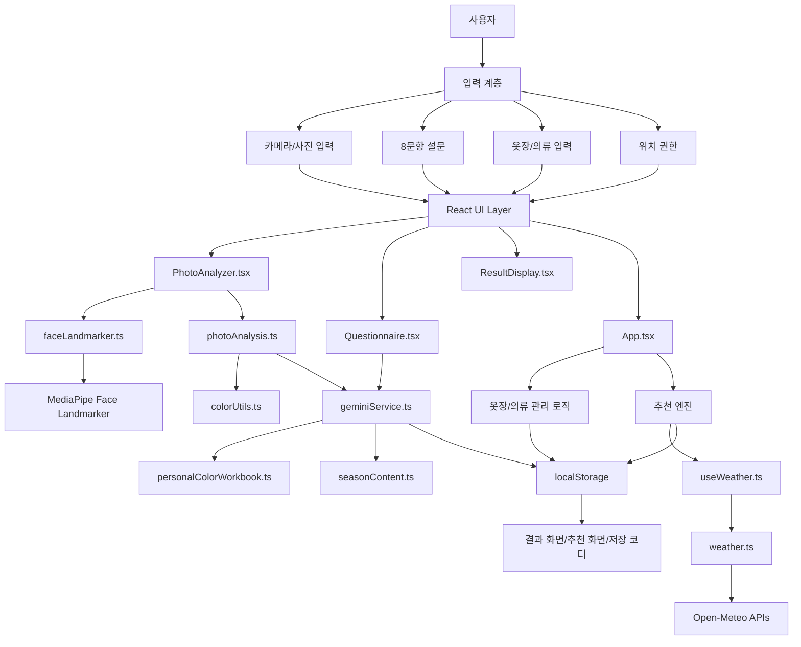

### 6.1 계층별 역할

| 계층 | 역할 |
|---|---|
| 입력 계층 | 카메라, 설문, 옷장 조작, 위치 권한 |
| UI 계층 | 화면 구성, 사용자 이벤트 처리, 페이지 전환 |
| 분석 계층 | 얼굴 색상 분석, 설문 점수화, 결과 융합 |
| 데이터 계층 | 12시즌 팔레트, 시즌 설명, 옷장/의류/코디 데이터 |
| 추천 계층 | 의류 적합도, 코디 점수, 날씨 반영 |
| 외부 API 계층 | MediaPipe 모델, 날씨/대기질 API |

---

## 7. 사용자 흐름

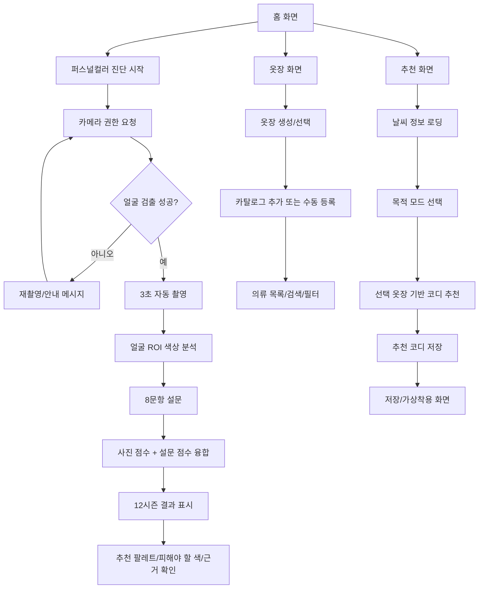

---

## 8. 화면/UI 구조

### 8.1 전체 페이지

앱의 주요 페이지 타입은 다음과 같다.

| Page | 화면 이름 | 역할 |
|---|---|---|
| `home` | 홈 | 진단 결과, 옷장 상태, 추천 진입 요약 |
| `personal` | 퍼스널컬러 | 사진 분석, 설문, 결과 표시 |
| `wardrobe` | 옷장 | 옷장 목록, 의류 목록, 카탈로그, 수동 등록 |
| `recommend` | 추천 | 날씨와 목적 기반 코디 추천 |
| `saved` | 저장 | 저장한 코디 목록 |
| `tryon` | 가상착용 | 저장 코디 이미지 미리보기 |
| `settings` | 설정 | 데이터 초기화 등 |

### 8.2 퍼스널컬러 진단 화면 흐름

| 단계 | 화면 내용 | 사용자 행동 |
|---|---|---|
| 사진 단계 | 카메라, 얼굴 가이드, 흰 종이 기준 영역, 자동 촬영 | 얼굴을 화면에 맞춤 |
| 분석 단계 | 촬영된 이미지 분석 진행 | 대기 |
| 설문 단계 | 8문항 카드 | 자신에게 맞는 선택지 선택 |
| 결과 단계 | 12시즌 결과, 팔레트, 근거, 측정 데이터 | 결과 확인 |

### 8.3 옷장 화면 흐름

| View | 역할 |
|---|---|
| `list` | 옷장 목록 |
| `detail` | 선택한 옷장 상세 의류 목록 |
| `catalog` | 기본 카탈로그 의류 선택 |
| `preview` | 선택한 카탈로그 의류 저장 전 미리보기 |
| `manual` | 의류 수동 등록 |

### 8.4 추천 화면 구성

추천 화면에는 다음 요소가 있다.

- 현재 날씨 카드
- 기온 구간 선택
- 추천 목적 모드 선택
- 추천 대상 옷장 선택
- 추천 가능 상태 요약
- 추천 코디 리스트
- 코디 저장 버튼

추천 목적 모드는 다음과 같다.

| Mode | 의미 |
|---|---|
| `데일리` | 일상 착장 |
| `출근` | 깔끔하고 안정적인 조합 |
| `데이트` | 색감과 분위기 강조 |
| `발표` | 신뢰감과 대비감 강조 |

현재 추천 모드는 UI 상태로 관리되며, 향후 모드별 가중치를 더 세분화할 수 있다.

---

## 9. 퍼스널컬러 분석 상세

### 9.1 전체 분석 파이프라인

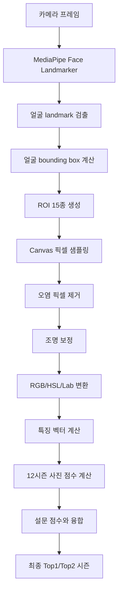

### 9.2 얼굴 ROI

`photoAnalysis.ts`에서 얼굴 landmark를 기반으로 다음 영역을 만든다.

| ROI key | 라벨 | 목적 |
|---|---|---|
| `underEyeLeft` | 왼쪽 눈가 | 눈 주변 색상 |
| `underEyeRight` | 오른쪽 눈가 | 눈 주변 색상 |
| `jawLeft` | 왼쪽 턱선 | 피부 보조 색상 |
| `jawRight` | 오른쪽 턱선 | 피부 보조 색상 |
| `skinLeft` | 왼쪽 볼 | 피부 대표 색상 |
| `skinRight` | 오른쪽 볼 | 피부 대표 색상 |
| `forehead` | 이마 중심 | 피부 보조 색상 |
| `noseLeft` | 코 왼쪽 | 피부 보조 색상 |
| `noseRight` | 코 오른쪽 | 피부 보조 색상 |
| `eyesLeft` | 왼쪽 홍채 | 눈 색상 |
| `eyesRight` | 오른쪽 홍채 | 눈 색상 |
| `eyebrowLeft` | 왼쪽 눈썹 | 눈썹/헤어 색상 보조 |
| `eyebrowRight` | 오른쪽 눈썹 | 눈썹/헤어 색상 보조 |
| `lips` | 입술 중심 | 입술 혈색 |
| `hair` | 헤어라인 | 머리 색상 |

### 9.3 색상 샘플링 방식

단순 평균 RGB를 사용하지 않고, ROI별로 다른 샘플링 전략을 사용한다.

| 처리 | 설명 |
|---|---|
| luminance trimming | 지나치게 어두운 픽셀과 밝은 픽셀 제거 |
| saturation filtering | 피부나 입술에 맞지 않는 무채색/오염 픽셀 제거 |
| erosion | ROI 가장자리 픽셀 오염을 줄이기 위해 내부 영역 위주 사용 |
| Lab median medoid | Lab 공간에서 중앙에 가까운 실제 픽셀을 대표색으로 선택 |
| lip-like filtering | 입술은 붉은/핑크 계열 조건을 우선 적용 |

### 9.4 조명 보정

조명 보정은 다음 우선순위로 수행된다.

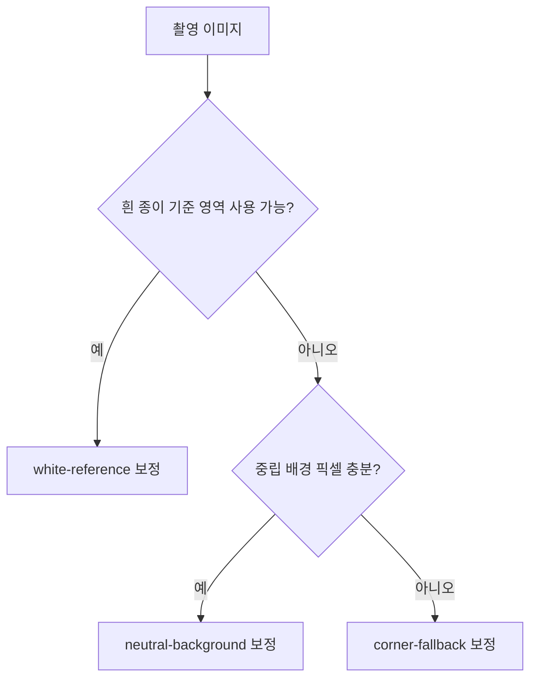

| 보정 방식 | 설명 |
|---|---|
| `white-reference` | 화면 오른쪽 아래 흰 종이 가이드 영역을 기준으로 색상 gain 계산 |
| `neutral-background` | 얼굴 주변 중립 배경 픽셀을 찾아 보정 |
| `corner-fallback` | 배경 판단이 어려우면 이미지 모서리 픽셀을 기준으로 보정 |

### 9.5 사진 품질 점수

사진 품질은 최종 융합 가중치에 영향을 준다.

| 항목 | 의미 |
|---|---|
| `overall` | 전체 품질 |
| `exposure` | 노출 적정성 |
| `symmetry` | 좌우 피부색 균형 |
| `distinctness` | 피부/머리/눈/입술 색상 구분도 |
| `faceSize` | 얼굴 크기 적정성 |
| `background` | 배경 중립성과 보정 가능성 |

### 9.6 사진 특징 벡터

사진 분석 결과는 다음 5개 특징으로 정규화된다.

| 특징 | 범위 | 의미 |
|---|---:|---|
| `temperature` | -1 ~ 1 | 쿨톤(-) / 웜톤(+) |
| `lightness` | -1 ~ 1 | 딥(-) / 라이트(+) |
| `clarity` | -1 ~ 1 | 뮤트(-) / 브라이트(+) |
| `contrast` | -1 ~ 1 | 저대비(-) / 고대비(+) |
| `mutedScore` | 0 ~ 1 | 뮤트 성향 |

---

## 10. 설문 분석 상세

### 10.1 설문 목적

사진 분석은 조명과 카메라 보정의 영향을 받기 때문에, 사용자의 경험적 응답을 통해 결과를 보정한다.

### 10.2 설문 문항

현재 설문은 8문항이다.

| 문항 id | 질문 요약 | 주로 반영되는 축 |
|---|---|---|
| `vein_color` | 손목 혈관 색 | temperature |
| `jewelry_reaction` | 골드/실버 반응 | temperature, clarity |
| `white_clothing` | 잘 받는 흰색 | temperature, lightness, clarity |
| `sun_reaction` | 햇빛 반응 | temperature, contrast |
| `vibrant_colors` | 비비드 컬러 반응 | clarity, contrast |
| `muted_colors` | 뮤트 컬러 반응 | clarity |
| `contrast_preference` | 대비 스타일 선호 | contrast, clarity |
| `color_depth` | 색의 깊이 | lightness |

### 10.3 설문 점수화

각 선택지는 다음 4개 축에 가중치를 준다.

```ts
interface QuestionnaireScores {
  temperature: number;
  lightness: number;
  clarity: number;
  contrast: number;
}
```

점수는 각 축의 최대 가능값으로 정규화되어 -1 ~ 1 범위로 변환된다.

---

## 11. 사진+설문 융합 알고리즘

### 11.1 융합 흐름

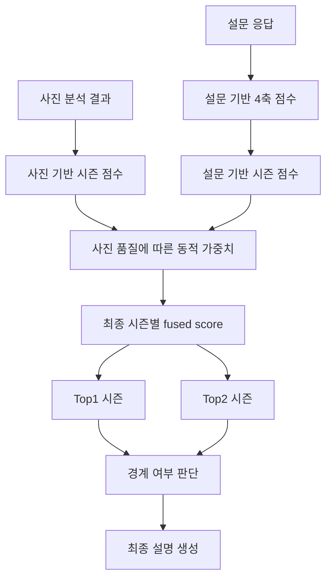

### 11.2 동적 가중치

사진 품질이 높을수록 사진 분석의 비중이 증가한다.

```text
photoWeight = clamp(0.22 + photoQuality * 0.14, 0.22, 0.36)
questionnaireWeight = 1 - photoWeight
```

즉 현재 구조에서는 설문이 항상 더 큰 비중을 갖고, 사진은 보조적으로 반영된다. 이는 카메라 색상 왜곡 가능성을 고려한 보수적 설계다.

### 11.3 시즌 점수 계산

사진 점수는 크게 두 요소로 구성된다.

| 요소 | 설명 |
|---|---|
| 팔레트 점수 | 추출 색상과 시즌 팔레트 간 Delta E 거리 |
| traits 점수 | temperature, lightness, clarity, contrast 특징과 시즌 traits의 유사도 |

특정 시즌에는 보정도 들어간다.

| 보정 | 설명 |
|---|---|
| 겨울 페널티 | mutedScore가 높으면 겨울 계열 과대 판정을 줄임 |
| 소프트 시즌 보너스 | mutedScore가 높으면 소프트 서머/소프트 오텀 가산 |
| 고대비 페널티 | 사진 대비가 낮으면 고대비 시즌 감점 |
| 고선명 페널티 | 사진 clarity가 낮으면 브라이트/고선명 시즌 감점 |

---

## 12. 12시즌 데이터 구조

### 12.1 시즌 목록

| ID | 한국어명 | 계열 |
|---|---|---|
| `light-spring` | 라이트 스프링 | spring |
| `true-spring` | 트루 스프링 | spring |
| `bright-spring` | 브라이트 스프링 | spring |
| `light-summer` | 라이트 서머 | summer |
| `true-summer` | 트루 서머 | summer |
| `soft-summer` | 소프트 서머 | summer |
| `soft-autumn` | 소프트 오텀 | autumn |
| `true-autumn` | 트루 오텀 | autumn |
| `dark-autumn` | 다크 오텀 | autumn |
| `dark-winter` | 다크 윈터 | winter |
| `true-winter` | 트루 윈터 | winter |
| `bright-winter` | 브라이트 윈터 | winter |

### 12.2 시즌 프로필 구조

```ts
interface SeasonProfile {
  id: SeasonId;
  name: string;
  englishName: string;
  family: SeasonFamily;
  toneNote: string;
  traits: QuestionnaireScores;
  workbookStats: {
    averageRgb: [number, number, number];
    averageLightness: number;
    averageSaturation: number;
    averageTemperature: number;
    averageContrast: number;
  };
  palette: string[];
}
```

### 12.3 시즌 데이터의 역할

| 데이터 | 역할 |
|---|---|
| `traits` | 사진/설문 특징과 시즌의 유사도 계산 |
| `palette` | 사용자 추천 색상과 의류 색상 적합도 계산 |
| `workbookStats` | 원본 엑셀 기반 시즌 평균 특성 보관 |
| `seasonContent.ts` | 결과 화면 설명, 추천/피해야 할 색, 인접 시즌 안내 |

### 12.4 퍼스널컬러 색상 체계의 핵심 개념

이 프로젝트에서 퍼스널컬러 색상은 단순히 "예쁜 색 목록"이 아니라, **진단, 설명, 의류 평가, 코디 추천에 모두 사용되는 기준 데이터**다.

퍼스널컬러는 크게 4개 계열과 12개 세부 시즌으로 나뉜다.

| 대분류 | 기본 성향 | 세부 시즌 |
|---|---|---|
| 봄 spring | 따뜻함, 밝음, 생기, 맑음 | 라이트 스프링, 트루 스프링, 브라이트 스프링 |
| 여름 summer | 차가움, 밝거나 중간 명도, 부드러움, 회색기 | 라이트 서머, 트루 서머, 소프트 서머 |
| 가을 autumn | 따뜻함, 깊이감, 차분함, 흙빛/골드감 | 소프트 오텀, 트루 오텀, 다크 오텀 |
| 겨울 winter | 차가움, 선명함, 고대비, 깊거나 강한 색 | 다크 윈터, 트루 윈터, 브라이트 윈터 |

색상 판단은 다음 4개 축을 중심으로 이루어진다.

| 축 | 값이 낮을 때 | 값이 높을 때 | 프로젝트 내 사용 위치 |
|---|---|---|---|
| `temperature` | 쿨, 푸른 기, 로지/블루 기반 | 웜, 노란 기, 골드/피치 기반 | 웜/쿨 계열 판단 |
| `lightness` | 딥, 어두움, 무게감 | 라이트, 밝음, 투명감 | 라이트/다크 시즌 판단 |
| `clarity` | 뮤트, 회색기, 탁함 | 브라이트, 선명함, 맑음 | 소프트/브라이트 시즌 판단 |
| `contrast` | 저대비, 부드러운 톤온톤 | 고대비, 강한 명암차 | 겨울/브라이트/다크 계열 판단 |

즉, 이 프로젝트의 색상 판단은 단순히 `웜톤/쿨톤`만 보는 것이 아니라 다음과 같은 질문을 동시에 계산한다.

- 이 색은 따뜻한가, 차가운가?
- 이 색은 밝은가, 어두운가?
- 이 색은 맑고 선명한가, 부드럽고 뮤트한가?
- 이 색은 얼굴과 함께 놓였을 때 대비가 강한가, 약한가?
- 이 색은 사용자의 Top1 시즌 팔레트에 가까운가?
- 이 색은 Top1 시즌의 피해야 할 색에 가까운가?

### 12.5 12시즌별 색상 성격 상세

아래 표는 코드에 들어 있는 `SEASON_PROFILES`의 traits와 팔레트가 어떤 의미로 쓰이는지 사람이 읽기 쉽게 풀어쓴 것이다.

| 시즌 | 색상 성격 | 잘 어울리는 색 방향 | 피해야 할 가능성이 큰 색 방향 |
|---|---|---|---|
| 라이트 스프링 | 웜, 매우 밝음, 비교적 맑음, 저대비 | 아이보리, 피치, 라이트 코랄, 맑은 민트, 밝은 옐로 | 검정, 무거운 버건디, 탁한 카키, 딥 네이비 |
| 트루 스프링 | 강한 웜, 중간 밝기, 생기, 선명함 | 골든 옐로, 오렌지, 코랄, 따뜻한 그린 | 차가운 블루그레이, 퍼플기 많은 색, 탁한 회색 |
| 브라이트 스프링 | 웜, 선명함, 고채도, 비교적 고대비 | 비비드 코랄, 선명한 옐로, 맑은 그린, 터쿼이즈 | 회색기 많은 뮤트톤, 너무 어두운 다크톤 |
| 라이트 서머 | 쿨, 매우 밝음, 부드러움, 저대비 | 파우더 핑크, 라벤더, 베이비 블루, 소프트 화이트 | 강한 오렌지, 머스타드, 검정, 고채도 원색 |
| 트루 서머 | 강한 쿨, 중간 명도, 부드러운 채도 | 로즈, 더스티 블루, 쿨 그레이, 라즈베리 | 노란기 강한 베이지, 브라운, 오렌지 |
| 소프트 서머 | 쿨, 뮤트, 저대비, 차분함 | 모브, 세이지, 토프 블루, 더스티 로즈 | 쨍한 원색, 형광색, 강한 검정-흰색 대비 |
| 소프트 오텀 | 웜, 뮤트, 중간 명도, 차분함 | 세이지, 카멜, 소프트 브라운, 살몬 베이지 | 차가운 실버블루, 형광 핑크, 순백 |
| 트루 오텀 | 강한 웜, 깊이감, earthy | 머스타드, 테라코타, 올리브, 브라운, 웜 베이지 | 차가운 파스텔, 블루핑크, 아이시 컬러 |
| 다크 오텀 | 웜, 어두움, 깊은 색, 중고대비 | 딥 올리브, 초콜릿, 러스트, 다크 카멜 | 너무 밝은 파스텔, 차가운 라벤더, 순백 |
| 다크 윈터 | 쿨, 어두움, 깊음, 고대비 | 블랙, 딥 와인, 다크 네이비, 차가운 에메랄드 | 노란 브라운, 탁한 카키, 흐린 베이지 |
| 트루 윈터 | 강한 쿨, 선명함, 고대비 | 블랙, 화이트, 로열 블루, 푸시아, 아이시 핑크 | 따뜻한 오렌지, 머스타드, 흐린 브라운 |
| 브라이트 윈터 | 쿨, 매우 선명함, 고채도, 고대비 | 핫핑크, 코발트, 아이시 블루, 선명한 퍼플 | 탁한 회색기, 누런 베이지, 소프트 오텀류 |

이 표의 내용은 사용자의 결과 화면에서 보이는 추천 팔레트, 인접 시즌, 피해야 할 색상 설명과 연결된다.

### 12.6 색상 데이터가 코드에서 쓰이는 방식

퍼스널컬러 색상 데이터는 크게 네 군데에서 사용된다.

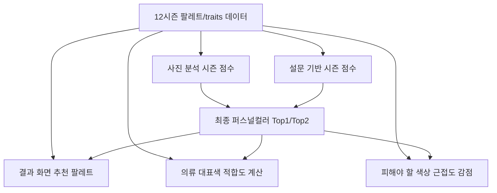

| 사용 위치 | 사용 데이터 | 설명 |
|---|---|---|
| 사진 분석 | `SEASON_PROFILES[seasonId].palette` | 얼굴에서 추출한 피부/머리/눈/입술 색과 시즌 팔레트의 거리를 비교 |
| 설문 분석 | `SEASON_PROFILES[seasonId].traits` | 설문 4축 점수와 시즌 traits의 유사도를 계산 |
| 결과 표시 | `palette`, `SEASON_DETAILS` | 사용자에게 추천색, 보조색, 인접 시즌, 설명 문구를 보여줌 |
| 의류 평가 | `result.palette` | 의류 대표색이 사용자 시즌 팔레트에 얼마나 가까운지 계산 |
| 위험 색상 감점 | `SEASON_DETAILS[seasonId].worstColors` | 피해야 할 색과 가까우면 `avoidPenalty` 적용 |

### 12.7 팔레트 색상의 의미

각 시즌의 `palette`는 HEX 색상 배열이다.

예시:

```ts
palette: [
  '#FFF6D9',
  '#FDF1D0',
  '#EFD8B8',
  '#D9C2A2',
  '#FFD1B8',
  ...
]
```

이 색상들은 단순 화면 장식용이 아니라 다음 목적에 사용된다.

| 목적 | 설명 |
|---|---|
| 추천 팔레트 표시 | 결과 화면에서 사용자가 바로 참고할 수 있는 색상 칩으로 표시 |
| 사진 색상 매칭 | 얼굴에서 추출한 색이 어떤 시즌 팔레트와 가까운지 계산 |
| 의류 적합도 | 옷의 대표색이 사용자 팔레트와 가까우면 높은 점수 |
| 유사 시즌 판단 | Top1과 Top2 시즌의 점수 차이를 통해 경계 여부 판단 |
| 코디 색상 가이드 | 저장 코디와 추천 코디의 색상 시각화 |

### 12.8 RGB, HSL, Lab를 모두 쓰는 이유

프로젝트에서는 색상을 하나의 색공간으로만 판단하지 않는다.

| 색공간 | 쓰는 이유 | 프로젝트 내 예 |
|---|---|---|
| RGB | 브라우저/Canvas에서 직접 얻는 기본 픽셀 값 | 카메라 프레임 픽셀 샘플링 |
| HSL | 색상, 채도, 밝기를 직관적으로 분리 | 입술 후보 필터링, clarity/muted 판단 |
| Lab | 사람이 느끼는 색 차이에 더 가까움 | Delta E 거리 계산, palette match |

RGB는 화면 표시와 픽셀 수집에는 좋지만, 사람 눈이 느끼는 색 차이를 그대로 반영하지 못한다. 예를 들어 RGB 숫자 차이는 비슷해도 사람 눈에는 어떤 색은 더 크게 다르게 보일 수 있다. 그래서 시즌 팔레트와 의류 색을 비교할 때는 Lab 변환 후 Delta E 거리 계산을 사용한다.

### 12.9 Delta E 기반 색상 거리

의류 대표색과 시즌 팔레트의 가까움을 계산할 때는 다음 흐름을 따른다.

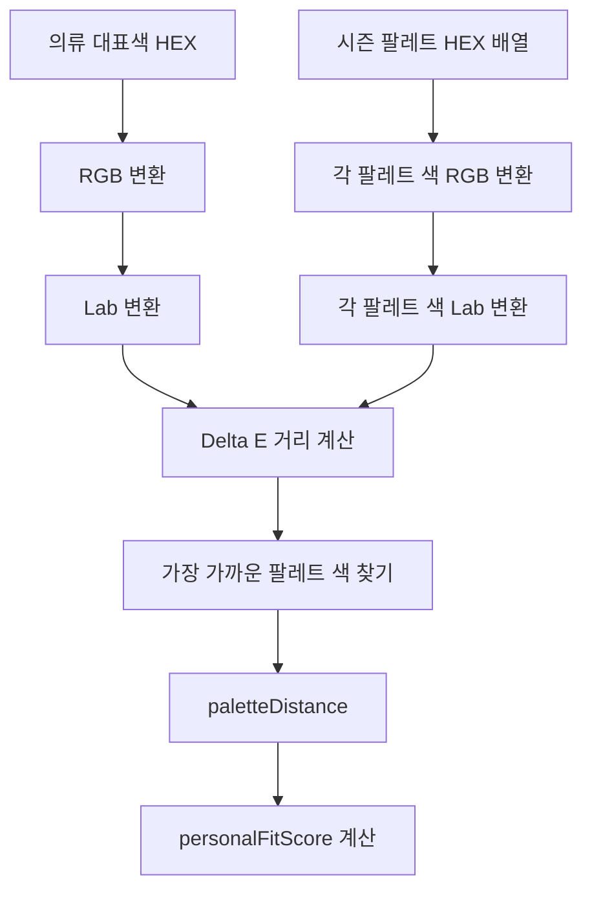

현재 의류 적합도 계산에서는 팔레트와의 최소 거리를 사용한다.

```text
paletteDistance = min(DeltaE(itemColorLab, eachPaletteColorLab))
paletteScore = max(0, 100 - paletteDistance * 3.2)
```

해석:

| 거리 | 의미 | 점수 영향 |
|---:|---|---|
| 작음 | 사용자 시즌 팔레트와 매우 가까움 | 높은 점수 |
| 중간 | 어느 정도 어울릴 수 있음 | 중간 점수 |
| 큼 | 시즌 팔레트와 멂 | 낮은 점수 |

### 12.10 피해야 할 색상 처리

결과 화면에는 추천색뿐 아니라 피해야 할 색상도 존재한다. 추천 엔진에서는 이 색을 단순 안내로만 쓰지 않고, 실제 의류 점수 감점에도 사용한다.

```text
avoidDistance = min(DeltaE(itemColorLab, eachWorstColorLab))

if avoidDistance < 18:
  avoidPenalty = 22
else if avoidDistance < 28:
  avoidPenalty = 10
else:
  avoidPenalty = 0
```

즉, 의류 색상이 사용자의 워스트 컬러에 매우 가까우면 큰 감점이 들어가고, 약간 가까우면 작은 감점이 들어간다.

이 방식의 장점:

- 단순히 추천 팔레트와 가까운지만 보는 것보다 안전하다.
- "팔레트에는 없지만 피해야 할 색에도 가깝지 않은 색"을 완전히 배제하지 않는다.
- 검정, 데님, 화이트 같은 기본템은 별도 보정과 함께 현실적으로 활용 가능하게 남긴다.

### 12.11 뉴트럴/데님 색상 보정

패션에서는 퍼스널컬러 이론만으로 모든 의류를 평가하면 실사용성이 떨어질 수 있다. 예를 들어 데님, 화이트, 블랙, 그레이, 네이비 같은 기본색은 팔레트와 완전히 일치하지 않아도 자주 활용된다.

그래서 현재 구현에는 다음 보정이 있다.

```text
utilityBonus = item.isNeutral || item.isDenim ? 8 : 0
```

| 색상 유형 | 처리 이유 |
|---|---|
| 화이트/아이보리 | 대부분의 코디에서 기본 상의나 이너로 활용 |
| 블랙 | 겨울 계열에는 강점, 다른 계열도 하의/신발로 활용 가능 |
| 그레이 | 쿨 계열에 유리하지만 무난한 중립색으로 사용 가능 |
| 네이비 | 블랙보다 부드러운 안정색 |
| 데님 | 색상 이론보다 실제 코디 활용도가 높음 |

이 보정은 추천이 너무 이론적으로만 흐르지 않도록 하는 장치다.

### 12.12 시즌별 팔레트와 의류 추천의 연결 예시

| 사용자 결과 | 의류 색상 | 처리 예 |
|---|---|---|
| 라이트 스프링 | 밝은 아이보리 니트 | 팔레트 거리 가까움 + 뉴트럴 보정으로 높은 점수 |
| 라이트 스프링 | 검정 가죽 자켓 | 색상은 다소 무거워 감점 가능, 아우터/기본템으로는 일부 활용 가능 |
| 소프트 서머 | 더스티 블루 셔츠 | 뮤트·쿨 계열이라 높은 점수 |
| 소프트 서머 | 형광 오렌지 티셔츠 | clarity와 temperature 모두 어긋나 낮은 점수 |
| 트루 오텀 | 카멜 코트 | 웜·earthy 계열이라 높은 점수 |
| 트루 오텀 | 아이시 라벤더 블라우스 | 쿨·라이트 방향이라 감점 |
| 트루 윈터 | 블랙 슬랙스 | 고대비/쿨 안정색이라 높은 점수 |
| 브라이트 윈터 | 핫핑크 포인트 아이템 | 선명한 쿨 고채도 색이라 높은 점수 |

### 12.13 결과 화면에서 색상이 보이는 방식

결과 화면의 색상 표현은 사용자 이해를 돕기 위해 여러 층으로 나뉜다.

| UI 요소 | 설명 |
|---|---|
| 대표 시즌명 | 예: 소프트 서머, 브라이트 윈터 |
| Top2 시즌 | 경계 또는 보조 참고 시즌 |
| 추천 팔레트 | 시즌 팔레트 중 일부 색상 칩 |
| 유사 색상 | 보조로 활용 가능한 색상 |
| 피해야 할 색 | 얼굴을 칙칙하게 만들거나 과하게 보일 수 있는 색 |
| 추출 색상 | 피부/머리/눈/입술에서 실제 측정된 색 |
| 개발자 모드 | ROI별 색상, Lab/HSL, 시즌별 점수 확인 |

### 12.14 현재 색상 파트의 한계

| 한계 | 설명 | 개선 방향 |
|---|---|---|
| 팔레트 데이터가 고정 | 현재 12시즌 팔레트는 코드에 고정되어 있음 | 사용자 데이터가 쌓이면 팔레트 보정 가능 |
| 카메라 색상 오차 | 조명과 기기 자동 보정의 영향을 받음 | 색상 보정 카드, 다중 촬영 평균 |
| 의류 자동 색상 미구현 | 현재 의류색은 카탈로그/수동 입력 중심 | 이미지 업로드 기반 대표색 추출 |
| 소재 반영 부족 | 광택, 니트, 데님, 가죽의 색감 차이 반영 제한 | 소재 태그와 보정값 추가 |
| 색상 조화도 단순 | 현재 harmonyScore는 뉴트럴/동색 중심 | hue/명도/채도/패턴 기반 조화도 확장 |

---

## 13. 옷장 관리 구조

### 13.1 옷장 기능

현재 구현된 옷장 기능은 다음과 같다.

| 기능 | 상태 |
|---|---|
| 기본 데모 옷장 제공 | 구현 |
| 옷장 생성 | 구현 |
| 옷장 이름 수정 | 구현 |
| 옷장 삭제 | 구현 |
| 옷장 검색 | 구현 |
| 옷장별 의류 목록 | 구현 |
| 카테고리 필터 | 구현 |
| grid/list 레이아웃 전환 | 구현 |
| 카탈로그에서 의류 추가 | 구현 |
| 수동 의류 등록 | 구현 |
| 의류 삭제 | 구현 |

### 13.2 옷장 데이터 모델

```ts
interface Wardrobe {
  id: string;
  name: string;
  createdAt: string;
}
```

### 13.3 의류 데이터 모델

```ts
interface ClothingItem {
  id: string;
  wardrobeId: string;
  imageUrl: string;
  category: ClothingCategory;
  type: string;
  color: string;
  size: string;
  brand: string;
  createdAt: string;
  representativeColor: string;
  representativeHex: string;
  seasonTag: string;
  patternType: string;
  isNeutral: boolean;
  isDenim: boolean;
  sourceType: 'catalog' | 'upload';
  catalogItemId?: string;
}
```

### 13.4 의류 카테고리

현재 카테고리는 다음 5개다.

| 카테고리 | 예시 |
|---|---|
| 상의 | 반팔, 긴팔, 니트, 셔츠 |
| 하의 | 청바지, 슬랙스, 스커트 |
| 아우터 | 자켓, 코트, 패딩 |
| 신발 | 스니커즈, 로퍼, 부츠 |
| 액세서리 | 가방, 모자, 스카프, 벨트 |

### 13.5 이미지 분류 결과와 옷장 카테고리 동기화

옷 이미지 분석 모델이 판단하는 것은 생활 상태가 아니다. 모델의 핵심 출력은 **의류 부위/카테고리, 세부 라벨, 대표색, 분석 이미지 결과물**이다.

따라서 업로드 분석 결과는 옷장에 다음 필드 중심으로 동기화된다.

| 이미지 분석 결과 | 옷장 필드 | 설명 |
|---|---|---|
| `part = upper` | `category = 상의` | 상의 카테고리로 저장 |
| `part = lower` | `category = 하의` | 하의 카테고리로 저장 |
| `part = outer` | `category = 아우터` | 아우터 카테고리로 저장 |
| `visible_fine_labels` | `type` 후보 | shirt, pants, coat 등 세부 타입 후보 |
| `colors[0].hex` | `representativeHex` | 대표색 HEX |
| `colors[0].hex` 매핑 결과 | `representativeColor`, `color` | 사용자에게 보이는 색상명 |
| `transparent/white/cropped` | `imageUrl` 또는 이미지 후보 | 옷장 카드 이미지 |
| `scene_mode` | 분석 메타데이터 | clean/worn/held 처리 방식 기록 |

생활 상태값은 이미지 모델이 자동 판단할 수 있는 값이 아니므로, 이 문서에서는 옷 분류 모델의 산출물로 다루지 않는다.

---

## 14. 의류 색상 메타데이터

### 14.1 현재 방식

현재 의류 대표색은 자동 이미지 분석이 아니라, 카탈로그 데이터 또는 수동 입력 색상에서 가져온다.

예:

```ts
const COLOR_META = {
  화이트: { representative: '화이트', hex: '#F7F7F4', neutral: true },
  블랙: { representative: '블랙', hex: '#171717', neutral: true },
  데님: { representative: '데님', hex: '#5C7898', denim: true },
  ...
}
```

### 14.2 색상 메타데이터의 역할

| 필드 | 역할 |
|---|---|
| `representativeColor` | 사용자에게 보여주는 대표 색상명 |
| `representativeHex` | 점수 계산용 HEX 색상 |
| `seasonTag` | 봄/가을, 여름, 겨울, 사계절 등 계절성 |
| `patternType` | 무지, 스트라이프, 체크 등 |
| `isNeutral` | 화이트/블랙/그레이/네이비 등 안정색 여부 |
| `isDenim` | 데님 보정 여부 |

### 14.3 옷 이미지 업로드 자동 분석 계획

현재 통합 React 앱에는 아직 직접 붙어 있지 않지만, 별도 자료인 `의류_추출_시스템_구현_보고서_옷장의 본인 옷 추가할때 쓰일 모델 및 로직.docx`와 `이미지 카테고리화 및 분석 및 새상추출 모델.ipynb`에는 **옷 이미지 업로드 시 사용할 분석 파이프라인**이 설계·구현되어 있다.

즉, 현재 본 앱의 옷장 등록은 카탈로그/수동 등록 중심이지만, 향후에는 아래 노트북 로직을 앱 또는 백엔드 API로 이식해 사용자가 직접 찍은 옷 사진을 자동 분석할 수 있다.

이 자동 분석 시스템의 목적은 단순히 사진에서 배경을 제거하는 것이 아니라, **옷장에 바로 저장 가능한 구조화된 의류 데이터**를 만드는 것이다.

입력:

- 흰 배경 제품컷
- 바닥에 놓고 찍은 옷 사진
- 사람이 착용한 전신샷/모델샷
- 사람이 손에 들고 찍은 사진

출력:

| 출력물 | 설명 | 옷장 시스템에서의 활용 |
|---|---|---|
| 투명 PNG | 의류 부분만 알파 마스크로 남긴 이미지 | 가상착용, 의류 카드 이미지 |
| 흰 배경 PNG | 투명 PNG를 흰 배경에 합성한 이미지 | 분류 모델 입력, 사용자 확인용 |
| 자동 크롭 이미지 | 의류 영역만 잘라낸 이미지 | 썸네일, 색상 추출 입력 |
| 색상 JSON | 대표색 RGB/HEX/비율 목록 | `representativeHex`, 팔레트, 추천 점수 |
| 메타 JSON | 장면 모드, 요청 부위, 예측 라벨, 분류기 정보 | DB 저장, 디버깅, 사용자 확인 |
| 팔레트 PNG | 대표색을 비율별 막대로 시각화 | 색상 추출 결과 검수 |

### 14.4 사용자가 먼저 선택하는 값

노트북은 이미지 분석 전에 사용자가 원하는 부위를 먼저 선택하도록 설계되어 있다.

```python
TARGET_PART = "upper"      # upper / lower / upper_lower / outer
SCENE_MODE = "auto"        # auto / clean / worn / held
N_COLORS = 5
CATEGORY_TOPK = 3
```

| 설정값 | 의미 |
|---|---|
| `upper` | 상의만 추출 |
| `lower` | 하의만 추출 |
| `upper_lower` | 상의와 하의를 각각 분리 추출 |
| `outer` | 아우터만 추출 |
| `clean` | 흰 배경 제품컷/깔끔한 옷 사진 |
| `worn` | 사람이 착용한 전신샷/모델샷 |
| `held` | 사람이 손에 들고 찍은 사진 |
| `auto` | 휴리스틱으로 장면 자동 판단 |

이 설계의 핵심은 **사진 1장을 무조건 의류 1개로 보지 않는 것**이다. 특히 전신 착용샷에서는 상의, 하의, 아우터가 한 장 안에 동시에 존재할 수 있으므로, `upper_lower`처럼 여러 부위를 나누어 결과를 만들 수 있다.

### 14.5 사용 모델과 역할

노트북에서 사용하는 모델/라이브러리는 다음과 같다.

| 구분 | 모델/라이브러리 | 역할 | 적용 장면 |
|---|---|---|---|
| 일반 전경 분리 | `rembg` + `birefnet-general` | 옷 또는 주요 객체의 전경 마스크 생성 | clean, held |
| 사람 마스크 | `rembg` + `u2net_human_seg` | 사람 영역 마스크 생성 | held, auto |
| 패션 파싱 | `sayeed99/segformer-b3-fashion` | 착용샷에서 상의/하의/아우터 라벨 분리 | worn |
| 제로샷 분류 | `Marqo/marqo-fashionSigLIP` | 단일 의류를 상의/하의/아우터로 coarse 분류 | clean, held |
| 분류 fallback | `openai/clip-vit-base-patch32` | FashionSigLIP 로딩 실패 시 대체 | clean, held |
| 색상 추출 | `scikit-learn KMeans` | 대표색 최대 5개 추출 | 모든 장면 |
| 후처리 | `OpenCV`, `scipy.ndimage` | 마스크 정리, largest component, dilation | 모든 장면 |

설치 기준은 Colab 재현성을 고려해 다음처럼 고정되어 있다.

```bash
pip install \
  "rembg==2.0.75" \
  "onnxruntime==1.22.1" \
  "transformers>=4.57.6,<6" \
  "accelerate>=1.0.0" \
  "opencv-python-headless<4.11" \
  "scipy" \
  "scikit-learn" \
  "matplotlib"
```

### 14.6 장면 자동 분기 로직

이미지 업로드 후 `SCENE_MODE = "auto"`이면 시스템은 사진이 어떤 유형인지 자동 판단한다.

판단에 쓰는 값:

| 값 | 계산 방식 | 의미 |
|---|---|---|
| `human_ratio` | `u2net_human_seg` 사람 마스크 평균 | 사진에서 사람이 차지하는 비율 |
| `border_white` | 이미지 테두리 픽셀 중 RGB > 235 비율 | 흰 배경 제품컷 가능성 |
| `border_std` | 테두리 픽셀 색상 표준편차 | 배경이 단순한지 복잡한지 |
| `apparel_ratio` | SegFormer 결과 중 의류 라벨 비율 | 착용샷에서 의류가 감지되는 정도 |

장면 판정 규칙:

```python
if human_ratio < 0.08 and border_white > 0.55:
    mode = "clean"
elif human_ratio > 0.15 and apparel_ratio > 0.04:
    mode = "worn"
else:
    mode = "held"
```

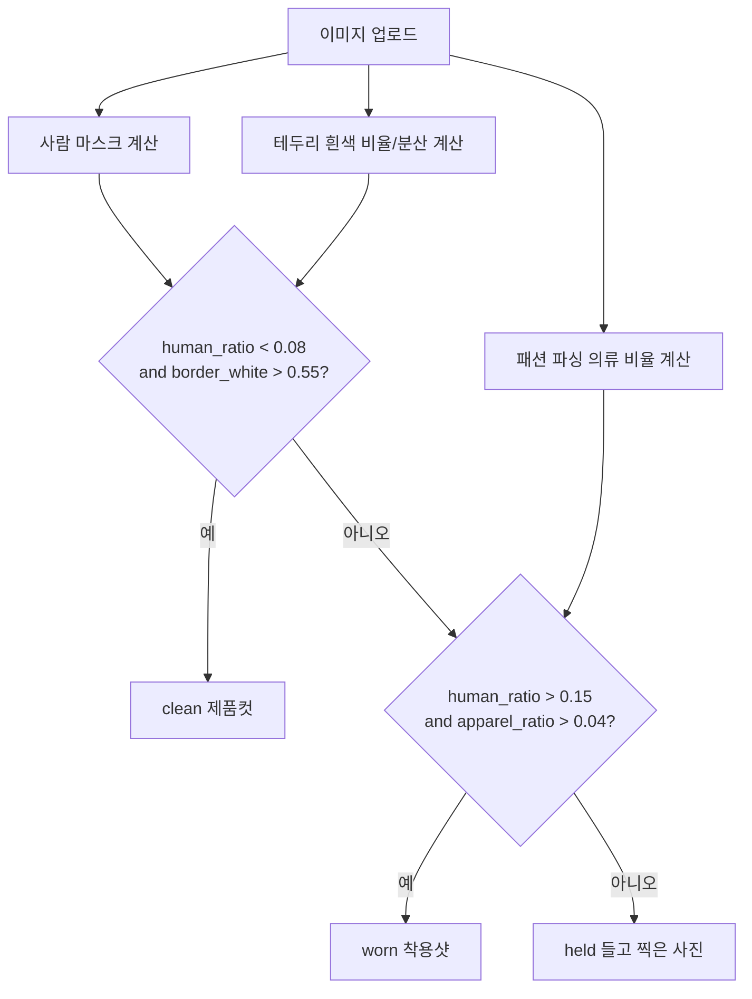

### 14.7 장면별 처리 방식

업로드 이미지 분석은 장면별로 다른 모델을 적용한다.

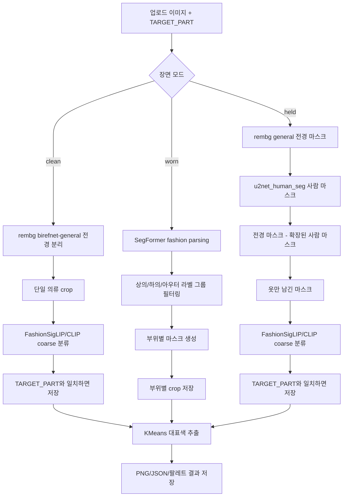

| 장면 | 처리 방식 | 이유 |
|---|---|---|
| `clean` | 일반 전경 분리 후 제로샷 분류 | 보통 옷 하나가 중심이므로 복잡한 파싱보다 빠르고 단순함 |
| `worn` | SegFormer 패션 파싱 | 한 장에 상의/하의/아우터가 동시에 존재할 수 있음 |
| `held` | 일반 전경에서 사람 마스크를 빼고 제로샷 분류 | 손이나 팔이 같이 찍히는 문제를 줄이기 위함 |

### 14.8 패션 파싱 라벨 그룹

`sayeed99/segformer-b3-fashion`이 예측하는 라벨 중 핵심 의류 라벨만 사용한다.

```python
FASHION_LABELS = {
    1: "shirt, blouse",
    2: "top, t-shirt, sweatshirt",
    3: "sweater",
    4: "cardigan",
    5: "jacket",
    6: "vest",
    7: "pants",
    8: "shorts",
    9: "skirt",
    10: "coat",
    11: "dress",
    12: "jumpsuit",
    13: "cape",
}
```

프로젝트에서는 이를 다음 coarse 그룹으로 묶는다.

| coarse part | 포함 라벨 ID | 포함 라벨 |
|---|---|---|
| `upper` | 1, 2, 3, 6 | shirt/blouse, top/t-shirt/sweatshirt, sweater, vest |
| `lower` | 7, 8, 9 | pants, shorts, skirt |
| `outer` | 4, 5, 10, 13 | cardigan, jacket, coat, cape |
| `fullbody` | 11, 12 | dress, jumpsuit |

현재 노트북의 기본 추출 대상은 `upper`, `lower`, `outer`이며, `dress`, `jumpsuit`는 장면 판단의 apparel ratio에는 포함되지만 옷장 카테고리 저장 로직에는 별도 확장 여지가 있다.

### 14.9 worn 착용샷 처리 로직

착용샷은 다음 순서로 처리된다.

1. SegFormer로 픽셀별 패션 라벨을 예측한다.
2. 사용자가 선택한 `TARGET_PART`에 맞는 라벨 ID만 남긴다.
3. 마스크에 close/open morphology를 적용해 구멍과 잡음을 줄인다.
4. 가장 큰 connected component만 남겨 불필요한 작은 조각을 제거한다.
5. 마스크를 알파 채널로 적용해 투명 PNG를 만든다.
6. 알파 영역 기준으로 crop한다.
7. 부위별 대표색을 KMeans로 추출한다.

`upper_lower` 모드에서는 한 장의 전신샷에서 상의와 하의를 각각 따로 저장한다.

예:

```json
[
  {
    "part": "upper",
    "part_ko": "상의",
    "visible_fine_labels": ["shirt, blouse", "top, t-shirt, sweatshirt"],
    "colors": []
  },
  {
    "part": "lower",
    "part_ko": "하의",
    "visible_fine_labels": ["pants"],
    "colors": []
  }
]
```

### 14.10 clean 제품컷 처리 로직

제품컷은 다음 순서로 처리된다.

1. `rembg`의 `birefnet-general`로 전경 마스크를 만든다.
2. 마스크에 close/open morphology를 적용한다.
3. 가장 큰 connected component만 남긴다.
4. 알파 마스크를 적용해 옷만 남긴다.
5. crop 후 흰 배경으로 합성한다.
6. 제로샷 이미지 분류로 상의/하의/아우터를 예측한다.
7. 예측 coarse가 사용자가 선택한 `TARGET_PART`와 맞으면 결과로 저장한다.
8. 대표색을 추출한다.

제로샷 후보 문장은 다음과 같다.

```python
COARSE_LABELS = [
    "upper clothing like a shirt, t-shirt, sweater or hoodie",
    "lower clothing like pants, shorts or a skirt",
    "outerwear like a jacket, coat or cardigan",
]
```

분류 결과는 top-k 형태로 저장된다.

```json
[
  {
    "label": "upper clothing like a shirt, t-shirt, sweater or hoodie",
    "coarse": "upper",
    "score": 0.82
  },
  {
    "label": "outerwear like a jacket, coat or cardigan",
    "coarse": "outer",
    "score": 0.12
  }
]
```

### 14.11 held 손에 든 사진 처리 로직

손에 들고 찍은 사진은 clean보다 어렵다. 사람 손과 옷이 겹치기 때문이다. 노트북은 다음 방식으로 처리한다.

1. `birefnet-general`로 전체 전경 마스크를 만든다.
2. `u2net_human_seg`로 사람 마스크를 만든다.
3. 사람 마스크를 dilation으로 조금 확장한다.
4. 전체 전경 마스크에서 확장된 사람 마스크를 뺀다.
5. 남은 영역을 옷 후보 마스크로 사용한다.
6. 만약 남은 마스크가 너무 작으면 원래 전경 마스크를 fallback으로 사용한다.
7. 이후 clean과 동일하게 crop, coarse 분류, 색상 추출을 수행한다.

핵심 로직:

```python
human_dilated = ndi.binary_dilation(human_mask, iterations=8)
garment_mask = obj_mask & (~human_dilated)

if garment_mask.sum() < obj_mask.sum() * 0.15:
    garment_mask = obj_mask.copy()
```

이 fallback은 손을 제거하다가 옷 영역까지 지나치게 사라지는 문제를 막기 위한 안전장치다.

### 14.12 마스크 후처리 로직

마스크는 모델 출력 그대로 쓰지 않고 정리한다.

| 함수 | 역할 |
|---|---|
| `close_open_mask(mask, k=5)` | morphology close 후 open으로 구멍과 잡음 정리 |
| `largest_component(mask)` | 가장 큰 연결 영역만 남김 |
| `crop_rgba_by_alpha(rgba_img)` | 알파가 있는 영역만 자동 crop |
| `composite_white(rgba_img)` | 투명 PNG를 흰 배경 RGB 이미지로 변환 |

이 과정이 필요한 이유:

- 작은 잡음 픽셀이 대표색에 섞이는 것을 방지
- 배경 조각이 의류 색상으로 들어가는 것을 방지
- 옷장 카드 썸네일을 깔끔하게 만들기 위함
- 제로샷 분류 모델에 배경보다 의류가 크게 보이도록 하기 위함

### 14.13 대표색 추출 로직

색상은 원본 전체 이미지에서 뽑지 않는다. 반드시 **알파 마스크가 적용된 의류 픽셀만** 사용한다.

처리 순서:

1. RGBA crop 이미지로 변환한다.
2. 긴 변이 `max_size=700`보다 크면 축소한다.
3. 알파 값이 0보다 큰 픽셀만 선택한다.
4. RGB 픽셀에 KMeans를 적용한다.
5. 최대 `N_COLORS=5`개 군집을 만든다.
6. 각 군집 중심을 RGB/HEX로 저장한다.
7. 각 군집 비율을 계산한다.
8. 비율이 높은 순서대로 정렬한다.

실제 출력 형태:

```json
[
  {
    "rgb": [236, 229, 214],
    "hex": "#ECE5D6",
    "ratio": 0.4832
  },
  {
    "rgb": [184, 170, 150],
    "hex": "#B8AA96",
    "ratio": 0.2711
  }
]
```

이 JSON은 향후 앱의 `ClothingItem`으로 다음처럼 연결된다.

| 색상 JSON | ClothingItem 필드 |
|---|---|
| 첫 번째 색상의 `hex` | `representativeHex` |
| 첫 번째 색상의 HEX를 표준 색상명으로 매핑한 값 | `representativeColor`, `color` |
| 전체 색상 배열 | 향후 `colorPalette` 확장 필드 |
| 첫 번째 색상 비율 | 대표색 신뢰도 |

색상 JSON만으로 옷장에 저장하지는 않는다. 실제 옷장 동기화 시에는 색상 JSON과 메타 JSON을 합쳐 다음처럼 하나의 의류 등록 데이터로 만든다.

```json
{
  "category": "상의",
  "type": "shirt, blouse",
  "representativeHex": "#ECE5D6",
  "representativeColor": "아이보리",
  "imageUrl": "outputs/sample_upper_1_cropped.png",
  "sourceType": "upload",
  "analysisMeta": {
    "sceneMode": "worn",
    "requestedTarget": "upper_lower",
    "visibleFineLabels": ["shirt, blouse"],
    "colorRatio": 0.4832
  }
}
```

여기서 중요한 점은 `category`, `type`, `representativeHex`, `representativeColor`, `imageUrl`이 옷장 동기화의 핵심이고, 생활 상태값은 자동 분석 모델의 결과가 아니라는 점이다.

### 14.14 업로드 분석 결과 메타데이터

노트북은 이미지 결과뿐 아니라 메타 JSON도 저장한다.

```json
{
  "file": "sample.jpg",
  "scene_mode": "worn",
  "requested_target": "upper_lower",
  "part": "upper",
  "part_ko": "상의",
  "visible_fine_labels": ["shirt, blouse"],
  "coarse_predictions": [],
  "classifier_backend": null
}
```

| 필드 | 의미 |
|---|---|
| `file` | 원본 파일명 |
| `scene_mode` | clean/worn/held 중 실제 처리된 장면 |
| `requested_target` | 사용자가 요청한 부위 |
| `part` | 실제 추출된 부위 |
| `part_ko` | 한국어 카테고리 |
| `visible_fine_labels` | SegFormer 또는 분류 후보 라벨 |
| `coarse_predictions` | clean/held 제로샷 분류 top-k |
| `classifier_backend` | FashionSigLIP 또는 CLIP fallback 정보 |

이 메타데이터는 나중에 사용자가 자동 분석 결과를 수정하거나, 추천 오류 원인을 추적할 때 필요하다.

### 14.15 React 앱에 붙일 때의 예상 구조

현재 노트북은 Colab 실행용이다. 실제 웹앱에 붙일 때는 브라우저에서 모든 모델을 돌리기보다 백엔드 분석 API로 분리하는 것이 현실적이다.

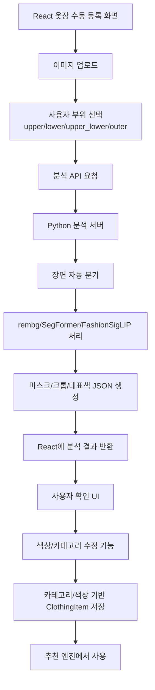

예상 API 응답:

```json
{
  "sceneMode": "worn",
  "items": [
    {
      "part": "upper",
      "partKo": "상의",
      "imageTransparentUrl": "...",
      "imageWhiteUrl": "...",
      "imageCroppedUrl": "...",
      "colors": [
        { "hex": "#ECE5D6", "rgb": [236, 229, 214], "ratio": 0.4832 }
      ],
      "visibleFineLabels": ["shirt, blouse"],
      "coarsePredictions": []
    }
  ],
  "debug": {
    "humanRatio": 0.3121,
    "borderWhite": 0.1022,
    "apparelRatio": 0.1865
  }
}
```

### 14.16 자동 분석 후 사용자 확인 UI

자동 분석 결과를 바로 확정하면 오류가 누적될 수 있다. 따라서 옷장 등록 화면에는 다음 확인 단계를 두는 것이 좋다.

| UI 단계 | 설명 |
|---|---|
| 1. 이미지 업로드 | 사용자가 옷 사진 선택 |
| 2. 부위 선택 | 상의/하의/상의+하의/아우터 선택 |
| 3. 자동 분석 중 | 장면 분기, 마스크, 색상 추출 진행 |
| 4. 결과 미리보기 | 투명 PNG, 흰 배경, crop 표시 |
| 5. 카테고리 확인 | 상의/하의/아우터 예측값 수정 가능 |
| 6. 색상 확인 | 대표색 후보 3~5개 중 실제 옷과 가까운 색 선택 |
| 7. 메타 입력 | 브랜드, 사이즈, 계절 태그 등 사용자가 아는 정보 입력 |
| 8. 옷장 저장 | 최종 `ClothingItem` 생성 |

### 14.17 자동 분석 로직의 한계

| 한계 | 설명 | 대응 방안 |
|---|---|---|
| 가려진 레이어 복원 불가 | 코트 안 셔츠처럼 거의 보이지 않는 옷은 추출 불가 | 보이는 의류만 저장하고 사용자 수동 추가 유도 |
| held 장면 손가락 오염 | 손과 옷이 겹치면 마스크 손실 가능 | 사람 마스크 제거 후 fallback, 사용자 crop 수정 |
| clean/held의 `upper_lower` 한계 | 단일 의류 사진이면 상의+하의가 동시에 나올 수 없음 | 감지된 1개 품목만 반환한다고 안내 |
| KMeans 색상 한계 | 그림자/주름/광택도 색상 군집으로 잡힐 수 있음 | 밝기 극단값 제거, 사용자 색상 확인 |
| 모델 실행 비용 | SegFormer/FashionSigLIP는 브라우저 실시간 실행에 무거움 | Python 서버/API 또는 배치 분석 구조 |
| 카테고리 세분화 부족 | 최종 앱 카테고리는 상의/하의/아우터 중심 | fine label을 저장하고 UI에서 세부 타입 선택 |

---

## 15. 추천 엔진

### 15.1 추천 후보 생성

추천 후보는 기본적으로 다음 방식으로 만든다.

1. 선택된 옷장들의 의류를 가져온다.
2. 이미지 분류 결과 또는 사용자가 확인한 `category`를 기준으로 상의/하의/아우터를 분리한다.
3. 상의 × 하의 조합을 만든다.
4. 날씨에 맞는 아우터가 있으면 추가한다.
5. 신발 데이터가 있으면 추가한다.
6. 조합별 점수를 계산한다.
7. 점수순으로 정렬해 상위 추천을 보여준다.

이미지 업로드 분석 모델은 생활 상태를 판단하지 않는다. 추천 후보 생성의 핵심 기준은 **카테고리, 대표색, 퍼스널컬러 적합도, 날씨 적합도**다.

### 15.2 개별 의류 퍼스널컬러 적합도

```ts
interface ScoredClothingItem extends ClothingItem {
  personalFitScore: number | null;
  fitGrade: FitGrade | null;
  fitReason: string;
  avoidRisk: boolean;
}
```

의류 점수 계산 흐름:

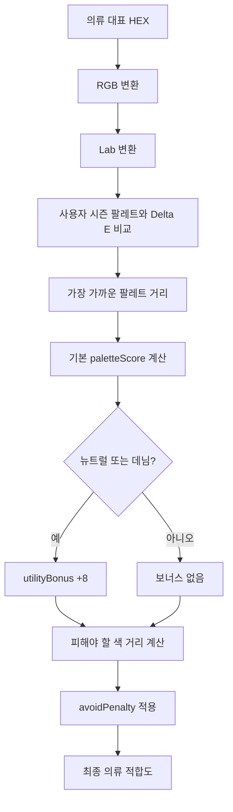

### 15.3 Fit Grade

| 점수 | 등급 |
|---:|---|
| 88 이상 | BEST |
| 74 이상 | GOOD |
| 58 이상 | OK |
| 그 외 | CHECK |

### 15.4 코디 추천 점수

최종 추천 점수는 다음 요소를 결합한다.

```text
score = personalScore * 0.42
      + weatherScore * 0.28
      + harmonyScore * 0.20
      + stabilityScore * 0.10
```

| 점수 | 의미 |
|---|---|
| `personalScore` | 포함된 의류들의 퍼스널컬러 적합도 평균 |
| `weatherScore` | 현재 기온 구간에 맞는 의류인지 |
| `harmonyScore` | 상하의 색상 조화도 |
| `stabilityScore` | 모두 보유중인지, 실패 확률이 낮은지 |

### 15.5 현재 조화도 계산

현재 조화도는 단순 규칙 중심이다.

| 조건 | 점수 경향 |
|---|---|
| 상의와 하의 대표색이 같음 | 높음 |
| 상의 또는 하의가 뉴트럴 | 높음 |
| 그 외 | 중간 |

향후에는 다음 요소를 추가할 수 있다.

- hue 차이
- 명도 대비
- 채도 대비
- 뉴트럴 anchor 여부
- 패턴 충돌
- 목적별 포멀/캐주얼 적합성

---

## 16. 날씨 연동

### 16.1 날씨 데이터 흐름

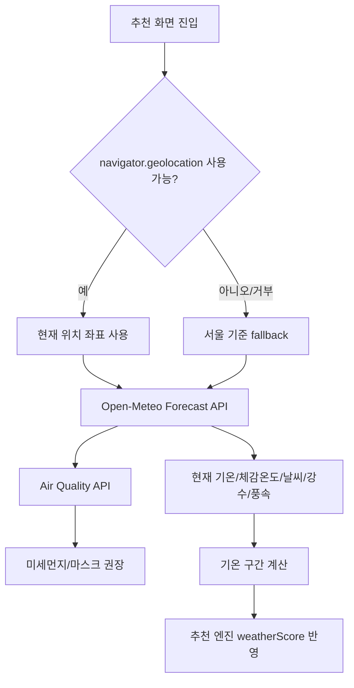

### 16.2 기온 구간

```ts
type WeatherBand =
  | '4도 이하'
  | '5~8도'
  | '9~11도'
  | '12~16도'
  | '17~19도'
  | '20~22도'
  | '23~27도'
  | '28도 이상';
```

### 16.3 기온별 추천 의류 규칙

| 기온 구간 | 추천 의류 예 |
|---|---|
| 4도 이하 | 패딩, 코트, 니트, 가디건 |
| 5~8도 | 코트, 자켓, 니트 |
| 9~11도 | 블레이저, 자켓, 니트, 긴팔 |
| 12~16도 | 블레이저, 셔츠, 긴팔 |
| 17~19도 | 셔츠, 가디건, 긴팔 |
| 20~22도 | 반팔, 셔츠, 블라우스 |
| 23~27도 | 반팔, 반바지, 블라우스, 스커트 |
| 28도 이상 | 반팔, 반바지, 샌들, 스커트 |

### 16.4 대기질/우산 판단

| 항목 | 판단 방식 |
|---|---|
| 우산 | 비 코드, 강수량, 강수확률 기준 |
| 미세먼지 | PM10, PM2.5 기준 |
| 마스크 권장 | 미세먼지 `나쁨` 또는 `매우 나쁨` |

---

## 17. 데이터베이스 설계

### 17.1 현재 DB 상태

현재는 실제 DB 서버가 없다. 브라우저 `localStorage`가 임시 DB 역할을 한다.

장점:

- 구현이 빠르다.
- 서버 없이 시연 가능하다.
- 프론트엔드 과제/중간 결과물에 적합하다.

단점:

- 브라우저를 바꾸면 데이터가 사라진다.
- 사용자 계정이 없다.
- 여러 기기 동기화가 불가능하다.
- 대량 이미지 저장에 적합하지 않다.

### 17.2 현재 localStorage 논리 ERD

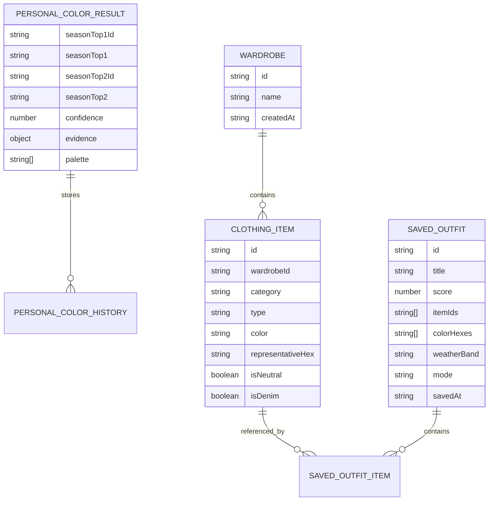

### 17.3 향후 서버 DB 설계안

향후 백엔드 DB를 도입하면 다음 테이블 구조가 적합하다.

#### users

| 컬럼 | 타입 | 설명 |
|---|---|---|
| id | UUID | 사용자 ID |
| email | string | 로그인 이메일 |
| name | string | 사용자명 |
| created_at | datetime | 가입일 |

#### personal_color_results

| 컬럼 | 타입 | 설명 |
|---|---|---|
| id | UUID | 결과 ID |
| user_id | UUID | 사용자 ID |
| season_top1_id | string | 1순위 시즌 |
| season_top2_id | string | 2순위 시즌 |
| confidence | number | 신뢰도 |
| extracted_colors | json | 피부/머리/눈/입술 색 |
| evidence | json | 사진/설문 근거 |
| created_at | datetime | 측정일 |

#### wardrobes

| 컬럼 | 타입 | 설명 |
|---|---|---|
| id | UUID | 옷장 ID |
| user_id | UUID | 사용자 ID |
| name | string | 옷장 이름 |
| created_at | datetime | 생성일 |

#### clothing_items

| 컬럼 | 타입 | 설명 |
|---|---|---|
| id | UUID | 의류 ID |
| wardrobe_id | UUID | 옷장 ID |
| category | string | 상의/하의/아우터 등 |
| type | string | 세부 종류 |
| color_name | string | 색상명 |
| representative_hex | string | 대표색 |
| size | string | 사이즈 |
| brand | string | 브랜드 |
| image_url | string | 이미지 URL |
| season_tag | string | 계절성 |
| pattern_type | string | 패턴 |
| source_type | string | catalog/upload/manual |
| analysis_meta | json | 이미지 분석 장면, fine label, 색상 비율 등 |
| created_at | datetime | 생성일 |

#### saved_outfits

| 컬럼 | 타입 | 설명 |
|---|---|---|
| id | UUID | 저장 코디 ID |
| user_id | UUID | 사용자 ID |
| title | string | 코디명 |
| score | number | 추천 점수 |
| weather_band | string | 날씨 구간 |
| mode | string | 추천 목적 |
| saved_at | datetime | 저장일 |

#### saved_outfit_items

| 컬럼 | 타입 | 설명 |
|---|---|---|
| outfit_id | UUID | 저장 코디 ID |
| clothing_item_id | UUID | 의류 ID |
| position | number | 표시 순서 |

---

## 18. 주요 파일별 역할

| 파일 | 역할 |
|---|---|
| `src/App.tsx` | 전체 라우팅, 화면 상태, 옷장/추천/저장/설정 UI와 로직 |
| `src/main.tsx` | React 앱 엔트리 |
| `src/index.css` | 전체 스타일 |
| `src/types.ts` | 퍼스널컬러, 측정, 설문, 시즌 타입 정의 |
| `src/constants.ts` | 8문항 설문 데이터 |
| `src/personalColorWorkbook.ts` | 12시즌 팔레트와 traits 데이터 |
| `src/seasonContent.ts` | 시즌별 설명, 추천 색, 피해야 할 색, 콘텐츠 |
| `src/components/PhotoAnalyzer.tsx` | 카메라, 얼굴 추적, 자동 촬영, 사진 분석 UI |
| `src/components/Questionnaire.tsx` | 설문 UI |
| `src/components/ResultDisplay.tsx` | 결과 상세, 측정 데이터, 개발자 모드 |
| `src/services/photoAnalysis.ts` | 얼굴 ROI 생성, 색상 샘플링, 조명 보정, 품질 계산 |
| `src/services/geminiService.ts` | 사진 점수, 설문 점수, 최종 융합 |
| `src/services/colorUtils.ts` | RGB/HSL/Lab 변환, Delta E, luminance |
| `src/services/faceLandmarker.ts` | MediaPipe Face Landmarker 로딩 |
| `src/hooks/useWeather.ts` | 날씨 hook, 위치 권한/fallback |
| `src/lib/weather.ts` | Open-Meteo API, 대기질, 우산/마스크 판단 |
| `vite.config.ts` | Vite 설정, chunk 분리, alias |
| `package.json` | scripts와 의존성 |
| `personal_color_ai_wardrobe_report.docx` | 기존 기술 설계 통합 보고서 |
| `퍼스널컬러_AI_옷장_과제양식_상세계획서.docx` | 과제 양식 기반 상세계획서 |

---

## 19. 현재 미구현 기능과 구현 계획

### 19.1 의류 사진 자동 색상 추출

현재 상태:

- 카탈로그 데이터와 수동 입력으로 의류 색상을 관리한다.
- 사용자가 직접 색상/카테고리/사이즈/브랜드를 입력할 수 있다.
- 업로드 이미지를 분석해 대표색을 자동 추출하는 기능은 없다.

구현 계획:

| 단계 | 구현 내용 |
|---|---|
| 1단계 | 이미지 업로드 UI 추가 |
| 2단계 | Canvas로 이미지 픽셀 읽기 |
| 3단계 | 단순 배경 제거 또는 GrabCut 적용 |
| 4단계 | 마스크 내부 픽셀에서 대표색 추출 |
| 5단계 | 기준 색상 사전과 Delta E 비교 |
| 6단계 | 후보 색상 2~3개를 사용자에게 제시 |
| 7단계 | 사용자가 확인한 색상을 ClothingItem에 저장 |

### 19.2 서버 DB/로그인

현재 상태:

- localStorage 저장
- 사용자 계정 없음
- 기기 간 동기화 없음

구현 계획:

| 단계 | 구현 내용 |
|---|---|
| 1단계 | IndexedDB로 브라우저 저장 강화 |
| 2단계 | Supabase/Firebase 등 BaaS 검토 |
| 3단계 | 사용자 로그인 추가 |
| 4단계 | 옷장/의류/결과 서버 저장 |
| 5단계 | 이미지 업로드 storage 연동 |

### 19.3 추천 고도화

현재 상태:

- 색상 적합도, 날씨 적합도, 단순 조화도, 안정성 기반

개선 계획:

| 개선 항목 | 설명 |
|---|---|
| 목적별 가중치 | 출근/데이트/발표별 포멀함, 대비감, 색감 가중치 차별화 |
| 패턴 충돌 판단 | 체크+스트라이프 등 과한 조합 감점 |
| 사용자 피드백 | 저장/좋아요/삭제 이력으로 개인 취향 반영 |
| 계절 캡슐 옷장 | 특정 계절에 자주 쓰는 핵심 아이템 추천 |
| 착용 빈도 | 자주 안 입은 옷을 추천에 섞어 옷장 활용도 증가 |

### 19.4 가상착용 고도화

현재 상태:

- 저장 코디의 아이템 이미지를 단순 카드 형태로 보여준다.

개선 계획:

| 단계 | 내용 |
|---|---|
| 1단계 | 상의/하의/신발 위치별 시각 배치 |
| 2단계 | 마네킹 또는 실루엣 기반 배치 |
| 3단계 | 배경 제거된 의류 이미지 사용 |
| 4단계 | 실제 착용 합성 또는 AR 기능 검토 |

---

## 20. 문제점과 해결 방안

### 20.1 기술적 문제

| 문제 | 원인 | 현재 대응 | 향후 대응 |
|---|---|---|---|
| 카메라 색상 왜곡 | 자동 화이트밸런스, 조명 | 흰 종이 기준, 배경 보정 | 색상 보정 카드, 다중 촬영 평균 |
| 얼굴 ROI 오염 | 머리카락, 안경, 메이크업 | trimming, saturation filter | 얼굴 부위 segmentation |
| 모바일 성능 | MediaPipe 모델 비용 | 모바일 검출 간격 증가 | 해상도 자동 조절, lazy loading |
| 의류 색상 자동화 부족 | 배경 제거 미구현 | 수동/카탈로그 등록 | U²-Net/GrabCut/KMeans |
| 데이터 동기화 없음 | localStorage 구조 | 시제품 단계에서 허용 | 서버 DB/로그인 |
| 추천 단순성 | 규칙 기반 초기 구현 | 점수 분리로 설명성 확보 | 개인화/패턴/목적별 고도화 |

### 20.2 설계 변경 사항

| 초기 계획 | 현재 변경 | 사유 |
|---|---|---|
| 의류 자동 색상 추출 우선 구현 | 카탈로그/수동 등록 우선 | 시연 안정성과 개발 기간 |
| 서버 DB 기반 | localStorage 기반 | 과제 중간 결과물의 설치 단순성 |
| 4계절 진단 | 12시즌 진단 | 결과 설득력과 세부 추천 강화 |
| 단순 날씨 표시 | 기온/우산/미세먼지 반영 | 실사용성 향상 |
| 결과만 표시 | 측정 근거/개발자 모드 포함 | 알고리즘 설명 가능성 확보 |

---

## 21. 개발 및 실행 방법

### 21.1 설치

```bash
npm install
```

### 21.2 개발 서버

```bash
npm run dev
```

기본 실행 주소:

```text
http://localhost:3000
```

### 21.3 빌드

```bash
npm run build
```

### 21.4 타입 검사

```bash
npm run lint
```

현재 `lint` 스크립트는 ESLint가 아니라 `tsc --noEmit` 기반 타입 검사다.

---

## 22. 개발 일정 및 진행도

### 22.1 현재 진행도

| 작업 | 현재 달성도 | 설명 |
|---|---:|---|
| 프로젝트 구조 및 UI | 95% | 기본 화면과 내비게이션 완료 |
| 퍼스널컬러 사진 분석 | 90% | ROI/조명 보정/점수 계산 완료 |
| 설문 및 결과 융합 | 95% | 8문항 설문과 최종 융합 완료 |
| 옷장 관리 | 85% | CRUD/카탈로그/수동 등록 완료 |
| 날씨 기반 추천 | 85% | API 연동과 기온 구간 추천 완료 |
| 저장/가상착용 | 45% | 저장 코디 미리보기 수준 |
| 의류 자동 색상 추출 | 20% | 설계만 존재 |
| 서버 DB | 0% | 미구현 |

### 22.2 향후 일정

| 주차 | 작업 | 산출물 |
|---|---|---|
| 1주차 | 현재 기능 안정화, 주요 버그 정리 | QA 체크리스트 |
| 2주차 | 실행 화면 캡처, 보고서 이미지 추가 | 중간 결과물 이미지 |
| 3주차 | 추천 문장과 점수 설명 고도화 | 추천 시연 시나리오 |
| 4주차 | 의류 자동 대표색 추출 최소 기능 검토 | 확장 모듈 설계안 |
| 5주차 | 발표용 데이터 세트 준비, 시연 리허설 | 발표 시연 스크립트 |
| 6주차 | 최종 보고서/발표자료 정리 | 최종 제출물 |

---

## 23. 평가 계획

| 평가 항목 | 평가 방법 | 성공 기준 |
|---|---|---|
| 빌드 안정성 | `npm run build` | 실패 없음 |
| 타입 안정성 | `npm run lint` | TypeScript 오류 없음 |
| 카메라 흐름 | 권한 허용/거부, 얼굴 검출/실패 테스트 | 적절한 안내 표시 |
| 사진 분석 품질 | 밝은 조명/어두운 조명/흰 종이 기준 비교 | 품질 점수 변화 확인 |
| 설문 융합 | 같은 사진에 다른 설문 응답 비교 | 결과가 설문 방향 반영 |
| 옷장 데이터 | 생성/수정/삭제/새로고침 | localStorage 유지 |
| 추천 결과 | 다양한 날씨 구간과 의류 조합 테스트 | 추천 이유와 점수 모순 없음 |
| 반응형 | 모바일/데스크톱 뷰포트 확인 | 주요 UI 겹침 없음 |

---

## 24. 기대 효과

### 24.1 사용자 관점

- 퍼스널컬러 결과를 실제 옷 선택에 바로 활용할 수 있다.
- 이미 보유한 옷의 활용도를 높일 수 있다.
- 날씨와 목적에 맞게 코디를 빠르게 결정할 수 있다.
- 추천 이유를 확인해 결과를 더 신뢰할 수 있다.

### 24.2 과제/전시 관점

- 카메라 촬영 → 분석 → 설문 → 결과 → 옷장 → 추천으로 이어지는 흐름이 명확하다.
- 컴퓨터 비전, 색상공간, 추천 알고리즘, 외부 API, UI/UX를 통합적으로 보여준다.
- 코드 내부를 보지 않아도 시연 흐름을 이해하기 쉽다.

### 24.3 서비스 확장 관점

- 온라인 쇼핑몰 추천과 연결할 수 있다.
- 계절별 캡슐 옷장 추천으로 확장할 수 있다.
- 스타일 상담 도구로 활용할 수 있다.
- 사용자 피드백 기반 개인화 추천으로 발전시킬 수 있다.

---

## 25. 최종 요약

이 프로젝트는 **퍼스널컬러 진단, 디지털 옷장, 날씨 기반 코디 추천을 하나로 연결한 통합형 프론트엔드 시제품**이다.

현재 가장 중요한 구현 성과는 다음과 같다.

- MediaPipe 기반 얼굴 인식
- 얼굴 ROI 색상 분석
- 조명 보정과 사진 품질 점수
- 8문항 설문 보정
- 12시즌 퍼스널컬러 결과
- 옷장/의류 관리
- 날씨 API 연동
- 색상/날씨 기반 코디 추천
- 추천 코디 저장

아직 구현되지 않은 핵심 확장 기능은 다음과 같다.

- 의류 사진 자동 색상 추출
- 서버 DB/로그인
- 고도화된 가상착용
- 사용자 피드백 기반 개인화 추천

따라서 현재 프로젝트는 **시연 가능한 중간/최종 과제 수준의 웹앱**으로 볼 수 있으며, 향후에는 서버 저장과 의류 이미지 자동 분석을 붙여 실제 서비스형 앱으로 확장할 수 있다.
