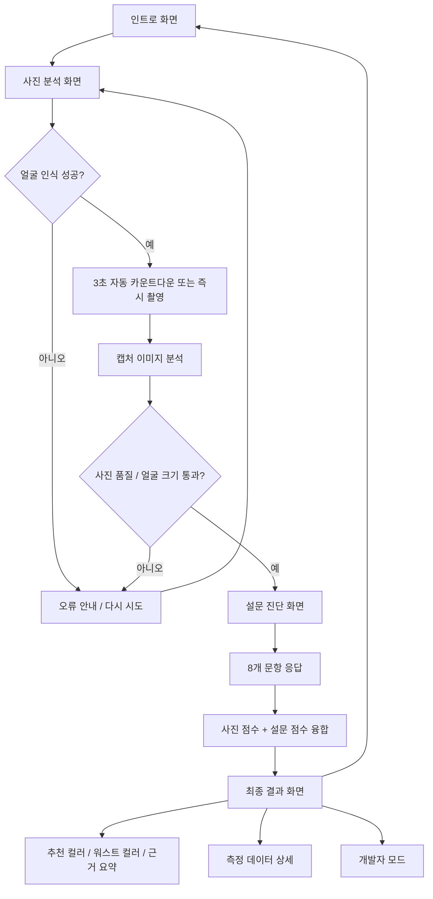
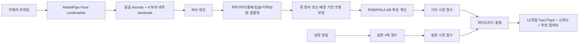
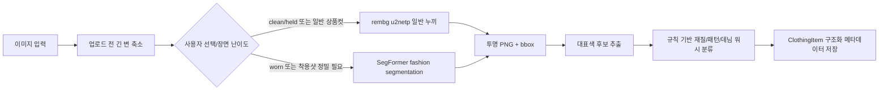

# 퍼스널컬러 12계절 진단 워크북

얼굴 사진에서 추출한 색상 데이터와 색상 스와치 기반 설문 응답을 함께 분석해 12계절 퍼스널컬러 결과를 안내하는 Vite + React 웹 앱입니다.

단순히 `웜/쿨` 또는 `봄/여름/가을/겨울`만 판정하지 않고, `라이트 스프링`, `소프트 서머`, `다크 어텀`, `브라이트 윈터`처럼 12계절 세부 시즌까지 계산합니다. 결과 화면에서는 4계절 대분류, 12계절 세부 시즌, 인접 시즌, 추천 컬러, 피해야 하는 컬러, 실무에서 자주 쓰는 별칭까지 함께 보여줍니다.

## 핵심 요약

- 브라우저 카메라와 MediaPipe Face Landmarker를 이용한 얼굴 랜드마크 검출
- 얼굴 ROI 기반 피부, 머리, 홍채, 입술, 이마, 눈썹 색상 샘플링
- 흰 종이 기준 영역을 이용한 화이트 밸런스 보정 및 배경 기반 fallback 보정
- RGB, HSL, LAB, 명도, 채도, 대비, 색온도 지표 계산
- 12계절 표준 팔레트와 시즌별 traits를 함께 쓰는 사진 점수화
- 8문항 설문으로 온도감, 명도, 선명도, 대비 성향 보정
- 사진 결과와 설문 결과를 가중 융합하는 하이브리드 판정
- 결과 화면의 개발자 모드에서 ROI, 점수표, 융합 근거, 품질 지표 확인 가능
- 옷장 등록 이미지의 누끼 PNG, 대표색 후보, 재질, 패턴, 데님 워시 정보를 구조화해 저장
- 데일리룩 메뉴에서 저장 코디를 하나의 룩 이미지로 자동 배치하고 레이어 편집 가능

## 기술 스택

| 영역 | 사용 기술 |
| --- | --- |
| 프론트엔드 | React 19, TypeScript, Vite 6 |
| 스타일/UI | Tailwind CSS 4, shadcn/ui 계열 컴포넌트, lucide-react |
| 애니메이션 | motion, canvas-confetti |
| 얼굴 인식 | @mediapipe/tasks-vision Face Landmarker |
| 색상 처리 | Canvas API, RGB/HSL/LAB 변환, Delta E 거리 계산 |
| 의류 이미지 처리 | FastAPI, rembg u2netp, SegFormer fashion segmentation, 샘플링 기반 대표색 추출 |
| 데이터 | 12계절 팔레트/traits TypeScript 데이터, 원본 xlsx 참고 자료 |

## 실행 방법

### 요구 사항

- Node.js 18 이상 권장
- npm
- 카메라 권한을 허용할 수 있는 브라우저
- MediaPipe 모델 리소스를 받을 수 있는 네트워크 환경

### 설치

```bash
npm install
```

### 개발 서버

```bash
npm run dev
```

기본 개발 서버는 `http://localhost:3000`에서 실행됩니다.

### 프로덕션 빌드

```bash
npm run build
```

### 타입 체크

```bash
npm run lint
```

현재 `lint` 스크립트는 ESLint가 아니라 `tsc --noEmit` 기반 타입 검사용입니다.

## UI 흐름도



## 사용자 시나리오

### 1. 일반 진단

1. 사용자가 `진단 시작하기`를 누릅니다.
2. 브라우저 카메라 권한을 허용합니다.
3. 얼굴을 화면 중앙에 맞추고, 오른쪽 아래 흰 종이 기준 영역에 흰 종이를 맞춥니다.
4. 얼굴이 안정적으로 인식되면 3초 카운트다운 후 자동 촬영됩니다.
5. 사진 분석이 끝나면 설문 화면으로 이동합니다.
6. 색상 스와치를 보면서 8개 문항에 답합니다.
7. 최종 결과에서 12계절 시즌, 2순위 시즌, 신뢰도, 추천 컬러, 피해야 하는 컬러를 확인합니다.

### 2. 촬영 실패 또는 품질 낮음

1. 얼굴이 너무 작거나 프레임 밖에 있으면 분석이 중단됩니다.
2. 사용자는 다시 촬영 버튼으로 카메라를 재시작합니다.
3. 밝고 균일한 조명, 정면 얼굴, 흰 배경 또는 흰 종이 기준을 맞춘 뒤 다시 촬영합니다.

### 3. 결과 검토

1. 결과 화면에서 `왜 이렇게 나왔나요?` 섹션을 읽습니다.
2. `근거 요약`에서 사진 신호, 설문 신호, 사진-설문 일치도, 융합 비율을 확인합니다.
3. `측정 데이터 열기`에서 얼굴 박스, ROI 좌표, RGB/LAB/HSL 값, 사진 품질 점수를 확인합니다.
4. `개발자 모드`에서 사진 점수표, 설문 점수표, 최종 융합 점수표까지 추적합니다.

## 진단 엔진 흐름



## 사진 분석 상세

사진 분석은 `src/components/PhotoAnalyzer.tsx`, `src/services/faceLandmarker.ts`, `src/services/photoAnalysis.ts`, `src/services/geminiService.ts`에 나뉘어 있습니다.

### 1. 얼굴 감지

- `getUserMedia`로 전면 카메라를 열고 1280x720 해상도를 우선 요청합니다.
- `@mediapipe/tasks-vision`의 Face Landmarker를 런타임에 로드합니다.
- GPU delegate를 먼저 시도하고 실패하면 CPU delegate로 fallback합니다.
- `requestAnimationFrame` 루프에서 약 120ms 간격으로 얼굴을 추적합니다.
- 얼굴이 감지되면 overlay canvas에 얼굴 박스, 랜드마크, 샘플링 영역을 표시합니다.

### 2. 자동 촬영

- 얼굴이 안정적으로 인식되면 3초 카운트다운을 시작합니다.
- 카운트다운 중 얼굴이 사라지면 타이머를 해제합니다.
- 사용자는 자동 촬영을 기다리거나 `바로 촬영 및 분석` 버튼으로 즉시 촬영할 수 있습니다.
- 촬영된 프레임은 hidden canvas에 그려지고 PNG object URL로 미리보기됩니다.

### 3. ROI 샘플링

샘플링 영역은 얼굴 랜드마크를 기준으로 만들어집니다.

| 영역 | 용도 |
| --- | --- |
| 양쪽 볼 | 피부 기본색 |
| 이마, 코 주변, 눈 밑, 턱선 | 피부 평균 안정화 |
| 양쪽 홍채 | 눈 색상 및 대비 |
| 입술 중앙 | 입술 혈색 |
| 헤어라인, 양쪽 눈썹 | 머리색 보정 |
| 흰 종이 기준 영역 | 조명 및 화이트 밸런스 보정 |

피부 샘플은 너무 어둡거나 밝은 픽셀을 일부 제거하고, LAB median medoid 방식으로 대표색을 안정화합니다. 입술은 빨강/핑크 계열 후보 픽셀을 우선 사용하고, 갈색 그림자에 과하게 끌리는 경우 제한적으로 보정합니다.

### 4. 조명 보정

조명 보정은 다음 순서로 적용됩니다.

1. `white-reference`: 화면 오른쪽 아래 가이드 영역의 흰 종이 기준을 사용합니다.
2. `neutral-background`: 흰 종이 기준이 불안정하면 얼굴 주변의 중립 배경 픽셀을 사용합니다.
3. `corner-fallback`: 중립 배경도 부족하면 화면 모서리 샘플을 사용합니다.

보정 결과는 `lightingCalibration`에 저장됩니다.

- `backgroundBrightness`: 기준 영역 밝기
- `backgroundNeutrality`: RGB 채널 중립성
- `correctionStrength`: 보정 강도
- `calibrationSource`: 실제 사용된 보정 소스
- `whiteReferenceUsed`: 흰 종이 기준 사용 여부
- `whiteBackdropRecommended`: 흰 배경/흰 종이 재촬영 권장 여부

## 점수 계산 방식

### 사진 특징 벡터

사진에서 추출한 대표색은 다음 특징으로 정규화됩니다.

| 특징 | 의미 |
| --- | --- |
| `temperature` | 피부, 입술, 머리, 홍채의 색온도. 음수는 쿨, 양수는 웜 |
| `lightness` | 얼굴 주요 색상의 평균 명도. 높을수록 라이트 계열 |
| `clarity` | HSL 채도 기반 선명도. 높을수록 비비드, 낮을수록 뮤트 |
| `contrast` | 얼굴 내부 대비와 피부-머리 대비를 합산한 값 |
| `mutedScore` | 낮은 채도와 부드러운 색감에 대한 보조 지표 |

사진 시즌 점수는 `팔레트 거리 42% + 특징 유사도 58%`로 계산됩니다.

- 팔레트 점수: 추출 색상과 시즌 팔레트의 LAB Delta E 거리 기반
- 특징 점수: 사진 특징 벡터와 시즌별 traits의 유사도 기반
- 겨울 계열은 저채도/저대비 사진에서 과판정되지 않도록 페널티가 있습니다.
- 소프트 서머/소프트 어텀은 mutedScore가 높을 때 보너스를 받습니다.

### 설문 점수

설문은 `src/constants.ts`의 8개 문항으로 구성됩니다.

| 문항 | 주로 반영하는 축 |
| --- | --- |
| 혈관 색 | 온도감 |
| 금속 액세서리 | 온도감, 선명도 |
| 흰색 옷 | 온도감, 명도, 선명도 |
| 햇빛 반응 | 온도감, 대비 |
| 고채도 컬러 반응 | 선명도, 대비 |
| 뮤트 컬러 반응 | 선명도 |
| 대비 스타일 | 대비, 선명도 |
| 색의 깊이 | 명도 |

각 답변의 가중치를 합산한 뒤 `temperature`, `lightness`, `clarity`, `contrast`를 -1에서 1 사이로 정규화합니다. 이후 시즌별 traits와 비교해 12계절 설문 시즌 점수를 만듭니다.

### 하이브리드 융합

최종 결과는 사진 점수와 설문 점수를 섞어 계산합니다.

```text
사진 비중 = clamp(0.22 + photoQuality * 0.14, 0.22, 0.36)
설문 비중 = 1 - 사진 비중
최종 원점수 = 사진 시즌 점수 * 사진 비중 + 설문 시즌 점수 * 설문 비중
```

현재 정책상 사진 비중은 최소 22%, 최대 36%입니다. 카메라 환경에 따라 사진 품질이 흔들릴 수 있으므로 설문 신호가 더 큰 안정화 역할을 합니다.

최종 신뢰도는 다음 요소를 함께 반영합니다.

- 1순위 시즌 점수
- 1순위와 2순위의 점수 차이
- 사진 품질 점수
- 사진 1순위와 설문 1순위의 일치도

## 결과 화면 구성

결과 화면은 다음 정보를 제공합니다.

- 최종 12계절 시즌
- 2순위 시즌
- 신뢰도
- 4계절 대분류 해석
- 인접 시즌 안내
- 사진 신호와 설문 신호
- 사진/설문 융합 비율
- 추천 특징: 온도감, 선명도, 명도, 대비감
- 잘 어울리는 색상
- 톤이 유사한 보조 활용 색상
- 피해야 하는 색상
- 측정 데이터 상세
- 개발자 모드 점수 추적

예시 별칭:

| 12계절 결과 | 실무 별칭 예시 |
| --- | --- |
| 트루 서머 | 여름 쿨 |
| 소프트 서머 | 여름 뮤트 |
| 다크 어텀 | 가을 딥 |
| 브라이트 윈터 | 겨울 브라이트 |

## 프로젝트 구조

```text
src/
  App.tsx                       # 앱 화면 전환, 옷장/추천/데일리룩, 의류 메타데이터 저장 흐름 제어
  main.tsx                      # React 엔트리
  index.css                     # Tailwind 기반 전역 스타일
  types.ts                      # 시즌, 설문, 사진 분석, 최종 결과 타입
  constants.ts                  # 설문 문항과 스와치/가중치
  personalColorWorkbook.ts      # 12계절 팔레트, traits, workbook 통계
  seasonContent.ts              # 시즌 설명, 별칭, 추천/워스트 컬러 설명
  components/
    PhotoAnalyzer.tsx           # 카메라, 자동 촬영, overlay, 사진 분석 호출
    Questionnaire.tsx           # 설문 진행, 스와치 옵션, 점수 계산 호출
    ResultDisplay.tsx           # 결과 화면, 측정 상세, 개발자 모드
  services/
    faceLandmarker.ts           # MediaPipe 모델 로딩 및 얼굴 검출
    photoAnalysis.ts            # ROI 생성, 픽셀 샘플링, 조명 보정, 품질 계산
    geminiService.ts            # 사진/설문 점수화와 최종 융합 엔진
    colorUtils.ts               # RGB/HSL/LAB 변환, Delta E, 보조 수식
  data/
    musinsaCatalogData.ts       # 무신사 카탈로그 이미지와 분석 JSON 로딩
server/
  background_remove_api.py      # 일반 누끼, 정밀 의류 추출, 대표색 추출 FastAPI 서버
  requirements.txt              # 이미지 처리 서버 Python 의존성
components/ui/                  # shadcn/ui 스타일 공용 컴포넌트
```

## 주요 데이터 구조

### `PhotoAnalysisResult`

사진 분석 결과입니다.

- `temperature`: 사진상 웜/쿨 방향
- `temperatureConfidence`: 온도감 신뢰도
- `seasonScores`: 12계절 사진 점수
- `mutedScore`: 뮤트 성향 지표
- `photoQuality`: 사진 품질
- `extractedColors`: 피부/머리/홍채/입술 대표색
- `measurementDetails`: 얼굴 박스, ROI, 품질, 보정, 상위 시즌 상세
- `debug`: 사진 점수표와 계산 메모

### `QuestionnaireScores`

설문 응답을 4개 축으로 정규화한 값입니다.

- `temperature`
- `lightness`
- `clarity`
- `contrast`

### `FinalResult`

최종 결과입니다.

- `seasonTop1Id`, `seasonTop1`: 최종 1순위 시즌
- `seasonTop2Id`, `seasonTop2`: 최종 2순위 시즌
- `confidence`: 최종 신뢰도
- `decisionType`: 현재는 `hybrid`
- `evidence`: 사진 신호, 설문 신호, 일치도, 융합 비율, 경계 시즌 메모
- `recommendationFeatures`: 스타일링 추천 축
- `palette`: 추천 팔레트
- `explanation`: 자연어 설명
- `debug`: 설문 점수표, 최종 융합 점수표, 원본 응답

### `ClothingItem`

옷장에 저장되는 의류 데이터입니다. 추천 품질을 위해 색상 하나만 저장하지 않고 색상, 재질, 패턴, 데님 워시를 분리합니다.

- `representativeColor`, `representativeHex`: UI와 추천 점수에 쓰는 대표 색상 라벨/HEX
- `dominantColors`: 누끼 또는 분석 결과에서 얻은 상위 대표색 후보 3개
- `material`: `cotton`, `denim`, `knit`, `leather`, `nylon`, `wool`, `unknown`
- `patternType`: `solid`, `stripe`, `plaid`, `graphic`
- `isDenim`: 데님 계열 여부
- `denimWash`: 데님일 때만 저장하는 `light`, `mid`, `dark`, `black`
- `segmentation`: 누끼 결과의 bbox, 모델명, 버전, 처리 시각, 색상 후보
- `cutoutImageUrl`: 데일리룩 만들기에 쓰는 투명 배경 PNG

청바지는 단순히 `블루`로만 보지 않고 다음처럼 저장하는 것을 기본 방향으로 둡니다.

```ts
{
  material: 'denim',
  isDenim: true,
  denimWash: 'light', // light | mid | dark | black
  patternType: 'solid',
  representativeColor: '연청'
}
```

## 의류 분석 파이프라인

현재 구현은 큰 모델 하나를 모든 이미지에 돌리는 방식이 아니라, 빠른 경로와 정밀 경로를 분리합니다.



당장 저장하는 핵심 필드는 다음 4개입니다.

- `patternType`: `solid`, `stripe`, `plaid`, `graphic`
- `isDenim`: `true` 또는 `false`
- `denimWash`: `light`, `mid`, `dark`, `black`
- `dominantColors`: 대표 HEX 후보 3개

분류 기준은 우선 빠른 규칙 기반입니다.

- 상품명/종류에 `청`, `데님`, `jean`, `denim`이 있으면 데님으로 봅니다.
- 데님 톤은 `연청`, `중청`, `진청`, `흑청`, `생지` 같은 이름 신호를 우선 사용합니다.
- 이름 신호가 없으면 대표 HEX의 밝기로 `light`, `mid`, `dark`, `black`을 추정합니다.
- 패턴은 `스트라이프`, `체크`, `그래픽/로고/프린트/레터링` 단어를 우선 사용하고, 없으면 `solid`로 저장합니다.

## 이미지 처리 서버

수동 의류 추가와 데일리룩 만들기에서 누끼가 필요할 때 FastAPI 서버를 사용합니다.

```bash
npm run dev:api
```

주요 엔드포인트:

- `POST /api/background/remove`: 가벼운 일반 누끼. clean/held 또는 상품컷에 우선 사용합니다.
- `POST /api/clothing/extract`: 상의/하의/아우터/신발 등 target part 기반 정밀 누끼. 착용샷처럼 필요한 경우만 사용합니다.
- `GET /api/health`: 서버 상태 확인.

첫 정밀 누끼 요청은 모델 로딩과 다운로드 때문에 오래 걸릴 수 있습니다. 일반 상품컷은 가능하면 일반 누끼 경로를 쓰고, 착용샷이나 특정 부위 분리가 필요한 경우에만 정밀 경로를 쓰는 것이 현재 권장 방식입니다.

## 현재 구현상 주의점

- 카메라 권한이 필요합니다.
- MediaPipe wasm과 모델 파일은 CDN 및 Google Storage에서 로드됩니다.
- 네트워크가 차단된 환경에서는 얼굴 인식 모델 로딩에 실패할 수 있습니다.
- 흰 종이 기준 영역을 쓰면 조명 보정 안정성이 좋아집니다.
- 정밀 누끼 서버는 첫 요청 때 `sayeed99/segformer-b3-fashion` 모델을 로드하므로 CPU 환경에서는 느릴 수 있습니다.
- 의류 대표색은 전체 이미지가 아니라 누끼 결과의 불투명 픽셀을 샘플링해 계산합니다.
- 앱 내부 일부 UI 문자열에 인코딩이 깨진 텍스트가 남아 있습니다. README는 UTF-8 한국어 기준으로 정리했지만, 실제 화면 문구 정비는 별도 작업이 필요합니다.
- `geminiService.ts`라는 파일명과 달리 현재 최종 판정은 외부 Gemini API 호출이 아니라 로컬 계산 로직으로 수행됩니다.

## 관련 문서와 자료

- `personal_color_12season_24palette_standard_colors_by_season.xlsx`: 시즌별 표준 팔레트 참고 자료
- `personal_color_12season_24palette_donotusethis.xlsx`: 추가 팔레트 참고 자료
- `퍼스널컬러_시스템_상세보고서.md`: 시스템 구조 상세 보고서
- `퍼스널컬러_부록_상세표.md`: 가중치와 시즌 표 부록
- `퍼스널컬러_기술검토서.md`: 기술 검토 및 개선 방향
- `ui예시.txt`: UI 구성 참고 텍스트
