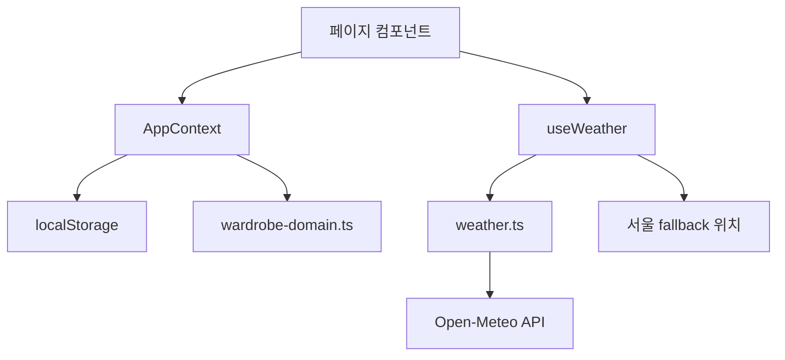
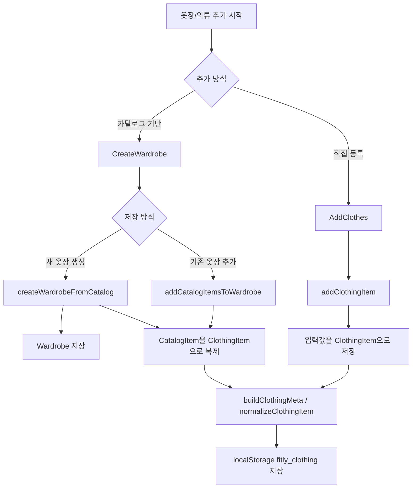
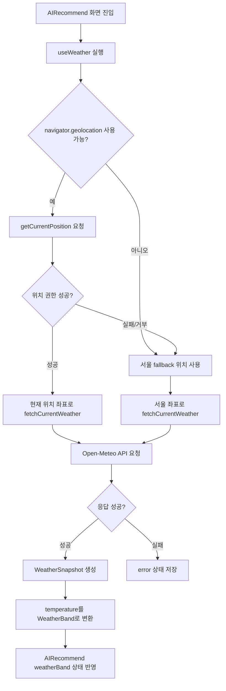

# 옷장 추가 기능 및 날씨 API 기술 구현 상세 가이드

작성일: 2026-04-24  
대상 프로젝트: `Fitly AI Wardrobe`  
관련 주요 파일:

- `app/pages/CreateWardrobe.tsx`
- `app/pages/AddClothes.tsx`
- `app/context/AppContext.tsx`
- `app/hooks/useWeather.ts`
- `app/lib/weather.ts`
- `app/lib/wardrobe-domain.ts`

## 1. 문서 목적

이 문서는 현재 프로젝트의 두 핵심 기능을 다른 개발자가 그대로 보고 다시 구현할 수 있을 정도로 상세히 설명하는 기술 구현 문서입니다.

다루는 범위는 다음 두 가지입니다.

1. 옷장 추가 기능
   - 카탈로그에서 옷을 선택해 새 옷장을 만드는 기능
   - 카탈로그에서 옷을 선택해 기존 옷장에 추가하는 기능
   - 사용자가 직접 사진과 정보를 입력해 옷을 추가하는 기능
   - 추가된 옷이 추천 엔진에서 사용할 수 있는 데이터로 정규화되는 과정

2. 날씨 API 연동 기능
   - 브라우저 위치 권한 요청
   - 현재 위치 기반 Open-Meteo API 호출
   - 위치 권한 실패 시 서울 fallback 사용
   - API 응답을 서비스 내부 날씨 구간으로 변환
   - 추천 조건 화면에 날씨 정보를 연결하는 과정

## 2. 전체 아키텍처 요약

현재 프로젝트는 서버 없이 React 프런트엔드 내부에서 상태와 도메인 로직을 관리합니다.



핵심 책임은 다음과 같이 나뉩니다.

| 계층 | 파일 | 책임 |
|---|---|---|
| 화면 | `CreateWardrobe.tsx` | 카탈로그 기반 옷장 생성/기존 옷장 편입 UI |
| 화면 | `AddClothes.tsx` | 사용자 직접 의류 추가 UI |
| 상태 | `AppContext.tsx` | 옷장, 의류, 카탈로그, 저장 코디 상태와 액션 관리 |
| 도메인 | `wardrobe-domain.ts` | 의류 메타데이터 생성, 추천 관련 상수와 계산 함수 |
| 날씨 hook | `useWeather.ts` | 위치 권한, fallback, 로딩/에러 상태 관리 |
| 날씨 API | `weather.ts` | Open-Meteo 요청, 응답 파싱, 날씨 구간 변환 |

## 3. 옷장 추가 기능 개요

현재 프로젝트의 옷장 추가는 크게 두 갈래입니다.



카탈로그 기반 추가는 `CatalogItem`을 사용자가 선택하면 `ClothingItem`으로 복제하는 방식입니다. 직접 등록은 사용자가 사진, 카테고리, 색상 등을 입력하면 `ClothingItemDraft`를 만들고 `addClothingItem`을 통해 저장합니다.

## 4. 핵심 데이터 모델

### 4.1 Wardrobe

`Wardrobe`는 사용자의 옷장 단위입니다.

```ts
export interface Wardrobe {
  id: string;
  name: string;
  createdAt: string;
}
```

필드 설명:

| 필드 | 타입 | 설명 |
|---|---|---|
| `id` | `string` | 옷장 고유 ID. 현재는 `w${Date.now()}` 형식으로 생성 |
| `name` | `string` | 사용자가 입력한 옷장 이름 |
| `createdAt` | `string` | ISO 문자열 생성 시간 |

구현 포인트:

- 옷장은 추천 요청의 최소 묶음입니다.
- 하나의 옷장에는 여러 `ClothingItem`이 연결됩니다.
- 연결은 별도 join table 없이 `ClothingItem.wardrobeId`로 합니다.

### 4.2 CatalogItem

`CatalogItem`은 관리자 또는 서비스가 미리 준비한 의류 원본 데이터입니다.

```ts
export interface CatalogItem {
  catalogItemId: string;
  name: string;
  category: string;
  subcategory: string;
  imageUrl: string;
  color: string;
  size: string;
  brand: string;
  representativeColor: string;
  representativeHex: string;
  seasonTag: string;
  patternType: string;
  isNeutral: boolean;
  isDenim: boolean;
  sourceType: 'catalog';
}
```

필드 설명:

| 필드 | 설명 |
|---|---|
| `catalogItemId` | 카탈로그 원본 ID |
| `name` | 사용자에게 보이는 의류명 |
| `category` | 대분류. 예: 상의, 하의, 아우터 |
| `subcategory` | 세부 종류. 예: 반팔티, 청바지, 블레이저 |
| `imageUrl` | 의류 이미지 |
| `color` | 입력 색상명 |
| `representativeColor` | 추천 로직에서 사용하는 대표색 |
| `representativeHex` | 대표색 HEX |
| `seasonTag` | 사계절, 봄/가을, 여름, 겨울 |
| `patternType` | 무지, 스트라이프 등 |
| `isNeutral` | 무채색 또는 안정색 여부 |
| `isDenim` | 데님 여부 |
| `sourceType` | 항상 `catalog` |

구현 포인트:

- 현재 프로젝트에서는 `INITIAL_CATALOG_ITEMS` 상수로 관리합니다.
- 사용자가 카탈로그 아이템을 선택해도 `CatalogItem` 자체를 옷장에 저장하지 않습니다.
- 선택된 카탈로그 아이템을 `ClothingItem`으로 복제해 저장합니다.
- 이렇게 해야 같은 카탈로그 아이템을 여러 옷장에 독립적으로 담을 수 있습니다.

### 4.3 ClothingItem

`ClothingItem`은 실제 옷장 안에 들어가는 의류 데이터이며 추천 엔진이 소비하는 핵심 모델입니다.

```ts
export interface ClothingItem {
  id: string;
  wardrobeId: string;
  imageUrl: string;
  category: string;
  type: string;
  color: string;
  size: string;
  brand: string;
  createdAt: string;
  hexColor: string;
  representativeColor: string;
  representativeHex: string;
  isNeutral: boolean;
  isDenim: boolean;
  seasonTag: string;
  patternType: string;
  availabilityStatus: '보유중' | '세탁중' | '보관중' | '추천제외';
  personalFitScore: number;
  fitGrade: 'BEST' | 'GOOD' | 'OK' | 'CHECK';
  fitReason: string;
  sourceType: 'catalog' | 'upload';
  catalogItemId?: string;
}
```

필드 그룹별 의미:

| 그룹 | 필드 | 역할 |
|---|---|---|
| 식별 | `id`, `wardrobeId`, `catalogItemId` | 의류 고유 ID, 소속 옷장, 원본 카탈로그 추적 |
| 기본 렌더링 | `imageUrl`, `category`, `type`, `color`, `size`, `brand` | 카드와 상세 화면 표시 |
| 색상 정규화 | `hexColor`, `representativeColor`, `representativeHex` | 퍼스널컬러 및 색상 표시 |
| 추천 속성 | `isNeutral`, `isDenim`, `seasonTag`, `patternType` | 추천 점수 계산 |
| 상태 | `availabilityStatus` | 추천 후보 포함 여부 |
| 설명 | `personalFitScore`, `fitGrade`, `fitReason` | 결과 설명과 적합도 표시 |
| 출처 | `sourceType` | 카탈로그 기반인지 직접 업로드인지 구분 |

### 4.4 ClothingItemDraft

직접 의류 추가 화면에서 저장 전 사용하는 입력 데이터입니다.

```ts
export interface ClothingItemDraft {
  wardrobeId: string;
  imageUrl: string;
  category: string;
  type: string;
  color: string;
  size: string;
  brand: string;
  seasonTag?: ClothingItem['seasonTag'];
  patternType?: ClothingItem['patternType'];
  availabilityStatus?: ClothingItem['availabilityStatus'];
  sourceType?: ClothingItem['sourceType'];
  catalogItemId?: string;
}
```

구현 포인트:

- `Draft`에는 `id`, `createdAt`, `hexColor`, `fitGrade` 같은 시스템 생성 필드가 없습니다.
- 저장 액션인 `addClothingItem`에서 이 필드들을 생성합니다.

## 5. localStorage 저장 구조

현재 프로젝트는 세 가지 키를 사용합니다.

| key | 저장 데이터 | 초기값 |
|---|---|---|
| `fitly_wardrobes` | `Wardrobe[]` | `INITIAL_WARDROBES` |
| `fitly_clothing` | `ClothingItem[]` | `INITIAL_CLOTHING` |
| `fitly_saved_outfits` | `SavedOutfit[]` | `INITIAL_SAVED_OUTFITS` |

읽기 함수:

```ts
function loadFromStorage<T>(key: string, fallback: T): T {
  try {
    const s = localStorage.getItem(key);
    return s ? JSON.parse(s) : fallback;
  } catch {
    return fallback;
  }
}
```

쓰기 함수:

```ts
function persist<T>(key: string, value: T) {
  try {
    localStorage.setItem(key, JSON.stringify(value));
  } catch {}
}
```

구현 시 주의할 점:

- `localStorage`는 브라우저 환경에서만 존재합니다.
- JSON 파싱 실패 가능성이 있으므로 `try/catch`가 필요합니다.
- 저장 실패는 현재 조용히 무시합니다. 실제 서비스에서는 사용자 알림 또는 로깅을 권장합니다.
- `fitly_clothing`을 읽을 때는 `normalizeClothingItem`을 한 번 거칩니다. 이전 버전 데이터에 누락된 메타 필드가 있어도 최신 구조로 맞추기 위함입니다.

## 6. 카탈로그 기반 옷장 생성 구현

### 6.1 화면 파일

카탈로그 기반 옷장 생성은 `app/pages/CreateWardrobe.tsx`에서 구현합니다.

이 화면은 두 단계로 동작합니다.

```ts
type BuilderStep = 'selection' | 'preview';
type SaveMode = 'create' | 'append';
```

| 상태 | 의미 |
|---|---|
| `selection` | 카탈로그 의류를 고르는 단계 |
| `preview` | 선택한 의류를 확인하고 저장 방식 선택 |
| `create` | 선택한 옷으로 새 옷장 생성 |
| `append` | 선택한 옷을 기존 옷장에 추가 |

### 6.2 CreateWardrobe 내부 상태

```ts
const [step, setStep] = useState<BuilderStep>('selection');
const [activeCategory, setActiveCategory] = useState('전체');
const [selectedIds, setSelectedIds] = useState<string[]>([]);
const [saveMode, setSaveMode] = useState<SaveMode>(presetWardrobeId ? 'append' : 'create');
const [newWardrobeName, setNewWardrobeName] = useState('');
const [targetWardrobeId, setTargetWardrobeId] = useState(presetWardrobeId || wardrobes[0]?.id || '');
const [toastMessage, setToastMessage] = useState('');
```

상태별 역할:

| 상태 | 역할 |
|---|---|
| `step` | 현재 화면 단계 |
| `activeCategory` | 카탈로그 필터 탭 |
| `selectedIds` | 사용자가 선택한 `catalogItemId` 목록 |
| `saveMode` | 새 옷장 생성인지 기존 옷장 편입인지 |
| `newWardrobeName` | 새 옷장 이름 |
| `targetWardrobeId` | 기존 옷장에 추가할 때 대상 옷장 ID |
| `toastMessage` | 검증 실패 안내 |

`presetWardrobeId`는 URL query에서 읽습니다.

```ts
const [searchParams] = useSearchParams();
const presetWardrobeId = searchParams.get('wardrobeId') ?? '';
```

사용 예:

```text
/create-wardrobe?wardrobeId=w1
```

이 URL로 들어오면 기본 저장 모드는 `append`가 됩니다.

### 6.3 카테고리 필터

카테고리 탭은 아래 상수로 관리합니다.

```ts
const CATEGORY_TABS = ['전체', '아우터', '상의', '하의'] as const;
```

필터링 로직:

```ts
const filteredItems = useMemo(() => {
  if (activeCategory === '전체') return catalogItems;
  return catalogItems.filter(item => item.category === activeCategory);
}, [activeCategory, catalogItems]);
```

구현 흐름:

1. 사용자가 카테고리 탭을 클릭합니다.
2. `setActiveCategory(category)`가 실행됩니다.
3. `filteredItems`가 다시 계산됩니다.
4. 화면에는 해당 카테고리의 카탈로그 카드만 렌더링됩니다.

### 6.4 카탈로그 아이템 선택/해제

선택 상태는 `selectedIds: string[]`로 관리합니다.

```ts
function toggleSelect(catalogItemId: string) {
  setSelectedIds(prev =>
    prev.includes(catalogItemId)
      ? prev.filter(id => id !== catalogItemId)
      : [...prev, catalogItemId]
  );
}
```

구현 로직:

- 이미 선택된 ID라면 배열에서 제거합니다.
- 선택되지 않은 ID라면 배열 끝에 추가합니다.
- 카드 렌더링 시 `selectedIds.includes(item.catalogItemId)`로 선택 여부를 판단합니다.

선택된 카드 UI 반응:

- `ring-4 ring-violet-500`
- 체크 아이콘 표시
- 이미지에 약한 보라색 오버레이
- 카드 scale 조정

### 6.5 선택 항목 미리보기

선택된 카탈로그 아이템 목록은 `selectedItems`로 계산합니다.

```ts
const selectedItems = useMemo(() => {
  const selectedSet = new Set(selectedIds);
  return catalogItems.filter(item => selectedSet.has(item.catalogItemId));
}, [catalogItems, selectedIds]);
```

미리보기 화면에서는 선택 항목을 카테고리별로 묶습니다.

```ts
const groupedSelected = useMemo(() => {
  return selectedItems.reduce<Record<string, typeof selectedItems>>(
    (acc, item) => {
      if (!acc[item.category]) acc[item.category] = [];
      acc[item.category].push(item);
      return acc;
    },
    { 아우터: [], 상의: [], 하의: [] }
  );
}, [selectedItems]);
```

이 구조를 사용하면 미리보기 화면에서 `아우터`, `상의`, `하의` 섹션을 따로 보여줄 수 있습니다.

### 6.6 selection에서 preview로 이동

```ts
function moveToPreview() {
  if (selectedIds.length === 0) {
    showToast('최소 1개 이상의 옷을 선택해 주세요.');
    return;
  }
  setStep('preview');
  window.scrollTo({ top: 0, behavior: 'smooth' });
}
```

검증 규칙:

- 선택한 카탈로그 아이템이 0개면 preview로 이동하지 않습니다.
- 사용자에게 toast 메시지를 보여줍니다.
- 1개 이상 선택되어 있으면 preview 단계로 이동합니다.

toast 구현:

```ts
function showToast(message: string) {
  setToastMessage(message);
  window.setTimeout(() => setToastMessage(''), 2500);
}
```

### 6.7 새 옷장 생성 저장 처리

저장 버튼 클릭 시 `handleSave`가 실행됩니다.

```ts
function handleSave() {
  if (selectedIds.length === 0) {
    showToast('선택된 옷이 없어요.');
    return;
  }

  if (saveMode === 'create') {
    if (!newWardrobeName.trim()) {
      showToast('새 옷장 이름을 입력해 주세요.');
      return;
    }

    const wardrobe = createWardrobeFromCatalog(newWardrobeName.trim(), selectedIds);
    navigate(`/wardrobe/${wardrobe.id}`);
    return;
  }

  if (!targetWardrobeId) {
    showToast('담을 옷장을 선택해 주세요.');
    return;
  }

  addCatalogItemsToWardrobe(targetWardrobeId, selectedIds);
  navigate(`/wardrobe/${targetWardrobeId}`);
}
```

새 옷장 생성의 검증 순서:

1. 선택한 아이템이 있는지 확인합니다.
2. `saveMode`가 `create`인지 확인합니다.
3. 새 옷장 이름이 비어 있지 않은지 확인합니다.
4. `createWardrobeFromCatalog(name, selectedIds)`를 호출합니다.
5. 생성된 옷장 상세 페이지로 이동합니다.

### 6.8 createWardrobeFromCatalog 구현

`AppContext.tsx` 안에 있습니다.

```ts
const createWardrobeFromCatalog = useCallback(
  (name: string, catalogItemIds: string[]) => {
    const wardrobe = createWardrobe(name);
    addCatalogItemsToWardrobe(wardrobe.id, catalogItemIds);
    return wardrobe;
  },
  [addCatalogItemsToWardrobe, createWardrobe]
);
```

처리 순서:

1. `createWardrobe(name)`으로 새 `Wardrobe`를 생성합니다.
2. 생성된 `wardrobe.id`를 이용해 `addCatalogItemsToWardrobe`를 호출합니다.
3. 생성된 옷장 객체를 반환합니다.

### 6.9 createWardrobe 구현

```ts
const createWardrobe = useCallback((name: string): Wardrobe => {
  const wardrobe: Wardrobe = {
    id: `w${Date.now()}`,
    name,
    createdAt: new Date().toISOString(),
  };

  setWardrobes(prev => {
    const next = [...prev, wardrobe];
    persist('fitly_wardrobes', next);
    return next;
  });

  return wardrobe;
}, []);
```

처리 순서:

1. `id`를 `w${Date.now()}`로 만듭니다.
2. `createdAt`을 현재 시간 ISO 문자열로 만듭니다.
3. 기존 `wardrobes` 배열 뒤에 새 옷장을 추가합니다.
4. `fitly_wardrobes` key로 localStorage에 저장합니다.
5. 새 옷장 객체를 반환합니다.

구현 시 주의:

- 같은 밀리초에 여러 옷장을 만들 가능성은 낮지만, 엄격한 고유 ID가 필요하면 `crypto.randomUUID()` 사용을 권장합니다.
- 현재는 이름 중복 검사가 없습니다.

## 7. 기존 옷장에 카탈로그 아이템 추가 구현

### 7.1 UI 동작

`CreateWardrobe` preview 단계에서 저장 방식을 `기존 옷장에 담기`로 선택하면 `saveMode`가 `append`가 됩니다.

```ts
setSaveMode('append')
```

대상 옷장은 select로 고릅니다.

```tsx
<select
  value={targetWardrobeId}
  onChange={event => setTargetWardrobeId(event.target.value)}
>
  {wardrobes.map(wardrobe => (
    <option key={wardrobe.id} value={wardrobe.id}>
      {wardrobe.name}
    </option>
  ))}
</select>
```

저장 시:

```ts
addCatalogItemsToWardrobe(targetWardrobeId, selectedIds);
navigate(`/wardrobe/${targetWardrobeId}`);
```

### 7.2 addCatalogItemsToWardrobe 구현

```ts
const addCatalogItemsToWardrobe = useCallback(
  (wardrobeId: string, catalogItemIds: string[]) => {
    const selectedCatalogItems = INITIAL_CATALOG_ITEMS.filter(item =>
      catalogItemIds.includes(item.catalogItemId)
    );

    let createdItems: ClothingItem[] = [];

    setClothingItems(prev => {
      const existingCatalogIds = new Set(
        prev
          .filter(item => item.wardrobeId === wardrobeId && item.catalogItemId)
          .map(item => item.catalogItemId as string)
      );

      createdItems = selectedCatalogItems
        .filter(item => !existingCatalogIds.has(item.catalogItemId))
        .map(item =>
          normalizeClothingItem({
            id: `c${Date.now()}-${item.catalogItemId}-${Math.random().toString(36).slice(2, 6)}`,
            wardrobeId,
            imageUrl: item.imageUrl,
            category: item.category,
            type: item.subcategory,
            color: item.color,
            size: item.size,
            brand: item.brand,
            createdAt: new Date().toISOString(),
            sourceType: 'catalog',
            catalogItemId: item.catalogItemId,
            representativeColor: item.representativeColor,
            representativeHex: item.representativeHex,
            isNeutral: item.isNeutral,
            isDenim: item.isDenim,
            seasonTag: item.seasonTag,
            patternType: item.patternType,
            availabilityStatus: '보유중',
          })
        );

      const next = [...prev, ...createdItems];
      persist('fitly_clothing', next);
      return next;
    });

    return createdItems;
  },
  []
);
```

상세 처리 순서:

1. 입력으로 `wardrobeId`, `catalogItemIds`를 받습니다.
2. `INITIAL_CATALOG_ITEMS`에서 선택된 ID에 해당하는 항목만 필터링합니다.
3. 현재 옷장에 이미 들어 있는 카탈로그 원본 ID 목록을 `existingCatalogIds`로 만듭니다.
4. 같은 옷장에 이미 들어 있는 카탈로그 아이템은 제외합니다.
5. 남은 카탈로그 아이템을 `ClothingItem` 형태로 변환합니다.
6. 변환 시 `normalizeClothingItem`을 호출해 누락 필드를 채웁니다.
7. 기존 `clothingItems` 뒤에 새 항목들을 붙입니다.
8. `fitly_clothing` key로 localStorage에 저장합니다.
9. 생성된 `ClothingItem[]`을 반환합니다.

중복 방지 기준:

```ts
item.wardrobeId === wardrobeId && item.catalogItemId
```

즉, 같은 카탈로그 아이템을 같은 옷장에 두 번 추가하지 않습니다. 다만 다른 옷장에는 같은 카탈로그 아이템을 추가할 수 있습니다.

### 7.3 CatalogItem에서 ClothingItem으로 매핑

| CatalogItem | ClothingItem |
|---|---|
| `catalogItemId` | `catalogItemId` |
| `imageUrl` | `imageUrl` |
| `category` | `category` |
| `subcategory` | `type` |
| `color` | `color` |
| `size` | `size` |
| `brand` | `brand` |
| `representativeColor` | `representativeColor` |
| `representativeHex` | `representativeHex` |
| `seasonTag` | `seasonTag` |
| `patternType` | `patternType` |
| `isNeutral` | `isNeutral` |
| `isDenim` | `isDenim` |
| 고정값 | `sourceType: 'catalog'` |
| 고정값 | `availabilityStatus: '보유중'` |

## 8. 직접 의류 추가 기능 구현

### 8.1 화면 파일

직접 의류 추가는 `app/pages/AddClothes.tsx`에서 구현합니다.

이 화면은 세 단계로 구성됩니다.

```ts
type Step = 'source' | 'details' | 'success';
```

| 단계 | 의미 |
|---|---|
| `source` | 사진 촬영, 앨범 선택, 샘플 이미지 선택 |
| `details` | 카테고리, 종류, 색상, 사이즈, 브랜드, 상태 입력 |
| `success` | 저장 완료 안내 |

### 8.2 AddClothes 내부 상태

```ts
const [step, setStep] = useState<Step>('source');
const [imageUrl, setImageUrl] = useState<string>('');
const [category, setCategory] = useState('상의');
const [type, setType] = useState('반팔티');
const [color, setColor] = useState('화이트');
const [size, setSize] = useState('M');
const [brand, setBrand] = useState('');
const [wardrobeId, setWardrobeId] = useState(defaultWardrobeId || (wardrobes[0]?.id ?? ''));
const [seasonTag, setSeasonTag] = useState('사계절');
const [availabilityStatus, setAvailabilityStatus] = useState('보유중');
```

상태별 역할:

| 상태 | 설명 |
|---|---|
| `imageUrl` | 선택한 이미지의 Data URL 또는 샘플 이미지 URL |
| `category` | 상의, 하의, 아우터, 신발, 기타 |
| `type` | 카테고리에 속한 세부 종류 |
| `color` | 색상명 |
| `size` | 카테고리별 사이즈 |
| `brand` | 브랜드명. 비어 있으면 `기타`로 저장 |
| `wardrobeId` | 저장할 옷장 ID |
| `seasonTag` | 사용자가 직접 고르는 계절 태그 |
| `availabilityStatus` | 보유중, 세탁중, 보관중, 추천제외 |

### 8.3 옵션 상수

```ts
const CATEGORIES = ['상의', '하의', '아우터', '신발', '기타'];
const TYPES: Record<string, string[]> = {
  '상의': ['반팔티', '긴팔티', '니트', '셔츠', '블라우스', '후드티', '맨투맨'],
  '하의': ['청바지', '슬랙스', '스커트', '반바지', '레깅스', '조거팬츠'],
  '아우터': ['자켓', '코트', '패딩', '트렌치코트', '가죽자켓', '블레이저'],
  '신발': ['스니커즈', '로퍼', '힐', '부츠', '샌들', '슬리퍼'],
  '기타': ['모자', '가방', '벨트', '스카프', '양말'],
};
const COLORS = ['화이트', '블랙', '그레이', '네이비', '블루', '베이지', '브라운', '레드', '핑크', '그린', '카키', '퍼플'];
const SIZES_TOP = ['XS', 'S', 'M', 'L', 'XL', 'XXL'];
const SIZES_BOTTOM = ['24', '25', '26', '27', '28', '29', '30', '31', '32'];
const SIZES_SHOES = ['220', '230', '240', '250', '260', '270', '280', '290'];
const SEASON_TAGS = ['사계절', '봄/가을', '여름', '겨울'];
const AVAILABILITY_OPTIONS = ['보유중', '세탁중', '보관중', '추천제외'] as const;
```

구현 포인트:

- `category`가 바뀌면 `type`과 `size`도 해당 카테고리의 첫 번째 값으로 초기화합니다.
- 사이즈 목록은 카테고리에 따라 다릅니다.

### 8.4 이미지 선택 구현

두 개의 숨겨진 file input을 사용합니다.

```ts
const fileInputRef = useRef<HTMLInputElement>(null);
const cameraInputRef = useRef<HTMLInputElement>(null);
```

앨범 선택:

```tsx
<input
  ref={fileInputRef}
  type="file"
  accept="image/*"
  className="hidden"
  onChange={handleFileChange}
/>
```

카메라 촬영:

```tsx
<input
  ref={cameraInputRef}
  type="file"
  accept="image/*"
  capture="environment"
  className="hidden"
  onChange={handleFileChange}
/>
```

파일 처리 함수:

```ts
function handleFileChange(e: React.ChangeEvent<HTMLInputElement>) {
  const file = e.target.files?.[0];
  if (!file) return;

  const reader = new FileReader();
  reader.onload = () => {
    setImageUrl(reader.result as string);
    setStep('details');
  };
  reader.readAsDataURL(file);
}
```

상세 처리 순서:

1. 사용자가 파일을 선택합니다.
2. `e.target.files?.[0]`으로 첫 파일을 가져옵니다.
3. 파일이 없으면 함수를 종료합니다.
4. `FileReader`를 생성합니다.
5. `readAsDataURL(file)`로 이미지를 base64 Data URL로 변환합니다.
6. 변환 완료 시 `imageUrl` 상태에 저장합니다.
7. 화면 단계를 `details`로 이동합니다.

구현 시 주의:

- 현재는 파일 크기 제한을 코드에서 검사하지 않습니다.
- UI에는 최대 10MB 안내가 있지만 실제 검증 로직은 없습니다.
- 실서비스에서는 MIME 타입, 파일 크기, 이미지 압축, 업로드 실패 처리가 필요합니다.
- 현재 Data URL을 localStorage에 저장하면 용량이 커질 수 있습니다. 서버 연동 시에는 이미지 파일을 스토리지에 업로드하고 URL만 저장하는 것이 좋습니다.

### 8.5 카테고리 변경 처리

```ts
function handleCategoryChange(nextCategory: string) {
  setCategory(nextCategory);
  setType(TYPES[nextCategory][0]);

  const nextSizes =
    nextCategory === '신발' ? SIZES_SHOES :
    nextCategory === '하의' ? SIZES_BOTTOM :
    SIZES_TOP;

  setSize(nextSizes[0]);
}
```

처리 순서:

1. 새 카테고리를 저장합니다.
2. 해당 카테고리의 첫 번째 type으로 초기화합니다.
3. 카테고리에 맞는 사이즈 목록을 고릅니다.
4. 해당 사이즈 목록의 첫 번째 값으로 초기화합니다.

이 처리를 하지 않으면, 예를 들어 `상의`에서 `M`을 선택한 뒤 `신발`로 바꿨을 때 신발 사이즈가 `M`으로 남는 문제가 생깁니다.

### 8.6 직접 의류 저장 처리

```ts
function handleSave() {
  if (!wardrobeId) return;

  addClothingItem({
    wardrobeId,
    imageUrl: imageUrl || `https://images.unsplash.com/photo-1648483098902-7af8f711498f?w=400&q=80`,
    category,
    type,
    color,
    size,
    brand: brand || '기타',
    seasonTag,
    availabilityStatus,
  });

  setStep('success');
}
```

검증 및 처리:

1. `wardrobeId`가 없으면 저장하지 않습니다.
2. 이미지가 없으면 샘플 이미지를 사용합니다.
3. 브랜드가 비어 있으면 `기타`로 저장합니다.
4. `addClothingItem`에 `ClothingItemDraft`를 전달합니다.
5. 저장 후 `success` 단계로 이동합니다.

현재 한계:

- 저장 실패 안내가 없습니다.
- 필수값 상세 검증이 없습니다.
- 이미지 업로드 서버가 없습니다.
- 사용자가 입력한 `seasonTag`는 저장되지만, `buildClothingMeta`가 먼저 만든 `seasonTag`보다 우선 적용됩니다.

## 9. addClothingItem 구현 상세

`AppContext.tsx`에 구현되어 있습니다.

```ts
const addClothingItem = useCallback((item: ClothingItemDraft) => {
  const meta = buildClothingMeta({
    category: item.category,
    type: item.type,
    color: item.color,
  });

  const clothingItem: ClothingItem = {
    ...item,
    ...meta,
    sourceType: item.sourceType ?? 'upload',
    catalogItemId: item.catalogItemId,
    seasonTag: item.seasonTag ?? meta.seasonTag,
    patternType: item.patternType ?? meta.patternType,
    availabilityStatus: item.availabilityStatus ?? meta.availabilityStatus,
    id: `c${Date.now()}-${Math.random().toString(36).slice(2, 7)}`,
    createdAt: new Date().toISOString(),
  };

  setClothingItems(prev => {
    const next = [...prev, clothingItem];
    persist('fitly_clothing', next);
    return next;
  });

  return clothingItem;
}, []);
```

상세 처리 순서:

1. 사용자가 입력한 `category`, `type`, `color`를 `buildClothingMeta`에 전달합니다.
2. `buildClothingMeta`는 추천용 메타데이터를 생성합니다.
3. 입력값과 메타데이터를 합쳐 최종 `ClothingItem`을 만듭니다.
4. `sourceType`이 없으면 `upload`로 지정합니다.
5. 사용자가 직접 입력한 `seasonTag`, `patternType`, `availabilityStatus`가 있으면 메타데이터보다 우선합니다.
6. `id`와 `createdAt`을 생성합니다.
7. 기존 `clothingItems` 뒤에 추가합니다.
8. `fitly_clothing`에 저장합니다.
9. 생성된 `ClothingItem`을 반환합니다.

중요한 병합 순서:

```ts
{
  ...item,
  ...meta,
  seasonTag: item.seasonTag ?? meta.seasonTag,
  patternType: item.patternType ?? meta.patternType,
  availabilityStatus: item.availabilityStatus ?? meta.availabilityStatus,
}
```

`...meta`가 `...item` 뒤에 있으므로, 기본적으로 메타데이터가 item의 일부 필드를 덮습니다. 하지만 `seasonTag`, `patternType`, `availabilityStatus`는 다시 명시적으로 사용자 입력을 우선합니다.

## 10. 의류 메타데이터 생성 구현

의류 추가 기능의 핵심은 저장 시 추천 엔진이 바로 사용할 수 있는 형태로 정규화하는 것입니다.

관련 파일: `app/lib/wardrobe-domain.ts`

### 10.1 입력 타입

```ts
export interface ClothingMetaInput {
  category: string;
  type: string;
  color: string;
}
```

### 10.2 출력 타입

```ts
export interface ClothingMeta {
  hexColor: string;
  representativeColor: string;
  representativeHex: string;
  isNeutral: boolean;
  isDenim: boolean;
  seasonTag: string;
  patternType: string;
  availabilityStatus: '보유중' | '세탁중' | '보관중' | '추천제외';
  personalFitScore: number;
  fitGrade: 'BEST' | 'GOOD' | 'OK' | 'CHECK';
  fitReason: string;
}
```

### 10.3 buildClothingMeta 구현

```ts
export function buildClothingMeta(input: ClothingMetaInput, season: PersonalSeason = '라이트 스프링'): ClothingMeta {
  const profile = COLOR_PROFILES[input.color] ?? COLOR_PROFILES.화이트;
  const fitScore = calculateFitScore(input.color, season);

  const fitGrade =
    fitScore >= 90 ? 'BEST' :
    fitScore >= 82 ? 'GOOD' :
    fitScore >= 72 ? 'OK' : 'CHECK';

  const isDenim = input.type.includes('데님') || input.type.includes('청');
  const patternType = getPatternType(input.type);
  const seasonTag = getSeasonTag(input.type, input.category);

  let fitReason = `${season} 기준 ${profile.representative} 계열이 안정적으로 어울려요.`;
  if (profile.neutral) fitReason = `${profile.representative} 계열이라 다양한 시즌에 무난하게 연결돼요.`;
  if (isDenim) fitReason = '데님 계열이라 퍼스널컬러 점수가 조금 낮아도 활용도가 높아요.';

  return {
    hexColor: profile.hex,
    representativeColor: profile.representative,
    representativeHex: profile.hex,
    isNeutral: Boolean(profile.neutral),
    isDenim,
    seasonTag,
    patternType,
    availabilityStatus: '보유중',
    personalFitScore: fitScore,
    fitGrade,
    fitReason,
  };
}
```

처리 상세:

1. `input.color`로 `COLOR_PROFILES`에서 색상 프로필을 찾습니다.
2. 없으면 `화이트` 프로필을 기본값으로 사용합니다.
3. `calculateFitScore`로 퍼스널컬러 적합도 점수를 계산합니다.
4. 점수에 따라 등급을 결정합니다.
5. `type` 문자열에 `데님` 또는 `청`이 있으면 데님으로 판단합니다.
6. `getPatternType`으로 패턴을 추정합니다.
7. `getSeasonTag`로 계절 태그를 추정합니다.
8. 무채색 또는 데님인 경우 설명 문구를 보정합니다.
9. 추천 엔진에서 바로 쓸 수 있는 `ClothingMeta`를 반환합니다.

### 10.4 패턴 타입 추정

```ts
function getPatternType(type: string) {
  if (type.includes('스트라이프')) return '스트라이프';
  if (type.includes('체크')) return '체크';
  if (type.includes('그래픽')) return '그래픽';
  return '무지';
}
```

현재는 `type` 문자열 포함 여부로 추정합니다. 실서비스에서는 이미지 분석, 관리자 태그, 사용자 입력을 함께 사용할 수 있습니다.

### 10.5 계절 태그 추정

```ts
function getSeasonTag(type: string, category: string) {
  if (type.includes('패딩') || type.includes('코트') || type.includes('니트')) return '겨울';
  if (type.includes('반팔') || type.includes('슬리브리스') || type.includes('반바지')) return '여름';
  if (category === '아우터' || type.includes('자켓') || type.includes('블레이저') || type.includes('셔츠')) return '봄/가을';
  return '사계절';
}
```

우선순위:

1. 겨울 키워드
2. 여름 키워드
3. 봄/가을 키워드 또는 아우터
4. 나머지는 사계절

### 10.6 퍼스널컬러 점수 계산

```ts
function calculateFitScore(color: string, season: PersonalSeason) {
  const profile = COLOR_PROFILES[color] ?? COLOR_PROFILES.화이트;

  if (profile.warmSeasons.includes(season) || profile.coolSeasons.includes(season)) {
    return profile.neutral ? 86 : 93;
  }

  if (profile.neutral) return 80;

  const sameFamily =
    ((season.includes('스프링') || season.includes('어텀')) && profile.warmSeasons.length > 0) ||
    ((season.includes('서머') || season.includes('윈터')) && profile.coolSeasons.length > 0);

  return sameFamily ? 74 : 61;
}
```

점수 정책:

| 조건 | 점수 |
|---|---|
| 사용자 시즌이 색상 프로필의 warm/cool 시즌에 포함되고 무채색 | 86 |
| 사용자 시즌이 색상 프로필의 warm/cool 시즌에 포함되고 유채색 | 93 |
| 포함되지는 않지만 무채색 | 80 |
| 같은 웜/쿨 계열 | 74 |
| 계열도 다름 | 61 |

등급 정책:

| 점수 | 등급 |
|---|---|
| 90 이상 | `BEST` |
| 82 이상 | `GOOD` |
| 72 이상 | `OK` |
| 그 외 | `CHECK` |

## 11. 날씨 API 기능 개요

날씨 API 기능은 추천 조건 선택 화면(`/recommend`)에서 사용됩니다.

목표:

- 현재 위치 기반 날씨를 자동으로 가져옵니다.
- 실패하면 서울 기준 날씨를 가져옵니다.
- 가져온 온도를 추천 엔진이 이해하는 `WeatherBand`로 바꿉니다.
- 사용자가 직접 날씨 구간을 바꾸면 자동값보다 수동값을 우선합니다.

전체 흐름:



## 12. 날씨 도메인 타입

파일: `app/lib/weather.ts`

### 12.1 WeatherLocation

```ts
export interface WeatherLocation {
  latitude: number;
  longitude: number;
  label: string;
}
```

| 필드 | 설명 |
|---|---|
| `latitude` | 위도 |
| `longitude` | 경도 |
| `label` | 화면에 표시할 위치명 |

기본 fallback 위치:

```ts
export const DEFAULT_WEATHER_LOCATION: WeatherLocation = {
  latitude: 37.5665,
  longitude: 126.978,
  label: '서울',
};
```

### 12.2 WeatherSnapshot

```ts
export interface WeatherSnapshot {
  locationLabel: string;
  latitude: number;
  longitude: number;
  temperature: number;
  apparentTemperature: number;
  weatherCode: number;
  weatherText: string;
  isDay: boolean;
  windSpeed: number;
  maxTemperature?: number;
  minTemperature?: number;
  weatherBand: WeatherBand;
  fetchedAt: string;
}
```

필드 설명:

| 필드 | 설명 |
|---|---|
| `locationLabel` | 현재 위치 또는 서울 |
| `temperature` | 현재 기온 |
| `apparentTemperature` | 체감 기온 |
| `weatherCode` | Open-Meteo 날씨 코드 |
| `weatherText` | 한국어 날씨 상태 |
| `isDay` | 주간 여부 |
| `windSpeed` | 풍속 |
| `maxTemperature` | 당일 최고 기온 |
| `minTemperature` | 당일 최저 기온 |
| `weatherBand` | 추천 엔진용 온도 구간 |
| `fetchedAt` | 조회 시각 |

## 13. WeatherBand 변환 구현

`WeatherBand`는 추천 엔진이 사용하는 온도 구간입니다.

```ts
export type WeatherBand =
  | '4도 이하'
  | '5~8도'
  | '9~11도'
  | '12~16도'
  | '17~19도'
  | '20~22도'
  | '23~27도'
  | '28도 이상';
```

상수:

```ts
export const WEATHER_BANDS: WeatherBand[] = [
  '4도 이하',
  '5~8도',
  '9~11도',
  '12~16도',
  '17~19도',
  '20~22도',
  '23~27도',
  '28도 이상',
];
```

기온 변환 함수:

```ts
export function getWeatherBandFromTemperature(temperature: number): WeatherBand {
  if (temperature <= 4) return WEATHER_BANDS[0];
  if (temperature <= 8) return WEATHER_BANDS[1];
  if (temperature <= 11) return WEATHER_BANDS[2];
  if (temperature <= 16) return WEATHER_BANDS[3];
  if (temperature <= 19) return WEATHER_BANDS[4];
  if (temperature <= 22) return WEATHER_BANDS[5];
  if (temperature <= 27) return WEATHER_BANDS[6];
  return WEATHER_BANDS[7];
}
```

변환표:

| 현재 기온 | WeatherBand |
|---|---|
| 4도 이하 | `4도 이하` |
| 5도 이상 8도 이하 | `5~8도` |
| 9도 이상 11도 이하 | `9~11도` |
| 12도 이상 16도 이하 | `12~16도` |
| 17도 이상 19도 이하 | `17~19도` |
| 20도 이상 22도 이하 | `20~22도` |
| 23도 이상 27도 이하 | `23~27도` |
| 28도 이상 | `28도 이상` |

구현 포인트:

- 현재는 실제 기온 `temperature`를 기준으로 구간을 계산합니다.
- 체감 기온을 기준으로 추천하고 싶다면 `apparentTemperature`를 넘기도록 바꾸면 됩니다.

## 14. Open-Meteo API 호출 구현

파일: `app/lib/weather.ts`

### 14.1 요청 URL 구성

```ts
const url = new URL('https://api.open-meteo.com/v1/forecast');
url.searchParams.set('latitude', String(location.latitude));
url.searchParams.set('longitude', String(location.longitude));
url.searchParams.set(
  'current',
  'temperature_2m,apparent_temperature,weather_code,is_day,wind_speed_10m'
);
url.searchParams.set('daily', 'temperature_2m_max,temperature_2m_min');
url.searchParams.set('forecast_days', '1');
url.searchParams.set('timezone', 'auto');
```

최종 요청 예:

```text
https://api.open-meteo.com/v1/forecast
  ?latitude=37.5665
  &longitude=126.978
  &current=temperature_2m,apparent_temperature,weather_code,is_day,wind_speed_10m
  &daily=temperature_2m_max,temperature_2m_min
  &forecast_days=1
  &timezone=auto
```

요청 파라미터 설명:

| 파라미터 | 설명 |
|---|---|
| `latitude` | 조회할 위도 |
| `longitude` | 조회할 경도 |
| `current` | 현재 날씨에서 받을 필드 목록 |
| `daily` | 일 단위에서 받을 필드 목록 |
| `forecast_days` | 조회 일수. 현재는 1일 |
| `timezone` | `auto`로 설정해 위치 기반 시간대 사용 |

### 14.2 응답 파싱 함수

```ts
export async function fetchCurrentWeather(location: WeatherLocation): Promise<WeatherSnapshot> {
  const url = new URL('https://api.open-meteo.com/v1/forecast');
  url.searchParams.set('latitude', String(location.latitude));
  url.searchParams.set('longitude', String(location.longitude));
  url.searchParams.set(
    'current',
    'temperature_2m,apparent_temperature,weather_code,is_day,wind_speed_10m'
  );
  url.searchParams.set('daily', 'temperature_2m_max,temperature_2m_min');
  url.searchParams.set('forecast_days', '1');
  url.searchParams.set('timezone', 'auto');

  const response = await fetch(url.toString());
  if (!response.ok) {
    throw new Error(`날씨 API 요청에 실패했습니다. (${response.status})`);
  }

  const payload = await response.json();
  const current = payload.current;
  const daily = payload.daily;

  if (!current) {
    throw new Error('현재 날씨 데이터를 찾을 수 없습니다.');
  }

  const temperature = Number(current.temperature_2m ?? 0);

  return {
    locationLabel: location.label,
    latitude: location.latitude,
    longitude: location.longitude,
    temperature,
    apparentTemperature: Number(current.apparent_temperature ?? temperature),
    weatherCode: Number(current.weather_code ?? -1),
    weatherText: getWeatherText(Number(current.weather_code ?? -1)),
    isDay: Boolean(current.is_day),
    windSpeed: Number(current.wind_speed_10m ?? 0),
    maxTemperature: daily?.temperature_2m_max?.[0],
    minTemperature: daily?.temperature_2m_min?.[0],
    weatherBand: getWeatherBandFromTemperature(temperature),
    fetchedAt: new Date().toISOString(),
  };
}
```

상세 처리 순서:

1. `WeatherLocation`을 인자로 받습니다.
2. `URL` 객체로 Open-Meteo 요청 URL을 만듭니다.
3. `fetch(url.toString())`으로 API를 호출합니다.
4. `response.ok`가 false면 HTTP status를 포함한 에러를 throw합니다.
5. JSON payload를 파싱합니다.
6. `payload.current`가 없으면 에러를 throw합니다.
7. 현재 기온을 숫자로 변환합니다.
8. 체감 기온, 날씨 코드, 주간 여부, 풍속, 최고/최저 기온을 안전하게 꺼냅니다.
9. 날씨 코드를 한국어 텍스트로 변환합니다.
10. 기온을 `WeatherBand`로 변환합니다.
11. `WeatherSnapshot`을 반환합니다.

### 14.3 날씨 코드 라벨 변환

```ts
const WEATHER_CODE_LABELS: Record<number, string> = {
  0: '맑음',
  1: '대체로 맑음',
  2: '부분적으로 흐림',
  3: '흐림',
  45: '안개',
  48: '서리 안개',
  51: '약한 이슬비',
  53: '이슬비',
  55: '강한 이슬비',
  61: '약한 비',
  63: '비',
  65: '강한 비',
  71: '약한 눈',
  73: '눈',
  75: '강한 눈',
  80: '약한 소나기',
  81: '소나기',
  82: '강한 소나기',
  95: '뇌우',
  96: '우박 동반 뇌우',
  99: '강한 우박 동반 뇌우',
};

function getWeatherText(weatherCode: number) {
  return WEATHER_CODE_LABELS[weatherCode] ?? '날씨 정보';
}
```

구현 포인트:

- Open-Meteo의 weather code는 숫자입니다.
- UI에는 숫자보다 한국어 설명이 필요하므로 매핑 테이블을 둡니다.
- 알 수 없는 코드면 `날씨 정보`로 표시합니다.

## 15. useWeather hook 구현

파일: `app/hooks/useWeather.ts`

### 15.1 상태 타입

```ts
interface UseWeatherState {
  data: WeatherSnapshot | null;
  loading: boolean;
  error: string;
  source: 'geolocation' | 'fallback';
}
```

| 필드 | 설명 |
|---|---|
| `data` | 성공 시 날씨 데이터 |
| `loading` | 요청 중 여부 |
| `error` | 실패 메시지 |
| `source` | 현재 위치 기반인지 fallback인지 |

초기 상태:

```ts
const [state, setState] = useState<UseWeatherState>({
  data: null,
  loading: true,
  error: '',
  source: 'fallback',
});
```

### 15.2 fetchWeather 구현

```ts
const fetchWeather = useCallback(
  async (location: WeatherLocation, source: UseWeatherState['source']) => {
    setState(prev => ({ ...prev, loading: true, error: '', source }));

    try {
      const weather = await fetchCurrentWeather(location);
      setState({
        data: weather,
        loading: false,
        error: '',
        source,
      });
    } catch (error) {
      setState(prev => ({
        ...prev,
        loading: false,
        error: error instanceof Error ? error.message : '날씨 정보를 불러오지 못했습니다.',
      }));
    }
  },
  []
);
```

처리 순서:

1. 요청 시작 시 `loading`을 true로 설정합니다.
2. 이전 에러를 초기화합니다.
3. `fetchCurrentWeather(location)`을 호출합니다.
4. 성공하면 `data`에 `WeatherSnapshot`을 저장합니다.
5. 실패하면 `loading`을 false로 바꾸고 `error` 메시지를 저장합니다.

중요:

- 이 함수는 location과 source를 외부에서 받습니다.
- 현재 위치 기반 요청인지 fallback 요청인지는 호출자가 결정합니다.

### 15.3 fallback 요청

```ts
const fetchFallbackWeather = useCallback(() => {
  return fetchWeather(DEFAULT_WEATHER_LOCATION, 'fallback');
}, [fetchWeather]);
```

서울 좌표를 사용합니다.

```ts
latitude: 37.5665
longitude: 126.978
label: '서울'
```

### 15.4 위치 기반 refresh 구현

```ts
const refresh = useCallback(() => {
  if (typeof navigator === 'undefined' || !navigator.geolocation) {
    return fetchFallbackWeather();
  }

  navigator.geolocation.getCurrentPosition(
    position => {
      void fetchWeather(
        {
          latitude: position.coords.latitude,
          longitude: position.coords.longitude,
          label: '현재 위치',
        },
        'geolocation'
      );
    },
    () => {
      void fetchFallbackWeather();
    },
    {
      enableHighAccuracy: false,
      timeout: 5000,
      maximumAge: 1000 * 60 * 10,
    }
  );
}, [fetchFallbackWeather, fetchWeather]);
```

처리 순서:

1. `navigator` 또는 `navigator.geolocation`이 없으면 fallback 요청을 실행합니다.
2. 브라우저 위치 권한 요청을 실행합니다.
3. 성공하면 `position.coords.latitude`, `position.coords.longitude`로 현재 위치 요청을 보냅니다.
4. 실패하거나 거부되면 서울 fallback 요청을 보냅니다.

옵션 설명:

| 옵션 | 값 | 의미 |
|---|---|---|
| `enableHighAccuracy` | `false` | 고정밀 GPS를 강제하지 않음 |
| `timeout` | `5000` | 5초 안에 위치를 못 가져오면 실패 처리 |
| `maximumAge` | `1000 * 60 * 10` | 10분 이내 캐시된 위치 허용 |

### 15.5 최초 자동 실행

```ts
useEffect(() => {
  refresh();
}, [refresh]);
```

화면에서 `useWeather()`를 호출하면 mount 시 자동으로 날씨 조회를 시작합니다.

### 15.6 hook 반환값

```ts
return {
  ...state,
  refresh,
};
```

화면에서는 다음처럼 사용합니다.

```ts
const {
  data: weather,
  loading: weatherLoading,
  error: weatherError,
  source,
  refresh,
} = useWeather();
```

## 16. AI 추천 화면과 날씨 연결

파일: `app/pages/AIRecommend.tsx`

### 16.1 상태 연결

```ts
const { data: weather, loading: weatherLoading, error: weatherError, source, refresh } = useWeather();
const [weatherBand, setWeatherBand] = useState(WEATHER_BANDS[3]);
const [weatherTouched, setWeatherTouched] = useState(false);
```

초기 `weatherBand`는 `WEATHER_BANDS[3]`, 즉 `12~16도`입니다.

### 16.2 API 결과를 화면 상태에 반영

```ts
useEffect(() => {
  if (weather && !weatherTouched) {
    setWeatherBand(weather.weatherBand);
  }
}, [weather, weatherTouched]);
```

동작:

- 날씨 API가 성공해 `weather`가 생기면 `weather.weatherBand`를 화면 상태에 반영합니다.
- 단, 사용자가 이미 직접 날씨 구간을 바꾼 경우에는 자동값으로 덮어쓰지 않습니다.

### 16.3 사용자의 수동 날씨 선택

```ts
function handleWeatherChange(value: (typeof WEATHER_BANDS)[number]) {
  setWeatherTouched(true);
  setWeatherBand(value);
}
```

동작:

1. 사용자가 날씨 구간 select를 바꿉니다.
2. `weatherTouched`를 true로 바꿉니다.
3. 선택한 값을 `weatherBand`에 저장합니다.
4. 이후 API가 다시 응답해도 사용자의 선택값을 유지합니다.

### 16.4 추천 요청 query에 날씨 포함

```ts
function handleRecommend() {
  if (selected.size === 0 || !summary.canRecommend) return;

  const params = new URLSearchParams({
    wardrobes: Array.from(selected).join(','),
    season,
    mode,
    weather: weatherBand,
  });

  if (weather) {
    params.set('temperature', String(weather.temperature));
    params.set('location', weather.locationLabel);
    params.set('weatherText', weather.weatherText);
  }

  navigate(`/recommend/result?${params.toString()}`);
}
```

query에 들어가는 값:

| query key | 값 | 설명 |
|---|---|---|
| `wardrobes` | `w1,w2` | 선택된 옷장 ID 목록 |
| `season` | `라이트 스프링` 등 | 퍼스널컬러 시즌 |
| `mode` | `데일리` 등 | 추천 상황 |
| `weather` | `12~16도` 등 | 추천 엔진용 날씨 구간 |
| `temperature` | `15.2` 등 | 실제 현재 기온 |
| `location` | `현재 위치` 또는 `서울` | 날씨 출처 위치명 |
| `weatherText` | `맑음` 등 | 날씨 상태 |

구현 포인트:

- 추천 엔진의 핵심 입력은 `weather`입니다.
- `temperature`, `location`, `weatherText`는 결과 화면에서 조건 요약을 보여주기 위한 보조 정보입니다.

## 17. WeatherCard UI 구현

`AIRecommend.tsx` 내부의 `WeatherCard`는 날씨 상태를 표시합니다.

받는 props:

```ts
{
  weather: ReturnType<typeof useWeather>['data'];
  loading: boolean;
  error: string;
  source: 'geolocation' | 'fallback';
  weatherBandLabel: string;
  onRefresh: () => void;
}
```

표시해야 할 상태:

| 상태 | UI |
|---|---|
| `loading === true` | 날씨 불러오는 중 표시 |
| `error` 있음 | 오류 메시지 표시 |
| `weather` 있음 | 위치, 기온, 체감, 날씨 상태, 추천 구간 표시 |
| `source === 'geolocation'` | 현재 위치 기반 안내 |
| `source === 'fallback'` | 서울 기준 안내 |

새로고침 버튼은 `onRefresh`를 호출합니다.

```tsx
<button onClick={onRefresh}>
  <RefreshCw />
</button>
```

## 18. 추천 엔진과 날씨 구간 연결

날씨 구간은 추천 엔진에서 `WEATHER_RULES`와 연결됩니다.

```ts
const WEATHER_RULES: Record<WeatherBand, string[]> = {
  '4도 이하': ['패딩', '코트', '니트', '후드티', '기모'],
  '5~8도': ['코트', '자켓', '니트', '후드티', '맨투맨'],
  '9~11도': ['블레이저', '자켓', '니트', '긴팔티', '셔츠'],
  '12~16도': ['블레이저', '셔츠', '긴팔티', '니트', '맨투맨'],
  '17~19도': ['셔츠', '가디건', '긴팔티', '맨투맨'],
  '20~22도': ['반팔티', '셔츠', '블라우스', '슬리브리스'],
  '23~27도': ['반팔티', '반바지', '슬리브리스', '블라우스'],
  '28도 이상': ['반팔티', '반바지', '슬리브리스'],
};
```

추천 계산에서는 `weatherBand`에 해당하는 키워드와 의류 `type`, `seasonTag`를 비교해 날씨 적합도를 계산합니다.

따라서 날씨 API의 역할은 원시 날씨를 추천 엔진이 이해하는 `WeatherBand`로 바꾸는 것입니다.

## 19. 옷장 추가 기능을 새로 구현할 때의 순서

아래 순서대로 만들면 현재 프로젝트와 같은 동작을 구현할 수 있습니다.

1. `Wardrobe`, `CatalogItem`, `ClothingItem`, `ClothingItemDraft` 타입을 정의합니다.
2. `INITIAL_CATALOG_ITEMS` 더미 데이터를 준비합니다.
3. `loadFromStorage`, `persist` 함수를 만듭니다.
4. `AppContext`를 만들고 `wardrobes`, `clothingItems`, `catalogItems` 상태를 제공합니다.
5. `createWardrobe`를 구현합니다.
6. `buildClothingMeta`를 구현합니다.
7. `normalizeClothingItem`을 구현해 누락 메타 필드를 보정합니다.
8. `addCatalogItemsToWardrobe`를 구현합니다.
9. `createWardrobeFromCatalog`를 구현합니다.
10. `addClothingItem`을 구현합니다.
11. `CreateWardrobe` 화면에서 카탈로그 필터, 선택, 미리보기, 저장 모드를 구현합니다.
12. `AddClothes` 화면에서 이미지 선택, 상세 입력, 저장 완료 단계를 구현합니다.
13. 저장 후 `/wardrobe/:id`로 이동시켜 결과를 확인하게 합니다.

## 20. 날씨 API 기능을 새로 구현할 때의 순서

1. `WeatherBand` 타입과 `WEATHER_BANDS` 상수를 정의합니다.
2. `getWeatherBandFromTemperature`를 구현합니다.
3. `WeatherLocation`, `WeatherSnapshot` 타입을 정의합니다.
4. `DEFAULT_WEATHER_LOCATION`을 서울 좌표로 정의합니다.
5. Open-Meteo weather code를 한국어 텍스트로 바꾸는 매핑 테이블을 만듭니다.
6. `fetchCurrentWeather(location)` 함수를 구현합니다.
7. API 응답 실패, current 누락 상황에서 에러를 throw합니다.
8. `useWeather` hook을 만들고 `data`, `loading`, `error`, `source` 상태를 관리합니다.
9. `navigator.geolocation.getCurrentPosition`을 사용해 현재 위치를 요청합니다.
10. 위치 실패 시 `DEFAULT_WEATHER_LOCATION`으로 fallback합니다.
11. `useEffect`에서 최초 mount 시 `refresh()`를 실행합니다.
12. 추천 조건 화면에서 `useWeather()`를 호출합니다.
13. API 결과의 `weather.weatherBand`를 화면의 `weatherBand` 상태에 반영합니다.
14. 사용자가 날씨 구간을 직접 바꾸면 `weatherTouched`를 true로 바꿔 자동값 덮어쓰기를 막습니다.
15. 추천 결과 화면으로 이동할 때 query string에 `weather`, `temperature`, `location`, `weatherText`를 넘깁니다.

## 21. 예외 처리 체크리스트

### 21.1 옷장 추가

| 예외 | 현재 처리 | 개선 방향 |
|---|---|---|
| 카탈로그 선택 0개 | toast 표시 후 preview 이동 차단 | 버튼 disabled와 병행 가능 |
| 새 옷장 이름 비어 있음 | toast 표시 | 이름 중복 검증 추가 가능 |
| 기존 옷장 선택 없음 | toast 표시 | 옷장이 없으면 새 옷장 생성으로 유도 |
| 같은 카탈로그 아이템 중복 추가 | 같은 옷장 내 중복 제외 | 제외된 개수 안내 가능 |
| 직접 추가 시 옷장 없음 | `return`으로 저장 중단 | 사용자 안내 필요 |
| 이미지 미선택 | 샘플 이미지 사용 | 실제 서비스에서는 필수 또는 명시적 선택 필요 |
| 파일 용량 초과 | 미구현 | 10MB 제한 로직 추가 필요 |

### 21.2 날씨 API

| 예외 | 현재 처리 | 개선 방향 |
|---|---|---|
| geolocation 미지원 | 서울 fallback | 안내 메시지 표시 |
| 위치 권한 거부 | 서울 fallback | source로 fallback 안내 |
| 위치 요청 timeout | 서울 fallback | 재시도 버튼 제공 |
| API HTTP 실패 | error 메시지 저장 | fallback 재시도 또는 캐시 사용 |
| current 데이터 없음 | error 메시지 저장 | 응답 로깅 |
| 알 수 없는 weather code | `날씨 정보` 표시 | 코드 매핑 확장 |

## 22. 서버 연동으로 바꿀 때의 설계

현재는 프런트 단독 구현이므로 다음 부분을 서버 API로 교체할 수 있습니다.

| 현재 구현 | 서버 연동 후 |
|---|---|
| `INITIAL_CATALOG_ITEMS` | `GET /catalog/items` |
| `createWardrobe` localStorage 저장 | `POST /wardrobes` |
| `addCatalogItemsToWardrobe` localStorage 저장 | `POST /wardrobes/:id/items/from-catalog` |
| `addClothingItem` localStorage 저장 | `POST /wardrobes/:id/items` |
| Data URL 이미지 저장 | 이미지 스토리지 업로드 후 URL 저장 |
| `useWeather` 직접 API 호출 | 서버 weather proxy 또는 그대로 프런트 호출 |

권장 API 예시:

```http
POST /wardrobes
Content-Type: application/json

{
  "name": "봄 데일리 옷장"
}
```

```http
POST /wardrobes/{wardrobeId}/items/from-catalog
Content-Type: application/json

{
  "catalogItemIds": ["catalog-1", "catalog-6", "catalog-11"]
}
```

```http
POST /wardrobes/{wardrobeId}/items
Content-Type: application/json

{
  "imageUrl": "https://...",
  "category": "상의",
  "type": "반팔티",
  "color": "화이트",
  "size": "M",
  "brand": "기타",
  "seasonTag": "사계절",
  "availabilityStatus": "보유중"
}
```

## 23. 구현 검증 시나리오

### 23.1 카탈로그 기반 새 옷장 생성

1. `/create-wardrobe`로 이동합니다.
2. 카탈로그에서 상의 1개, 하의 1개를 선택합니다.
3. preview 단계로 이동합니다.
4. `새 옷장 만들기`를 선택합니다.
5. 이름을 입력합니다.
6. 저장합니다.
7. `/wardrobe/{id}`로 이동하는지 확인합니다.
8. localStorage `fitly_wardrobes`에 새 옷장이 있는지 확인합니다.
9. localStorage `fitly_clothing`에 해당 `wardrobeId`를 가진 옷이 추가됐는지 확인합니다.

### 23.2 기존 옷장에 카탈로그 아이템 추가

1. `/create-wardrobe?wardrobeId=w1`로 이동합니다.
2. 카탈로그 아이템을 선택합니다.
3. preview 단계에서 기존 옷장 추가 모드인지 확인합니다.
4. 저장합니다.
5. `/wardrobe/w1`로 이동하는지 확인합니다.
6. 같은 카탈로그 아이템을 다시 추가해도 중복 저장되지 않는지 확인합니다.

### 23.3 직접 의류 추가

1. `/add-clothes`로 이동합니다.
2. 샘플 이미지 또는 파일을 선택합니다.
3. 카테고리를 `하의`로 바꿉니다.
4. 사이즈 목록이 숫자 사이즈로 바뀌는지 확인합니다.
5. 색상, 브랜드, 계절 태그, 상태를 입력합니다.
6. 저장합니다.
7. success 화면이 보이는지 확인합니다.
8. 옷장 상세에서 새 항목이 보이는지 확인합니다.
9. localStorage `fitly_clothing`에 `sourceType: 'upload'`로 저장됐는지 확인합니다.

### 23.4 날씨 API

1. `/recommend`로 이동합니다.
2. 브라우저 위치 권한을 허용합니다.
3. 날씨 카드에 현재 위치 기반 안내가 보이는지 확인합니다.
4. query 이동 전 날씨 구간이 자동으로 설정되는지 확인합니다.
5. 위치 권한을 거부한 상태로 다시 접속합니다.
6. 서울 기준 fallback 안내가 보이는지 확인합니다.
7. 날씨 구간을 직접 변경합니다.
8. 새로고침 응답이 와도 수동 선택값이 유지되는지 확인합니다.
9. 추천 버튼을 누른 뒤 URL query에 `weather`, `temperature`, `location`, `weatherText`가 들어가는지 확인합니다.

## 24. 핵심 요약

옷장 추가 기능의 핵심은 `CatalogItem` 또는 사용자 입력값을 최종적으로 `ClothingItem`으로 정규화해 `fitly_clothing`에 저장하는 것입니다. 이때 `buildClothingMeta`가 색상, 계절, 패턴, 퍼스널컬러 적합도 같은 추천용 필드를 만들어줍니다.

날씨 API 기능의 핵심은 브라우저 위치 좌표 또는 서울 fallback 좌표로 Open-Meteo를 호출한 뒤, 현재 기온을 `WeatherBand`로 변환해 추천 조건에 연결하는 것입니다. 추천 엔진은 원시 날씨 응답을 직접 다루지 않고 `WeatherBand`만 소비하므로, 날씨 공급자를 바꿔도 추천 로직은 안정적으로 유지됩니다.
