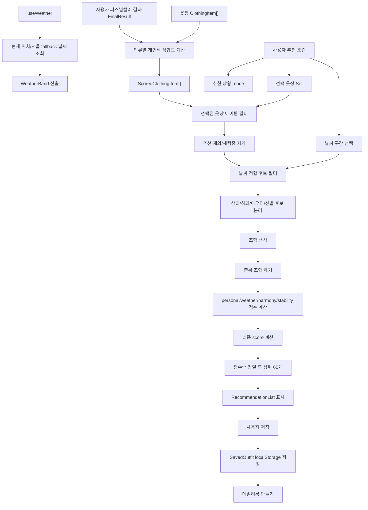
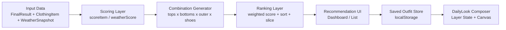
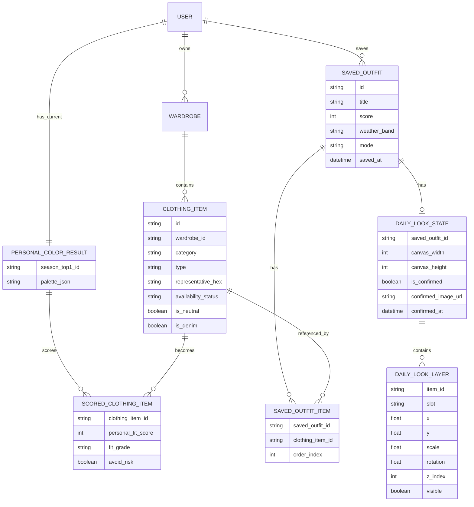
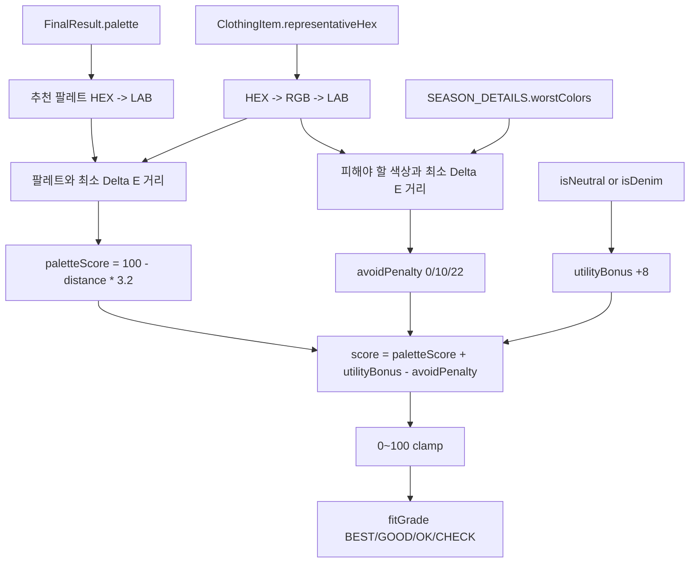
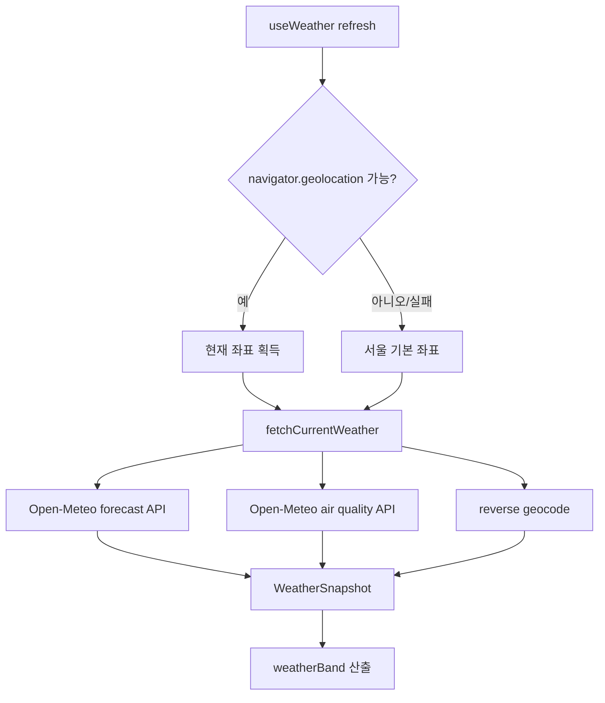
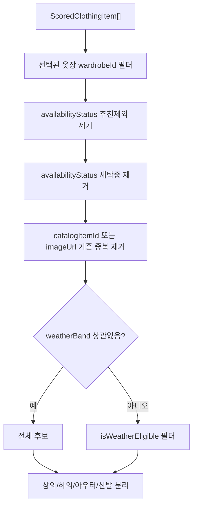
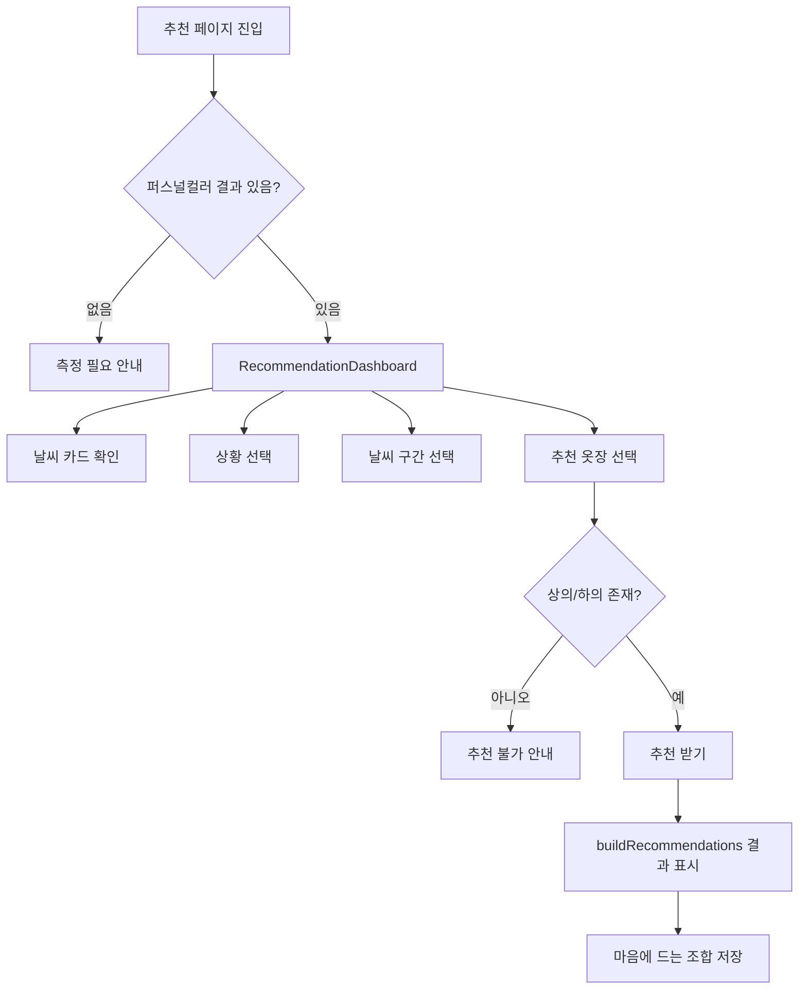
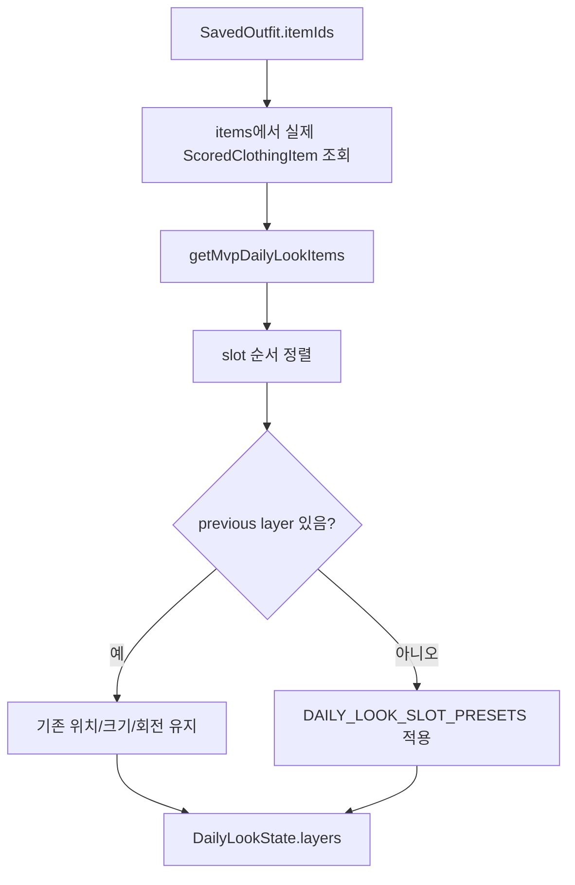
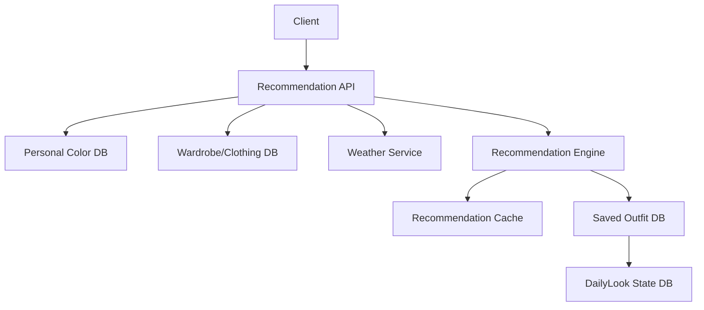
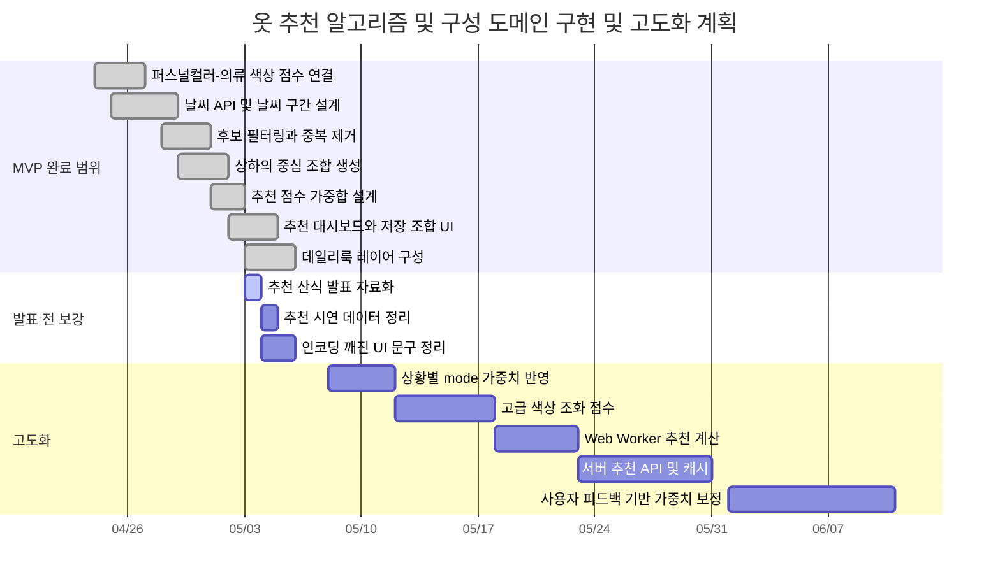

dho sdsd# 옷 추천 알고리즘 및 구성 도메인 상세 분석 보고서

## 0. 문서 목적

이 문서는 `통합_퍼컬_옷장` 프로젝트에서 **옷 추천 알고리즘 및 추천 구성 도메인**만 분석한다. 앞선 문서에서 다룬 퍼스널컬러 진단 자체, 옷장 생성/옷 추가 CRUD, 누끼 등록 파이프라인은 입력 데이터로만 설명하고, 본문은 추천 점수 계산, 조합 생성, 날씨/상황 반영, 추천 결과 저장, 데일리룩 구성 데이터 구조에 집중한다.

분석 대상은 다음이다.

- 퍼스널컬러 결과를 의류별 적합도 점수로 변환하는 로직
- 옷장 내 의류를 추천 가능한 후보군으로 필터링하는 로직
- 날씨 구간과 보유 상태를 반영하는 로직
- 상의/하의/아우터/신발 조합 생성 방식
- 추천 조합 점수 산식
- 추천 조합 중복 제거 및 상위 N개 선별
- 추천 결과 저장 구조
- 저장한 조합을 데일리룩 구성 데이터로 바꾸는 구조
- 캐싱, 인덱싱, 동시성 제어, 대용량 처리 관점
- WBS와 간트 차트

## 1. 도메인 문제 정의

### 1.1 타겟 사용자

이 도메인의 타겟 사용자는 다음과 같다.

- 퍼스널컬러 진단 결과를 실제 옷 선택에 적용하고 싶은 사용자
- 여러 옷장 중 일부만 선택해 코디 추천을 받고 싶은 사용자
- 현재 날씨에 맞는 옷 조합을 빠르게 찾고 싶은 사용자
- 출근, 데일리, 데이트, 발표처럼 상황별 코디 방향을 고르고 싶은 사용자
- 마음에 드는 추천 조합을 저장해 나중에 다시 보고 싶은 사용자
- 저장한 조합을 이미지 레이어 형태의 데일리룩으로 구성하고 싶은 사용자

### 1.2 기존 추천 방식의 한계

일반적인 옷 추천은 다음 중 하나에 치우치는 경우가 많다.

- 색상만 맞추고 실제 날씨를 고려하지 않는다.
- 날씨만 맞추고 사용자의 퍼스널컬러를 고려하지 않는다.
- 단일 아이템 추천에 머물고 상의/하의/아우터 조합을 만들지 않는다.
- 보유 상태, 세탁 상태, 추천 제외 상태를 반영하지 않는다.
- 왜 추천됐는지 점수 근거가 없다.
- 저장된 추천 조합이 이후 데일리룩 이미지 구성으로 이어지지 않는다.

본 프로젝트의 추천 도메인은 다음 방식으로 이 한계를 줄인다.

- 퍼스널컬러 팔레트와 의류 대표색의 LAB 거리로 개인색 적합도를 계산한다.
- 날씨 구간별 착용 가능 키워드와 계절 태그를 반영한다.
- 보유 상태가 `추천제외` 또는 `세탁중`인 의류는 후보에서 제외한다.
- 상의와 하의를 필수 축으로 두고, 아우터와 신발은 선택 축으로 조합한다.
- 조합 점수를 개인색, 날씨, 조화, 안정성 4개 점수로 분해한다.
- 추천 결과를 `SavedOutfit`으로 저장하고, 데일리룩 레이어 편집 데이터로 확장한다.

## 2. 실제 코드 기준 기술 스택

| 영역 | 사용 기술 | 실제 역할 |
| --- | --- | --- |
| 프론트엔드 | React 19, TypeScript, Vite 6 | 추천 대시보드, 추천 결과, 저장 조합, 데일리룩 구성 |
| 상태 관리 | React `useState`, `useMemo` | 선택 옷장, 추천 조건, 추천 결과, 저장 코디 상태 |
| 색상 계산 | 자체 `colorUtils.ts` | HEX -> RGB -> LAB 변환, Delta E 색상 거리 |
| 퍼스널컬러 데이터 | `FinalResult`, `SEASON_DETAILS` | 사용자 팔레트, 피해야 할 색상, 시즌 라벨 |
| 옷장 데이터 | `ClothingItem`, `ScoredClothingItem` | 추천 후보 아이템 |
| 날씨 데이터 | `useWeather`, `lib/weather.ts`, Open-Meteo API | 현재 기온, 날씨 구간, 미세먼지, 우산 정보 |
| 저장소 | Browser localStorage | 저장 코디 `integrated_saved_outfits` |
| 이미지 구성 | Browser Canvas API | 저장 조합을 데일리룩 이미지로 렌더링 |
| 누끼 보강 | FastAPI background remove API | 저장 코디 이미지 구성 전 누끼 없는 옷 처리 |

## 3. 추천 도메인 파일 구조

```text
통합_퍼컬_옷장/
  src/
    App.tsx
      - ScoredClothingItem, OutfitRecommendation, SavedOutfit, DailyLookState 타입
      - scoreItemForPersonalColor
      - getWeatherScore
      - isWeatherEligible
      - buildRecommendations
      - saveOutfit / renameSavedOutfit / deleteSavedOutfit
      - buildDailyLookState / buildDailyLookLayers
      - RecommendationDashboard / RecommendationList / SavedOutfits / TryOn UI

    services/
      colorUtils.ts
        - hexToRgb
        - rgbToLab
        - deltaE

    lib/
      weather.ts
        - WeatherBand
        - WEATHER_BANDS
        - fetchCurrentWeather
        - getWeatherBandFromTemperature

    hooks/
      useWeather.ts
        - 위치 기반 또는 서울 fallback 날씨 조회

    seasonContent.ts
      - 시즌별 worstColors
      - 시즌 라벨과 설명

    types.ts
      - FinalResult
      - SeasonId
```

## 4. 시스템 아키텍처

### 4.1 전체 추천 흐름도



### 4.2 추천 레이어 구조



추천 도메인은 서버 AI 호출 없이 브라우저 내부에서 결정론적으로 작동한다. 같은 입력 데이터, 같은 퍼스널컬러, 같은 날씨 구간이면 같은 추천 결과가 나온다. 발표에서 "AI 추천"이라는 UI 표현을 쓰더라도, 실제 코드의 핵심은 **설명 가능한 룰 기반 추천 엔진**이다.

## 5. 핵심 도메인 모델

### 5.1 `ScoredClothingItem`

기존 `ClothingItem`에 퍼스널컬러 적합도 점수를 붙인 추천 후보 아이템이다.

```ts
interface ScoredClothingItem extends ClothingItem {
  personalFitScore: number | null;
  fitGrade: FitGrade | null;
  fitReason: string;
  avoidRisk: boolean;
}
```

| 필드 | 의미 |
| --- | --- |
| `personalFitScore` | 퍼스널컬러 팔레트 기준 적합도 0~100 |
| `fitGrade` | BEST, GOOD, OK, CHECK |
| `fitReason` | 어떤 퍼스널컬러 기준으로 계산됐는지 설명 |
| `avoidRisk` | 피해야 할 색상에 가까운지 여부 |

### 5.2 `OutfitRecommendation`

추천 결과 하나를 나타내는 조합 엔티티다.

```ts
interface OutfitRecommendation {
  id: string;
  title: string;
  score: number;
  personalScore: number;
  harmonyScore: number;
  weatherScore: number;
  stabilityScore: number;
  items: ScoredClothingItem[];
  reason: string;
  weatherBand: RecommendationWeatherBand;
  mode: RecommendationMode;
}
```

추천 조합은 총점만 갖지 않고, 점수를 4개 하위 항목으로 나눠 저장한다.

| 점수 | 의미 |
| --- | --- |
| `personalScore` | 조합 내 아이템들의 퍼스널컬러 평균 점수 |
| `weatherScore` | 조합 내 아이템들의 날씨 적합도 평균 |
| `harmonyScore` | 상의/하의 색상 조화 또는 중립색 여부 |
| `stabilityScore` | 모든 아이템이 보유중인지 여부 |
| `score` | 최종 가중합 점수 |

### 5.3 `SavedOutfit`

추천 결과를 저장한 데이터다.

```ts
interface SavedOutfit {
  id: string;
  title: string;
  score: number;
  itemIds: string[];
  colorHexes: string[];
  weatherBand: RecommendationWeatherBand;
  mode: RecommendationMode;
  savedAt: string;
  dailyLookState?: DailyLookState;
}
```

저장 조합은 전체 아이템 객체를 복사하지 않고 `itemIds`만 저장한다. 이렇게 하면 옷장 의류가 업데이트되었을 때 저장 조합도 최신 의류 데이터를 참조할 수 있다.

### 5.4 `DailyLookState`

저장 조합을 시각적 레이어로 배치한 상태다.

```ts
interface DailyLookState {
  canvas: {
    width: number;
    height: number;
  };
  layers: DailyLookLayer[];
  isConfirmed: boolean;
  confirmedImage?: string;
  confirmedAt?: string;
}
```

`DailyLookLayer`는 각 옷의 위치, 크기, 회전, zIndex, 표시 여부를 저장한다.

```ts
interface DailyLookLayer {
  itemId: string;
  category: ClothingCategory;
  slot: DailyLookSlot;
  x: number;
  y: number;
  scale: number;
  rotation: number;
  zIndex: number;
  visible: boolean;
}
```

## 6. 저장 구조

### 6.1 현재 저장 방식

추천 도메인에서 직접 저장하는 localStorage key는 다음이다.

| localStorage key | 저장 데이터 | 구조 |
| --- | --- | --- |
| `integrated_saved_outfits` | 저장한 추천 조합 | `SavedOutfit[]` |

의류와 퍼스널컬러는 다른 도메인에서 저장하지만 추천 엔진의 입력으로 사용된다.

| 입력 key | 역할 |
| --- | --- |
| `integrated_personal_color_result` | 추천 기준이 되는 퍼스널컬러 결과 |
| `integrated_clothing_items` | 추천 후보 의류 |
| `integrated_wardrobes` | 사용자가 선택할 옷장 목록 |

### 6.2 논리 ERD



## 7. 의류별 퍼스널컬러 적합도 계산

### 7.1 계산 흐름

`scoreItemForPersonalColor(item, result)`는 `ClothingItem` 하나를 `ScoredClothingItem`으로 변환한다.



### 7.2 공식

의류 대표색과 사용자 추천 팔레트 사이의 LAB Delta E 최단 거리를 구한다.

```text
paletteDistance = min(deltaE(itemLab, paletteColorLab))
paletteScore = max(0, 100 - paletteDistance * 3.2)
```

피해야 할 색상과의 거리도 계산한다.

```text
avoidDistance = min(deltaE(itemLab, worstColorLab))
avoidPenalty =
  22점, avoidDistance < 18
  10점, avoidDistance < 28
   0점, 그 외
```

중립색 또는 데님은 활용도가 높으므로 보너스를 준다.

```text
utilityBonus = isNeutral or isDenim ? 8 : 0
```

최종 의류 적합도는 다음이다.

```text
personalFitScore = clamp(round(paletteScore + utilityBonus - avoidPenalty), 0, 100)
```

### 7.3 등급화

```ts
function gradeFromScore(score: number): FitGrade {
  if (score >= 88) return 'BEST';
  if (score >= 74) return 'GOOD';
  if (score >= 58) return 'OK';
  return 'CHECK';
}
```

| 점수 범위 | 등급 | 의미 |
| --- | --- | --- |
| 88~100 | BEST | 퍼스널컬러 팔레트와 매우 가까움 |
| 74~87 | GOOD | 충분히 활용 가능 |
| 58~73 | OK | 무난하지만 핵심 추천색은 아님 |
| 0~57 | CHECK | 주의 필요 |

### 7.4 독창성

이 로직은 단순히 색상명을 비교하지 않는다. 예를 들어 "블루"라는 이름만으로 판단하지 않고, `representativeHex`를 LAB 색공간으로 변환해 사람 눈에 가까운 색상 거리인 Delta E를 계산한다. 또한 피해야 할 색상 팔레트와의 거리까지 계산해 단순 추천 팔레트 근접도만 보는 한계를 줄인다.

## 8. 날씨 기반 필터링과 점수

### 8.1 날씨 데이터 수집

`useWeather`는 브라우저 위치 권한을 사용해 현재 위치 날씨를 조회한다. 위치 사용이 불가능하면 서울 기준 위치를 fallback으로 사용한다.



`WeatherSnapshot`에는 다음 정보가 들어간다.

- 현재 기온
- 체감 기온
- 날씨 코드/텍스트
- 강수량
- 강수 확률
- 우산 필요 여부
- 풍속
- 미세먼지/초미세먼지
- 최고/최저 기온
- 추천 날씨 구간 `weatherBand`

### 8.2 날씨 구간

날씨 구간은 기온 기준으로 나뉜다.

| 구간 | 의미 |
| --- | --- |
| 4도 이하 | 매우 추움 |
| 5~8도 | 추움 |
| 9~11도 | 쌀쌀함 |
| 12~16도 | 선선함 |
| 17~19도 | 가벼운 겉옷 |
| 20~22도 | 온화함 |
| 23~27도 | 더움 |
| 28도 이상 | 매우 더움 |

### 8.3 날씨별 허용 키워드

`WEATHER_RULES`는 날씨 구간별 추천 의류 키워드를 갖는다.

| 날씨 구간 | 키워드 예시 |
| --- | --- |
| 4도 이하 | 패딩, 코트, 니트, 가디건 |
| 5~8도 | 코트, 재킷, 니트, 맨투맨 |
| 9~11도 | 블레이저, 재킷, 니트, 긴팔티, 셔츠 |
| 12~16도 | 블레이저, 셔츠, 긴팔티, 니트, 맨투맨 |
| 17~19도 | 셔츠, 가디건, 긴팔티, 맨투맨 |
| 20~22도 | 반팔티, 셔츠, 블라우스 |
| 23~27도 | 반팔티, 긴바지, 반바지, 블라우스, 스커트 |
| 28도 이상 | 반팔티, 반바지, 샌들, 스커트 |

`getAllowedWeatherKeywords`는 현재 구간뿐 아니라 직전 낮은 구간의 키워드도 함께 포함한다. 예를 들어 12~16도라면 9~11도 일부 옷도 허용된다. 이는 실제 체감온도와 개인차를 고려한 완충 장치다.

### 8.4 날씨 후보 필터

`isWeatherEligible`은 아이템이 특정 날씨 구간에 사용 가능한지 판단한다.

핵심 규칙은 다음이다.

- `상관없음`이면 모두 허용
- 카테고리에 맞는 키워드가 없으면 하의/신발은 기본 허용
- 아이템 종류가 날씨 키워드를 포함하면 허용

### 8.5 날씨 점수

`getWeatherScore(item, band)`는 의류별 날씨 점수를 계산한다.

날씨를 `상관없음`으로 둔 경우:

| 상태/속성 | 점수 |
| --- | --- |
| 추천제외 | 0 |
| 세탁중 | 35 |
| 보관중 | 55 |
| 중립색/데님 | 82 |
| 일반 보유중 | 72 |

특정 날씨 구간이 있는 경우:

```text
기본 점수 = 60
날씨 키워드와 type 일치 = +28
seasonTag가 사계절 = +8
28도 이상인데 겨울 태그 = -30
4도 이하 또는 5~8도인데 여름 태그 = -25
추천제외 = 0
세탁중 = 20
보관중 = 45
최종 0~100 clamp
```

## 9. 추천 후보군 필터링

추천은 다음 순서로 후보군을 줄인다.



중복 제거 키는 다음이다.

```ts
function itemUniqueKey(item: ScoredClothingItem) {
  return item.catalogItemId ?? item.imageUrl;
}
```

카탈로그 의류는 `catalogItemId`를 기준으로, 업로드 의류는 `imageUrl`을 기준으로 중복을 제거한다.

## 10. 조합 생성 알고리즘

### 10.1 조합 축

추천 조합은 다음 축으로 생성된다.

| 축 | 필수 여부 |
| --- | --- |
| 상의 | 필수 |
| 하의 | 필수 |
| 아우터 | 선택 |
| 신발 | 선택 |

코드상 조합은 다음과 같은 중첩 반복으로 생성된다.

```text
for top in tops
  for bottom in bottoms
    for outer in [undefined, ...outerwear]
      for shoe in [undefined, ...shoes]
        outfit = [outer, top, bottom, shoe].filter(Boolean)
```

상의와 하의가 있어야 추천 가능 조건을 만족한다. 아우터와 신발은 없을 수 있다.

### 10.2 아우터 정렬

아우터 후보는 날씨 점수 높은 순으로 정렬된다.

```ts
const outerOptions = [
  undefined,
  ...outerwear.sort((a, b) => getWeatherScore(b, band) - getWeatherScore(a, band))
];
```

따라서 추운 날씨에는 날씨 적합도가 높은 아우터가 조합 초반에 들어오기 쉽다.

### 10.3 조합 중복 제거

아이템 순서가 달라도 같은 구성이라면 같은 조합으로 본다.

```ts
function outfitUniqueKey(items: ScoredClothingItem[]) {
  return items.map(itemUniqueKey).sort().join('|');
}
```

`seenOutfits` Set으로 이미 생성된 조합을 제거한다.

## 11. 조합 점수 산식

각 조합은 네 개 점수를 계산한다.

### 11.1 개인색 점수

조합에 포함된 아이템들의 `personalFitScore` 평균이다.

```text
personalScore = average(item.personalFitScore ?? 55)
```

퍼스널컬러 미측정 또는 점수 없는 아이템은 55점으로 처리한다. 이 값은 완전 배제는 아니지만 높은 추천을 받기 어렵게 하는 중립 하한값이다.

### 11.2 날씨 점수

조합 아이템들의 `getWeatherScore` 평균이다.

```text
weatherScore = average(getWeatherScore(item, band))
```

### 11.3 색상 조화 점수

현재 구현은 간단한 규칙을 사용한다.

```text
harmonyScore =
  84, 상의 대표색 == 하의 대표색 또는 상의/하의 중 하나가 neutral
  72, 그 외
```

이는 MVP 수준의 조화 점수다. 같은 색상이나 무채색/데님 같은 중립 축을 안정적인 조합으로 본다.

### 11.4 안정성 점수

모든 아이템이 `보유중`이면 안정성이 높다.

```text
stabilityScore =
  92, 모든 아이템 availabilityStatus == 보유중
  68, 그 외
```

다만 추천 후보 필터에서 `추천제외`, `세탁중`은 이미 제거되므로, 여기서 낮아지는 주요 케이스는 `보관중` 같은 상태다.

### 11.5 최종 점수

최종 추천 점수는 다음 가중합이다.

```text
score =
  personalScore * 0.42
  + weatherScore * 0.28
  + harmonyScore * 0.20
  + stabilityScore * 0.10
```

| 점수 요소 | 비중 | 이유 |
| --- | --- | --- |
| 개인색 적합도 | 42% | 프로젝트의 핵심 차별점 |
| 날씨 적합도 | 28% | 실제 착용 가능성 |
| 색상 조화 | 20% | 코디 구성 안정성 |
| 보유 상태 안정성 | 10% | 실제 사용 가능성 |

이 가중치는 추천 목표가 "예쁜 색"만이 아니라 "오늘 입을 수 있는 조합"이라는 점을 반영한다.

## 12. 추천 결과 정렬과 제한

생성된 조합은 점수 내림차순으로 정렬된다.

```ts
return outfits.sort((a, b) => b.score - a.score).slice(0, 60);
```

최대 60개만 UI에 전달한다. 이는 조합 수가 많아질 때 렌더링 비용을 줄이는 상한이다.

조합 수는 대략 다음과 같이 증가한다.

```text
조합 수 = 상의 수 * 하의 수 * (아우터 수 + 1) * (신발 수 + 1)
```

예를 들어 상의 20개, 하의 15개, 아우터 8개, 신발 5개라면:

```text
20 * 15 * 9 * 6 = 16,200 조합
```

현재는 브라우저에서 전수 생성 후 정렬한다. MVP에는 충분하지만, 대규모 옷장에서는 top-k heap, 카테고리별 사전 컷오프, Web Worker 분리가 필요하다.

## 13. 추천 대시보드 구성

`RecommendationDashboard`는 추천 조건을 조정하고 추천 결과를 요청하는 UI다.

### 13.1 입력 조건

| 조건 | 역할 |
| --- | --- |
| 퍼스널컬러 | 현재 적용 중인 `FinalResult.seasonTop1Id` |
| 상황 mode | 데일리, 출근, 데이트, 발표 |
| 날씨 weatherBand | 상관없음 또는 기온 구간 |
| 선택 옷장 | 추천 후보로 사용할 옷장 Set |
| 옷장 검색 | 선택할 옷장 필터 |

현재 `mode`는 제목과 저장 메타데이터에 들어가지만 점수 산식에는 직접 반영되지 않는다. 즉 상황별 가중치 조정은 향후 확장 포인트다.

### 13.2 추천 가능 조건

추천 버튼은 다음 조건을 만족해야 활성화된다.

```text
선택된 옷장 수 > 0
선택된 옷장 안의 상의 수 > 0
선택된 옷장 안의 하의 수 > 0
```

이는 MVP 조합 생성이 상의+하의를 최소 구성으로 요구하기 때문이다.

### 13.3 사용자 액션 흐름



## 14. 저장 코디 도메인

### 14.1 저장 흐름

`saveOutfit`은 추천 결과를 `SavedOutfit`으로 변환해 저장한다.

```ts
const saveOutfit = (outfit: OutfitRecommendation) => {
  const key = outfit.items.map((item) => item.id).join(',');
  if (savedOutfits.some((saved) => saved.itemIds.join(',') === key)) return;
  const next = [{
    id: `saved-${Date.now()}`,
    title: outfit.title,
    score: outfit.score,
    itemIds: outfit.items.map((item) => item.id),
    colorHexes: outfit.items.map((item) => item.representativeHex),
    weatherBand: outfit.weatherBand,
    mode: outfit.mode,
    savedAt: new Date().toISOString(),
  }, ...savedOutfits];
  setSavedOutfits(next);
  saveJson(STORAGE_KEYS.saved, next);
};
```

### 14.2 저장 중복 방지

저장 조합은 `itemIds.join(',')`이 같은 경우 중복 저장하지 않는다.

주의할 점은 추천 조합 생성의 중복 키는 정렬된 unique key지만, 저장 중복 키는 현재 아이템 순서 기반이다. 현재 추천 생성 순서가 안정적이라 실사용에는 큰 문제가 없지만, 장기적으로는 저장 중복도 정렬된 key로 통일하는 것이 좋다.

### 14.3 저장 조합 관리

저장 조합은 다음 기능을 갖는다.

- 이름 변경
- 삭제
- 상세 보기
- 색상 팔레트 미리보기
- 포함 아이템 썸네일 보기
- 데일리룩 만들기 진입

저장 조합 삭제는 `SavedOutfit[]`에서 해당 id만 제거한다. 원본 의류는 삭제하지 않는다.

## 15. 데일리룩 구성 도메인

저장한 추천 조합은 `TryOn` 화면에서 데일리룩으로 구성할 수 있다. 이 기능은 추천 알고리즘 이후의 "구성 도메인"이다.

### 15.1 슬롯 매핑

의류 카테고리는 데일리룩 슬롯으로 변환된다.

| ClothingCategory | DailyLookSlot |
| --- | --- |
| 아우터 | `outer` |
| 상의 | `upper` |
| 하의 | `lower` |
| 신발 | `shoes` |
| 액세서리 | 기본 `accessory`, 모자는 `hat`, 가방은 `bag` |

### 15.2 자동 배치 프리셋

`DAILY_LOOK_SLOT_PRESETS`는 캔버스 1080x1440 기준 위치를 정의한다.

| slot | x | y | scale | zIndex |
| --- | --- | --- | --- | --- |
| outer | 540 | 382 | 1.08 | 0 |
| upper | 540 | 350 | 0.95 | 2 |
| lower | 540 | 795 | 1.00 | 1 |
| shoes | 540 | 1185 | 0.78 | 3 |
| hat | 540 | 170 | 0.56 | 4 |
| bag | 760 | 690 | 0.72 | 5 |
| accessory | 740 | 460 | 0.50 | 6 |

### 15.3 레이어 생성

`buildDailyLookLayers`는 저장 조합의 아이템을 레이어로 변환한다. 이전에 사용자가 수정한 배치가 있으면 유지하고, 없으면 slot preset을 적용한다.



### 15.4 누끼 보강

데일리룩을 만들 때 누끼 이미지가 없거나 버전이 오래된 아이템은 자동으로 누끼 처리한다.

```ts
const missingItems = dailyLookItems.filter(
  (item) => !item.cutoutImageUrl || item.segmentation?.version !== CUTOUT_VERSION
);
```

중복 요청 방지를 위해 `cutoutRequestKeyRef`를 사용한다.

```ts
const requestKey = `${selectedOutfit.id}:${missingItems.map((item) => item.id).join(',')}`;
if (cutoutRequestKeyRef.current === requestKey) return;
```

이 구조는 데일리룩 화면에서 같은 누끼 작업이 반복 호출되는 문제를 막는다.

### 15.5 확정 이미지 저장

사용자가 확정하면 Canvas에 레이어를 렌더링해 PNG data URL을 만든다.

```text
renderConfirmedImage
  -> canvas 1080x1440 생성
  -> 배경 fill
  -> zIndex 순으로 이미지 draw
  -> toDataURL('image/png')
```

외부 이미지 CORS 때문에 렌더링 저장이 실패할 수 있는데, 이 경우 이미지 없이 배치 상태만 저장한다. 이 방어 처리가 들어가 있다.

## 16. 데이터 캐싱, 인덱싱, 동시성 제어

### 16.1 `useMemo` 기반 추천 재계산 제어

추천 결과는 다음 입력이 바뀔 때만 다시 계산된다.

```ts
const recommendations = useMemo(
  () => buildRecommendations(recommendItems, weatherBand, recommendMode),
  [recommendItems, weatherBand, recommendMode]
);
```

`recommendItems`는 선택된 옷장의 점수화된 의류 목록이다. 이 구조는 렌더마다 불필요한 추천 조합 생성을 줄인다.

### 16.2 Set 기반 선택 옷장 관리

선택 옷장은 `Set<string>`으로 관리된다.

```ts
const [selectedRecommendWardrobes, setSelectedRecommendWardrobes] =
  useState<Set<string>>(...)
```

특정 옷장이 선택되었는지 확인할 때 O(1)에 가깝게 조회할 수 있다.

### 16.3 중복 아이템 제거

`dedupeRecommendationItems`는 `Set`을 사용해 추천 후보 중복을 제거한다.

```text
key = catalogItemId ?? imageUrl
```

### 16.4 중복 조합 제거

조합은 정렬된 unique key로 중복을 제거한다.

```text
outfitUniqueKey = sorted item unique keys joined by "|"
```

### 16.5 데일리룩 누끼 요청 중복 방지

`cutoutRequestKeyRef`는 동일 저장 조합에 대해 같은 누끼 요청이 반복되는 것을 막는다. 이는 React effect가 여러 번 실행되는 상황에서 중요하다.

### 16.6 날씨 API 비동기 처리

`useWeather`는 다음 상태를 관리한다.

- `data`
- `loading`
- `error`
- `source`

위치 권한 실패 시 fallback으로 자동 전환되며, 앱이 날씨 API 실패로 전체 중단되지 않는다.

## 17. 대용량 처리 관점

현재 추천 엔진은 브라우저에서 전수 조합을 만든 뒤 정렬한다. 데이터가 작을 때는 단순하고 설명 가능하지만, 옷장 규모가 커지면 조합 폭발이 발생한다.

### 17.1 시간 복잡도

```text
O(T * B * (O + 1) * (S + 1))
```

| 기호 | 의미 |
| --- | --- |
| T | 상의 수 |
| B | 하의 수 |
| O | 아우터 수 |
| S | 신발 수 |

### 17.2 개선 방향

대규모 옷장에서는 다음이 필요하다.

- 카테고리별 상위 K개 후보만 먼저 선택
- `personalFitScore`와 `weatherScore`가 낮은 후보 사전 컷오프
- Web Worker로 조합 계산 분리
- top-k heap으로 전체 정렬 비용 감소
- 서버 추천 API로 이전
- 추천 결과 캐시 키 도입

추천 캐시 키 예시는 다음과 같다.

```text
userId + personalColorResultId + selectedWardrobeIds + weatherBand + mode + clothingVersion
```

## 18. 서버 DB 확장 구조

현재는 localStorage 기반이지만, 서버 기반으로 확장하면 다음 구조가 적합하다.



추천 도메인용 DB 인덱스는 다음과 같다.

| 테이블 | 인덱스 | 목적 |
| --- | --- | --- |
| `clothing_items` | `(wardrobe_id, category)` | 카테고리별 후보 조회 |
| `clothing_items` | `(wardrobe_id, availability_status)` | 추천 제외/세탁중 필터 |
| `clothing_items` | `(representative_hex)` | 색상 분석/통계 |
| `saved_outfits` | `(user_id, saved_at DESC)` | 저장 코디 목록 |
| `saved_outfit_items` | `(saved_outfit_id, order_index)` | 저장 조합 아이템 복원 |
| `daily_look_layers` | `(saved_outfit_id, z_index)` | 레이어 렌더링 순서 |

## 19. 핵심 로직의 독창성 및 난이도

### 19.1 퍼스널컬러 결과의 실제 활용

이 프로젝트는 퍼스널컬러 결과를 단순 프로필로만 보여주지 않는다. `FinalResult.palette`와 `SEASON_DETAILS.worstColors`를 의류 대표색과 비교해 아이템 단위 점수로 변환한다. 진단 결과가 추천 엔진의 실제 입력이 된다.

### 19.2 다중 목적 점수 체계

추천 조합은 하나의 블랙박스 점수가 아니라 다음 네 점수로 나뉜다.

- 개인색 적합도
- 날씨 적합도
- 색상 조화
- 보유 상태 안정성

따라서 사용자는 왜 추천됐는지 더 쉽게 이해할 수 있고, 발표에서도 로직 근거를 설명하기 좋다.

### 19.3 조합 생성과 저장의 연결

추천 결과가 일회성 리스트에서 끝나지 않는다. `SavedOutfit`으로 저장되고, 이후 `DailyLookState`로 확장되어 이미지 레이어 편집까지 이어진다. 추천 도메인이 데이터 생성, 저장, 재구성까지 연결되어 있다.

### 19.4 날씨 완충 규칙

날씨 구간은 딱 하나의 키워드만 쓰지 않고 직전 낮은 구간 키워드도 포함한다. 실제 착용은 기온 경계에서 애매해지므로, 이 완충 규칙은 실사용성을 높인다.

## 20. 현재 MVP 구현 상태

| 기능 | 구현 상태 |
| --- | --- |
| 퍼스널컬러 결과 없을 때 추천 차단 | 구현 |
| 의류별 퍼스널컬러 적합도 점수 | 구현 |
| BEST/GOOD/OK/CHECK 등급 | 구현 |
| 피해야 할 색상 penalty | 구현 |
| 중립색/데님 utility bonus | 구현 |
| 위치 기반 날씨 조회 | 구현 |
| 서울 fallback 날씨 | 구현 |
| 날씨 구간 산출 | 구현 |
| 날씨 구간별 의류 키워드 | 구현 |
| 선택 옷장 기반 후보 필터 | 구현 |
| 추천제외/세탁중 제외 | 구현 |
| 상의+하의 필수 추천 조건 | 구현 |
| 상의/하의/아우터/신발 조합 생성 | 구현 |
| 조합 중복 제거 | 구현 |
| 개인색/날씨/조화/안정성 점수 | 구현 |
| 상위 60개 추천 제한 | 구현 |
| 추천 결과 저장 | 구현 |
| 저장 조합 이름 변경/삭제 | 구현 |
| 저장 조합 데일리룩 구성 | 구현 |
| 데일리룩 레이어 자동 배치 | 구현 |
| 누끼 없는 저장 조합 자동 처리 | 구현 |

현재 한계는 다음과 같다.

- `mode`가 점수 산식에 직접 반영되지 않는다.
- 색상 조화 점수가 단순하다. 보색, 유사색, 명도 대비, 채도 균형은 아직 없다.
- 전체 조합을 브라우저에서 전수 생성하므로 대규모 옷장에서는 성능 한계가 있다.
- 추천 점수 가중치가 사용자별로 학습되지는 않는다.
- 저장 코디 중복 체크가 순서 기반이라 정렬 key로 통일하는 개선 여지가 있다.
- 날씨 텍스트/일부 문자열에 인코딩 깨짐이 있다.

## 21. WBS

| 단계 | 작업 | 산출물 | 현재 상태 |
| --- | --- | --- | --- |
| 1 | 추천 입력 데이터 구조 정의 | FinalResult, ClothingItem, WeatherBand | 완료 |
| 2 | 의류별 퍼스널컬러 점수 계산 | scoreItemForPersonalColor | 완료 |
| 3 | 날씨 API 연동 | useWeather, fetchCurrentWeather | 완료 |
| 4 | 날씨 구간과 의류 키워드 설계 | WEATHER_RULES | 완료 |
| 5 | 후보 필터링 | availability/weather/wardrobe filter | 완료 |
| 6 | 조합 생성 알고리즘 | buildRecommendations | 완료 |
| 7 | 조합 점수 산식 | personal/weather/harmony/stability | 완료 |
| 8 | 추천 대시보드 UI | RecommendationDashboard | 완료 |
| 9 | 추천 결과 리스트 UI | RecommendationList | 완료 |
| 10 | 추천 저장 | SavedOutfit localStorage | 완료 |
| 11 | 저장 코디 관리 | SavedOutfits | 완료 |
| 12 | 데일리룩 레이어 모델 | DailyLookState | 완료 |
| 13 | 데일리룩 자동 배치 | buildDailyLookLayers | 완료 |
| 14 | 데일리룩 확정 이미지 | Canvas renderConfirmedImage | 완료 |
| 15 | 상황 mode별 가중치 분기 | 출근/데이트/발표별 scoring | 예정 |
| 16 | 고급 색상 조화 알고리즘 | 유사색/보색/톤온톤/대비 | 예정 |
| 17 | Web Worker 추천 계산 | 대규모 조합 성능 개선 | 예정 |
| 18 | 서버 추천 API와 캐시 | recommendation cache | 예정 |

## 22. 간트 차트



## 23. 발표에서 강조할 핵심 포인트

이 추천 도메인은 단순 랜덤 코디나 카테고리 필터가 아니다.

- **진단 결과 활용**: 퍼스널컬러 팔레트와 의류 대표색을 LAB Delta E로 비교한다.
- **다중 점수 체계**: 개인색, 날씨, 조화, 안정성을 분리 계산하고 가중합한다.
- **실사용 조건 반영**: 세탁중/추천제외 상태를 제외하고, 보관중은 안정성에 반영한다.
- **날씨 반영**: Open-Meteo 기반 실시간 날씨와 구간별 의류 키워드를 사용한다.
- **조합 생성**: 상의+하의를 중심으로 아우터/신발 선택 조합을 만든다.
- **중복 제어**: 아이템과 조합 모두 Set 기반 unique key로 중복을 줄인다.
- **저장과 재구성**: 추천 결과가 `SavedOutfit`으로 저장되고 `DailyLookState`로 확장된다.
- **설명 가능성**: 추천 결과 카드에서 총점과 하위 점수를 함께 보여줄 수 있는 구조다.

## 24. 결론

옷 추천 알고리즘 및 구성 도메인은 퍼스널컬러 진단 결과와 옷장 데이터를 실제 사용자 행동으로 연결하는 핵심 모듈이다. 퍼스널컬러 결과는 단순 라벨이 아니라 의류별 색상 적합도 점수로 변환되고, 옷장 데이터는 날씨와 보유 상태를 거쳐 실제 착용 가능한 조합으로 재구성된다.

현재 구현은 설명 가능한 룰 기반 추천 엔진이다. `personalScore 42% + weatherScore 28% + harmonyScore 20% + stabilityScore 10%`라는 명확한 산식이 있고, 각 점수의 근거도 코드상 추적 가능하다. 또한 추천 결과는 저장 조합과 데일리룩 레이어 구성으로 이어져, 단순 추천 목록을 넘어 "추천 -> 저장 -> 시각적 구성"까지 연결되는 도메인 흐름을 갖는다.

따라서 이 모듈은 "옷을 몇 개 보여주는 기능"이 아니라, 퍼스널컬러, 날씨, 옷장 상태, 조합 생성, 저장 코디를 하나의 데이터 파이프라인으로 묶은 추천 구성 엔진이라고 정리할 수 있다.
