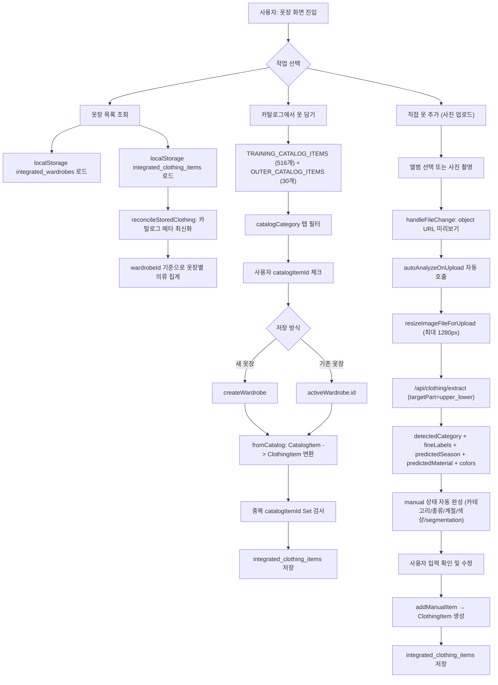
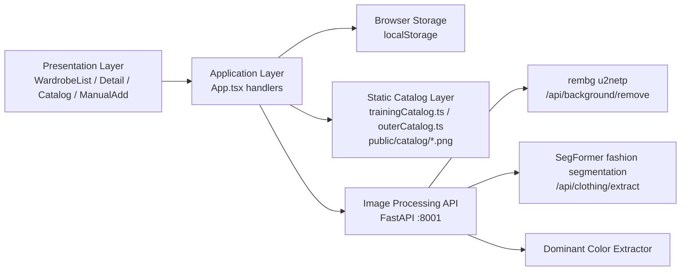
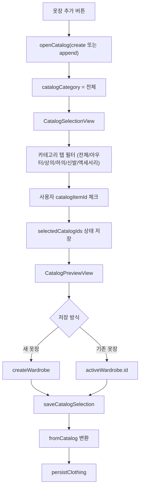
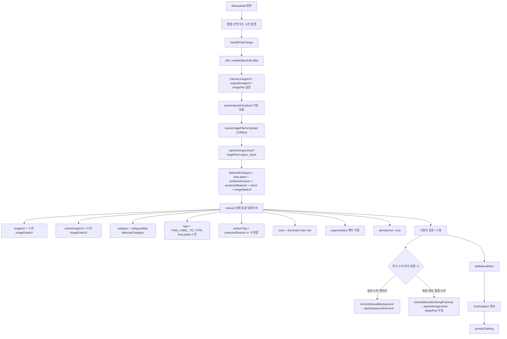
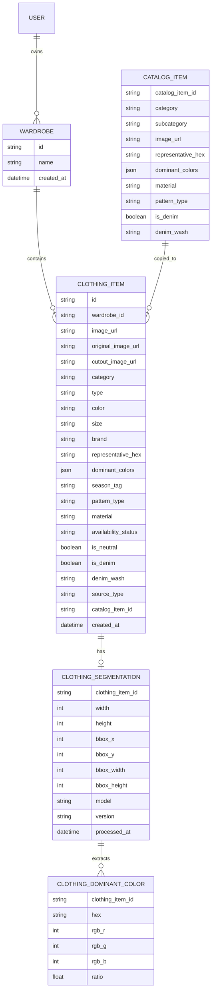
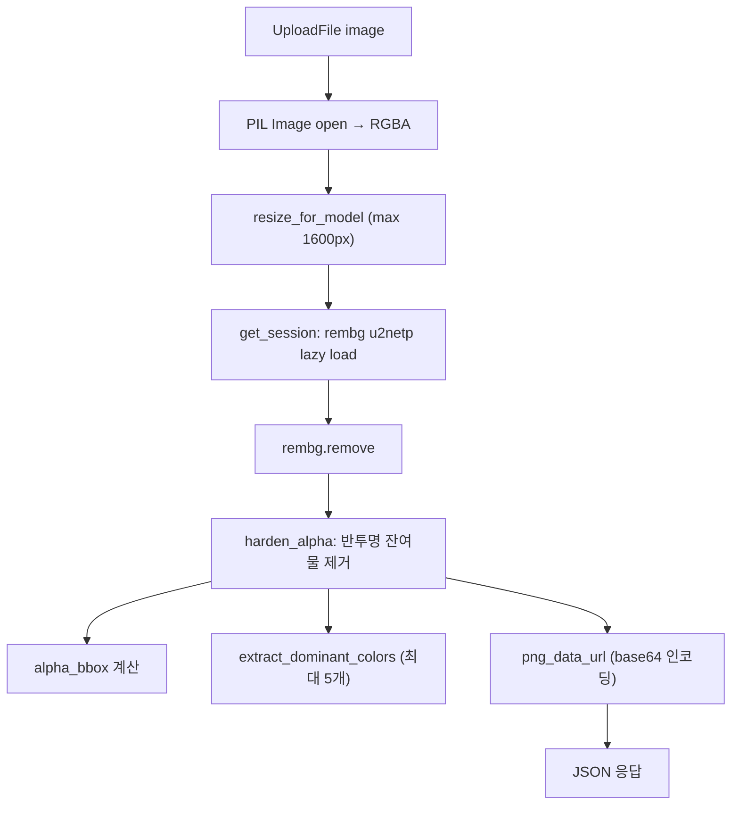
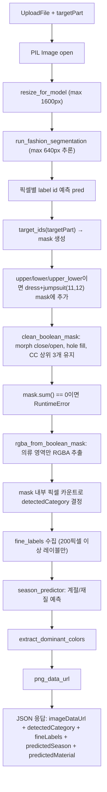
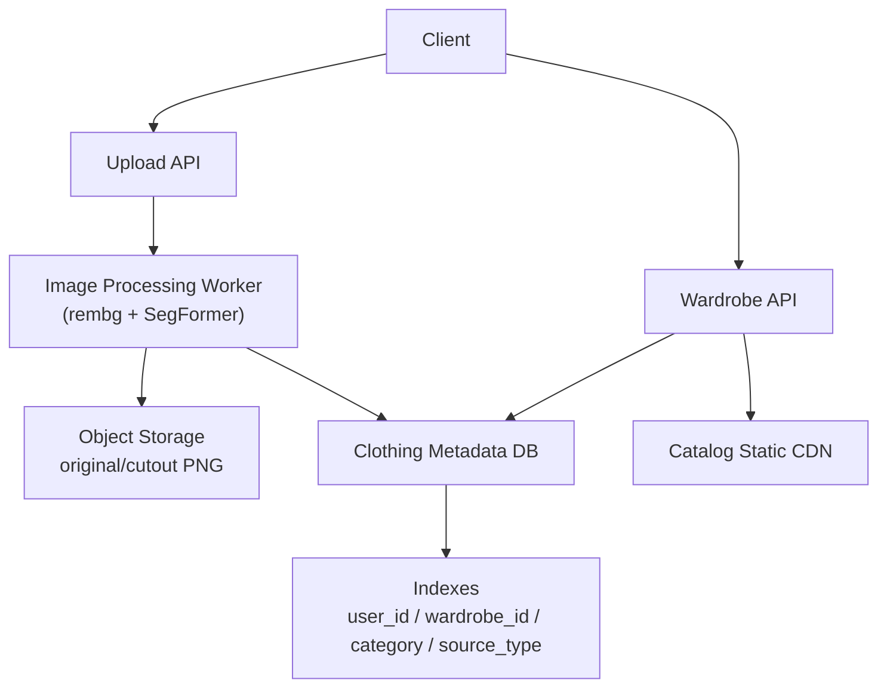

# 옷장 및 옷 추가 도메인 상세 분석 보고서

> 최종 갱신: 2026-05-16 (commit 9161ba2 기준)

## 0. 문서 목적

이 문서는 `통합_퍼컬_옷장` 프로젝트에서 **옷장 관리와 옷 추가 도메인**만 분석한다. 퍼스널컬러 결과를 이용한 옷 추천 알고리즘, 날씨 기반 추천, 저장 코디, 데일리룩 추천 로직은 의도적으로 제외한다.

분석 대상은 다음이다.

- 옷장 생성, 조회, 이름 변경, 삭제
- 옷장별 의류 저장 구조
- 학습 데이터 기반 카탈로그에서 옷을 선택해 옷장에 담는 흐름
- 사용자가 직접 사진을 올려 옷을 추가하는 흐름
- AI 자동 분석: 사진 업로드 → 카테고리/계절/재질/색상 자동 감지 → 폼 자동 완성
- 누끼 처리 및 의류 색상 메타데이터 추출 구조
- localStorage 저장 방식과 서버 DB 확장 가능성
- 캐싱, 인덱싱, 동시성 제어, 대용량 처리 관점

## 1. 도메인 문제 정의

### 1.1 타겟 사용자

이 도메인의 타겟 사용자는 다음과 같다.

- 여러 목적별 옷장을 나눠 관리하고 싶은 사용자
- 출근용, 주말용, 발표용처럼 상황별 옷 묶음을 관리하고 싶은 사용자
- 이미 준비된 의류 DB에서 빠르게 내 옷장을 구성하고 싶은 사용자
- 실제 본인 옷 사진을 올려 디지털 옷장에 저장하고 싶은 사용자
- 옷의 카테고리, 색상, 사이즈, 브랜드, 계절 태그, 보유 상태를 관리하고 싶은 사용자

### 1.2 기존 방식의 한계와 이 프로젝트의 접근

일반적인 옷장 앱은 사진을 등록하고 목록을 보여주는 CRUD에 머문다. 사용자가 카테고리, 색상, 계절 정보를 매번 수동 입력해야 하고, 배경이 있는 사진은 코디 미리보기에 쓰기 어렵다.

이 프로젝트는 다음 설계로 문제를 해결한다.

- `Wardrobe`와 `ClothingItem`을 분리하고 `wardrobeId`로 관계를 만든다.
- 카탈로그 기반 추가와 수동 업로드 추가를 모두 `ClothingItem` 하나의 구조로 통합한다.
- 수동 업로드 시 사진을 올리는 순간 AI가 자동으로 카테고리/계절/색상을 감지하고 폼을 자동 완성한다.
- 누끼 이미지, segmentation 메타데이터, 색상 팔레트, 재질, 데님 워시를 구조화해 저장한다.
- 카탈로그 의류는 `catalogItemId`로 원본과 연결되고, 앱 재시작 시 `reconcileStoredClothing`으로 메타데이터를 최신화한다.

## 2. 실제 코드 기준 기술 스택

| 영역 | 사용 기술 | 실제 역할 |
| --- | --- | --- |
| 프론트엔드 | React 19, TypeScript, Vite 6 | 옷장 목록, 상세, 카탈로그 선택, 수동 등록 화면 |
| 상태 관리 | React `useState`, `useMemo` | 옷장/의류/선택 상태 관리 |
| 저장소 | Browser localStorage | 옷장 배열과 의류 배열 영속화 |
| 이미지 업로드 | HTML file input, camera capture | 앨범 선택/사진 촬영 |
| 이미지 리사이징 | Browser Canvas API (`createImageBitmap`) | 업로드 전 최대 1280px로 축소 |
| 카탈로그 자산 | `public/catalog/*.png` + TypeScript 정적 배열 | 학습 데이터 516개 + 아우터 2차 30개 |
| 누끼 서버 | FastAPI, Pillow, rembg `u2netp` | 일반 배경 제거 |
| AI 의류 분석 서버 | transformers SegFormer (`sayeed99/segformer-b3-fashion`), torch | 의류 파트 segmentation + 카테고리/계절/재질 자동 감지 |
| 색상 추출 | Python Counter + alpha mask | 누끼 결과의 대표 색상 추출 |
| UI | lucide-react, Tailwind CSS | 옷장 카드, 의류 카드, 카탈로그 선택, 수동 입력 |

## 3. 도메인 파일 구조

```text
통합_퍼컬_옷장/
  src/
    App.tsx                          핵심 파일. 모든 타입, 상태, 핸들러, UI 컴포넌트 포함
      - Wardrobe, CatalogItem, ClothingItem 타입 정의
      - localStorage load/save
      - 옷장 생성/수정/삭제
      - 카탈로그 의류 추가
      - 수동 의류 추가 (AI 자동 분석 포함)
      - 누끼 API 호출
      - 옷장 목록/상세/카탈로그/수동 등록 UI

    data/
      trainingCatalog.ts             퍼스널컬러 ML 학습용 516개 의류 카탈로그 (1차)
      outerCatalog.ts                2차 확장 아우터 30개 (재킷 24 + 코트 6)

    services/
      personalColorEngine.ts         퍼스널컬러 fusionResults 계산
      colorUtils.ts                  Delta E, Lab, HSL 변환 유틸

    hooks/
      useWeather.ts                  날씨 데이터 훅

    lib/
      weather.ts                     날씨 구간(WeatherBand) 타입/상수

  server/
    background_remove_api.py         FastAPI 이미지 처리 서버
      - /api/health
      - /api/background/remove       rembg 일반 누끼
      - /api/clothing/extract        SegFormer 정밀 의류 추출 + 카테고리/계절/재질 자동 감지

  public/
    catalog/
      upper_shirt_001.png ~ ...      516개 상의/하의 학습 이미지
      v2_outer_*.png                 30개 아우터 2차 이미지
```

## 4. 시스템 아키텍처

### 4.1 전체 흐름도



### 4.2 레이어 구조



## 5. 핵심 도메인 모델

### 5.1 `Wardrobe`

옷장 단위 엔티티다.

```ts
interface Wardrobe {
  id: string;
  name: string;
  createdAt: string;
}
```

기본 옷장 3개가 `INITIAL_WARDROBES`로 정의된다.

| id | name | 의미 |
| --- | --- | --- |
| `w-demo-1` | 출근용 옷장 | 출근/업무용 의류 묶음 |
| `w-demo-2` | 주말 캐주얼 옷장 | 일상 캐주얼 의류 묶음 |
| `w-demo-3` | 발표/중요 일정 옷장 | 발표, 면접, 공식 일정용 의류 묶음 |

### 5.2 `CatalogItem`

내장 카탈로그에 존재하는 원본 의류 데이터다. `trainingCatalog.ts`와 `outerCatalog.ts`에 정적 배열로 정의된다.

```ts
interface CatalogItem {
  catalogItemId: string;
  name: string;
  category: ClothingCategory;
  subcategory: string;
  imageUrl: string;
  color: string;
  size: string;
  brand: string;
  representativeColor: string;
  representativeHex: string;
  dominantColors: { hex?: string; ratio?: number }[];
  seasonTag: string;
  patternType: PatternType;
  material: MaterialType;
  isNeutral: boolean;
  isDenim: boolean;
  denimWash?: DenimWash;
  sourceType: 'catalog';
}
```

카탈로그 아이템은 저장소에 직접 저장되는 최종 데이터가 아니라, 사용자가 선택하면 `ClothingItem`으로 변환된다.

### 5.3 `ClothingItem`

실제 사용자의 옷장에 저장되는 의류 엔티티다.

```ts
interface ClothingItem {
  id: string;
  wardrobeId: string;
  imageUrl: string;
  originalImageUrl?: string;
  cutoutImageUrl?: string;
  segmentation?: ClothingSegmentationMeta;
  category: ClothingCategory;
  type: string;
  color: string;
  size: string;
  brand: string;
  createdAt: string;
  representativeColor: string;
  representativeHex: string;
  dominantColors: ClothingColorAnalysis[];
  seasonTag: string;
  patternType: PatternType;
  material: MaterialType;
  availabilityStatus: AvailabilityStatus;
  isNeutral: boolean;
  isDenim: boolean;
  denimWash?: DenimWash;
  sourceType: 'catalog' | 'upload';
  catalogItemId?: string;
}
```

중요한 필드 설명은 다음과 같다.

| 필드 | 설명 |
| --- | --- |
| `wardrobeId` | 어떤 옷장에 속하는지 결정하는 외래키 역할 |
| `sourceType` | `'catalog'` (카탈로그에서 담은 옷) 또는 `'upload'` (사용자가 업로드한 옷) |
| `catalogItemId` | 카탈로그 기반 옷의 원본 추적 키 |
| `originalImageUrl` | 업로드 원본 이미지 object URL |
| `cutoutImageUrl` | 누끼 처리된 PNG data URL |
| `segmentation` | 누끼 처리 결과와 모델 메타데이터 |
| `dominantColors` | 누끼 이미지에서 추출한 상위 3개 대표색 팔레트 (ratio 포함) |
| `representativeHex` | 대표 색상 HEX. 추천 알고리즘의 Delta E 계산 기준 |
| `material` | 재질 타입 (cotton/denim/knit/leather/nylon/wool/unknown) |
| `denimWash` | 데님 워시 (light/mid/dark/black). isDenim이 true일 때만 사용 |
| `availabilityStatus` | 보유중, 세탁중, 보관중, 추천제외 |

### 5.4 타입 정의

```ts
type ClothingCategory = '상의' | '하의' | '아우터' | '신발' | '액세서리';
type AvailabilityStatus = '보유중' | '세탁중' | '보관중' | '추천제외';
type PatternType = 'solid' | 'stripe' | 'plaid' | 'graphic';
type MaterialType = 'cotton' | 'denim' | 'knit' | 'leather' | 'nylon' | 'wool' | 'unknown';
type DenimWash = 'light' | 'mid' | 'dark' | 'black';
```

### 5.5 `ClothingSegmentationMeta`

수동 업로드 의류에 붙는 이미지 분석 메타데이터다.

```ts
interface ClothingSegmentationMeta {
  width: number;
  height: number;
  bbox: {
    x: number;
    y: number;
    width: number;
    height: number;
  } | null;
  model: string;
  version?: string;
  processedAt: string;
  colors?: ClothingColorAnalysis[];
}
```

`bbox`는 투명 배경이 아닌 실제 의류 영역을 나타낸다. 추후 썸네일 자동 크롭, 데일리룩 레이어 배치에 사용할 수 있다.

### 5.6 `BackgroundRemoveResult`

FastAPI 서버의 응답 인터페이스다. 수동 등록 시 누끼/AI 분석 결과가 이 구조로 반환된다.

```ts
interface BackgroundRemoveResult {
  imageDataUrl: string;
  width: number;
  height: number;
  bbox: ClothingSegmentationMeta['bbox'];
  colors?: ClothingColorAnalysis[];
  model: string;
  version?: string;
  processedAt: string;
  predictedSeason?: string;
  seasonConfidence?: number;
  seasonProbabilities?: Record<string, number>;
  predictedMaterial?: string;
  detectedCategory?: string;    // 'upper' | 'lower' | 'outer' | null
  fineLabels?: string[];        // SegFormer fine label 영문명 배열
}
```

`detectedCategory`와 `fineLabels`는 `/api/clothing/extract` 전용 필드로, AI 자동 분석에 사용된다.

## 6. 카탈로그 구조

### 6.1 카탈로그 데이터 소스

카탈로그는 두 개의 TypeScript 정적 배열로 구성된다.

| 파일 | 변수명 | 항목 수 | 내용 |
| --- | --- | --- | --- |
| `src/data/trainingCatalog.ts` | `TRAINING_CATALOG_ITEMS` | 516개 | 퍼스널컬러 ML 학습용 상의/하의 이미지 |
| `src/data/outerCatalog.ts` | `OUTER_CATALOG_ITEMS` | 30개 | 2차 확장 아우터 (재킷 24 + 코트 6) |

앱에서 실제로 활성화된 카탈로그는 다음과 같다.

```ts
const ACTIVE_CATALOG_ITEMS = TRAINING_CATALOG_ITEMS;
```

현재는 `TRAINING_CATALOG_ITEMS`만 활성화되어 있고 `OUTER_CATALOG_ITEMS`는 별도 활성화가 필요하다.

### 6.2 카탈로그 이미지 경로

학습 데이터 이미지는 `public/catalog/` 하위에 PNG 파일로 저장된다.

```text
public/catalog/
  upper_shirt_001.png ~ upper_shirt_NNN.png   상의 셔츠
  upper_knit_001.png ~ ...                    상의 니트
  lower_pants_001.png ~ ...                   하의 팬츠
  lower_skirt_001.png ~ ...                   하의 스커트
  v2_outer_coat_001.png ~ v2_outer_coat_006.png   아우터 코트 6개
  v2_outer_jacket_001.png ~ v2_outer_jacket_024.png  아우터 재킷 24개
```

각 이미지는 해당 의류만 추출된 누끼 PNG이며, 배경은 투명하다.

### 6.3 카탈로그 아이템 구조

각 카탈로그 아이템은 다음 필드를 가진다.

```ts
{
  catalogItemId: "upper_shirt_001",
  name: "상의 셔츠",
  category: "상의",
  subcategory: "셔츠",
  imageUrl: "/catalog/upper_shirt_001.png",
  color: "#282733",              // 분석된 대표 HEX
  size: "FREE",
  brand: "학습 데이터",           // 1차: "학습 데이터", 2차: "학습 데이터 2차"
  representativeColor: "#282733",
  representativeHex: "#282733",
  dominantColors: [
    { hex: "#282733", ratio: 0.4909 },
    { hex: "#766D6C", ratio: 0.3886 },
    { hex: "#CEC0B1", ratio: 0.1205 }
  ],
  seasonTag: "봄/가을",
  patternType: "solid",
  material: "unknown",
  isNeutral: false,
  isDenim: false,
  sourceType: "catalog"
}
```

`dominantColors`는 상위 3개 색상과 비율을 포함한다. 추천 알고리즘의 Delta E 계산과 색상 조화 점수 산출에 사용된다.

### 6.4 카탈로그 선택 UI 흐름



`filteredCatalog`는 다음 방식으로 생성된다.

```ts
const filteredCatalog = catalogCategory === '전체'
  ? ACTIVE_CATALOG_ITEMS
  : ACTIVE_CATALOG_ITEMS.filter((item) => item.category === catalogCategory);
```

### 6.5 `fromCatalog`

카탈로그 아이템을 실제 저장 의류로 변환하는 함수다.

```ts
function fromCatalog(item: CatalogItem, wardrobeId: string): ClothingItem {
  return {
    id: `c-${wardrobeId}-${item.catalogItemId}`,
    wardrobeId,
    imageUrl: item.imageUrl,
    category: item.category,
    type: item.subcategory,
    color: item.color,
    size: item.size,
    brand: item.brand,
    createdAt: new Date().toISOString(),
    representativeColor: item.representativeColor,
    representativeHex: item.representativeHex,
    dominantColors: item.dominantColors,
    seasonTag: item.seasonTag,
    patternType: item.patternType,
    material: item.material,
    availabilityStatus: '보유중',
    isNeutral: item.isNeutral,
    isDenim: item.isDenim,
    denimWash: item.denimWash,
    sourceType: 'catalog',
    catalogItemId: item.catalogItemId,
  };
}
```

카탈로그 기반 의류는 이미 누끼 처리된 PNG 이미지를 사용하므로 `originalImageUrl`, `cutoutImageUrl`, `segmentation`은 별도로 저장하지 않는다.

### 6.6 중복 방지

`saveCatalogSelection`은 같은 옷장 안에 같은 `catalogItemId`가 이미 있으면 추가하지 않는다.

```ts
const existingCatalogIds = new Set(
  clothingItems
    .filter((item) => item.wardrobeId === targetWardrobeId)
    .map((item) => item.catalogItemId)
);
const additions = selectedCatalogItems
  .filter((item) => !existingCatalogIds.has(item.catalogItemId))
  .map((item) => fromCatalog(item, targetWardrobeId));
```

논리적으로는 다음 제약과 같다.

```text
UNIQUE (wardrobe_id, catalog_item_id)
```

## 7. 수동 업로드 기반 옷 추가

### 7.1 `manual` 상태

수동 등록 화면은 `manual` 상태 객체로 임시 입력값을 관리한다.

```ts
const [manual, setManual] = useState({
  imageUrl: '',
  originalImageUrl: '',
  cutoutImageUrl: '',
  imageFile: null as File | null,
  segmentation: null as ClothingSegmentationMeta | null,
  category: '상의' as ClothingCategory,
  type: '반팔티',
  color: '화이트',
  size: 'M',
  brand: '',
  seasonTag: '사계절',
  availabilityStatus: '보유중' as AvailabilityStatus,
  predictedSeasonTag: null as string | null,   // AI 예측 계절 (서버 반환값 원본 보존)
  predictedMaterial: null as string | null,    // AI 예측 재질
  aiAnalyzed: false,                           // AI 자동 분석 완료 여부
  aiConfidence: null as number | null,         // 계절 예측 신뢰도 (0~1)
});
```

이 상태는 아직 저장된 데이터가 아닌 draft다. 저장 버튼을 누르면 `addManualItem`이 `ClothingItem`으로 변환한다.

### 7.2 수동 등록 전체 흐름



### 7.3 AI 자동 분석 (`autoAnalyzeOnUpload`)

사진을 업로드하는 순간 `handleFileChange` 끝에서 자동으로 호출되는 핵심 함수다. 사용자가 누끼 버튼을 누르지 않아도 즉시 실행된다.

```ts
const autoAnalyzeOnUpload = async (file: File) => {
  setBackgroundRemoveStatus('processing');
  try {
    const resized = await resizeImageFileForUpload(file);
    const result = await requestPrecisionExtraction(resized, 'upper_lower', file.name);
    const detectedColor = dominantColorFromAnalysis(result.colors);

    // 서버 응답의 detectedCategory를 앱 내부 ClothingCategory로 변환합니다.
    const categoryMap: Record<string, ClothingCategory> = {
      upper: '상의', lower: '하의', outer: '아우터'
    };
    const detectedCat: ClothingCategory =
      (result.detectedCategory && categoryMap[result.detectedCategory]) || '상의';

    // fineLabels 중 detectedCat에 속하는 첫 번째 매핑 종류를 가져옵니다.
    const firstMatchedType = result.fineLabels
      ?.map((label) => FINE_LABEL_TO_TYPE[label])
      .find((t) => t && TYPES[detectedCat].includes(t));

    const seasonTagFromAI =
      result.predictedSeason && result.predictedSeason !== '미분류'
        ? result.predictedSeason
        : '사계절';

    setManual((prev) => ({
      ...prev,
      imageUrl: result.imageDataUrl,
      cutoutImageUrl: result.imageDataUrl,
      color: detectedColor?.hex ?? prev.color,
      category: detectedCat,
      type: firstMatchedType ?? TYPES[detectedCat][0],
      seasonTag: seasonTagFromAI,
      segmentation: {
        width: result.width, height: result.height,
        bbox: result.bbox, colors: result.colors ?? [],
        model: result.model,
        version: result.version ?? 'fashion-segformer-v1',
        processedAt: result.processedAt,
      },
      predictedSeasonTag: result.predictedSeason ?? null,
      predictedMaterial: result.predictedMaterial ?? null,
      aiAnalyzed: true,
      aiConfidence: result.seasonConfidence ?? null,
    }));
  } catch (error) {
    setBackgroundRemoveError('AI 분석에 실패했습니다. 직접 입력하거나 누끼 따기를 사용하세요.');
    setBackgroundRemoveStatus('error');
  }
};
```

이 함수의 핵심 동작을 단계별로 정리하면 다음과 같다.

1. `targetPart='upper_lower'`로 서버에 요청해 상의/하의/드레스/점프수트 마스크를 한 번에 추출한다.
2. 서버가 반환한 `detectedCategory` (`'upper'`/`'lower'`/`'outer'`) → `ClothingCategory` (`'상의'`/`'하의'`/`'아우터'`)로 변환한다.
3. `fineLabels`에서 감지된 세부 의류 유형을 `FINE_LABEL_TO_TYPE`으로 한국어로 변환하고, 해당 카테고리의 `TYPES` 배열에 포함되는 첫 번째 항목을 `type`으로 설정한다.
4. 계절 예측 결과를 `seasonTag`에 반영하고, `'미분류'`는 `'사계절'`로 대체한다.
5. 누끼 이미지 data URL을 `imageUrl`과 `cutoutImageUrl`에 모두 저장한다.
6. `aiAnalyzed: true`로 설정해 UI에 AI 자동 선택 배지를 표시한다.

### 7.4 `FINE_LABEL_TO_TYPE`

SegFormer가 반환하는 영문 fine label을 앱 내부 의류 종류(한국어)로 변환하는 매핑이다.

```ts
const FINE_LABEL_TO_TYPE: Record<string, string> = {
  'shirt, blouse': '셔츠',
  'top, t-shirt, sweatshirt': '반팔티',
  'sweater': '니트',
  'cardigan': '가디건',
  'jacket': '재킷',
  'vest': '조끼',
  'pants': '슬랙스',
  'shorts': '반바지',
  'skirt': '스커트',
  'coat': '코트',
  'dress': '원피스',
  'jumpsuit': '점프수트',
};
```

### 7.5 이미지 리사이징

업로드 이미지는 서버 전송 전 `resizeImageFileForUpload`로 긴 변 기준 1280px 이하로 줄인다.

```ts
async function resizeImageFileForUpload(file: File, maxSide = 1280) {
  const bitmap = await createImageBitmap(file);
  const scale = Math.min(1, maxSide / Math.max(bitmap.width, bitmap.height));
  const canvas = document.createElement('canvas');
  canvas.width = Math.max(1, Math.round(bitmap.width * scale));
  canvas.height = Math.max(1, Math.round(bitmap.height * scale));
  const ctx = canvas.getContext('2d');
  ctx!.drawImage(bitmap, 0, 0, canvas.width, canvas.height);
  return new Promise<Blob>((resolve) => {
    canvas.toBlob((blob) => resolve(blob ?? file), 'image/jpeg', 0.9);
  });
}
```

목적은 모바일 원본 사진의 용량 감소, FastAPI 서버 추론 비용 감소, localStorage data URL 저장 용량 완화다.

### 7.6 누끼 처리 경로

수동 등록에는 세 가지 이미지 처리 경로가 있다.

| 경로 | 트리거 | 함수 | API | 모델 |
| --- | --- | --- | --- | --- |
| AI 자동 분석 | 사진 업로드 즉시 | `autoAnalyzeOnUpload` | `/api/clothing/extract` (upper_lower) | SegFormer |
| 일반 누끼 재처리 | "누끼 따기" 버튼 | `removeManualBackground` | `/api/background/remove` | rembg u2netp |
| 정밀 누끼 재처리 | "정밀 누끼" 버튼 | `extractManualClothingPrecisely` | `/api/clothing/extract` (category별) | SegFormer |

`extractManualClothingPrecisely`는 현재 선택된 카테고리를 기준으로 `PRECISION_TARGET_BY_CATEGORY`를 통해 targetPart를 결정한다.

```ts
const PRECISION_TARGET_BY_CATEGORY: Record<ClothingCategory, string> = {
  상의: 'upper',
  하의: 'lower',
  아우터: 'outer',
  신발: 'shoes',
  액세서리: 'accessory',
};
```

### 7.7 `addManualItem`

최종 저장 시 생성되는 `ClothingItem`이다.

```ts
const addManualItem = () => {
  if (!activeWardrobe) return;
  const detectedColor = dominantColorFromAnalysis(manual.segmentation?.colors);
  const meta = buildColorMeta(manual.category, manual.type, manual.color, manual.segmentation?.colors, manual.brand);
  const item: ClothingItem = {
    id: `manual-${Date.now()}`,
    wardrobeId: activeWardrobe.id,
    imageUrl: manual.cutoutImageUrl || manual.imageUrl || fallbackUrl,
    originalImageUrl: manual.originalImageUrl || manual.imageUrl || undefined,
    cutoutImageUrl: manual.cutoutImageUrl || undefined,
    segmentation: manual.segmentation ?? undefined,
    category: manual.category,
    type: manual.type,
    color: manual.color,
    size: manual.size,
    brand: manual.brand || '직접 등록',
    createdAt: new Date().toISOString(),
    representativeColor: meta.representativeColor,
    representativeHex: detectedColor?.hex ?? meta.representativeHex,
    dominantColors: meta.dominantColors,
    seasonTag: (manual.predictedSeasonTag && manual.predictedSeasonTag !== '미분류')
      ? manual.predictedSeasonTag
      : manual.seasonTag,
    patternType: meta.patternType,
    material: (manual.predictedMaterial as MaterialType | null) ?? meta.material,
    availabilityStatus: manual.availabilityStatus,
    isNeutral: meta.isNeutral,
    isDenim: meta.isDenim,
    denimWash: meta.denimWash,
    sourceType: 'upload',
  };
  persistClothing([...clothingItems, item]);
  navigate({ page: 'wardrobe', wardrobeView: 'detail' }, { replace: true });
};
```

중요한 결정 포인트는 다음과 같다.

- `seasonTag`: AI 예측 결과(`predictedSeasonTag`)가 있으면 우선 적용한다. `'미분류'`는 `'사계절'`로 변환한다.
- `material`: AI 예측 재질(`predictedMaterial`)이 있으면 우선 적용하고, 없으면 `buildColorMeta`가 텍스트 기반으로 추론한다.
- `representativeHex`: 누끼 dominant color HEX를 우선하고, 없으면 `buildColorMeta`의 색상명 기반 HEX를 사용한다.

## 8. 색상/재질 메타데이터 파생 시스템

### 8.1 `buildColorMeta`

의류의 카테고리, 종류, 색상, 색상 팔레트, 브랜드 정보로부터 추천 엔진에 필요한 모든 메타데이터를 한 번에 파생하는 핵심 함수다.

```ts
function buildColorMeta(
  category: ClothingCategory,
  type: string,
  color: string,
  colors?: ClothingColorAnalysis[],
  sourceText = ''
) {
  const colorMeta = colorMetaForInput(color);
  const text = `${category} ${type} ${color} ${sourceText}`;
  const material = inferMaterial(category, type, color, sourceText);
  const isDenim = material === 'denim' || /청|데님|jean|denim/i.test(text);
  const dominantColors = normalizeDominantColors(colors, colorMeta.hex);
  const primaryHex = dominantColors[0]?.hex ?? colorMeta.hex;
  const denimWash = isDenim ? inferDenimWash(text, primaryHex) : undefined;
  const representativeColor = isDenim && denimWash ? DENIM_WASH_LABELS[denimWash] : colorMeta.representative;
  return {
    representativeColor,
    representativeHex: primaryHex,
    dominantColors,
    seasonTag: getSeasonTag(type, category),
    patternType: inferPatternType(text),
    material,
    isNeutral: Boolean(COLOR_META[color]?.neutral),
    isDenim,
    denimWash,
  };
}
```

### 8.2 `inferMaterial`

카테고리, 종류, 색상, 텍스트에서 재질을 추론한다.

```ts
function inferMaterial(category, type, color, sourceText = ''): MaterialType {
  const text = `${category} ${type} ${color} ${sourceText}`;
  if (/데님|청바지|jean|denim/i.test(text)) return 'denim';
  if (/니트|가디건|스웨터|knit/i.test(text)) return 'knit';
  if (/레더|가죽|leather/i.test(text)) return 'leather';
  if (/나일론|윈드브레이커|nylon|wind/i.test(text)) return 'nylon';
  if (/울|wool|코트/i.test(text)) return 'wool';
  if (/셔츠|티셔츠|맨투맨|반팔|긴팔|cotton/i.test(text)) return 'cotton';
  return 'unknown';
}
```

### 8.3 `inferDenimWash`

텍스트와 대표 HEX로부터 데님 워시를 추론한다. 텍스트 키워드를 우선하고, 없으면 HEX 밝기와 파란색 편향도로 판정한다.

```ts
function inferDenimWash(text: string, hex: string | undefined): DenimWash | undefined {
  if (/흑청|black denim/i.test(text)) return 'black';
  if (/연청|light denim/i.test(text)) return 'light';
  if (/중청|mid denim/i.test(text)) return 'mid';
  if (/진청|생지|raw denim/i.test(text)) return 'dark';
  if (!hex) return undefined;
  const { r, g, b } = hexToRgb(hex);
  const brightness = (r * 0.299) + (g * 0.587) + (b * 0.114);
  const blueBias = b - Math.max(r, g);
  if (brightness < 58) return 'black';
  if (brightness > 150 && blueBias > 5) return 'light';
  if (brightness > 90) return 'mid';
  return 'dark';
}
```

### 8.4 `normalizeDominantColors`

누끼 API의 색상 후보를 ratio 내림차순으로 정렬하고 상위 3개만 남긴다.

```ts
function normalizeDominantColors(colors, fallbackHex: string) {
  const normalized = [...(colors ?? [])]
    .filter((c) => c.hex)
    .sort((a, b) => (b.ratio ?? 0) - (a.ratio ?? 0))
    .slice(0, 3)
    .map((c) => ({ hex: c.hex, rgb: c.rgb, ratio: c.ratio ?? 0 }));
  return normalized.length > 0 ? normalized : [{ hex: fallbackHex, ratio: 1 }];
}
```

### 8.5 `colorNameFromHex` 패턴

`COLOR_NAME_PATTERNS`는 정규식 배열로, HEX나 색상 텍스트에서 앱 내부 색상명을 매핑한다. 데님, 흑청, 멜란지, 포레스트 등 26가지 색상 이름을 처리한다.

## 9. 저장 구조

### 9.1 현재 저장 방식

현재는 browser localStorage를 사용한다.

| localStorage key | 저장 데이터 | 구조 |
| --- | --- | --- |
| `integrated_wardrobes` | 옷장 목록 | `Wardrobe[]` |
| `integrated_clothing_items` | 저장된 의류 목록 | `ClothingItem[]` |

관련 함수는 다음과 같다.

```ts
function loadJson<T>(key: string, fallback: T): T {
  try {
    const stored = localStorage.getItem(key);
    return stored ? (JSON.parse(stored) as T) : fallback;
  } catch {
    return fallback;
  }
}

function saveJson<T>(key: string, value: T) {
  try {
    localStorage.setItem(key, JSON.stringify(value));
  } catch (error) {
    console.warn(`localStorage 저장 실패: ${key}`, error);
  }
}
```

메모리 상태와 localStorage는 다음 wrapper를 통해 동시에 갱신된다.

```ts
const persistWardrobes = (next: Wardrobe[]) => {
  setWardrobes(next);
  saveJson(STORAGE_KEYS.wardrobes, next);
};

const persistClothing = (next: ClothingItem[]) => {
  setClothingItems(next);
  saveJson(STORAGE_KEYS.clothing, next);
};
```

### 9.2 논리 ERD



### 9.3 localStorage 저장 예시

의류 저장 예시 (카탈로그 기반)는 다음과 같다.

```json
{
  "id": "c-w-demo-1-upper_shirt_001",
  "wardrobeId": "w-demo-1",
  "imageUrl": "/catalog/upper_shirt_001.png",
  "category": "상의",
  "type": "셔츠",
  "color": "#282733",
  "size": "FREE",
  "brand": "학습 데이터",
  "createdAt": "2026-05-16T00:00:00.000Z",
  "representativeColor": "#282733",
  "representativeHex": "#282733",
  "dominantColors": [
    { "hex": "#282733", "ratio": 0.4909 },
    { "hex": "#766D6C", "ratio": 0.3886 }
  ],
  "seasonTag": "봄/가을",
  "patternType": "solid",
  "material": "unknown",
  "availabilityStatus": "보유중",
  "isNeutral": false,
  "isDenim": false,
  "sourceType": "catalog",
  "catalogItemId": "upper_shirt_001"
}
```

수동 업로드 의류는 여기에 `originalImageUrl`, `cutoutImageUrl`, `segmentation`이 추가된다.

```json
{
  "id": "manual-1747389600000",
  "wardrobeId": "w-demo-1",
  "imageUrl": "data:image/png;base64,...",
  "originalImageUrl": "blob:http://localhost:3000/...",
  "cutoutImageUrl": "data:image/png;base64,...",
  "segmentation": {
    "width": 800,
    "height": 1200,
    "bbox": { "x": 12, "y": 80, "width": 560, "height": 900 },
    "colors": [
      { "hex": "#4A6B8A", "rgb": [74, 107, 138], "ratio": 0.61 }
    ],
    "model": "sayeed99/segformer-b3-fashion",
    "version": "fashion-segformer-v1",
    "processedAt": "2026-05-16T10:00:00.000Z"
  },
  "category": "하의",
  "type": "슬랙스",
  "color": "#4A6B8A",
  "seasonTag": "봄/가을",
  "material": "unknown",
  "sourceType": "upload"
}
```

## 10. 누끼 서버 구조

### 10.1 FastAPI 엔드포인트

`server/background_remove_api.py`는 다음 엔드포인트를 제공한다.

| endpoint | method | 역할 |
| --- | --- | --- |
| `/api/health` | GET | 서버/모델 상태 확인 |
| `/api/background/remove` | POST | 일반 배경 제거 |
| `/api/clothing/extract` | POST | 정밀 의류 추출 + AI 카테고리/계절/재질 감지 |

### 10.2 일반 배경 제거 (`/api/background/remove`)



응답 구조는 다음과 같다.

```json
{
  "imageDataUrl": "data:image/png;base64,...",
  "width": 800,
  "height": 1200,
  "bbox": { "x": 10, "y": 20, "width": 500, "height": 900 },
  "colors": [{ "hex": "#303030", "rgb": [48, 48, 48], "ratio": 0.42 }],
  "model": "u2netp",
  "version": "hard-alpha-v3",
  "processedAt": "2026-05-16T..."
}
```

### 10.3 정밀 의류 추출 (`/api/clothing/extract`)

`sayeed99/segformer-b3-fashion` 모델을 사용한다. `upper_lower`가 핵심 targetPart이며 AI 자동 분석에서 사용된다.

#### SegFormer label ID 그룹 정의

```python
label_groups = {
    "upper":       {1, 2, 3, 6, 28, 29, 32, 34},    # 셔츠/탑/스웨터/조끼 등
    "lower":       {7, 8, 9},                         # 팬츠/반바지/스커트
    "outer":       {4, 5, 10, 13, 28, 29, 32, 34},   # 가디건/재킷/코트/포초 등
    "shoes":       {24},
    "bag":         {25},
    "accessory":   {14, 15, 16, 17, 18, 19, 20, 23, 25, 26},
    "upper_lower": {1, 2, 3, 6, 7, 8, 9, 11, 12, 28, 29, 32, 34},
}
```

`upper_lower`는 상의와 하의 ID를 모두 포함하며, 드레스(11)와 점프수트(12)도 포함해 원피스/점프수트 전신 의류를 처리한다.

#### 카테고리 자동 감지 로직

```python
# 마스크 내부 픽셀만 카운트 (핵심: 전체 이미지가 아닌 마스크 영역만)
_UPPER_IDS = {1, 2, 3, 6}
_LOWER_IDS = {7, 8, 9}
_OUTER_IDS = {4, 5, 10, 13}

masked_pixels = pred[mask]  # 실제로 의류로 감지된 픽셀만
upper_px = int(np.isin(masked_pixels, list(_UPPER_IDS)).sum())
lower_px = int(np.isin(masked_pixels, list(_LOWER_IDS)).sum())
outer_px = int(np.isin(masked_pixels, list(_OUTER_IDS)).sum())

_category_scores = {"upper": upper_px, "lower": lower_px, "outer": outer_px}
detected_category = (
    max(_category_scores, key=_category_scores.get)
    if any(v > 0 for v in _category_scores.values())
    else None
)
```

**중요 설계 결정**: `pred` 전체가 아닌 `pred[mask]`를 사용해야 하는 이유는 다음과 같다. 이미지 배경 영역에 상의로 오분류되는 노이즈 픽셀이 존재할 때, 전체 이미지를 기준으로 카운트하면 바지 사진도 상의로 판정되는 오류가 발생한다. 마스크 내부 픽셀만 카운트하면 실제로 의류로 감지된 영역에서만 비교하므로 정확도가 높아진다.

#### fine_labels 수집

```python
_FINE_LABEL_MAP = {
    1: "shirt, blouse",
    2: "top, t-shirt, sweatshirt",
    3: "sweater",
    4: "cardigan",
    5: "jacket",
    6: "vest",
    7: "pants",
    8: "shorts",
    9: "skirt",
    10: "coat",
    11: "dress",
    12: "jumpsuit",
}
fine_labels = [
    _FINE_LABEL_MAP[int(lid)]
    for lid in np.unique(pred)
    if int(lid) in _FINE_LABEL_MAP
    and int(np.isin(pred, [int(lid)]).sum()) > 200  # 200픽셀 이상만 포함
]
```

#### 정밀 누끼 전체 흐름



#### 응답 구조

```json
{
  "imageDataUrl": "data:image/png;base64,...",
  "width": 800,
  "height": 1200,
  "bbox": { "x": 10, "y": 80, "width": 560, "height": 900 },
  "colors": [{ "hex": "#4A6B8A", "rgb": [74, 107, 138], "ratio": 0.61 }],
  "model": "sayeed99/segformer-b3-fashion",
  "version": "fashion-segformer-v1",
  "targetPart": "upper_lower",
  "detectedCategory": "lower",
  "fineLabels": ["pants"],
  "predictedSeason": "봄/가을",
  "seasonConfidence": 0.82,
  "seasonProbabilities": { "봄/가을": 0.82, "사계절": 0.11, "겨울": 0.07 },
  "predictedMaterial": "denim",
  "processedAt": "2026-05-16T..."
}
```

### 10.4 서버 캐싱

서버는 모델을 요청마다 새로 로드하지 않는다.

| 전역 변수 | 역할 |
| --- | --- |
| `session` | rembg u2netp 세션 |
| `remove_fn` | rembg remove 함수 |
| `fashion_processor` | SegFormer processor |
| `fashion_model` | SegFormer model |
| `fashion_device` | CPU/CUDA device |

`get_session()`과 `get_fashion_model()`은 lazy loading 구조다. 서버 시작은 빠르게 하고, 첫 요청에서 모델을 로드한다. 이후 요청은 같은 객체를 재사용한다.

### 10.5 alpha 처리

`harden_alpha`는 rembg가 남긴 반투명 그림자와 블러 배경을 제거한다.

- `ALPHA_KEEP_THRESHOLD = 56`: 이 이상의 alpha는 255 (완전 불투명)
- `ALPHA_EDGE_THRESHOLD = 24`: 이 이상의 edge는 옷 테두리로 보존

192처럼 높은 임계값을 쓰면 밝은 옷 가장자리가 사라지는 문제가 있어 낮은 임계값을 사용한다.

`clean_boolean_mask`는 SegFormer 마스크의 작은 점과 구멍을 정리한다.

- `MORPH_CLOSE`: 마스크 내 작은 구멍 채우기
- `MORPH_OPEN`: 작은 점 제거
- `binary_fill_holes`: 완전한 홀 채우기
- Connected Component 상위 3개 유지 (레이어드 의류 고려)

## 11. 옷장 관리 기능

### 11.1 옷장 생성

```ts
const createWardrobe = (name: string) => {
  const wardrobe: Wardrobe = {
    id: `w-${Date.now()}`,
    name,
    createdAt: new Date().toISOString()
  };
  persistWardrobes([wardrobe, ...wardrobes]);  // 목록 맨 앞에 추가
  setSelectedWardrobeId(wardrobe.id);           // 생성 직후 active
  return wardrobe.id;
};
```

### 11.2 옷장 이름 변경

```ts
const renameWardrobe = (id: string, name: string) => {
  const trimmed = name.trim();
  if (!trimmed) return;
  persistWardrobes(
    wardrobes.map((w) => w.id === id ? { ...w, name: trimmed } : w)
  );
};
```

빈 이름은 저장하지 않는다.

### 11.3 옷장 삭제 (cascade)

```ts
const deleteWardrobe = (id: string) => {
  const nextWardrobes = wardrobes.filter((w) => w.id !== id);
  persistWardrobes(nextWardrobes);
  persistClothing(clothingItems.filter((item) => item.wardrobeId !== id));
  setSelectedWardrobeId(nextWardrobes[0]?.id ?? '');
};
```

`wardrobeId`가 삭제된 옷장 ID와 일치하는 의류도 함께 삭제된다. DB 관점의 CASCADE DELETE다.

### 11.4 의류 삭제

```ts
const deleteClothing = (id: string) =>
  persistClothing(clothingItems.filter((item) => item.id !== id));
```

단일 아이템만 제거하고 옷장은 유지된다.

## 12. 카탈로그 메타 동기화 (`reconcileStoredClothing`)

앱 초기화 시 localStorage에 저장된 카탈로그 기반 의류를 현재 카탈로그 메타데이터와 동기화한다.

```ts
function reconcileStoredClothing(items: ClothingItem[]) {
  const catalogMap = new Map(ACTIVE_CATALOG_ITEMS.map((i) => [i.catalogItemId, i]));
  return items
    .filter((item) => item.sourceType !== 'catalog' || item.catalogItemId?.startsWith('catalog-'))
    .map((item) => {
      if (item.sourceType !== 'catalog') return normalizeClothingMeta(item);
      const catalogItem = catalogMap.get(item.catalogItemId ?? '');
      if (!catalogItem) return normalizeClothingMeta(item);
      return normalizeClothingMeta({ ...item, ...catalogItem });
    });
}
```

중요한 필터 조건은 `item.catalogItemId?.startsWith('catalog-')`다. 이 조건은 구버전 Unsplash 기반 카탈로그(id가 `catalog-`로 시작하는 것)만 동기화 대상으로 보존하고, 학습 데이터 기반 카탈로그(`upper_shirt_001` 등)는 이 필터를 통과하지 못하므로 실질적으로 reconcile 대상에서 제외된다.

`normalizeClothingMeta`는 구버전 의류 항목에서 누락된 `dominantColors`, `material`, `patternType`, `denimWash` 필드를 채워준다.

## 13. 조회, 필터링, 관리 UI

### 13.1 옷장 목록 (`WardrobeListView`)

- 전체 옷장 수, 전체 의류 수 표시
- 옷장명 검색 (`wardrobeSearch`)
- 옷장 이름 일괄 수정 모드
- 옷장 삭제 버튼
- 옷장 카드 모자이크 썸네일
- 카테고리별 개수 요약

### 13.2 옷장 상세 (`WardrobeDetailView`)

- 옷장 이름 수정
- 의류 수 / 카테고리별 보유 수 표시
- 카테고리 탭 필터 (`detailCategory`)
- 텍스트 검색 (`detailSearch`)
- grid/list 레이아웃 전환 (`detailLayout`)
- 의류 삭제
- DB에서 의류 추가 버튼 (카탈로그 진입)
- 직접 의류 추가 버튼 (수동 등록 진입)

### 13.3 의류 카드 (`ClothingCard`)

의류 카드는 다음을 표시한다.

- 이미지 (`clothingDisplayImage`로 누끼/원본 자동 선택)
- 카테고리, 종류, 색상, 계절 태그
- 대표 HEX 스와치
- 보유 상태
- 삭제 버튼

```ts
function clothingDisplayImage(item: ClothingItem) {
  return item.cutoutImageUrl || item.imageUrl;
}
```

### 13.4 수동 등록 UI (`ManualAdd`)

- 앨범 선택 / 카메라 촬영 버튼
- 사진 업로드 즉시 AI 자동 분석 진행 (처리 중 상태 표시)
- AI 분석 완료 시 AI 자동 선택 배지 표시 (`aiAnalyzed` 기반)
- 카테고리 버튼 선택 (AI 결과 기반 초기값)
- 종류 드롭다운 (카테고리 선택 시 `TYPES[category]`로 옵션 변경)
- 색상 감지 팔레트 (클릭 시 색상명으로 매핑)
- 누끼 따기 / 정밀 누끼 버튼 (추가 재처리용)
- 사이즈, 브랜드, 계절 태그, 보유 상태 입력
- 저장 버튼

## 14. 데이터 캐싱, 인덱싱, 동시성 제어

### 14.1 카탈로그 Map 인덱스

`reconcileStoredClothing`은 배열 선형 검색 대신 Map을 사용한다.

```ts
const catalogMap = new Map(ACTIVE_CATALOG_ITEMS.map((item) => [item.catalogItemId, item]));
```

### 14.2 중복 방지 Set 인덱스

카탈로그 의류 추가 시 같은 옷장 안의 기존 `catalogItemId`를 Set으로 만들어 중복을 막는다.

```ts
const existingCatalogIds = new Set(
  clothingItems
    .filter((item) => item.wardrobeId === targetWardrobeId)
    .map((item) => item.catalogItemId)
);
```

### 14.3 서버 모델 캐싱

FastAPI 서버는 rembg와 SegFormer 모델을 전역 변수로 캐싱한다. 첫 요청은 모델 로드로 느릴 수 있지만 이후 요청은 빠르다.

### 14.4 동시성 제어 (`backgroundRemoveStatus`)

프론트 수동 등록 화면은 `backgroundRemoveStatus`로 중복 요청을 막는다.

- `'idle'`: 요청 없음
- `'processing'`: API 호출 중 (버튼 disabled)
- `'done'`: 성공
- `'error'`: 실패 (오류 메시지 표시)

```tsx
disabled={!manual.imageFile || backgroundRemoveStatus === 'processing'}
```

### 14.5 저장소 한도 방어

수동 업로드 누끼 결과는 base64 data URL이므로 localStorage 용량을 크게 차지할 수 있다. `saveJson`은 try/catch로 저장 실패를 앱 전체 오류로 전파하지 않는다. 다만 현재 구조의 한계로 data URL을 많이 저장하면 빠르게 한도에 도달한다.

## 15. 현재 MVP 구현 상태

| 기능 | 구현 상태 |
| --- | --- |
| 기본 옷장 3개 제공 | 완료 |
| 옷장 생성 | 완료 |
| 옷장 이름 변경 | 완료 |
| 옷장 삭제 시 의류 cascade 삭제 | 완료 |
| 옷장 검색 | 완료 |
| 옷장별 의류 목록 조회 | 완료 |
| 의류 카테고리 필터 | 완료 |
| 의류 검색 | 완료 |
| 의류 grid/list 전환 | 완료 |
| 의류 삭제 | 완료 |
| 학습 데이터 카탈로그 516개 (1차) | 완료 |
| 아우터 카탈로그 30개 (2차) | 완료 (미활성화) |
| 카탈로그 카테고리 탭 필터 | 완료 |
| 카탈로그 선택 후 새 옷장 생성 | 완료 |
| 카탈로그 선택 후 기존 옷장에 추가 | 완료 |
| 같은 옷장 내 카탈로그 중복 방지 | 완료 |
| 직접 사진 업로드 | 완료 |
| 카메라 촬영 input | 완료 |
| AI 자동 분석 (사진 업로드 즉시 카테고리/계절/색상 감지) | 완료 |
| AI 분석 배지 (aiAnalyzed 기반 UI) | 완료 |
| 일반 누끼 API | 완료 |
| 정밀 누끼 API | 완료 |
| 마스크 내부 픽셀 기반 카테고리 감지 | 완료 |
| fine_labels → 한국어 종류 매핑 | 완료 |
| 대표 색상 추출 (dominantColors) | 완료 |
| 재질 추론 (inferMaterial) | 완료 |
| 데님 워시 추론 (inferDenimWash) | 완료 |
| 수동 메타데이터 입력 | 완료 |
| localStorage 저장 | 완료 |
| reconcileStoredClothing 메타 동기화 | 완료 |

현재 한계는 다음과 같다.

- 옷장과 의류 타입/로직이 `App.tsx`에 집중되어 있다.
- localStorage에 base64 누끼 이미지를 저장하므로 많은 옷을 등록하면 용량 한도에 걸릴 수 있다.
- AI 자동 분석이 실패하면 사용자가 수동으로 입력해야 하지만, 실패 안내 문구가 있어 사용 흐름은 유지된다.
- 2차 아우터 카탈로그 30개가 `outerCatalog.ts`에 있지만 `ACTIVE_CATALOG_ITEMS`에 연결되지 않아 현재 UI에서 선택 불가능하다.
- 서버 누끼 API는 로컬 FastAPI 서버(포트 8001)가 떠 있어야 동작한다.
- 다중 사용자 권한, 로그인, 서버 DB 동기화는 없다.

## 16. WBS

| 단계 | 작업 | 산출물 | 현재 상태 |
| --- | --- | --- | --- |
| 1 | 옷장/의류 도메인 모델 설계 | Wardrobe, ClothingItem 타입 | 완료 |
| 2 | localStorage 저장 구조 구현 | integrated_wardrobes, integrated_clothing_items | 완료 |
| 3 | 기본 옷장 seed 구성 | INITIAL_WARDROBES | 완료 |
| 4 | 옷장 목록 UI | WardrobeListView | 완료 |
| 5 | 옷장 상세 UI | WardrobeDetailView | 완료 |
| 6 | 옷장 생성/이름 변경/삭제 | create/rename/delete handlers | 완료 |
| 7 | 의류 삭제 | deleteClothing | 완료 |
| 8 | 학습 데이터 카탈로그 1차 516개 구성 | trainingCatalog.ts + public/catalog/*.png | 완료 |
| 9 | 아우터 카탈로그 2차 30개 구성 | outerCatalog.ts + public/catalog/v2_outer_*.png | 완료 |
| 10 | 카탈로그 선택/미리보기/저장 | CatalogSelectionView, CatalogPreviewView | 완료 |
| 11 | 수동 등록 draft 상태 설계 | manual state | 완료 |
| 12 | 이미지 업로드/촬영 입력 | handleFileChange | 완료 |
| 13 | 일반 누끼 API | /api/background/remove | 완료 |
| 14 | 정밀 누끼 API | /api/clothing/extract | 완료 |
| 15 | AI 자동 분석 (업로드 즉시 실행) | autoAnalyzeOnUpload | 완료 |
| 16 | 마스크 내부 카테고리 감지 | pred[mask] 방식 | 완료 |
| 17 | fine_labels 한국어 매핑 | FINE_LABEL_TO_TYPE | 완료 |
| 18 | 색상/재질/데님워시 파생 시스템 | buildColorMeta, inferMaterial, inferDenimWash | 완료 |
| 19 | 대표 색상 팔레트 저장 | dominantColors 3개 | 완료 |
| 20 | 수동 의류 저장 | addManualItem | 완료 |
| 21 | 2차 아우터 카탈로그 활성화 | ACTIVE_CATALOG_ITEMS에 연결 | 예정 |
| 22 | 서버 DB 전환 설계 | wardrobes/clothing_items schema | 예정 |
| 23 | 오브젝트 스토리지 연동 | original/cutout image upload | 예정 |
| 24 | App.tsx 도메인 분리 리팩터링 | wardrobe service/components | 예정 |

## 17. 서버 DB 확장 구조

현재 MVP는 단일 브라우저 localStorage 기반이다. 다중 사용자/대용량 서비스로 확장한다면 다음 구조가 적합하다.



옷장 관리용 DB 인덱스는 다음과 같다.

| 테이블 | 인덱스 | 목적 |
| --- | --- | --- |
| `wardrobes` | `(user_id, created_at DESC)` | 사용자별 옷장 목록 |
| `clothing_items` | `(wardrobe_id, created_at DESC)` | 옷장 상세 조회 |
| `clothing_items` | `(wardrobe_id, category)` | 카테고리 필터 |
| `clothing_items` | `(wardrobe_id, catalog_item_id) UNIQUE NULLABLE` | 카탈로그 중복 방지 |
| `clothing_items` | `(source_type)` | 업로드/카탈로그 분리 통계 |
| `dominant_colors` | `(clothing_item_id)` | 대표색 목록 조회 |

## 18. 핵심 로직의 독창성 및 난이도

### 18.1 AI 자동 분석 파이프라인

업로드 즉시 SegFormer segmentation → 픽셀 기반 카테고리 감지 → fine label 매핑 → 계절 예측 → 색상 팔레트 추출이 하나의 API 호출로 연결된다. 사용자는 사진만 올리면 대부분의 메타데이터가 자동 완성된다.

### 18.2 마스크 내부 픽셀 기반 카테고리 감지

전체 이미지가 아닌 `pred[mask]`를 카운트한다. 이미지 배경의 오분류 노이즈를 완전히 배제하고 실제 의류 영역만 기준으로 상의/하의/아우터를 판정한다.

### 18.3 재질/데님워시 파생

텍스트 키워드와 HEX 밝기/색상 편향도를 결합해 코드 레벨에서 재질과 데님 워시를 추론한다. 추천 알고리즘에서 재질별 가산/감산 점수를 사용할 수 있는 구조다.

### 18.4 카탈로그와 사용자 업로드의 통합 모델

출처가 다른 두 유형을 하나의 `ClothingItem` 구조로 통합하므로 목록, 상세, 추천, 삭제, 데일리룩 레이어에서 같은 컴포넌트를 사용할 수 있다.

### 18.5 dominantColors 팔레트 저장

누끼 이미지에서 추출한 상위 3개 색상과 비율을 `dominantColors`로 저장한다. 추천 알고리즘이 단일 대표 HEX 대신 팔레트 기반 가중 Delta E를 계산할 수 있어 색상 적합도 정밀도가 높아진다.

## 19. 결론

옷장 및 옷 추가 도메인은 이 프로젝트에서 사용자의 실제 의류 데이터를 구조화하는 핵심 모듈이다.

카탈로그 기반 추가는 학습 데이터 516개+30개 의류 이미지에서 빠르게 초기 데이터를 구성할 수 있게 한다. 수동 업로드 기반 추가는 AI 자동 분석이 즉시 실행되어 사용자가 별도 입력 없이도 카테고리, 계절, 색상이 자동 완성된다.

특히 마스크 내부 픽셀 카운트 방식의 카테고리 감지, fine_labels 기반 의류 종류 매핑, 재질/데님워시 파생 시스템은 단순 CRUD를 넘어 AI 이미지 분석과 메타데이터 생성이 결합된 부분이다. 저장 구조는 현재 localStorage MVP지만 엔티티 모델이 정규화되어 있어 서버 DB/오브젝트 스토리지로의 전환이 구조적으로 준비되어 있다.
