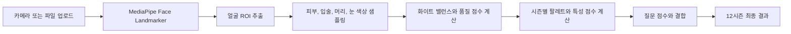
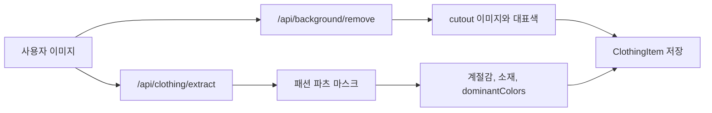
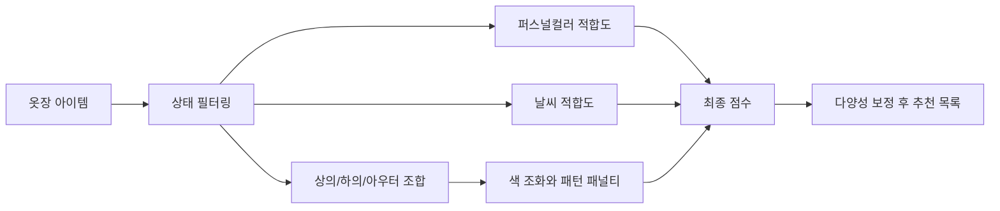

# 통합 퍼스널컬러 옷장 프로젝트 이해도.

## 1. 문서 기준.

이 문서는 기존 `이해도.md`를 먼저 읽은 뒤, 현재 `통합_퍼컬_옷장` 폴더의 실제 파일을 다시 훑어서 작성한 Codex 기준 이해도 문서다.

기준 시점은 2026-05-16 현재 로컬 작업 폴더다.

코드와 데이터가 기존 문서보다 많이 바뀌었을 가능성을 전제로, 과거 설명보다 현재 파일 내용을 우선했다.

직접 확인한 주요 범위는 다음과 같다.

| 구분 | 확인한 내용 |
| --- | --- |
| 기준 문서 | `이해도.md`, `README.md`, `PROJECT_FULL_ANALYSIS_AND_PLAN.md`, 관련 설계 문서 일부 |
| 앱 설정 | `package.json`, `vite.config.ts`, `tsconfig.json`, `.env.example` |
| React 진입점 | `src/main.tsx`, `src/App.tsx`, `src/index.css` |
| 퍼스널컬러 로직 | `src/types.ts`, `src/constants.ts`, `src/personalColorWorkbook.ts`, `src/seasonContent.ts`, `src/services/*`, `src/components/*` |
| 날씨 로직 | `src/lib/weather.ts`, `src/hooks/useWeather.ts` |
| 카탈로그 데이터 | `src/data/trainingCatalog.ts`, `src/data/outerCatalog.ts`, `public/catalog` |
| 서버 로직 | `server/background_remove_api.py`, `server/season_predictor.py`, `server/requirements.txt`, `server/artifacts/*` |
| 스크립트 | `scripts/generate_catalog_v2.py`, `scripts/dedup_catalog.py`, 기타 카탈로그 생성과 점검 스크립트 목록 |
| 작업 기록 | `checklist.md`, `context-notes.md`, `plan.md` |

`node_modules`, `dist`, `.claude/worktrees` 내부 대량 파일, 바이너리 이미지와 모델 파일 자체는 전체 본문을 읽는 방식으로 분석하지 않았다.

대신 이미지와 모델은 경로, 파일 수, 호출 코드, 산출물 메타데이터 기준으로 현재 구조에 반영했다.

## 2. 한 줄 이해.

이 프로젝트는 브라우저에서 12시즌 퍼스널컬러를 진단하고, 로컬 옷장과 대량 의류 카탈로그를 결합해 날씨와 색 조화 기반 코디를 추천하며, 추천 결과를 데일리룩 캔버스 이미지로 편집하고 저장하는 Vite React 앱이다.

서버는 별도 FastAPI 프로세스로 실행되며, 업로드 의류 이미지의 배경 제거, 패션 파츠 세그멘테이션, 계절감 예측 보조 정보를 제공한다.

현재 핵심은 단순 퍼스널컬러 진단 앱이 아니라 `진단 → 옷장/카탈로그 → 추천 → 데일리룩 제작`까지 이어지는 통합형 옷장 도구에 가깝다.

## 3. 실행 구조.

### 3.1 프론트엔드.

프론트엔드는 Vite 6, React 19, TypeScript, Tailwind CSS 4 기반이다.

`package.json` 기준 주요 명령은 다음과 같다.

| 명령 | 역할 |
| --- | --- |
| `npm run dev` | Vite 개발 서버를 `0.0.0.0:3000`으로 실행한다. |
| `npm run build` | TypeScript 빌드와 Vite 번들 생성을 실행한다. |
| `npm run preview` | 빌드 결과를 미리 본다. |
| `npm run lint` | 실제로는 ESLint가 아니라 `tsc --noEmit` 타입 검사를 실행한다. |
| `npm run dev:api` | FastAPI 서버를 `0.0.0.0:8001`로 실행한다. |

`vite.config.ts`는 `/api` 요청을 `http://127.0.0.1:8001`로 프록시한다.

따라서 브라우저 앱은 같은 origin의 `/api/background/remove`, `/api/clothing/extract`를 호출하지만, 실제 처리는 로컬 FastAPI 서버가 맡는다.

Cloudflare tunnel을 고려해 `.trycloudflare.com` 호스트가 허용되어 있고, HMR은 `DISABLE_HMR` 환경 변수로 끌 수 있다.

### 3.2 백엔드.

백엔드는 `server/background_remove_api.py` 하나가 FastAPI 앱을 제공한다.

주요 엔드포인트는 다음과 같다.

| 엔드포인트 | 역할 |
| --- | --- |
| `GET /api/health` | 서버 상태를 반환한다. |
| `POST /api/background/remove` | `rembg`의 `u2netp` 모델로 배경을 제거하고 PNG data URL, bbox, 대표색을 반환한다. |
| `POST /api/clothing/extract` | SegFormer 패션 세그멘테이션으로 의류 파츠를 추출하고 계절감, 소재 추정, 대표색을 반환한다. |

서버는 무거운 모델을 지연 로딩한다.

배경 제거는 `rembg` 세션을 처음 요청 시 생성하고, 패션 파츠 추출은 `sayeed99/segformer-b3-fashion` 모델을 처음 요청 시 로드한다.

`server/season_predictor.py`는 `server/artifacts`의 `season_model.joblib`, `feature_columns.json`, `label_mapping.json`을 사용해 계절 예측을 보조한다.

모델이나 의존성이 없으면 규칙 기반 fallback을 반환하도록 설계되어 있다.

## 4. 현재 앱 화면과 상태.

`src/App.tsx`가 거의 모든 앱 상태와 화면 렌더링을 가진 중심 파일이다.

현재 페이지 타입은 다음과 같다.

| Page 값 | 의미 |
| --- | --- |
| `home` | 시작 화면과 요약 진입점이다. |
| `personal` | 퍼스널컬러 진단과 결과 화면이다. |
| `wardrobe` | 옷장, 카탈로그, 업로드, 수동 등록 화면이다. |
| `recommend` | 코디 추천 화면이다. |
| `saved` | 저장한 코디 목록 화면이다. |
| `tryon` | 데일리룩 캔버스 편집 화면이다. |
| `settings` | 설정 화면이다. |

주요 로컬 저장 키는 다음과 같다.

| localStorage 키 | 저장 내용 |
| --- | --- |
| `integrated_personal_color_result` | 최신 퍼스널컬러 결과다. |
| `integrated_personal_color_history` | 진단 이력이다. |
| `integrated_wardrobes` | 사용자 옷장 목록이다. |
| `integrated_clothing_items` | 사용자 옷과 카탈로그에서 저장한 옷 목록이다. |
| `integrated_saved_outfits` | 저장한 추천 코디와 데일리룩 상태다. |

앱은 서버 DB 없이 브라우저 localStorage를 중심으로 개인 상태를 유지한다.

카탈로그 이미지와 데이터는 앱에 포함된 정적 리소스와 TypeScript 데이터 파일에서 온다.

## 5. 퍼스널컬러 진단.

### 5.1 질문 진단.

질문 데이터는 `src/constants.ts`의 `QUESTIONS`에 있다.

현재 실제 질문 수는 5개다.

질문 축은 `temperature`, `lightness`, `clarity`, `contrast` 네 가지다.

질문 컴포넌트는 `src/components/Questionnaire.tsx`가 담당한다.

일부 화면 문구나 오래된 문서에는 8문항 흐름이 남아 있을 수 있지만, 현재 코드 기준 진단 질문은 5문항이다.

### 5.2 사진 진단.

사진 분석은 `src/components/PhotoAnalyzer.tsx`, `src/services/faceLandmarker.ts`, `src/services/photoAnalysis.ts`, `src/services/geminiService.ts`로 나뉜다.

흐름은 다음과 같다.

Face Landmarker는 JSDelivr WASM과 Google 모델 asset을 사용한다.

GPU landmarker를 먼저 시도하고 실패하면 CPU landmarker로 fallback한다.

사진 ROI는 피부, 이마, 코, 눈 밑, 턱, 눈, 입술, 머리, 눈썹 등 15개 영역 중심으로 계산한다.

`photoAnalysis.ts`는 단순 평균이 아니라 밝기 trimming, Lab medoid, 입술 후보 필터링, 머리와 눈썹 혼합 같은 보정 로직을 사용한다.

사진 품질 점수는 노출, 좌우 대칭, 색 분리도, 얼굴 크기, 배경 안정성을 합산해 계산한다.

### 5.3 최종 시즌 산출.

12시즌 프로필과 24색 팔레트는 `src/personalColorWorkbook.ts`에 들어 있다.

결과 설명, 계열별 가이드, worst color 데이터는 `src/seasonContent.ts`가 가진다.

`src/services/geminiService.ts`는 이름과 달리 현재 Gemini API를 호출하지 않는다.

브라우저 안에서 질문 점수, 사진 feature, 팔레트 거리, 계절 특성 점수를 계산하는 규칙 기반 서비스다.

현재 결합 방식은 사진 품질에 따라 사진 가중치를 대략 22퍼센트에서 36퍼센트 사이로 두고, 나머지를 질문 점수로 둔다.

사진 시즌 점수는 팔레트 유사도 42퍼센트와 계절 특성 점수 58퍼센트를 섞는다.

주의할 점은 `geminiService.ts`의 사진 팔레트 점수는 아직 `deltaE2000`이 아니라 CIE76 계열의 `deltaE`를 사용한다는 것이다.

반면 옷 추천 쪽 색상 점수는 `App.tsx`에서 `deltaE2000`을 사용한다.

## 6. 옷장과 카탈로그.

### 6.1 도메인 모델.

옷장과 의류 모델은 별도 domain 파일이 아니라 `src/App.tsx` 안에 정의되어 있다.

핵심 타입은 `Wardrobe`, `ClothingItem`, `ClothingAnalysisMeta`, `ClothingColorAnalysis`, `ClothingSegmentationMeta`, `ScoredClothingItem`, `OutfitRecommendation`, `SavedOutfit`, `DailyLookState`다.

의류 카테고리는 현재 `상의`, `하의`, `아우터`, `신발`, `액세서리`를 사용한다.

데일리룩 배치 슬롯은 `outer`, `upper`, `lower`, `shoes`, `hat`, `bag`, `accessory`로 더 세분화되어 있다.

의류 상태는 `보유중`, `세탁중`, `보관중`, `추천제외`를 사용한다.

추천에서는 `세탁중`과 `추천제외`가 제외된다.

### 6.2 기본 옷장.

옷장이 비어 있으면 `INITIAL_WARDROBES`로 데모 성격의 3개 옷장을 만든다.

실제 의류 목록은 localStorage에 저장된 값을 우선 사용한다.

초기 카탈로그를 옷장에 넣을 때는 `fromCatalog(item, wardrobeId)`가 카탈로그 항목을 `ClothingItem`으로 변환한다.

### 6.3 카탈로그 데이터.

현재 앱에서 실제로 쓰는 카탈로그는 `ACTIVE_CATALOG_ITEMS = TRAINING_CATALOG_ITEMS`다.

`src/data/trainingCatalog.ts`는 기존 516개 의류 이미지와 2차 확장 344개 데이터를 기반으로 하며, 파일 끝에서 `OUTER_CATALOG_ITEMS`를 함께 펼친다.

`src/data/outerCatalog.ts`에는 아우터 30개가 따로 있다.

현재 파일 기준으로 확인한 대략의 카탈로그 상태는 다음과 같다.

| 항목 | 현재 확인값 |
| --- | --- |
| `trainingCatalog.ts`의 `catalogItemId` 선언 수 | 831개 |
| `outerCatalog.ts`의 `catalogItemId` 선언 수 | 30개 |
| 런타임 의도상 총량 | 861개 수준 |
| `public/catalog` 이미지 파일 수 | 860개 |
| 분류 literal 집계 총량 | 860개 |

여기에는 1개 차이가 있다.

실제 장애인지, 집계 방식 차이인지, 데이터와 이미지 중 하나가 누락된 것인지는 별도 점검이 필요하다.

카테고리 literal 집계는 다음과 같다.

| 카테고리 | 개수 |
| --- | ---: |
| 상의 | 582 |
| 하의 | 75 |
| 신발 | 47 |
| 액세서리 | 126 |
| 아우터 | 30 |

시즌 태그 literal 집계는 다음과 같다.

| 시즌 태그 | 개수 |
| --- | ---: |
| 봄/가을 | 382 |
| 여름 | 297 |
| 겨울 | 179 |
| 사계절 | 2 |

대표 이미지 폴더는 `public/catalog` 아래 `upper_top`, `upper_shirt`, `upper_sweater`, `upper_unknown`, `v2_lower_pants`, `v2_shoe_shoe`, `v2_belt_belt`, `v2_bag_bag`, `v2_outer_jacket`, `v2_outer_coat` 같은 형태로 나뉜다.

## 7. 의류 업로드와 이미지 처리.

수동 등록 화면은 사용자가 이미지, 카테고리, 색상, 패턴, 소재, 계절 태그, 상태를 입력하도록 한다.

이미지가 있으면 서버 호출을 통해 배경 제거와 세그멘테이션을 시도한다.

흐름은 다음과 같다.

배경 제거 결과는 `imageUrl`, `cutoutImageUrl`, `segmentation`, `dominantColors`, `representativeHex` 등으로 `ClothingItem`에 저장된다.

서버가 실패하거나 API가 없으면 클라이언트는 사용자가 입력한 값과 원본 이미지를 중심으로 저장할 수 있다.

`CUTOUT_VERSION`은 클라이언트와 서버 모두 `hard-alpha-v3`를 사용한다.

패션 세그멘테이션 정밀 cutout은 서버에서 `fashion-segformer-v1`로 표시된다.

## 8. 추천 알고리즘.

추천은 `src/App.tsx` 내부 함수들이 담당한다.

현재 자동 추천은 주로 상의, 하의, 선택적 아우터 조합으로 만든다.

신발과 액세서리는 카탈로그와 데일리룩 편집에는 들어오지만, 자동 추천 조합의 중심 요소는 아니다.

추천 흐름은 다음과 같다.

퍼스널컬러 적합도는 의류 dominant color 상위 3개를 중심으로 계산한다.

개별 색상은 추천 팔레트와의 `deltaE2000` 거리, worst color와의 거리, 중립색 또는 데님 보너스를 반영한다.

날씨 적합도는 Open-Meteo 기반 현재 기온 band와 의류 `weatherTags`를 비교한다.

사용자가 선택한 band와 한 단계 더 추운 band까지 허용하는 방식이다.

색 조화는 상의와 하의의 hue 차이, 중립색 여부, analogous, triadic, complementary, tension 계열을 고려한다.

그래픽과 패턴 조합에는 패널티가 붙는다.

현재 최종 추천 점수 가중치는 다음과 같다.

| 요소 | 가중치 |
| --- | ---: |
| 퍼스널컬러 적합도 | 38퍼센트 |
| 날씨 적합도 | 22퍼센트 |
| 색 조화 | 28퍼센트 |
| 안정성 | 12퍼센트 |

추천 결과는 상위 60개를 먼저 고른 뒤, 같은 아이템이 과도하게 반복되지 않도록 다양성 보정을 거친다.

## 9. 데일리룩 제작.

`tryon` 페이지는 이름과 달리 현재 실제 착장 합성보다 데일리룩 캔버스 편집기에 가깝다.

캔버스 기준 크기는 1080 x 1440이다.

사용자는 추천 코디에서 진입하거나, 저장된 코디를 다시 열어 편집할 수 있다.

데일리룩 레이어는 의류 레이어와 텍스트 레이어로 나뉜다.

의류 레이어는 `outer`, `upper`, `lower`, `shoes`, `hat`, `bag`, `accessory` 슬롯 프리셋을 기준으로 배치된다.

사용자는 옷장 아이템과 카탈로그 아이템을 추가하고, 위치, 크기, 회전, 순서를 조정할 수 있다.

저장 시에는 `DailyLookState`가 `SavedOutfit`에 같이 들어간다.

브라우저 canvas로 1080 x 1440 PNG data URL을 만들려고 시도하지만, 이미지 CORS 문제 등이 발생하면 이미지 생성 없이 레이아웃 상태만 저장할 수 있도록 예외 처리되어 있다.

## 10. 날씨 연동.

날씨는 `src/hooks/useWeather.ts`와 `src/lib/weather.ts`가 담당한다.

브라우저 위치 권한이 허용되면 현재 위치를 사용하고, 실패하면 서울 좌표를 기본값으로 사용한다.

데이터 소스는 Open-Meteo forecast, Open-Meteo air-quality, BigDataCloud reverse geocode다.

`WeatherSnapshot`은 현재 기온, 체감 기온, 강수 확률, 우산 조언, 미세먼지 상태, 최저/최고 기온, 날씨 band를 포함한다.

추천에서는 이 날씨 band가 `weatherTags`와 맞는지 확인해 날씨 점수에 반영된다.

## 11. 스크립트와 데이터 생성 흐름.

`scripts/generate_catalog_v2.py`는 외부 프로젝트의 이미지와 JSON 결과를 읽어 `public/catalog`로 PNG를 복사하고, `trainingCatalog.ts`에 카탈로그 엔트리를 붙이는 스크립트다.

이 스크립트는 현재 절대 경로를 포함한다.

따라서 다른 PC나 이동된 폴더에서는 바로 동작하지 않을 수 있다.

`scripts/dedup_catalog.py`는 현재 메인 소스가 아니라 `.claude/worktrees/priceless-lamarr-895d68` 아래 파일을 가리키는 하드코딩 경로를 가진다.

지금 메인 앱의 데이터 정리용으로 다시 쓰려면 경로를 현재 `src/data/trainingCatalog.ts`로 재확인해야 한다.

`generate_outer_catalog.py`, `find_outer_candidates.py`, `check_*` 계열 스크립트는 카탈로그 확장과 데이터 점검 흔적으로 보인다.

현재 앱 실행에 반드시 필요한 런타임 파일이라기보다, 카탈로그 구축과 검증을 위해 남아 있는 작업 도구에 가깝다.

## 12. 기존 이해도와 달라진 핵심.

기존 `이해도.md`의 큰 방향은 여전히 맞다.

하지만 현재 파일 기준으로 다음 차이가 중요하다.

| 항목 | 현재 기준 |
| --- | --- |
| 질문 수 | 코드 기준 5문항이다. 오래된 8문항 설명은 현재와 다르다. |
| 사진 분석 | MediaPipe ROI와 로컬 규칙 기반 점수 결합이 중심이다. Gemini API 호출은 현재 없다. |
| 카탈로그 | `trainingCatalog.ts`와 `outerCatalog.ts` 기반 대량 카탈로그가 핵심이다. |
| 추천 점수 | 현재 최종 가중치는 퍼스널컬러 38, 날씨 22, 조화 28, 안정성 12다. |
| 색상 거리 | 옷 추천은 `deltaE2000`을 쓰지만, 사진 시즌 팔레트 점수는 아직 CIE76 `deltaE`다. |
| 데일리룩 | 저장 코디의 후처리 화면이 아니라 카탈로그와 옷장 아이템을 섞어 배치하는 캔버스 편집기로 커졌다. |
| 서버 | 단순 배경 제거 서버가 아니라 패션 세그멘테이션과 시즌 예측 fallback까지 포함한다. |
| 데이터 생성 | 외부 이미지 모델 프로젝트 산출물을 가져와 카탈로그를 확장한 흔적이 강하다. |

## 13. 현재 위험과 불일치.

현재 바로 눈에 띄는 위험은 다음과 같다.

| 위치 | 내용 |
| --- | --- |
| `src/components/Questionnaire.tsx`와 문서류 | 8문항 문구 또는 과거 설명이 남아 있을 가능성이 있다. 실제 질문은 5개다. |
| `src/services/geminiService.ts` | 파일명은 Gemini지만 실제 API 호출은 없다. 오해를 부를 수 있다. |
| `src/services/geminiService.ts`와 `src/App.tsx` | 사진 팔레트 점수와 옷 추천 점수의 색상 거리 방식이 서로 다르다. |
| `public/catalog`와 `src/data/*Catalog.ts` | 이미지 파일 수와 데이터 선언 수에 1개 차이가 보인다. |
| `server/requirements.txt` | `season_predictor.py`가 쓰는 `joblib`, `pandas`, `scikit-learn`이 명시되어 있지 않다. |
| `scripts/dedup_catalog.py` | 현재 메인 폴더가 아니라 `.claude/worktrees` 경로를 바라본다. |
| `src/App.tsx`의 `reconcileStoredClothing` | 저장된 catalog source 중 `catalog-`로 시작하지 않는 `catalogItemId`는 로드 시 걸러질 수 있다. 새 v2 카탈로그 저장분과 정책이 맞는지 확인이 필요하다. |
| 오래된 한국어 문서와 터미널 출력 | 일부 파일명과 문서 내용은 mojibake 상태로 보인다. 안정 식별자는 경로, 함수명, storage key, 타입명이다. |

이 항목들은 지금 당장 모두 버그라고 단정할 수는 없다.

다만 다음 수정이나 발표 자료를 만들 때 먼저 확인해야 하는 지점이다.

## 14. 현재 프로젝트를 다시 설명한다면.

이 앱은 세 층으로 나뉜다.

첫째, `PhotoAnalyzer`와 `Questionnaire`가 사용자의 퍼스널컬러 근거를 만든다.

둘째, `App.tsx`의 옷장 상태와 대량 카탈로그가 추천 가능한 의류 풀을 만든다.

셋째, 추천 알고리즘과 데일리룩 편집기가 의류 조합을 사용자가 저장하고 다시 편집할 수 있는 결과물로 바꾼다.

서버는 이 흐름에서 업로드 의류 이미지를 앱이 다룰 수 있는 형태로 정제하는 보조 엔진이다.

따라서 앞으로 확장하려면 단순 UI 추가보다 다음 경계를 먼저 정리하는 편이 중요하다.

| 경계 | 정리 이유 |
| --- | --- |
| `App.tsx` 도메인 타입 분리 | 추천, 옷장, 데일리룩 로직이 한 파일에 몰려 있어 변경 위험이 크다. |
| 카탈로그 데이터 검증 | 데이터 수, 이미지 수, 계절 태그, 카테고리 분포를 자동 점검해야 한다. |
| 서버 의존성 명시 | ML fallback과 실제 모델 추론 환경을 재현 가능하게 해야 한다. |
| Gemini 명칭 정리 | 현재 규칙 기반 로직과 외부 AI 호출 여부를 명확히 분리해야 한다. |
| 추천 조합 범위 확장 | 신발과 액세서리는 데이터에 있지만 자동 추천 조합에는 아직 핵심으로 들어오지 않는다. |
| 저장소 구조 분리 | localStorage는 MVP에는 충분하지만 사용자 이미지와 대량 카탈로그가 계속 늘면 DB와 object storage 경계가 필요하다. |

현재 코드는 이미 퍼스널컬러 진단 앱의 범위를 넘어섰다.

이제는 옷장 데이터, 카탈로그 데이터, 이미지 분석 서버, 추천 엔진, 데일리룩 제작기를 가진 통합 스타일링 도구로 보는 것이 더 정확하다.

