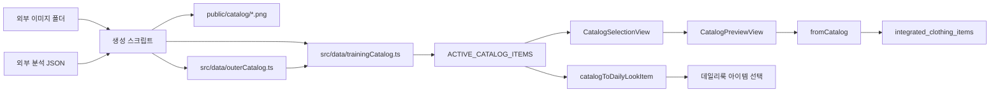

# 카탈로그 데이터 아키텍처.

## 1. 결론.

이 프로젝트의 카탈로그는 브라우저에서 JSON 파일을 직접 읽어 렌더링하는 구조가 아니다.

외부 이미지 분석 프로젝트에서 만들어진 JSON 결과와 PNG 이미지를 Python 스크립트가 읽고, 앱 안에서 바로 import 가능한 TypeScript 상수 파일과 `public/catalog` 정적 이미지로 변환해 둔 구조다.

React 앱은 실행 중에 `src/data/trainingCatalog.ts`와 `src/data/outerCatalog.ts`를 import하고, 각 아이템의 `imageUrl`이 가리키는 `/catalog/*.png` 파일을 브라우저에 보여준다.

현재 검증 스크립트 기준 카탈로그 아이템은 860개이고, `public/catalog` PNG 파일도 860개이며, 검증 이슈는 0건이다.

## 2. 전체 흐름.



중요한 점은 원본 JSON이 런타임 데이터베이스 역할을 하지 않는다는 것이다.

원본 JSON은 카탈로그를 생성할 때 읽히는 입력물이고, 앱에서 실제로 소비하는 데이터는 TypeScript 파일이다.

## 3. 현재 런타임 데이터 파일.

### 3.1 `src/data/trainingCatalog.ts`.

이 파일이 현재 카탈로그의 본체다.

파일 첫 줄 설명에 따르면 퍼스널컬러 ML 모델 학습에 사용된 516개 의류 이미지와 2차 확장 344개 데이터를 합친 카탈로그다.

현재 `CatalogItem` 인터페이스도 이 파일 안에 정의되어 있다.

핵심 필드는 다음과 같다.

| 필드 | 의미 |
| --- | --- |
| `catalogItemId` | 카탈로그 내부 고유 ID다. 예시는 `upper_shirt_001`, `v2_bag_bag_001`이다. |
| `name` | 화면에 보일 수 있는 기본 이름이다. 대체로 `상의 셔츠`, `액세서리 가방` 같은 형식이다. |
| `category` | 대분류다. `상의`, `하의`, `아우터`, `신발`, `액세서리` 중 하나다. |
| `subcategory` | 소분류다. `셔츠`, `스웨터`, `바지`, `가방`, `시계` 같은 값이다. |
| `imageUrl` | 브라우저가 불러올 정적 이미지 경로다. `/catalog/파일명.png` 형식이다. |
| `representativeHex` | 대표 색상 HEX 값이다. 추천 점수와 색상 표시에서 사용된다. |
| `dominantColors` | 주요 색상 배열이다. 각 원소는 `hex`, `ratio`를 가진다. |
| `seasonTag` | 카탈로그 생성 단계에서 붙은 시즌 태그다. `봄/가을`, `여름`, `겨울`, `사계절` 등이 있다. |
| `patternType` | 패턴 유형이다. 현재 생성 데이터는 대부분 `solid`다. |
| `material` | 소재 추정값이다. 현재 생성 데이터는 대부분 `unknown`이다. |
| `isNeutral` | 중립색 여부다. |
| `isDenim` | 데님 여부다. |
| `sourceType` | 카탈로그 출처 표시다. 항상 `catalog`다. |

`trainingCatalog.ts`는 끝에서 `...OUTER_CATALOG_ITEMS`를 펼쳐 넣는다.

따라서 실제 앱에서 쓰는 `TRAINING_CATALOG_ITEMS`에는 `outerCatalog.ts`의 아우터 30개도 포함된다.

### 3.2 `src/data/outerCatalog.ts`.

이 파일은 2차 확장 아우터 데이터만 따로 가진다.

현재 구성은 재킷 24개와 코트 6개다.

아우터를 별도 파일로 분리한 이유는 생성과 관리 단계에서 아우터 데이터가 뒤늦게 추가되었기 때문으로 보인다.

런타임에서는 `trainingCatalog.ts`가 이 파일을 import해서 하나의 배열로 합친다.

### 3.3 `public/catalog`.

이 폴더는 브라우저가 실제로 이미지를 가져가는 정적 이미지 저장소다.

Vite 기준 `public` 폴더 아래 파일은 빌드 후 루트 경로에서 제공된다.

그래서 `imageUrl: "/catalog/upper_shirt_001.png"`는 브라우저에서 `/catalog/upper_shirt_001.png`로 요청된다.

현재 검증 결과 PNG는 860개다.

`gallery.html`도 이 폴더에 있으며, `scripts/generate_gallery.py`가 생성하는 정적 갤러리 확인용 파일이다.

앱 본체 렌더링에는 `gallery.html`이 필요하지 않다.

## 4. 현재 데이터 분포.

`scripts/validate_catalog.py` 실행 결과는 다음과 같다.

| 항목 | 값 |
| --- | ---: |
| 총 카탈로그 아이템 | 860개 |
| `public/catalog` PNG | 860개 |
| 검증 이슈 | 0건 |
| 소분류 종류 | 17개 |

카테고리 분포는 다음과 같다.

| 카테고리 | 개수 |
| --- | ---: |
| 상의 | 582 |
| 액세서리 | 126 |
| 하의 | 75 |
| 신발 | 47 |
| 아우터 | 30 |

시즌 태그 분포는 다음과 같다.

| 시즌 태그 | 개수 |
| --- | ---: |
| 봄/가을 | 382 |
| 여름 | 297 |
| 겨울 | 179 |
| 사계절 | 2 |

## 5. JSON 파일의 역할.

이 프로젝트 안에는 원본 분석 JSON 파일이 대량으로 들어와 있지 않다.

JSON은 주로 외부 폴더에 있고, `scripts/generate_catalog.py`, `scripts/generate_catalog_v2.py`, `scripts/generate_outer_catalog.py`가 그 JSON을 읽어 TypeScript 카탈로그로 변환한다.

생성 스크립트가 기대하는 JSON 구조는 대략 다음과 같다.

```json
{
  "id": "upper_shirt_001",
  "part": "upper",
  "fine_labels": ["shirt, blouse"],
  "colors": [
    { "hex": "#282733", "ratio": 0.4909 },
    { "hex": "#766D6C", "ratio": 0.3886 }
  ],
  "human_label": "봄/가을",
  "season": "봄/가을",
  "source_file": "upper_shirt_001.png"
}
```

각 필드의 변환 방식은 다음과 같다.

| JSON 필드 | 변환 결과 |
| --- | --- |
| `id` | `catalogItemId`가 된다. 2차 데이터는 앞에 `v2_`가 붙는다. |
| `part` | `category`로 매핑된다. 예시는 `upper`에서 `상의`, `shoe`에서 `신발`이다. |
| `fine_labels[0]` | `subcategory`로 매핑된다. 예시는 `shirt, blouse`에서 `셔츠`다. |
| `colors[0].hex` | `representativeHex`, `representativeColor`, `color`가 된다. |
| `colors.slice(0, 3)` | `dominantColors`가 된다. |
| `human_label` | 우선 시즌 태그로 사용된다. |
| `season` | `human_label`이 없을 때 fallback 시즌 태그로 사용된다. |
| `source_file` | 원본 PNG 파일명과 매칭하는 기준이다. |

즉 JSON은 분석 결과의 원천이고, TypeScript 파일은 앱이 사용하는 정규화된 카탈로그 스냅샷이다.

## 6. 생성 스크립트 구조.

### 6.1 `scripts/generate_catalog.py`.

초기 학습 이미지 516개를 대상으로 한 생성 스크립트다.

외부 `RESULT_DIR`의 JSON 파일과 `IMG_SRC_DIR`의 PNG 파일을 매칭한다.

매칭 기준은 JSON의 `source_file`에서 꺼낸 파일명이다.

성공하면 이미지는 `public/catalog`로 복사되고, `trainingCatalog.ts`가 생성된다.

현재 스크립트 내부 경로와 일부 주석은 mojibake 상태로 보이지만, 동작 구조는 `JSON 읽기 → 이미지 복사 → TypeScript 라인 생성`이다.

### 6.2 `scripts/generate_catalog_v2.py`.

2차 확장 데이터를 추가하는 스크립트다.

하위 폴더를 순회하며 `*_json` 폴더를 찾고, 같은 폴더의 PNG와 JSON을 매칭한다.

새 ID에는 `v2_` 접두사가 붙는다.

이 스크립트는 기존 `trainingCatalog.ts`의 끝부분 `];` 앞에 새 항목 라인을 삽입한다.

### 6.3 `scripts/generate_outer_catalog.py`.

2차 확장 중 아우터 cropped 폴더를 대상으로 하는 스크립트다.

기존 `catalogItemId`를 먼저 읽어서 중복을 건너뛰는 로직이 있다.

현재 최종 아우터 데이터는 별도 `outerCatalog.ts`로 분리되어 있으므로, 이 스크립트를 다시 실행할 때는 실제 출력 대상이 현재 구조와 맞는지 먼저 확인해야 한다.

### 6.4 `scripts/validate_catalog.py`.

현재 카탈로그의 상태를 확인하는 검증 스크립트다.

`trainingCatalog.ts`와 `outerCatalog.ts`에서 `catalogItemId`, `category`, `subcategory`, `seasonTag`, `imageUrl`, `representativeHex`를 파싱한다.

이후 중복 ID, 비어 있는 필드, 이미지 파일 존재 여부, 카테고리 분포, 시즌 태그 분포를 출력한다.

현재 실행 결과는 이슈 0건이다.

### 6.5 `scripts/generate_gallery.py`.

카탈로그 확인용 정적 HTML을 만드는 스크립트다.

`trainingCatalog.ts`와 `outerCatalog.ts`를 파싱해 `public/catalog/gallery.html`을 만든다.

이 파일은 개발자가 이미지와 메타데이터를 빠르게 훑기 위한 보조 산출물이다.

### 6.6 주의할 스크립트.

`scripts/dedup_catalog.py`는 현재 메인 `src/data/trainingCatalog.ts`가 아니라 `.claude/worktrees/priceless-lamarr-895d68` 아래 파일을 가리킨다.

현재 메인 데이터 정리에 바로 사용하면 안 된다.

`scripts/check_categories.py`, `scripts/check_subcats.py`, `scripts/check_main_dups.py`는 카탈로그 분포와 중복 점검용 보조 스크립트다.

## 7. React 앱에서 보이는 로직.

### 7.1 import 지점.

`src/App.tsx`는 다음 데이터를 import한다.

```ts
import { TRAINING_CATALOG_ITEMS } from './data/trainingCatalog';
import type { CatalogItem } from './data/trainingCatalog';
```

그리고 현재 실제 사용 배열을 다음처럼 고정한다.

```ts
const ACTIVE_CATALOG_ITEMS = TRAINING_CATALOG_ITEMS;
```

예전에 수동 샘플용 `INITIAL_CATALOG_ITEMS`가 남아 있지만, 현재 화면에 쓰이는 것은 `ACTIVE_CATALOG_ITEMS`다.

### 7.2 카탈로그 선택 화면.

카탈로그는 `CatalogSelectionView`에서 보인다.

상위 상태에서 먼저 `filteredCatalog`를 만든다.

```ts
const filteredCatalog =
  catalogCategory === '전체'
    ? ACTIVE_CATALOG_ITEMS
    : ACTIVE_CATALOG_ITEMS.filter((item) => item.category === catalogCategory);
```

이후 `CatalogSelectionView` 내부에서 소분류와 시즌 pill 필터가 한 번 더 적용된다.

```ts
const displayItems = props.catalogItems
  .filter((i) => subcat === '전체' || i.subcategory === subcat)
  .filter((i) => season === '전체' || i.seasonTag.includes(season));
```

화면 카드는 `displayItems.map`으로 렌더링된다.

이미지는 `item.imageUrl`을 그대로 ``에 넣는다.

따라서 이미지가 보이려면 TypeScript 데이터의 `imageUrl`과 `public/catalog`의 파일명이 정확히 맞아야 한다.

### 7.3 선택 상태.

사용자가 카드를 누르면 `selectedCatalogIds`에 `catalogItemId`가 들어간다.

다시 누르면 제거된다.

선택 완료 버튼을 누르면 `CatalogPreviewView`로 넘어간다.

### 7.4 미리보기 화면.

`CatalogPreviewView`는 선택된 항목을 카테고리별로 묶어 보여준다.

여기서 새 옷장을 만들지, 기존 옷장에 추가할지 결정한다.

실제 저장은 `onSaveCatalog`로 전달된 `saveCatalogSelection`이 한다.

## 8. 카탈로그가 옷장 데이터로 바뀌는 방식.

카탈로그 원본은 읽기 전용 상품 데이터에 가깝다.

사용자가 옷장에 담으면 `fromCatalog(item, wardrobeId)`가 `CatalogItem`을 `ClothingItem`으로 복사한다.

주요 변환은 다음과 같다.

| CatalogItem | ClothingItem |
| --- | --- |
| `catalogItemId` | 그대로 유지된다. |
| `imageUrl` | 그대로 복사된다. |
| `category` | 그대로 복사된다. |
| `subcategory` | `type`으로 들어간다. |
| `representativeHex` | 그대로 복사된다. |
| `dominantColors` | 그대로 복사된다. |
| `seasonTag` | 그대로 복사된다. |
| `sourceType` | `catalog`로 유지된다. |
| 없음 | `id`가 `c-${wardrobeId}-${catalogItemId}`로 새로 생긴다. |
| 없음 | `wardrobeId`가 붙는다. |
| 없음 | `availabilityStatus`가 `보유중`으로 들어간다. |
| 없음 | `createdAt`이 현재 시각으로 들어간다. |

이 설계 때문에 같은 카탈로그 항목이라도 서로 다른 옷장에 들어가면 다른 `ClothingItem.id`를 갖는다.

삭제, 상태 변경, 추천 제외 같은 사용자별 행위는 `ClothingItem` 단위로 처리된다.

저장 위치는 localStorage의 `integrated_clothing_items`다.

## 9. 저장된 카탈로그 데이터 동기화.

앱 시작 시 localStorage에서 의류를 읽은 뒤 `reconcileStoredClothing`이 카탈로그 메타데이터를 최신 값으로 맞춘다.

의도는 이미지 경로, 대표색, 카테고리, 시즌 태그 등이 카탈로그 파일에서 바뀌어도 기존 사용자의 옷장 데이터가 최신 기준을 따르도록 하는 것이다.

다만 현재 코드에는 주의할 점이 있다.

```ts
.filter((item) => item.sourceType !== 'catalog' || item.catalogItemId?.startsWith('catalog-'))
```

이 필터는 `sourceType`이 `catalog`인 항목 중 `catalogItemId`가 `catalog-`로 시작하는 항목만 통과시킨다.

현재 대량 카탈로그 ID는 `upper_shirt_001`, `v2_bag_bag_001`처럼 `catalog-`로 시작하지 않는다.

따라서 저장된 v2 카탈로그 항목이 앱 재시작 후 유지되어야 하는 정책이라면 이 부분은 재확인이 필요하다.

이 문서는 현황 설명 문서이므로 코드는 수정하지 않았다.

## 10. 데일리룩에서 쓰이는 방식.

데일리룩 아이템 풀은 옷장 점수화 아이템과 카탈로그 전체를 합쳐 만든다.

```ts
const dailyLookSourceItems = useMemo(
  () => [...scoredItems, ...ACTIVE_CATALOG_ITEMS.map(catalogToDailyLookItem)],
  [scoredItems]
);
```

`catalogToDailyLookItem`은 카탈로그 항목을 임시 `ScoredClothingItem`으로 바꾼다.

이때 `wardrobeId`는 `catalog-dailylook`이고, `id`는 `catalog-dailylook-${catalogItemId}`다.

즉 데일리룩 편집기는 카탈로그를 옷장에 저장하지 않아도 직접 불러와 배치할 수 있다.

추천 알고리즘에 들어가는 자동 코디 후보와 데일리룩 편집기의 선택 풀은 다르다.

자동 추천은 사용자가 옷장에 담은 `clothingItems` 중심이고, 데일리룩 편집은 카탈로그 전체도 직접 선택할 수 있다.

## 11. 추천에서 쓰이는 방식.

추천에 들어가는 기본 배열은 `scoredItems`다.

`scoredItems`는 localStorage에 저장된 `clothingItems`를 퍼스널컬러 기준으로 점수화한 결과다.

따라서 카탈로그 항목은 사용자가 옷장에 담아 `ClothingItem`으로 저장된 뒤에 추천 대상이 된다.

추천 점수에는 카탈로그에서 복사된 `representativeHex`, `dominantColors`, `seasonTag`, `category`, `type`, `material`, `isNeutral`, `isDenim` 등이 사용된다.

카탈로그의 대표색과 dominant color가 부정확하면 퍼스널컬러 점수와 색 조화 점수도 같이 흔들린다.

## 12. 파일별 역할 요약.

| 파일 또는 폴더 | 역할 |
| --- | --- |
| `src/data/trainingCatalog.ts` | 앱이 import하는 메인 카탈로그 데이터와 `CatalogItem` 타입이다. |
| `src/data/outerCatalog.ts` | 아우터 30개 별도 데이터다. `trainingCatalog.ts`가 합쳐서 export한다. |
| `public/catalog/*.png` | 브라우저가 실제로 보여주는 정적 의류 이미지다. |
| `public/catalog/gallery.html` | 개발 확인용 정적 갤러리다. 앱 필수 파일은 아니다. |
| `scripts/generate_catalog.py` | 초기 학습 JSON과 이미지를 카탈로그 TS와 PNG로 변환한다. |
| `scripts/generate_catalog_v2.py` | 2차 확장 JSON과 이미지를 기존 카탈로그에 추가한다. |
| `scripts/generate_outer_catalog.py` | 아우터 확장 데이터를 추가하기 위한 스크립트다. 현재 구조와 출력 대상 확인이 필요하다. |
| `scripts/validate_catalog.py` | TS 데이터와 PNG 파일 매칭, 분포, 중복, 누락을 검증한다. |
| `scripts/generate_gallery.py` | 카탈로그 확인용 HTML 갤러리를 만든다. |
| `src/App.tsx` | 카탈로그 표시, 선택, 미리보기, 옷장 저장, 데일리룩 사용을 모두 처리한다. |

## 13. 앞으로 수정할 때의 원칙.

카탈로그를 추가할 때는 JSON만 넣으면 앱에 보이지 않는다.

반드시 TypeScript 카탈로그와 `public/catalog` 이미지까지 생성되어야 한다.

새 데이터 추가 후에는 `scripts/validate_catalog.py`를 실행해 아이템 수, PNG 수, 누락 이미지, 중복 ID를 확인해야 한다.

카탈로그 ID는 저장 데이터의 연결 키이므로 변경하면 기존 localStorage 옷장 항목과 연결이 끊길 수 있다.

이미지 파일명과 `imageUrl`은 항상 같이 움직여야 한다.

카테고리와 소분류는 화면 필터, 추천 조합, 데일리룩 슬롯 판단에 영향을 준다.

대표색과 `dominantColors`는 퍼스널컬러 추천 품질에 직접 영향을 준다.

현재 구조는 로컬 MVP에는 단순하고 빠르지만, 카탈로그가 더 커지면 TypeScript 파일이 지나치게 커질 수 있다.

장기적으로는 이미지 저장소, 메타데이터 저장소, 분석 결과 저장소, 추천용 feature 저장소를 분리하는 편이 낫다.

