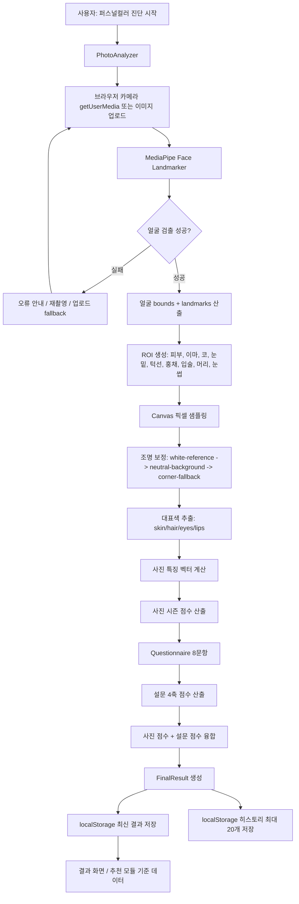
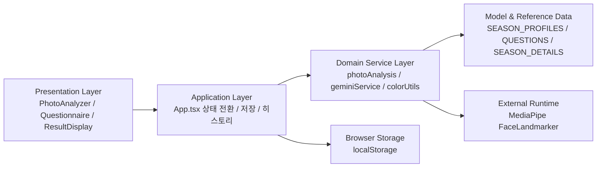
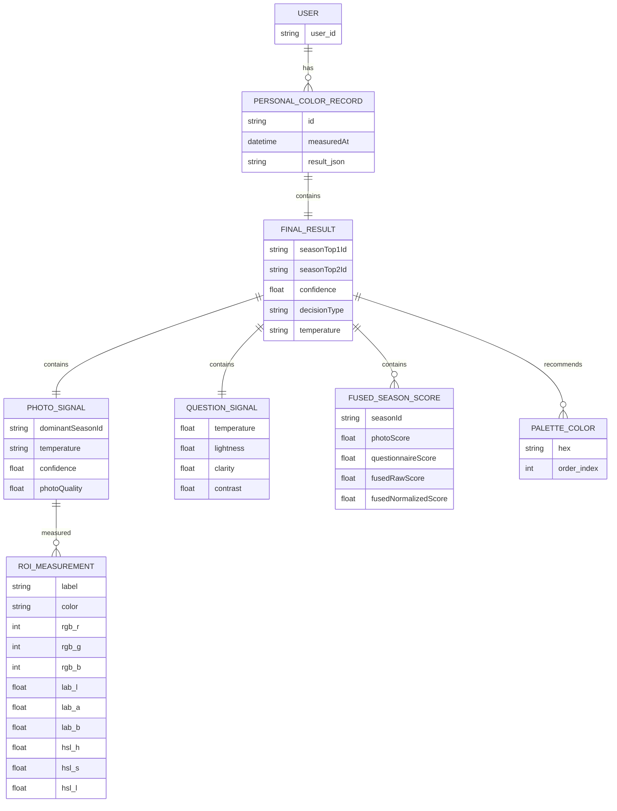
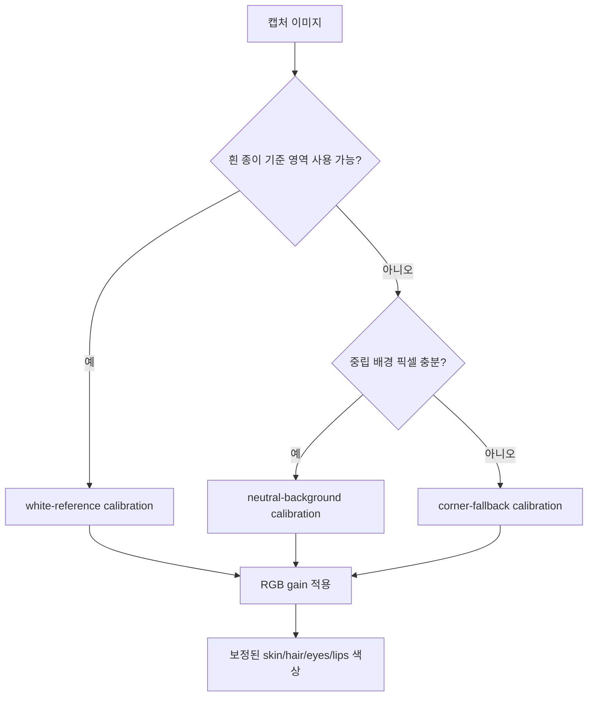
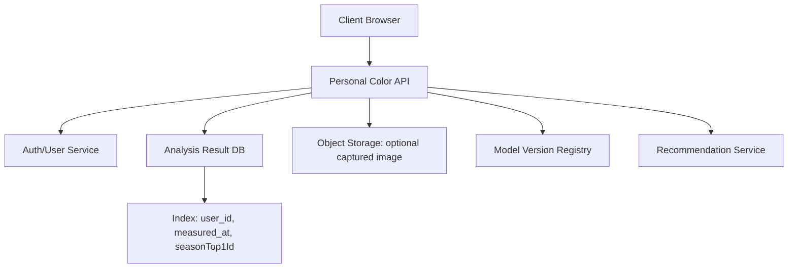
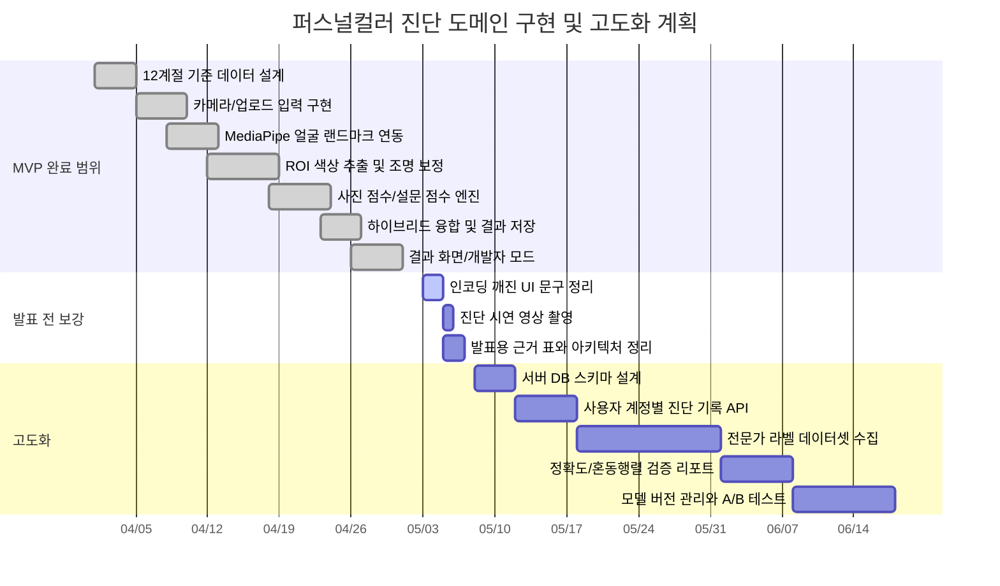

# 퍼스널 컬러 진단 도메인 상세 분석 보고서

## 0. 문서 목적

이 문서는 `통합_퍼컬_옷장` 프로젝트에서 **퍼스널컬러 진단 도메인**만을 대상으로 한다. 옷장, 날씨, 추천, 데일리룩 편집 기능은 퍼스널컬러 결과를 소비하는 후속 모듈이므로 필요한 연결 지점만 언급하고, 본문은 사진 기반 얼굴 색상 분석, 설문 기반 보정, 12계절 판정, 결과 저장 구조, 진단 데이터의 재사용 흐름에 집중한다.

분석 기준은 다음 4가지다.

1. 데이터 처리 및 아키텍처: 단순 CRUD를 넘어 캐싱, 인덱싱, 동시성 제어, 대용량 처리 관점, 시스템 구성도 포함
2. 핵심 로직의 독창성 및 난이도: 복사 코드가 아닌 자체 판정 로직, 오픈소스 활용 및 커스터마이징 근거
3. 문제 정의 및 분석: 기존 퍼스널컬러 서비스의 한계와 본 시스템이 해결하려는 기술적 문제
4. 구현 가능성 및 계획: 현재 MVP 상태, WBS, 간트 차트, 향후 고도화 계획

## 1. 도메인 문제 정의

### 1.1 타겟 사용자

이 시스템의 타겟 사용자는 다음과 같다.

- 전문 컨설팅샵 방문 없이 웹에서 1차 퍼스널컬러를 확인하고 싶은 사용자
- 단순히 "웜톤/쿨톤"이 아니라 실제 옷 색상 추천까지 이어지는 결과가 필요한 사용자
- 모바일 카메라 또는 업로드 사진으로 빠르게 진단하고 싶은 사용자
- 진단 결과를 옷장/추천 시스템의 기준 데이터로 저장해 반복적으로 활용하려는 사용자

### 1.2 기존 서비스의 문제점

일반적인 퍼스널컬러 웹 진단은 크게 두 부류로 나뉜다.

첫째, 설문형 진단이다. 혈관 색, 액세서리 반응, 햇빛 반응, 선호 색을 묻고 결과를 낸다. 구현은 쉽지만 사용자의 기억과 주관에 크게 의존한다. 같은 사용자가 다른 날 답하면 결과가 달라질 수 있고, 실제 얼굴 색상 데이터가 없어서 진단 근거가 약하다.

둘째, 사진 업로드형 진단이다. 얼굴 사진에서 평균 색을 뽑아 웜/쿨을 판정한다. 하지만 카메라 조명, 화이트밸런스, 배경색, 그림자, 얼굴 위치, 입술/머리카락 샘플링 오류에 취약하다. 특히 단순 평균 RGB만 쓰면 조명이 노랗거나 푸른 환경에서 결과가 쉽게 틀어진다.

본 프로젝트의 퍼스널컬러 도메인은 이 두 방식의 한계를 함께 다룬다.

- 사진만 믿지 않고 설문을 함께 반영한다.
- 설문만 믿지 않고 실제 얼굴 ROI 색상 데이터를 추출한다.
- RGB 평균만 쓰지 않고 HSL, LAB, Delta E, 명도, 채도, 대비, 뮤트 점수를 함께 계산한다.
- 단순 4계절이 아니라 12계절 세부 시즌까지 분류한다.
- 결과를 localStorage에 저장해 옷장 추천의 기준 데이터로 재사용한다.

## 2. 실제 코드 기준 기술 스택

| 영역 | 사용 기술 | 실제 역할 |
| --- | --- | --- |
| 프론트엔드 | React 19, TypeScript, Vite 6 | 전체 SPA, 진단 단계 상태 전환, 결과 렌더링 |
| UI | Tailwind CSS 4, shadcn 계열 컴포넌트, lucide-react | 카드, 버튼, 진행률, 다이얼로그, 아이콘 UI |
| 애니메이션 | motion, canvas-confetti | 설문 전환, 결과 화면 효과 |
| 얼굴 인식 | `@mediapipe/tasks-vision` Face Landmarker | 얼굴 랜드마크 검출, 얼굴 박스 산출, ROI 기준점 제공 |
| 이미지 처리 | Browser Canvas API | 카메라 프레임 캡처, 픽셀 샘플링, ROI 색상 추출 |
| 색상 수학 | 자체 `colorUtils.ts` | RGB/HSL/LAB 변환, Delta E 거리, 색온도 지수, 휘도 계산 |
| 진단 모델 | 자체 TypeScript 룰 엔진 | 사진 점수, 설문 점수, 12계절 융합 판정 |
| 기준 데이터 | `personalColorWorkbook.ts`, xlsx 원본 | 12계절별 traits, 팔레트, 평균 RGB/명도/채도/온도/대비 |
| 저장소 | Browser localStorage | 최신 결과, 최대 20개 진단 히스토리 저장 |

중요한 점은 파일명이 `geminiService.ts`이지만 현재 핵심 판정은 외부 Gemini API 호출이 아니라 **로컬 TypeScript 계산 로직**으로 수행된다는 것이다. 즉 네트워크 AI 의존도가 아니라 브라우저 내 색상 분석과 룰 기반 융합 모델이 핵심이다.

## 3. 퍼스널컬러 도메인 파일 구조

```text
통합_퍼컬_옷장/
  src/
    App.tsx
      - 퍼스널컬러 진단 단계 전환
      - 최종 결과와 히스토리 localStorage 저장
      - 저장된 퍼스널컬러를 추천 모듈에 전달

    types.ts
      - SeasonId, SeasonProfile
      - PhotoAnalysisResult
      - QuestionnaireScores
      - FinalResult
      - MeasurementDetails

    constants.ts
      - 8개 설문 문항
      - 문항별 temperature/lightness/clarity/contrast 가중치

    personalColorWorkbook.ts
      - 12계절 시즌 정의
      - 시즌별 traits
      - 시즌별 workbookStats
      - 시즌별 24색 팔레트

    seasonContent.ts
      - 결과 화면 설명 문구
      - 계절별 인접 시즌
      - 추천 색상/피해야 할 색상 설명

    components/
      PhotoAnalyzer.tsx
        - 카메라 시작
        - MediaPipe 모델 로딩
        - 실시간 얼굴 추적
        - 3초 자동 촬영
        - 이미지 업로드 fallback
        - 사진 분석 호출

      Questionnaire.tsx
        - 8문항 설문 UI
        - 응답 수집
        - 설문 점수 계산 호출

      ResultDisplay.tsx
        - 최종 결과 표시
        - 측정 데이터 상세
        - 개발자 모드 점수 추적

    services/
      faceLandmarker.ts
        - MediaPipe FaceLandmarker 싱글턴 캐싱
        - GPU 우선, CPU fallback
        - 얼굴 박스와 landmark 반환

      photoAnalysis.ts
        - 얼굴 landmark 기반 ROI 생성
        - 흰 종이/배경 기반 조명 보정
        - 픽셀 샘플링, 이상치 제거
        - 피부/머리/홍채/입술 대표색 추출
        - 사진 품질 점수 계산

      geminiService.ts
        - 사진 특징 벡터 계산
        - 팔레트 LAB 거리 점수
        - 설문 점수 계산
        - 사진+설문 하이브리드 융합
        - 최종 12계절 결과 생성

      colorUtils.ts
        - RGB, HSL, LAB 변환
        - Delta E
        - luminance
        - colorTemperatureIndex
```

## 4. 시스템 아키텍처

### 4.1 전체 흐름도



### 4.2 레이어 아키텍처



이 구조의 장점은 UI와 판정 로직이 분리되어 있다는 점이다. `PhotoAnalyzer.tsx`는 카메라와 사용자 흐름을 담당하고, 실제 색상 추출은 `photoAnalysis.ts`, 최종 시즌 판정은 `geminiService.ts`가 담당한다. 따라서 추후 서버 API, 모바일 앱, 다른 UI로 옮겨도 도메인 로직을 비교적 독립적으로 재사용할 수 있다.

## 5. 데이터베이스 및 저장 구조

### 5.1 현재 저장 방식

현재 프로젝트는 별도 RDBMS나 서버 DB를 쓰지 않고, 브라우저 `localStorage`를 데이터 저장소로 사용한다. 퍼스널컬러 도메인에서 직접 사용하는 키는 다음 2개다.

| localStorage key | 저장 대상 | 구조 |
| --- | --- | --- |
| `integrated_personal_color_result` | 현재 적용 중인 최신 퍼스널컬러 결과 | `FinalResult` 단일 객체 |
| `integrated_personal_color_history` | 진단 히스토리 | `PersonalColorRecord[]`, 최대 20개 |

`App.tsx` 기준 저장 구조는 다음과 같다.

```ts
interface PersonalColorRecord {
  id: string;
  measuredAt: string;
  result: FinalResult;
}
```

최종 설문 완료 시 실행되는 흐름은 다음과 같다.

```text
completeQuestionnaire(scores, rawResponses)
  -> fuseResults(photoData, scores, rawResponses)
  -> record = { id: "pc-" + Date.now(), measuredAt: ISO timestamp, result }
  -> nextHistory = [record, ...personalColorHistory].slice(0, 20)
  -> localStorage["integrated_personal_color_result"] = result
  -> localStorage["integrated_personal_color_history"] = nextHistory
```

### 5.2 논리 ERD

현재는 localStorage 기반이지만, 도메인 모델을 DB 관점으로 보면 다음과 같다.



### 5.3 `FinalResult` 핵심 필드

`FinalResult`는 퍼스널컬러 도메인의 최종 산출물이며, 추천 모듈이 소비하는 기준 데이터다.

| 필드 | 의미 |
| --- | --- |
| `temperature` | 최종 웜/쿨 |
| `seasonTop1Id` | 최종 1순위 12계절 ID |
| `seasonTop1` | 최종 1순위 한글명 |
| `seasonTop2Id` | 2순위 시즌 ID |
| `confidence` | 최종 신뢰도 |
| `decisionType` | 현재는 `hybrid` |
| `evidence.photoSignal` | 사진 기반 1순위, 온도감, 사진 신뢰도 |
| `evidence.questionSignal` | 설문 기반 온도감, 선명도, 설문 신호 |
| `evidence.fusionWeights` | 사진/설문 융합 비율 |
| `evidence.boundary` | 1위와 2위 차이가 작을 때 경계 시즌 안내 |
| `recommendationFeatures` | 옷 추천에 필요한 온도감/선명도/명도/대비 |
| `palette` | 최종 시즌 추천 팔레트 |
| `extractedColors` | 사진에서 추출한 피부/머리/눈/입술 색 |
| `debug` | 개발자 모드용 설문 점수, 융합 점수, 원본 응답 |

### 5.4 캐싱과 인덱싱

현재 퍼스널컬러 도메인에는 명시적 DB 인덱스는 없지만, 런타임 성능을 위한 캐싱 구조가 있다.

#### MediaPipe 모델 캐싱

`faceLandmarker.ts`는 `faceLandmarkerPromises`를 통해 GPU/CPU 모델 로딩 Promise를 캐싱한다.

```ts
const faceLandmarkerPromises: Partial<Record<'GPU' | 'CPU', Promise<FaceLandmarker>>> = {};
```

효과는 다음과 같다.

- FaceLandmarker 모델을 진단마다 새로 다운로드/초기화하지 않는다.
- GPU delegate 로딩 실패 시 CPU delegate로 fallback한다.
- 여러 컴포넌트가 동시에 모델을 요청해도 동일 Promise를 공유한다.

#### 팔레트 LAB 인덱싱

`geminiService.ts`는 시즌별 팔레트를 매번 RGB에서 LAB로 변환하지 않도록 미리 계산한다.

```ts
const SEASON_PALETTE_LABS = Object.fromEntries(
  SEASON_ORDER.map((seasonId) => [
    seasonId,
    SEASON_PROFILES[seasonId].palette.map((hex) => rgbToLab(hexToRgb(hex)))
  ])
)
```

이 구조는 작은 도메인 인덱스 역할을 한다. 사진에서 추출된 색상과 각 시즌 팔레트의 Delta E 거리를 계산할 때, 기준 팔레트 LAB 변환 비용을 반복하지 않는다.

#### 히스토리 상한

진단 히스토리는 최대 20개로 제한한다.

```text
[record, ...personalColorHistory].slice(0, 20)
```

브라우저 저장소 한도와 성능을 고려한 간단한 용량 제어다.

## 6. 동시성 및 안정성 제어

### 6.1 카메라 프레임 동시 분석 방지

`PhotoAnalyzer.tsx`는 실시간 얼굴 검출 중 중복 호출을 막기 위해 `detectInFlightRef`를 사용한다.

- 이전 얼굴 검출이 진행 중이면 새 검출을 시작하지 않는다.
- 모바일에서는 검출이 일정 시간 이상 멈춘 경우 stuck 상태로 보고 다시 진행할 수 있게 한다.
- 데스크톱은 `requestAnimationFrame` 기반으로 돌되 120ms 간격 제한을 둔다.
- 모바일은 320ms 타이머 기반으로 검출 빈도를 낮춘다.

이 방식은 브라우저에서 MediaPipe 추론이 과도하게 겹쳐 UI가 멈추는 문제를 방지한다.

### 6.2 자동 촬영 중복 방지

자동 촬영은 얼굴이 안정적으로 검출되면 3초 카운트다운 후 실행된다. 이때 다음 ref들이 중복 촬영을 막는다.

- `autoCaptureTimerRef`
- `countdownIntervalRef`
- `isCapturingRef`

이미 촬영 중이거나 분석 중이면 추가 촬영을 시작하지 않는다.

### 6.3 얼굴 검출 grace time

일시적으로 얼굴 검출이 끊겨도 바로 실패 처리하지 않고 `FACE_DETECTION_GRACE_MS = 1100`을 둔다. 사용자가 잠깐 움직이거나 MediaPipe 검출이 한 프레임 실패하는 상황을 완충한다.

### 6.4 저장 안정성

`saveJson`은 `localStorage.setItem` 실패를 try/catch로 감싼다. 이는 브라우저 저장소 한도 초과가 앱 전체 오류로 번지지 않게 하기 위한 방어 코드다.

## 7. 핵심 진단 로직 상세

### 7.1 얼굴 검출

`faceLandmarker.ts`는 MediaPipe Face Landmarker를 사용한다.

주요 설정은 다음과 같다.

| 설정 | 값 | 의미 |
| --- | --- | --- |
| 모델 | `face_landmarker.task` | Google Storage의 Face Landmarker 모델 |
| runningMode | `VIDEO` | 실시간 카메라 프레임 분석 |
| numFaces | `1` | 1인 진단 전용 |
| minFaceDetectionConfidence | `0.35` | 데모 환경에서 검출 실패를 줄이기 위한 낮은 임계값 |
| minFacePresenceConfidence | `0.35` | 얼굴 존재 신뢰도 |
| minTrackingConfidence | `0.35` | 추적 신뢰도 |
| delegate | GPU 우선, CPU fallback | 기기 성능에 따라 안정성 확보 |

얼굴 검출 결과는 다음 데이터로 바뀐다.

```ts
interface FaceDetectionSnapshot {
  landmarks: NormalizedLandmark[];
  bounds: {
    minX: number;
    minY: number;
    maxX: number;
    maxY: number;
    width: number;
    height: number;
  };
}
```

### 7.2 ROI 생성

`photoAnalysis.ts`의 `buildSampleRegions`는 얼굴 랜드마크를 기준으로 색상 샘플링 영역을 만든다.

사용되는 ROI는 다음과 같다.

| ROI | 목적 |
| --- | --- |
| `skinLeft`, `skinRight` | 양쪽 볼 피부색 |
| `forehead` | 이마 피부색 |
| `noseLeft`, `noseRight` | 코 주변 피부색 |
| `underEyeLeft`, `underEyeRight` | 눈밑 피부색 |
| `jawLeft`, `jawRight` | 턱선 피부색 |
| `eyesLeft`, `eyesRight` | 홍채/눈 색상 |
| `lips` | 입술 중앙 색상 |
| `hair` | 헤어라인 색상 |
| `eyebrowLeft`, `eyebrowRight` | 눈썹 기반 머리색 보정 |

피부는 단일 점이 아니라 볼, 이마, 코, 눈밑, 턱선의 가중 평균을 쓴다. 이는 조명과 그림자에 따라 특정 영역이 튀는 문제를 줄인다.

피부 대표색 가중치는 다음과 같다.

| 부위 | 좌/우 또는 영역 | 가중치 |
| --- | --- | --- |
| 볼 | 좌 0.20, 우 0.20 | 0.40 |
| 이마 | 0.14 | 0.14 |
| 코 | 좌 0.08, 우 0.08 | 0.16 |
| 눈밑 | 좌 0.10, 우 0.10 | 0.20 |
| 턱선 | 좌 0.05, 우 0.05 | 0.10 |

### 7.3 픽셀 샘플링과 이상치 제거

단순 평균 RGB를 사용하지 않는다. 다음 처리를 거친다.

- ROI 내부 가장자리 픽셀을 줄이기 위해 erosion을 적용한다.
- alpha 값이 낮은 픽셀은 제외한다.
- 명도 기준으로 너무 어두운 픽셀과 너무 밝은 픽셀을 trimming한다.
- 피부 샘플은 최소 채도 조건을 적용한다.
- 피부와 입술은 LAB median medoid 방식으로 대표색을 안정화한다.
- 입술은 빨강/핑크 hue 후보 픽셀을 우선 선택한다.
- 입술이 갈색 그림자에 끌리는 경우 제한적으로 색상 보정을 수행한다.

이 부분이 본 프로젝트의 독창적인 핵심이다. 퍼스널컬러 사진 진단은 조명, 그림자, 화장, 입술 그림자, 헤어라인 오류에 매우 취약하다. 이 코드는 ROI별로 다른 샘플링 전략을 적용해 단순 평균 방식의 한계를 줄인다.

### 7.4 조명 보정

사진 분석에서 가장 큰 오차 원인은 조명이다. 이 프로젝트는 3단계 fallback 보정 구조를 둔다.



#### 1단계: white-reference

사용자가 화면 가이드 영역에 흰 종이를 맞추면, 해당 영역을 화이트밸런스 기준으로 사용한다. 밝기, 중립성, 안정성을 검사해 통과한 경우에만 사용한다.

#### 2단계: neutral-background

흰 종이 기준이 불안정하면 얼굴 주변 또는 화면 가장자리의 중립 배경 픽셀을 수집한다. 색상 채널 편차가 작고 채도가 낮은 픽셀만 사용한다.

#### 3단계: corner-fallback

중립 배경도 부족하면 화면 네 모서리 패치를 사용한다. 보정 강도는 낮게 제한된다.

저장되는 조명 보정 메타데이터는 다음과 같다.

| 필드 | 의미 |
| --- | --- |
| `backgroundBrightness` | 기준 영역 밝기 |
| `backgroundNeutrality` | RGB 채널 중립성 |
| `correctionStrength` | 보정 강도 |
| `calibrationSource` | 실제 사용된 보정 소스 |
| `whiteReferenceUsed` | 흰 종이 기준 사용 여부 |
| `whiteBackdropRecommended` | 흰 배경/흰 종이 사용 권장 여부 |

### 7.5 사진 품질 점수

사진 품질은 최종 융합에서 사진 비중을 조절하는 핵심 값이다.

품질 점수 구성은 다음과 같다.

| 요소 | 의미 |
| --- | --- |
| `exposure` | 피부 밝기가 너무 어둡거나 날아가지 않았는지 |
| `symmetry` | 좌우 피부 샘플 색 차이가 작은지 |
| `distinctness` | 피부/머리/홍채/입술 색이 서로 구분되는지 |
| `faceSize` | 얼굴이 프레임에서 충분히 큰지 |
| `background` | 배경 또는 흰 종이 기준이 안정적인지 |
| `overall` | 위 요소의 종합 점수 |

종합 점수는 0.35~0.98 범위로 제한된다. 너무 낮은 점수가 나오더라도 시스템이 완전히 붕괴하지 않도록 하되, 품질이 낮으면 최종 융합에서 사진 비중이 크게 올라가지 않는다.

## 8. 색상 특징 벡터

사진에서 추출한 `skin`, `hair`, `eyes`, `lips`는 다음 5개 특징으로 변환된다.

| 특징 | 계산 의미 | 결과 해석 |
| --- | --- | --- |
| `temperature` | 피부 45%, 입술 25%, 머리 15%, 홍채 15%의 색온도 지수 | 음수는 쿨, 양수는 웜 |
| `lightness` | 피부/입술/눈/머리 휘도 기반 평균 | 높을수록 라이트, 낮을수록 딥 |
| `clarity` | HSL 채도 평균 기반 | 양수는 선명, 음수는 뮤트 |
| `contrast` | 얼굴 내부 대비 78% + 피부-머리 대비 22% | 높을수록 고대비 |
| `mutedScore` | `1 - 평균 채도` | 높을수록 소프트/뮤트 성향 |

특히 대비 계산에서 머리카락 비중을 22%로 낮춘 점이 중요하다. 동아시아 사용자는 검은 머리 비율이 높기 때문에 단순 피부-머리 대비만 크게 반영하면 겨울 타입으로 과분류될 수 있다. 이 시스템은 얼굴 내부 대비를 더 크게 보고, 검은 머리 하나만으로 겨울 고대비 판정이 되는 문제를 완화한다.

## 9. 12계절 기준 데이터

`personalColorWorkbook.ts`는 12계절을 다음 ID로 관리한다.

| ID | 한글명 | 계열 |
| --- | --- | --- |
| `light-spring` | 라이트 스프링 | 봄 |
| `true-spring` | 트루 스프링 | 봄 |
| `bright-spring` | 브라이트 스프링 | 봄 |
| `light-summer` | 라이트 서머 | 여름 |
| `true-summer` | 트루 서머 | 여름 |
| `soft-summer` | 소프트 서머 | 여름 |
| `soft-autumn` | 소프트 오텀 | 가을 |
| `true-autumn` | 트루 오텀 | 가을 |
| `dark-autumn` | 다크 오텀 | 가을 |
| `dark-winter` | 다크 윈터 | 겨울 |
| `true-winter` | 트루 윈터 | 겨울 |
| `bright-winter` | 브라이트 윈터 | 겨울 |

각 시즌은 다음 구조를 가진다.

```ts
interface SeasonProfile {
  id: SeasonId;
  name: string;
  englishName: string;
  family: SeasonFamily;
  toneNote: string;
  traits: QuestionnaireScores;
  workbookStats: {
    averageRgb: [number, number, number];
    averageLightness: number;
    averageSaturation: number;
    averageTemperature: number;
    averageContrast: number;
  };
  palette: string[];
}
```

`traits`는 판정 모델이 직접 사용하는 핵심 프로필이다.

```text
temperature: 웜/쿨 축
lightness: 라이트/딥 축
clarity: 브라이트/뮤트 축
contrast: 저대비/고대비 축
```

즉 이 시스템은 시즌을 문자열 라벨로만 저장하지 않고, 각 시즌을 4차원 특징 벡터와 팔레트 집합으로 모델링한다.

## 10. 사진 시즌 점수 계산

사진 기반 시즌 점수는 두 축을 합산한다.

```text
사진 시즌 점수 = 팔레트 거리 점수 42% + 특징 유사도 점수 58%
```

### 10.1 팔레트 거리 점수

사진에서 추출된 색과 시즌별 팔레트를 LAB 색공간에서 비교한다.

```text
scorePaletteMatch = 1 - minDeltaE / 65
```

색상별 비중은 다음과 같다.

| 색상 | 비중 |
| --- | --- |
| 피부 | 45% |
| 머리 | 20% |
| 홍채 | 15% |
| 입술 | 20% |

피부와 입술 비중이 높다. 이는 퍼스널컬러에서 얼굴 혈색과 피부 반응이 더 중요하기 때문이다.

### 10.2 특징 유사도 점수

사진 특징 벡터와 시즌 traits를 비교한다.

사진 특징 가중치는 다음과 같다.

| 축 | 비중 |
| --- | --- |
| temperature | 30% |
| lightness | 16% |
| clarity | 34% |
| contrast | 20% |

선명도 비중이 가장 높다. 12계절 세부 분류에서는 단순 웜/쿨보다 `브라이트`, `소프트`, `다크`, `라이트` 축이 결과를 크게 가르기 때문이다.

### 10.3 보정 규칙

사진 점수에는 다음 보정이 들어간다.

- `mutedScore`가 높으면 겨울 계열에 최대 0.16 페널티
- `soft-summer`, `soft-autumn`은 mutedScore가 높을 때 보너스
- 고대비 시즌인데 실제 사진 contrast가 낮으면 페널티
- 고선명 시즌인데 실제 clarity가 낮으면 페널티

이 규칙은 실제 도메인 한계를 반영한다. 예를 들어 채도가 낮고 부드러운 얼굴 사진이 겨울 브라이트로 과분류되는 문제를 줄인다.

## 11. 설문 점수 계산

설문은 8문항으로 구성되어 있다.

| 문항 ID | 질문 요약 | 주로 반영되는 축 |
| --- | --- | --- |
| `vein_color` | 손목 혈관 색 | temperature |
| `jewelry_reaction` | 골드/실버 액세서리 반응 | temperature, clarity |
| `white_clothing` | 아이보리/순백/오프화이트 반응 | temperature, lightness, clarity |
| `sun_reaction` | 햇빛 반응 | temperature, contrast |
| `vibrant_colors` | 선명한 고채도 컬러 반응 | clarity, contrast |
| `muted_colors` | 뮤트 컬러 반응 | clarity |
| `contrast_preference` | 고대비/저대비 스타일 | contrast, clarity |
| `depth_preference` | 밝은/중간/깊은 색 | lightness |

각 선택지는 `temperature`, `lightness`, `clarity`, `contrast`에 가중치를 더한다. 이후 축별 최대 가능 절댓값으로 나누어 -1~1 범위로 정규화한다.

설문 특징 가중치는 다음과 같다.

| 축 | 비중 |
| --- | --- |
| temperature | 38% |
| lightness | 20% |
| clarity | 25% |
| contrast | 17% |

설문에서는 온도감 비중이 사진보다 높다. 혈관, 액세서리, 흰색 옷, 햇빛 반응은 웜/쿨을 보완하는 질문이 많기 때문이다.

## 12. 최종 하이브리드 융합

최종 결과는 사진 점수와 설문 점수를 융합한다.

```text
사진 비중 = clamp(0.22 + photoQuality * 0.14, 0.22, 0.36)
설문 비중 = 1 - 사진 비중
최종 점수 = 사진 시즌 점수 * 사진 비중 + 설문 시즌 점수 * 설문 비중
```

사진 비중은 최소 22%, 최대 36%다. 이유는 다음과 같다.

- 사진은 실제 얼굴 색상 데이터라는 장점이 있다.
- 그러나 웹캠, 모바일 카메라, 조명, 화장, 배경의 영향을 크게 받는다.
- 따라서 사진 품질이 좋아도 설문보다 과도하게 우세하지 않게 제한한다.
- 설문은 사용자 착용 경험을 반영하므로 안정화 장치 역할을 한다.

최종 신뢰도는 다음 요소를 반영한다.

- 1위 시즌 점수
- 1위와 2위 점수 차이
- 사진 품질
- 사진 1위와 설문 1위의 일치 정도

1위와 2위 차이가 `0.06` 미만이면 경계 시즌으로 표시한다. 또한 2위가 인접 시즌이면 "함께 활용 가능"하다는 설명을 제공한다.

## 13. 결과 화면과 설명 가능성

이 시스템은 단순히 결과 라벨만 보여주지 않는다. `ResultDisplay.tsx`는 다음 정보를 제공한다.

- 최종 12계절 결과
- 4계절 대분류
- 2순위 시즌
- 사진 신호와 설문 신호
- 사진/설문 융합 비율
- 추천 특징: 온도감, 선명도, 명도, 대비
- 잘 어울리는 색상 팔레트
- 보조 활용 색상
- 피해야 하는 색상
- 측정 데이터 상세
- 개발자 모드 점수표

개발자 모드에서는 다음을 추적할 수 있다.

- ROI별 RGB/LAB/HSL
- 얼굴 박스 좌표
- 사진 품질 점수
- 조명 보정 소스
- 사진 시즌별 팔레트 점수/특징 점수
- 설문 시즌별 점수
- 최종 융합 점수

이는 발표 평가에서 중요한 "내 논리가 들어갔는가", "어떤 근거로 판정했는가"를 보여주는 구조다.

## 14. 오픈소스 활용 및 커스터마이징

### 14.1 사용한 오픈소스

| 오픈소스 | 사용 목적 |
| --- | --- |
| MediaPipe Tasks Vision | 얼굴 랜드마크 검출 |
| React | SPA UI 구현 |
| Vite | 개발 서버 및 빌드 |
| shadcn 계열 UI | 기본 UI 컴포넌트 |
| lucide-react | 아이콘 |
| motion | 설문 전환 애니메이션 |
| canvas-confetti | 결과 화면 효과 |

### 14.2 그대로 쓰지 않고 수정한 부분

MediaPipe는 얼굴 랜드마크만 제공한다. 퍼스널컬러 진단 자체는 제공하지 않는다. 본 프로젝트에서 직접 구현한 부분은 다음과 같다.

- 랜드마크 인덱스를 이용해 퍼스널컬러용 ROI를 설계
- 피부/입술/홍채/머리 영역별 샘플링 전략 분리
- 흰 종이 기준 조명 보정과 fallback 구조 설계
- RGB, HSL, LAB, Delta E 기반 색상 특징 계산
- 12계절 traits와 팔레트 기준 데이터 구성
- 사진 점수와 설문 점수의 하이브리드 융합 정책 설계
- 사진 품질에 따라 사진 비중을 제한적으로 조정
- 겨울 과분류, 고대비 과분류, 뮤트/소프트 과소평가 문제를 보정

즉 핵심 도메인 로직은 오픈소스 모델을 호출해서 결과를 받아오는 방식이 아니라, 얼굴 랜드마크를 입력으로 받아 자체 색상 분석 모델을 구축한 것이다.

## 15. 기존 방식의 한계 극복

| 기존 한계 | 본 시스템의 대응 |
| --- | --- |
| 설문만으로 주관적 결과 | 사진 ROI 색상 데이터와 설문을 함께 사용 |
| 사진 평균 RGB만 사용 | ROI별 robust sampling, LAB median medoid, trimming 적용 |
| 조명에 취약 | white-reference, neutral-background, corner-fallback 보정 |
| 검은 머리 때문에 겨울 과분류 | contrast 계산에서 머리 비중을 낮추고 겨울 페널티 적용 |
| 웜/쿨 단순 분류 | 12계절 season traits와 팔레트 기반 분류 |
| 결과 근거 부족 | 개발자 모드에서 점수와 측정값 전체 표시 |
| 일회성 진단 | 최신 결과와 히스토리를 저장해 추천 기준으로 재사용 |

## 16. 대용량 처리 관점

현재 퍼스널컬러 진단은 단일 사용자 브라우저에서 1회 사진을 분석하는 MVP 구조다. 대용량 서버 처리 시스템은 아니지만, 브라우저 단의 성능 제어는 다음과 같이 적용되어 있다.

- 실시간 검출 간격 제한: 데스크톱 120ms, 모바일 320ms
- MediaPipe 모델 Promise 캐싱
- LAB 팔레트 사전 계산
- ROI 중심 픽셀 샘플링으로 전체 이미지 모든 픽셀 분석 회피
- 히스토리 20개 제한
- 캡처 이미지는 object URL로 관리하고 재촬영 시 revoke 처리

추후 서버 DB와 다중 사용자 환경으로 확장한다면 다음 구조가 적합하다.



추천 DB 인덱스는 다음과 같이 잡을 수 있다.

| 테이블 | 인덱스 | 목적 |
| --- | --- | --- |
| `personal_color_records` | `(user_id, measured_at DESC)` | 사용자별 최신 진단 조회 |
| `personal_color_records` | `(user_id, season_top1_id)` | 시즌별 히스토리 분석 |
| `roi_measurements` | `(record_id)` | 진단 상세 재현 |
| `fused_scores` | `(record_id, season_id)` | 시즌별 점수 추적 |

## 17. 현재 MVP 구현 상태

현재 코드 기준 MVP는 다음 기능을 갖춘다.

| 기능 | 구현 상태 |
| --- | --- |
| 카메라 기반 얼굴 인식 | 구현 |
| 이미지 업로드 fallback | 구현 |
| MediaPipe 모델 캐싱 | 구현 |
| 얼굴 ROI 생성 | 구현 |
| 흰 종이/배경 조명 보정 | 구현 |
| 피부/머리/홍채/입술 색상 추출 | 구현 |
| 사진 특징 벡터 계산 | 구현 |
| 12계절 팔레트 거리 계산 | 구현 |
| 8문항 설문 | 구현 |
| 사진+설문 융합 | 구현 |
| 최종 결과 저장 | 구현 |
| 히스토리 최대 20개 저장 | 구현 |
| 측정 데이터 상세 | 구현 |
| 개발자 모드 | 구현 |

현재 한계는 다음과 같다.

- 서버 DB가 아니라 localStorage 기반이라 기기 간 동기화가 없다.
- 카메라 색상은 기기별 센서와 브라우저 보정에 영향을 받는다.
- 실제 전문가 라벨 데이터셋으로 모델 검증이 된 상태는 아니다.
- README 등 일부 문서/문자열에 인코딩 깨짐이 존재한다.
- `geminiService.ts`라는 파일명은 현재 로컬 룰 엔진 역할과 맞지 않아 추후 `personalColorEngine.ts` 같은 이름으로 리팩터링하는 것이 바람직하다.

## 18. WBS

| 단계 | 작업 | 산출물 | 현재 상태 |
| --- | --- | --- | --- |
| 1 | 문제 정의 및 기준 시즌 설계 | 12계절 ID, traits, 팔레트 기준 | 완료 |
| 2 | 카메라/업로드 입력 구현 | PhotoAnalyzer | 완료 |
| 3 | 얼굴 랜드마크 연동 | faceLandmarker | 완료 |
| 4 | ROI 샘플링 구현 | buildSampleRegions, analyzeFaceSnapshotColors | 완료 |
| 5 | 조명 보정 구현 | white-reference/background fallback | 완료 |
| 6 | 색상 수학 구현 | RGB/HSL/LAB/Delta E | 완료 |
| 7 | 사진 점수 엔진 구현 | analyzePhotoColors | 완료 |
| 8 | 설문 문항 설계 | QUESTIONS 8문항 | 완료 |
| 9 | 설문 점수 엔진 구현 | calculateQuestionnaireScores | 완료 |
| 10 | 융합 판정 구현 | fuseResults | 완료 |
| 11 | 결과 UI 구현 | ResultDisplay | 완료 |
| 12 | 저장/히스토리 구현 | localStorage 저장 | 완료 |
| 13 | 발표용 설명 가능성 강화 | 개발자 모드, 측정 데이터 상세 | 완료 |
| 14 | DB 서버화 | 사용자별 진단 테이블 | 예정 |
| 15 | 전문가 검증 데이터셋 구축 | 라벨링 데이터, 정확도 리포트 | 예정 |
| 16 | 모델 버전 관리 | rule version, palette version | 예정 |

## 19. 간트 차트



## 20. 발표에서 강조할 핵심 포인트

이 프로젝트의 퍼스널컬러 도메인은 단순 CRUD가 아니다. 사용자의 얼굴 이미지를 실시간으로 분석하고, 얼굴 랜드마크 기반 ROI를 생성하고, 픽셀 샘플링과 조명 보정을 수행한 뒤, 색상 특징 벡터와 12계절 팔레트 거리, 설문 응답을 융합해 최종 결과를 만든다.

핵심 차별점은 다음과 같다.

- **데이터 처리**: 카메라 프레임, 얼굴 landmark, ROI 픽셀, RGB/HSL/LAB, 설문 응답, 최종 결과가 단계적으로 변환된다.
- **캐싱**: MediaPipe 모델 Promise 캐싱, 시즌 팔레트 LAB 사전 계산, 히스토리 상한 관리가 적용되어 있다.
- **동시성 제어**: 실시간 얼굴 검출 중복 실행 방지, 자동 촬영 중복 방지, 모바일 검출 stuck 방지가 구현되어 있다.
- **독창성**: MediaPipe는 얼굴 좌표만 제공하고, 퍼스널컬러 판정 로직은 자체 구현이다.
- **설명 가능성**: 개발자 모드에서 ROI 색상, 사진 점수, 설문 점수, 융합 점수를 추적할 수 있다.
- **확장성**: 현재 localStorage 기반 MVP지만, `FinalResult`와 `PersonalColorRecord` 구조가 명확해 서버 DB로 확장 가능하다.

## 21. 결론

퍼스널컬러 진단 도메인은 이 프로젝트의 핵심 기준 데이터 생성 모듈이다. 이 모듈이 만들어내는 `FinalResult`는 단순 화면 출력용 결과가 아니라, 사용자의 옷장 추천, 색상 적합도 평가, 저장된 코디 추천까지 이어지는 기준 프로필이다.

기술적으로는 MediaPipe 기반 얼굴 랜드마크 검출, Canvas 픽셀 샘플링, 조명 보정, LAB 색공간 거리 계산, 12계절 기준 데이터, 설문 기반 자기 인식 보정, 품질 기반 하이브리드 융합이 결합되어 있다. 따라서 이 시스템은 "사진을 넣고 결과 라벨을 보여주는 기능"이 아니라, 퍼스널컬러 도메인 지식을 데이터 처리 파이프라인과 설명 가능한 판정 모델로 구현한 모듈이라고 정리할 수 있다.
